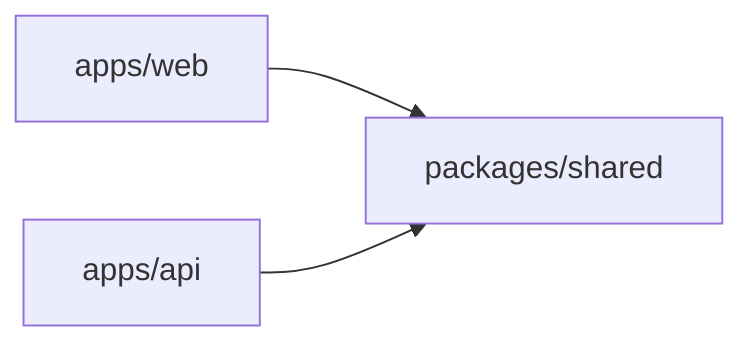

# Software Architecture

## Workspaces and the dependency rule

`packages/shared` depends on nothing. Both apps depend on it. The apps never import from each other. A type that
both sides need (a role, a request body, a response shape) lives in `packages/shared/src/contracts.ts` or
`roles.ts`; the API DTO `implements` the shared interface so the two cannot drift.

## API layers

| Layer       | Lives in                                        | Owns                                                                   |
| ----------- | ----------------------------------------------- | ---------------------------------------------------------------------- |
| Controllers | `*.controller.ts`                               | HTTP shape: routes, DTOs, status codes, Swagger                        |
| Guards      | `auth/jwt-auth.guard.ts`, `auth/roles.guard.ts` | Who may call a handler                                                 |
| Services    | `*.service.ts`                                  | Business rules and outcomes (the only place that throws domain errors) |
| Entities    | `*.entity.ts`                                   | Persistence shape, mirrored by a migration                             |
| Config      | `config/`                                       | Validated env and typed access to it                                   |

Rules:

- Controllers call services. Services call repositories and other services. Nothing calls a controller.
- A guard decides access; it never mutates state. A service decides outcomes; it never reads the request.
- `AuthService` is the only writer of `Role.User` on new accounts. `UsersService.changeRole` is the only writer
  of any other role. Keep it that way so the role model stays auditable.
- Each module exports only what another module injects. `UsersModule` exports `UsersService`; `AuthModule`
  exports `RolesGuard`.

## Web layers

| Layer     | Lives in                                       | Owns                                                    |
| --------- | ---------------------------------------------- | ------------------------------------------------------- |
| API calls | `api/http.ts`, `auth/auth-api.ts`              | fetch, headers, error mapping. Pages never call `fetch` |
| Session   | `auth/auth-context.tsx`, `auth/use-auth.ts`    | token storage, current user, login/register/logout      |
| Guards    | `auth/RequireAuth.tsx`, `auth/RequireRole.tsx` | routing decisions by session and role                   |
| Pages     | `pages/`                                       | one route each, composed from MUI components            |
| Shell     | `components/AppShell.tsx`                      | top bar and layout shared by every page                 |

Rules:

- A page reads the session through `useAuth()`; it never touches `localStorage`.
- Role checks in the UI hide affordances. They never replace the API guard: every admin action is also
  `@Roles(Role.Admin)` on the server.
- Keep the landing page free of session-dependent logic beyond the top bar so it stays fast and testable.

## Where each kind of type lives

- Role list and role type: `packages/shared/src/roles.ts`
- Cross-boundary request/response shapes: `packages/shared/src/contracts.ts`
- API-only shapes (JWT payload, authenticated request): next to the code that uses them in `apps/api/src/auth/`
- Web-only shapes (form state, context value): next to the component or context

## Quick decision guide

- New endpoint → DTO in `dto/`, handler in the controller, rule in the service, spec for each, `@Roles` if gated.
- New column → entity change + migration in the same PR, `synchronize` stays `false`.
- New role-gated screen → route inside `<RequireRole>` in `App.tsx`, affordance hidden for other roles, test for allowed and forbidden.
- New shared shape → `packages/shared`, DTO `implements` it, web imports it.
- New third-party dependency → an ADR in `docs/adr/` explaining why and what was rejected.

## Anti-patterns

- Comparing `user.role === 'admin'` instead of `Role.Admin`.
- Trusting the role inside the JWT for authorization decisions instead of the account loaded by `JwtStrategy`.
- A page calling `fetch` directly.
- `synchronize: true`, or editing a migration that has already run anywhere.
- Adding a role without a spec, a migration and an ADR.
