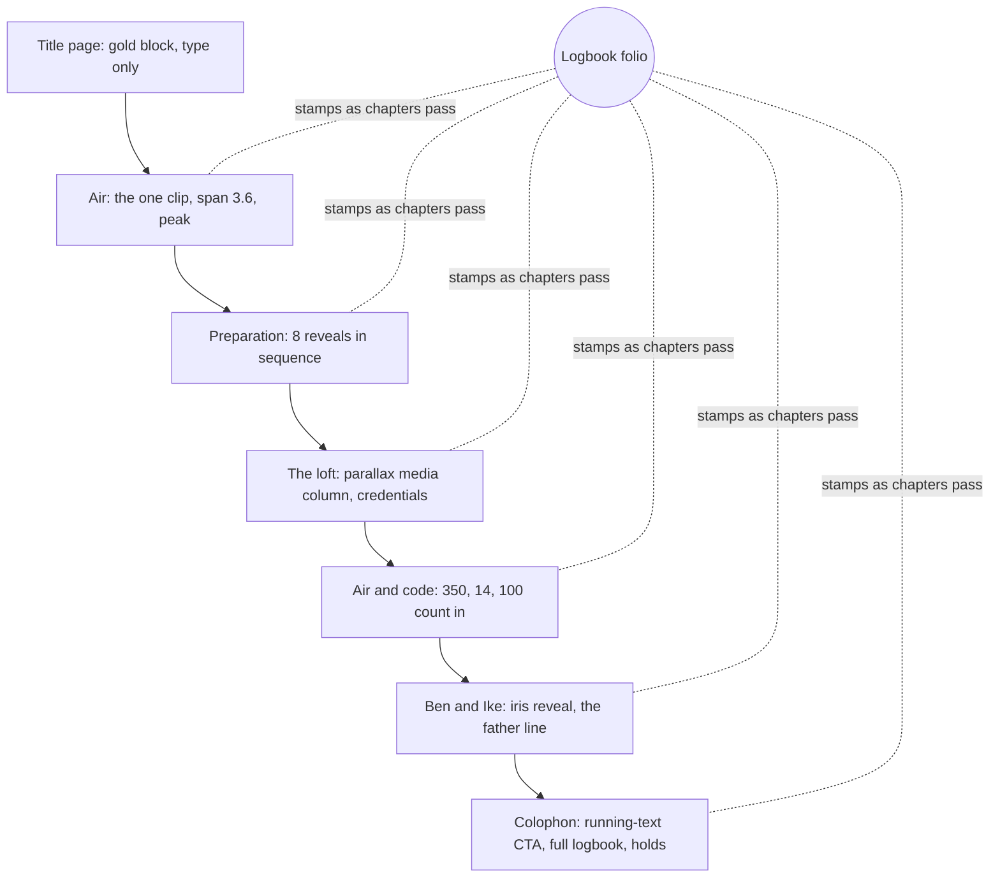

# Feature: About page as a scroll story

> Issue: none yet · Branch: `feat/about-scroll-story` · Supersedes: `about-page.md` (v1 layout) · ADR: [0006](../../docs/adr/0006-scrollcraft-engine-for-the-about-story.md) · Brief: `design/scrollcraft/builds/about/BRIEF.md` · Briefed by Eca, 2026-09-14

## Problem Statement

The v1 About page is a document: a founder card and three text blocks. Eca asked for the opposite: a page that
shows he is a professional by the way it is built, tells his career through his own photos and footage, puts the
wingsuit flight the visitor can "fly" with the scroll wheel at its centre, lists his real licences and
certifications, explains that Bendike is Ben and Ike, his sons, and carries his line about wanting a safer sport
for them. Energetic at the start, calm at the end, in distinct scenes, in the flat brutalist style of the Ableton
Live brand.

## Personas

| Persona  | Impact   | Notes                                                                      |
| -------- | -------- | -------------------------------------------------------------------------- |
| Visitor  | Positive | Primary audience: a skydiver deciding whether to trust Eca with their gear |
| User     | Positive | Same page; sees the person behind the reminders                            |
| Rigger   | Positive | Sees a peer's credentials laid out honestly                                |
| Dropzone | Positive | Sees who they are dealing with                                             |
| Admin    | Neutral  | No admin content                                                           |

## Value Assessment

- **Primary value**: Customer — trust in the person is what makes a skydiver hand over a reserve.
- **Secondary value**: Market — a page people send each other; the flight is the hook.

## User Stories

### Story 1: Fly the wingsuit

As a **Visitor**,
I want **the flight footage to move under my scroll wheel, forward as I scroll down and back as I scroll up**,
so that I can **feel the terrain come up the way Eca does**.

#### Acceptance Criteria

- The page shall contain exactly one scrub clip, in the chapter titled Air, spanning 3.6 viewport-heights with a
  dwell so the camera settles mid-chapter.
- The chapter before the clip (the title page) shall contain no media, so the clip arrives from quiet.
- While the clip has not painted, the stage shall show its own first frame as a poster, portrait on phones.
- Under reduced motion, the page shall show the poster and the copy, fetch no clip, and stay comprehensible.

### Story 2: Read the story in chapters

As a **Visitor**,
I want **distinct chapters, each on its own ground, cut hard from the previous one**,
so that I can **read it like a printed feature rather than watch a film**.

#### Acceptance Criteria

- The page shall render, in order: title page (type on a gold block), Air (clip), Preparation (eight photographs
  revealing one after another), The loft (dense spread, media column with parallax), Air and code (real figures
  counting in), Ben and Ike (one portrait, iris reveal, the father's words), Colophon (navy plate).
- No two adjacent chapters shall use the same primary device; the page shall use at least four device families.
- Grounds shall be painted per chapter with hard cuts, never interpolated.
- Every number that animates shall be true and sourced from Eca's LinkedIn profile: 350, 14, 100.
- Every licence and certification shown shall be one Eca holds, with its year.

### Story 3: Watch the logbook fill

As a **Visitor**,
I want **a logbook in the margin that stamps Eca's dated credentials as I pass each chapter**,
so that I can **see his record accumulate and jump back to any chapter from it**.

#### Acceptance Criteria

- A folio shall be fixed in the left margin on wide screens showing the logbook title, the current chapter, and
  the count of stamped entries over the total.
- When a chapter reaches the middle of the viewport, its entries and those of every earlier chapter shall be
  stamped in and remain stamped.
- Each stamped entry shall be a button that scrolls to its chapter.
- Below 1180px the folio shall collapse to a bottom-left stamp counter that opens the list on tap.
- The folio shall publish its state through `data-sc-verify-state` so the verification harness can see it.

### Story 4: Resolve

As a **Visitor**,
I want **the page to end on Bendike as the safer environment, with one clear next step**,
so that I can **act on what I just read**.

#### Acceptance Criteria

- The colophon shall hold on screen with the heading "Bendike is that environment.", the CTA as a line of running
  text linking to `/register`, the full credential list in small type, and links to Home, Log in, Instagram,
  LinkedIn and WhatsApp.
- Nothing on the last screen shall fade out.

---

## Design

> Refer to `.github/copilot-instructions.md` for technical standards.

### Role Access

| Role     | Access    |
| -------- | --------- |
| Visitor  | Full page |
| User     | Full page |
| Rigger   | Full page |
| Dropzone | Full page |
| Admin    | Full page |

### Components Affected

- `apps/web/src/pages/about/scrollcraft/scrollcraft.js` — the scrollcraft engine, vendored verbatim, never edited
- `apps/web/public/scrollcraft/scrollcraft.css` — the engine stylesheet, injected as a `<link>` only while the About
  page is mounted, because it styles `body`
- `apps/web/src/pages/about/story/use-scrollcraft.ts` — dynamic import of the engine, mount on the page root, unlink on leave
- `apps/web/src/pages/about/story/about-story-content.ts` — every string, credential, logbook entry and asset path
- `apps/web/src/pages/about/story/chapters.tsx` — the seven chapters as real semantic markup with `data-sc-*` attributes
- `apps/web/src/pages/about/story/LogbookFolio.tsx` — the signature move (bespoke, engine untouched)
- `apps/web/src/pages/about/story/about-story.css` — tokens and page classes (`as-*`)
- `apps/web/src/pages/about/story/AboutStoryPage.tsx`, `AboutStoryPage.spec.tsx`
- `apps/web/scripts/prepare-about-assets.mjs` — grades and encodes the clip (dense GOP), converts photos to WebP,
  writes posters, and generates placeholders for anything missing
- `apps/web/public/about/` — generated assets (committed); `design/about/raw/` — raw drops (ignored);
  `design/about/ASSETS.md` — the manifest for Eca
- `design/scrollcraft/builds/about/BRIEF.md` — the interview, feeling curve, peak, score, gate
- `apps/web/src/App.tsx` — `/about` now renders `AboutStoryPage`; the v1 `AboutPage` is removed

### Dependencies

- `sharp` (dev) for image conversion; a full ffmpeg build on the machine that runs the asset script.
- Eca's raw assets per `design/about/ASSETS.md`. Until they land the page renders with flat placeholders.
- `playwright-core` (build folder only) for the scrollcraft verification pass.

### Data Model Changes

None.

### Diagrams



```mermaid
sequenceDiagram
  participant Eca
  participant Script as prepare-about-assets
  participant Public as apps/web/public/about
  Eca->>Script: drop raw files in design/about/raw, run npm run about:assets
  Script->>Script: ffmpeg fps=30, 1080p g=8 crf 20; portrait 720p g=4 crf 24; first frame → poster
  Script->>Script: sharp rotate, 1600 and 800 WebP per photo
  Script->>Public: flight.mp4, flight-m.mp4, posters, *-1600.webp, *-800.webp
  Script-->>Eca: checklist of real vs placeholder slots
```

### Open Questions

- [ ] Raw assets: waiting on Eca (clip plus 13 photos, see `design/about/ASSETS.md`).
- [ ] Jump count and flight hours: none shown until Eca gives real numbers.
- [ ] Spanish version of the copy.
- [ ] The engine has no unmount; leaving `/about` leaves one idle animation frame loop. Acceptable now, revisit if
      the app grows many scroll pages.

---

## Tasks

### Task 1: Brief, grammar, score

**Objective**: Interview answers into `BRIEF.md` with the feeling curve, peak, signature move and gate.

**Verification**:

- [x] BRIEF.md exists with the eight answers verbatim, a curve with no adjacent duplicates, one peak, the tell-someone sentence

**Done when**:

- [x] All verification steps pass

---

### Task 2: Engine hosting inside React

**Objective**: Vendor the engine, inject its stylesheet per route, mount it on the page root.

**Affected files**: `scrollcraft/scrollcraft.js`, `public/scrollcraft/scrollcraft.css`, `story/use-scrollcraft.ts`

**Verification**:

- [x] `sha1sum` of the vendored engine equals the skill's; the CSS link is removed on unmount

**Done when**:

- [x] All verification steps pass

---

### Task 3: Chapters, content and folio

**Depends on**: Task 2

**Objective**: Seven chapters as semantic markup, content module, logbook folio, page CSS.

**Verification**:

- [x] `npm run test:unit -w @bendike/web -- AboutStoryPage` passes
- [x] Exactly one `[data-sc-scrub]`; counters are `350`, `14`, `100`; 16 logbook entries

**Done when**:

- [x] All verification steps pass

---

### Task 4: Asset pipeline

**Depends on**: Task 3

**Objective**: `npm run about:assets` produces every file the page references, real or placeholder.

**Verification**:

- [x] Running with an empty raw folder yields placeholders for every slot and the kids photo from Downloads
- [ ] Running with the real clip yields `flight.mp4` under ~6 MB and a matching poster

**Done when**:

- [ ] All verification steps pass

---

### Task 5: Verification pass

**Depends on**: Task 4 with real assets

**Objective**: Run the scrollcraft harness (desktop, 390px, reduced motion), read the contact sheets, run the
feel check cold, append the fingerprint row.

**Verification**:

- [ ] No dead scroll, no frozen clip, no cue that never peaks, contrast clean on the composited page
- [ ] Felt curve diffed against BRIEF.md and differences fixed in the page
- [ ] `design/scrollcraft/FINGERPRINTS.md` has the row

**Done when**:

- [ ] All verification steps pass

---

## Out of Scope

- Generated imagery (no kie.ai key; all assets are Eca's own)
- Spanish localisation
- A second scroll story elsewhere on the site

## Future Considerations

- Real jump and hour counts once Eca provides them
- A photo of the loft's location if he wants the address shown
