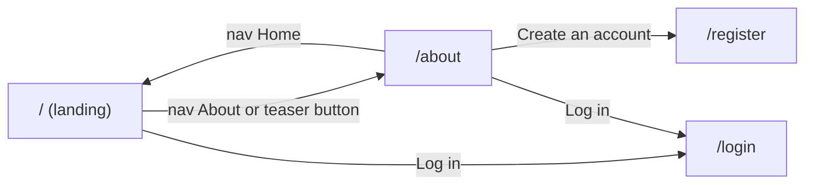

# Feature: About page

> **Superseded on 2026-09-14** by [about-page-scroll-story.md](./about-page-scroll-story.md). Kept for the record of the v1 layout.

> Issue: none yet · Branch: `feat/landing-page-copy` · Requested by Enrique Coscarelli on 2026-09-11, same briefing as the landing page

## Problem Statement

The landing page can only carry a short introduction to Eca and the loft before it gets in the way of the
services and the sign-up path. Visitors who want the full story, who Eca is, what the loft does, what the software
does and why safety comes first, need a page of their own that the navigation links to from anywhere on the site.

## Personas

| Persona  | Impact   | Notes                                                                |
| -------- | -------- | -------------------------------------------------------------------- |
| Visitor  | Positive | Primary audience; decides whether to trust the loft and the software |
| User     | Positive | A skydiver learns what the software will track for them              |
| Rigger   | Positive | Learns how riggers fit in                                            |
| Dropzone | Positive | Learns how dropzones fit in                                          |
| Admin    | Neutral  | Same page, no admin-specific content                                 |

## Value Assessment

- **Primary value**: Customer — trust in the person behind the loft is what makes a skydiver hand over their rig.
- **Secondary value**: Market — a shareable page for Instagram and LinkedIn visitors.

## User Stories

### Story 1: Read the full story

As a **Visitor**,
I want **an About page that tells me who Eca is, what the loft does, what the software does and why safety comes first**,
so that I can **decide whether to trust Bendike with my gear**.

#### Acceptance Criteria

- The web app shall serve the About page at `/about` to every visitor, signed in or not.
- The About page shall render exactly one H1 naming the page.
- The About page shall render a founder section naming Enrique "Eca" Coscarelli, his role and Argentina.
- The About page shall render one section each for the loft, the software and the safety priority.
- The About page shall render the Instagram and LinkedIn links next to the founder and in the footer.
- The About page shall end with a call to action to `/register`.
- The About page shall render without calling the API.

### Story 2: Get there and back

As a **Visitor**,
I want **the site navigation to link Home and About and show which page I am on**,
so that I can **move between the public pages without the browser back button**.

#### Acceptance Criteria

- The site navigation shall link to `/` and `/about` on every public page and mark the current one with
  `aria-current="page"`.
- While a visitor is not signed in, the navigation shall keep the Log in and Sign up links; while signed in it
  shall show Open app.

---

## Design

> Refer to `.github/copilot-instructions.md` for technical standards.

### Role Access

| Role     | Access                                      |
| -------- | ------------------------------------------- |
| Visitor  | Full page, navigation shows Log in, Sign up |
| User     | Full page, navigation shows Open app        |
| Rigger   | Full page, navigation shows Open app        |
| Dropzone | Full page, navigation shows Open app        |
| Admin    | Full page, navigation shows Open app        |

### Components Affected

- `apps/web/src/components/site/site-content.ts` — site name, navigation links, social links, footer tagline
- `apps/web/src/components/site/SiteNav.tsx`, `SiteFooter.tsx`, `SocialLinks.tsx`, `SitePage.tsx` — shared by every public page
- `apps/web/src/pages/about/about-content.ts` — every string on the About page
- `apps/web/src/pages/about/AboutPage.tsx`, `AboutPage.spec.tsx`
- `apps/web/src/pages/landing/AboutSection.tsx` — becomes a teaser that links to `/about`
- `apps/web/src/App.tsx` — the `/about` route

### Dependencies

- None beyond the landing page's.

### Data Model Changes

None.

### Diagrams

### Open Questions

- [ ] A photo of Eca and of the loft (initials avatar stands in today).
- [ ] Spanish version.
- [ ] Should the About page list the loft's location and opening hours? No address was given in the briefing.

---

## Tasks

### Task 1: Shared site chrome

**Objective**: Move navigation, footer and social links into `components/site/` so every public page shares them.

**Affected files**:

- `apps/web/src/components/site/*`
- `apps/web/src/pages/landing/LandingPage.tsx`, `AboutSection.tsx`

**Verification**:

- [x] `npm run test:unit -w @bendike/web -- LandingPage` passes with the shared chrome

**Done when**:

- [x] All verification steps pass

---

### Task 2: About page

**Depends on**: Task 1

**Objective**: Add `/about` with founder, loft, software and safety sections, social links and a sign-up call to action.

**Affected files**:

- `apps/web/src/pages/about/*`
- `apps/web/src/App.tsx`

**Verification**:

- [x] `npm run test:unit -w @bendike/web -- AboutPage` passes
- [x] `npm run validate` passes

**Done when**:

- [x] All verification steps pass
- [x] Stories 1 and 2 satisfied

---

### Task 3: Imagery and final copy review

**Depends on**: Task 2

**Objective**: Replace the initials avatar with a photo and have Eca review the copy.

**Verification**:

- [ ] Eca has read the page and approved or corrected the copy
- [ ] `npm run validate` passes

**Done when**:

- [ ] All verification steps pass

---

## Out of Scope

- Contact form, address, opening hours (none provided)
- Team page (Eca is the team today)

## Future Considerations

- Spanish localisation
- A services page with pricing once the loft's service list is confirmed
