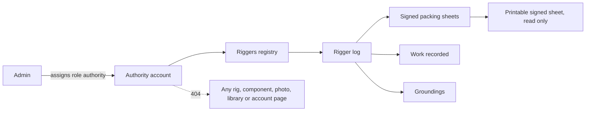
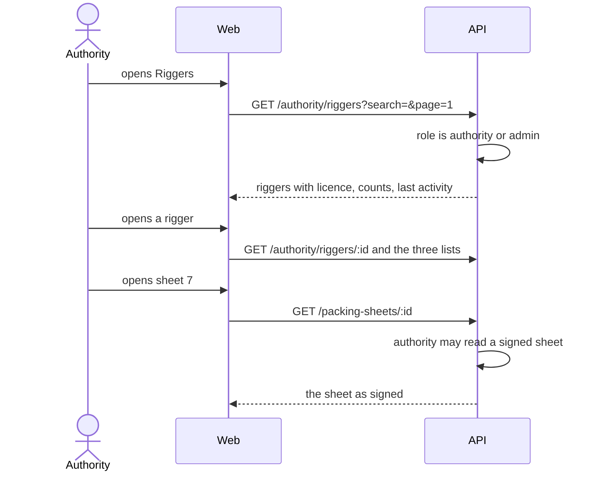

# Feature: Authority oversight

> Issue: none yet · Branch: `feat/authority-oversight` · Requested by Eca, 2026-09-20 · Depends on: [packing-sheets.md](./packing-sheets.md), [gear-tracking.md](./gear-tracking.md), [user-accounts-and-roles.md](./user-accounts-and-roles.md)

## Problem Statement

A governing body over riggers, in Argentina the ANAC, has to be able to see who the riggers are and what they have
signed. Today that means asking each rigger for a paper logbook. Bendike already keeps a numbered, signed, immutable
record of every reserve packing and every piece of work a rigger records, so it can give an authority a register of all
riggers and read access to each one's virtual log, without asking anyone to fetch a binder.

## Personas

| Persona   | Impact   | Notes                                                                                                                   |
| --------- | -------- | ----------------------------------------------------------------------------------------------------------------------- |
| Visitor   | Neutral  | Nothing visible                                                                                                         |
| User      | Neutral  | Their name and contact details still appear on the packing sheets that their rigger signed, which an authority may read |
| Rigger    | Neutral  | Their signed sheets, licence number and recorded work become readable by the authority; the log is what it is already   |
| Dropzone  | Neutral  | Same as a user                                                                                                          |
| Admin     | Positive | Promotes an account to authority, and can open the same views                                                           |
| Authority | Positive | New persona: sees every rigger and each rigger's log, read only                                                         |

## Value Assessment

- **Primary value**: Market: an authority that can inspect the register is the strongest reason for riggers and
  associations to trust and adopt Bendike.
- **Secondary value**: Customer: riggers keep one digital record that answers an inspection without a binder.
- **Tertiary value**: Future: the same read model is the base for reports and exports for associations.

## User Stories

### Story 1: An authority account

As an **Admin**,
I want **to give an account the authority role**,
so that I can **let a governing body inspect the riggers without giving it any other power**.

#### Acceptance Criteria

- The API shall accept `authority` as a role, and an admin shall be able to assign it from the accounts page like any
  other role.
- While an account has the authority role, the API shall refuse it every write, and shall answer 404 for every rig,
  component and account page other than the riggers' registry and logs.
- While signed in as an authority, the web app shall show a "Riggers" link in the navigation and shall not show the
  gear, work, customers or library links.
- While signed in as an authority, the web app shall show the riggers' registry as the main action on the dashboard, and
  shall send the gear and rigger-link pages back to the dashboard.

### Story 2: The registry of riggers

As an **Authority**,
I want **a searchable list of every rigger**,
so that I can **see who is working and how active they are**.

#### Acceptance Criteria

- The web app shall serve `/app/authority/riggers`, to authorities and admins, listing every account with the rigger
  role, 25 a page, with name, email, WhatsApp phone, licence number, number of signed packing sheets, number of
  pieces of work recorded, date of the last activity and the number of customers currently linked.
- The web app shall let the visitor search by name, email or licence number and sort by name or by last activity.
- The API shall take a rigger's licence number from their most recent signed sheet or, if none, their most recent
  work entry that carries one, and shall return it empty when the rigger has never recorded one.
- If the signed-in account is neither an authority nor an admin, then the API shall respond 403 and the web app shall
  redirect to `/app`.

### Story 3: A rigger's virtual log

As an **Authority**,
I want **to open a rigger and read everything they have signed and recorded**,
so that I can **inspect their work as I would their paper logbook**.

#### Acceptance Criteria

- The web app shall serve `/app/authority/riggers/:id` with the rigger's details and three lists: signed packing
  sheets, work recorded and groundings.
- Each signed sheet shall show its number, date, rig, owner, how many items were not complete, and whether it is void,
  and shall open the printable sheet exactly as the rigger signed it.
- The work list shall hold what the rigger performed and what they verified, each marked as one or the other, with its
  date, kind, component, rig, owner, description, and whether it is void with its reason.
- Each grounding the rigger opened shall show the rig, the reason, when it was opened and, if cleared, when, by whom
  and with what note.
- The lists shall be newest first and paged 25 a page.
- The web app shall not show a void, email or any other action on a sheet opened by an authority.
- If the id is not a rigger, then the API shall respond 404.

### Story 4: Read only, and nothing more

As a **Rigger**,
I want **the authority to see my log and nothing else of mine**,
so that I can **trust that oversight does not become access to my customers' gear**.

#### Acceptance Criteria

- The API shall let an authority read a packing sheet only when it is signed, and shall answer 404 for a draft.
- The API shall not let an authority read the gear, rigs, photos, library, work queue or links of any account.
- The API shall never change anything as a result of an authority reading.

---

## Design

> Refer to `.github/copilot-instructions.md` for technical standards.

### Role Access

| Role      | Access                                                                               |
| --------- | ------------------------------------------------------------------------------------ |
| Visitor   | None                                                                                 |
| User      | None                                                                                 |
| Rigger    | None (their own work is unchanged)                                                   |
| Dropzone  | None                                                                                 |
| Admin     | Assign the authority role; open the registry and the logs                            |
| Authority | The registry, each rigger's log and the signed sheets in it, read only; nothing else |

### Components Affected

- `packages/shared/src/roles.ts`, `authority.ts` — the role and the registry contracts
- `apps/api/src/database/migrations/` — add `authority` to the role enum
- `apps/api/src/authority/` — service, controller, module
- `apps/api/src/packing-sheets/packing-sheets.service.ts` — an authority may read a signed sheet
- `apps/web/src/pages/authority/` — registry page, rigger log page
- `apps/web/src/components/AppShell.tsx`, `pages/DashboardPage.tsx`, `App.tsx`,
  `pages/packing/PackingSheetPrintPage.tsx` — navigation, dashboard, routes, read-only sheet
- `apps/api/scripts/seed-dev-accounts.ts`, `docs/personas.md`, `README.md`

### Dependencies

- None new.

### Data Model Changes

The `user_role` enum gains `authority`. No new table: the registry and the logs are read from `users`,
`packing_sheets`, `maintenance_entries`, `groundings`, `rigger_links`, `rigs` and `gear_items`.

### Diagrams

### Open Questions

- [ ] "In our territory": Bendike runs in Argentina today, so the registry lists every rigger on Bendike. When accounts
      carry a country or province, the authority's view should be limited to its territory.
- [ ] The legal basis for an authority to read riggers' logs and the owner details printed on each sheet, and whether
      riggers must be told: for Eca and ANAC to settle; this spec builds the access, not the agreement.
- [ ] Whether the authority needs a record of which riggers it opened and when (an access log riggers can read).
- [ ] A rigger's licence number is taken from what they signed until the rigger-profile spec stores it on the account.

---

## Tasks

> Each task is one coding session. Tick the boxes in the same commit that delivers the work.

### Task 1: The role and the contracts

**Objective**: The `authority` role everywhere the four others exist, and the shared registry types.

**Affected files**:

- `packages/shared/src/roles.ts`, `roles.spec.ts`, `authority.ts`, `index.ts`, migration, `apps/web/src/pages/DashboardPage.tsx`
  (greeting), dev-accounts script

**Requirements**: Story 1

**Verification**:

- [x] `npm run test:unit` passes; an admin can set the role from the accounts page; the migration adds the enum value

**Done when**:

- [x] All verification steps pass

---

### Task 2: Registry and log API

**Depends on**: Task 1

**Objective**: The registry, a rigger's sheets, work and groundings, and read access to signed sheets.

**Affected files**:

- `apps/api/src/authority/*`, `apps/api/src/packing-sheets/packing-sheets.service.ts`, `apps/api/src/app.module.ts`

**Requirements**: Stories 2, 3, 4

**Verification**:

- [x] Only authorities and admins reach any authority route; others get 403
- [x] The registry lists every rigger with the derived licence, counts and last activity, searchable and sortable, paged
- [x] A rigger's sheets, work and groundings are theirs alone, newest first, paged; a non-rigger id is 404
- [x] An authority can read a signed sheet and not a draft, and cannot read any gear, photo, library or link route

**Done when**:

- [x] All verification steps pass

---

### Task 3: Registry page and navigation

**Depends on**: Task 2

**Objective**: The authority navigation, dashboard and the searchable registry page.

**Affected files**:

- `apps/web/src/pages/authority/AuthorityRiggersPage.tsx`, `authority-api.ts`, `AppShell.tsx`, `DashboardPage.tsx`, `App.tsx`

**Requirements**: Stories 1, 2

**Verification**:

- [x] An authority sees Riggers and none of the gear links; users and riggers cannot open the route

**Done when**:

- [x] All verification steps pass

---

### Task 4: A rigger's log page

**Depends on**: Task 3

**Objective**: The three lists and the read-only signed sheet.

**Affected files**:

- `apps/web/src/pages/authority/AuthorityRiggerPage.tsx`, `pages/packing/PackingSheetPrintPage.tsx`

**Requirements**: Stories 3, 4

**Verification**:

- [x] Each list is paged and newest first; a sheet opens as signed with no actions; verified in a browser
- [x] README, personas and this spec updated

**Done when**:

- [x] All verification steps pass

---

## Out of Scope

- Any write by an authority: sanctions, comments, approvals
- Reports, exports and dashboards of statistics
- Territory or province filters
- An access log of what the authority opened
- Authority access to owners' gear, photos, manuals or any other account data

## Future Considerations

- Exports and periodic reports for associations
- A rigger's licence and its validity verified against the authority's own register
- Letting riggers see when and by whom their log was opened
