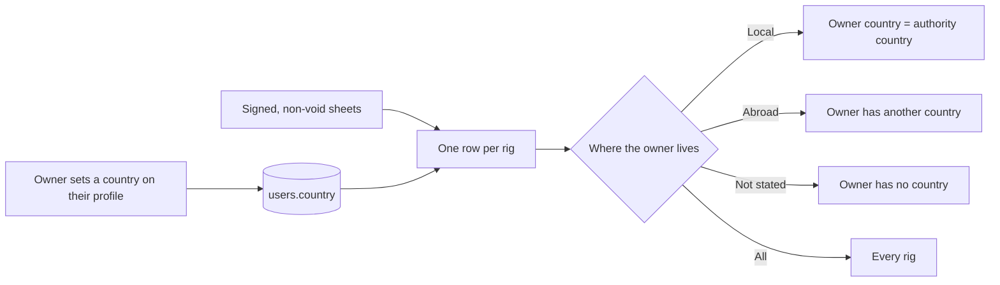
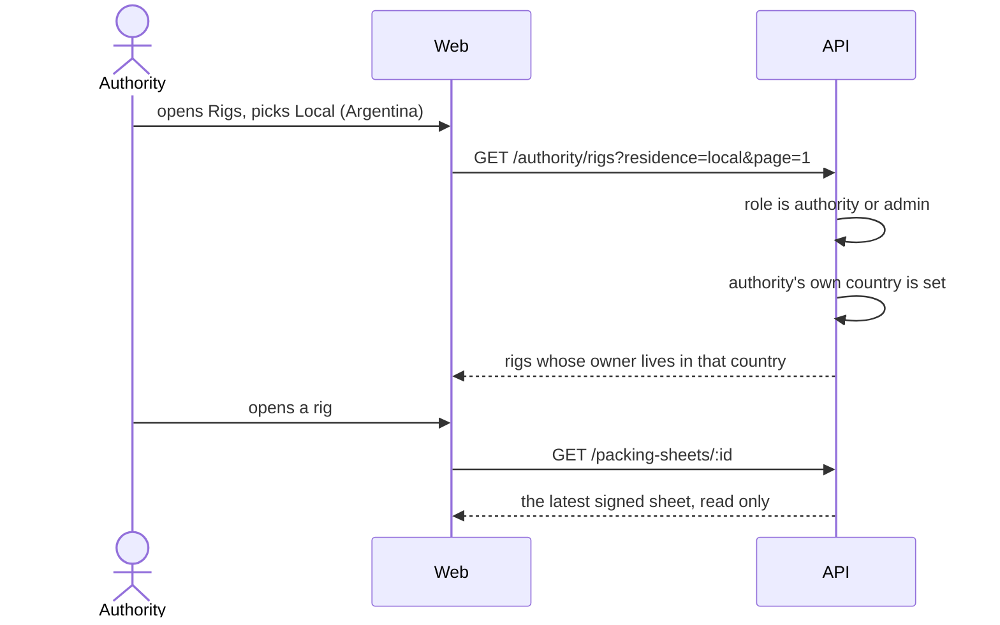

# Feature: Authority register of packed rigs, by where the owner lives

> Issue: none yet · Branch: `feat/authority-rig-register` · Requested by Eca, 2026-09-20 · Depends on: [authority-oversight.md](./authority-oversight.md), [packing-sheets.md](./packing-sheets.md), [user-accounts-and-roles.md](./user-accounts-and-roles.md)

## Problem Statement

The authority can read each rigger's log, but it cannot answer the question it is really asked: which rigs were packed
in this country, and who uses them. It also cannot tell the rigs of people who live in its territory from those of
visitors, because Bendike does not know where anyone lives. The authority needs one list of every rig its riggers have
packed, and a way to keep only the rigs of jumpers who live in its own country, in Argentina's case the people who live
in Argentina.

## Personas

| Persona   | Impact   | Notes                                                                                                           |
| --------- | -------- | --------------------------------------------------------------------------------------------------------------- |
| Visitor   | Neutral  | Nothing visible                                                                                                 |
| User      | Neutral  | Can say which country they live in; their name and country appear in the authority's list next to their rig     |
| Rigger    | Neutral  | Their signed packing sheets become searchable by rig in the authority's list; the log is what it is already     |
| Dropzone  | Neutral  | Same as a user: the country of the dropzone account is the country of the rigs it owns                          |
| Admin     | Positive | Opens the same list                                                                                             |
| Authority | Positive | Sees every rig packed, filters by whether the owner lives in the authority's own country, and sets that country |

## Value Assessment

- **Primary value**: Market: an authority that can see the rigs in its territory, and only those of its own people, has
  a reason to ask its riggers to use Bendike.
- **Secondary value**: Customer: riggers keep one digital record that answers an inspection about a rig, not only about
  themselves.
- **Tertiary value**: Future: the country on an account is the base for the territory filter the authority spec left
  open, and for reports by country.

## User Stories

### Story 1: Where an account lives

As a **User, Rigger, Dropzone or Authority**,
I want **to say which country I live in**,
so that **an authority can tell the rigs of people in its territory from the rest**.

#### Acceptance Criteria

- The API shall accept `country` on `PATCH /users/me`, as a two-letter ISO 3166-1 code or null to clear it, and shall
  answer 400 for anything else.
- The API shall return `country` on every account summary, null until it is set.
- The web app shall show a Country field on the profile page, listing countries by name in the account's language, and
  shall save it with the other contact details.
- While an authority has no country, the web app shall say so on the register of rigs and link to the profile page.

### Story 2: The register of packed rigs

As an **Authority**,
I want **a list of every rig that its riggers have packed**,
so that **I can see what is flying in my territory**.

#### Acceptance Criteria

- The web app shall serve `/app/authority/rigs`, to authorities and admins, listing every rig with at least one signed,
  non-void packing sheet, 25 a page, newest packing first.
- Each row shall show the rig, the owner's name as signed and the country the owner's account lives in, the reserve
  (manufacturer, model, serial) as it was on the latest sheet, the date of the latest packing, the rigger and licence
  who signed it, and how many signed sheets the rig has.
- Each row shall open the latest signed sheet, read only.
- The web app shall let the visitor search by rig name, owner name, reserve serial or rigger name.
- The list shall show no owner email, phone or address.
- If the signed-in account is neither an authority nor an admin, then the API shall respond 403 and the web app shall
  redirect to `/app`.

### Story 3: Only the jumpers who live here

As an **Authority**,
I want **to keep only the rigs whose owner lives in my own country**,
so that **I can look at my own people, the local jumpers, apart from visitors**.

#### Acceptance Criteria

- The web app shall offer the filter "Where the owner lives": All, Local, Abroad and Not stated.
- When the filter is Local, the API shall return only rigs whose owner's country equals the country of the signed-in
  account; when Abroad, only those whose owner has a country that differs; when Not stated, only those whose owner has
  none.
- If the filter is Local or Abroad and the signed-in account has no country, then the API shall respond 400 and say to
  set the country in the profile.
- The filter and the search shall combine, and changing either shall return to page one.
- The Local option shall be labelled with the authority's country by name, for example "Local (Argentina)".

---

## Design

> Refer to `.github/copilot-instructions.md` for technical standards.

### Role Access

| Role      | Access                                                                        |
| --------- | ----------------------------------------------------------------------------- |
| Visitor   | None                                                                          |
| User      | Set their own country                                                         |
| Rigger    | Set their own country                                                         |
| Dropzone  | Set their own country                                                         |
| Admin     | Set their own country; open the register of packed rigs                       |
| Authority | Set their own country; the register of packed rigs and its filters, read only |

### Components Affected

- `packages/shared/src/countries.ts`, `contracts.ts`, `authority.ts` — country codes, the account country, the rig row
- `apps/api/src/database/migrations/` — `users.country`
- `apps/api/src/users/` — entity, summary, contact DTO and service
- `apps/api/src/authority/` — `GET /authority/rigs`
- `apps/web/src/pages/ProfilePage.tsx`, `pages/authority/AuthorityRigsPage.tsx`, `authority-api.ts`, `App.tsx`,
  `components/AppShell.tsx`, `pages/DashboardPage.tsx` — profile field, page, route, navigation
- `README.md`, `docs/personas.md`, `.github/specs/README.md`

### Dependencies

- None new. Country names come from the browser's `Intl.DisplayNames`.

### Data Model Changes

`users` gains `country char(2) null`. No new table: the register reads `packing_sheets`, `maintenance_entries` (to know
which sheets are void), `rigs` and `users`.

### API

`GET /authority/rigs?search=&residence=&page=` → `{ rows: AuthorityRigRow[], total }`, `residence` being `all`
(default), `local`, `abroad` or `unknown`.

### Diagrams

### Open Questions

- [ ] The country is read from the owner's account when the list is opened, not stored on the sheet when it is signed,
      so a jumper who moves changes where their old rigs appear. Snapshotting it on the sheet is the alternative.
- [ ] Existing accounts have no country until their owner sets it; an authority will see most rigs under "Not stated"
      at first. An admin-side bulk fill, or asking on the next sign-in, would speed that up.
- [ ] A dropzone's country is the country of the rigs it owns, whoever jumps them; visiting jumpers on a local
      dropzone's rigs count as local.
- [ ] Whether a tourist who lives abroad but owns a rig kept in Argentina should count as local.

---

## Tasks

> Each task is one coding session. Tick the boxes in the same commit that delivers the work.

### Task 1: The country on an account

**Objective**: A country on every account, set from the profile page.

**Affected files**:

- `packages/shared/src/countries.ts`, `contracts.ts`, migration, `apps/api/src/users/*`, `apps/web/src/pages/ProfilePage.tsx`

**Requirements**: Story 1

**Verification**:

- [x] `npm run test:unit` passes; a user can set and clear their country; an invalid code is refused

**Done when**:

- [x] All verification steps pass

---

### Task 2: Register of packed rigs API

**Depends on**: Task 1

**Objective**: The list of packed rigs with search and the residence filter.

**Affected files**:

- `packages/shared/src/authority.ts`, `apps/api/src/authority/*`

**Requirements**: Stories 2, 3

**Verification**:

- [x] One row per rig with the latest non-void sheet, its counts, owner name and country; void sheets do not count
- [x] Search and each residence filter behave as written; local and abroad without an own country are 400
- [x] Only authorities and admins reach it; no owner email or phone is returned

**Done when**:

- [x] All verification steps pass

---

### Task 3: Rigs page and navigation

**Depends on**: Task 2

**Objective**: The page, the filter, the navigation and the documentation.

**Affected files**:

- `apps/web/src/pages/authority/AuthorityRigsPage.tsx`, `authority-api.ts`, `App.tsx`, `AppShell.tsx`, `DashboardPage.tsx`,
  `README.md`, `docs/personas.md`

**Requirements**: Stories 2, 3

**Verification**:

- [x] An authority reaches Rigs from the navigation and dashboard, filters to Local, and opens a rig's latest sheet
- [x] A user or rigger cannot open the route; verified in a browser at desktop and phone width

**Done when**:

- [x] All verification steps pass

---

## Out of Scope

- Country of jurisdiction for riggers, or filtering the register of riggers by territory
- Provinces, cities or addresses
- Verifying that the stated country is true
- Exports and reports

## Future Considerations

- Snapshot the owner's country on the sheet at signing
- Limit an authority's whole view to its own territory
- Ask for the country at sign-up
