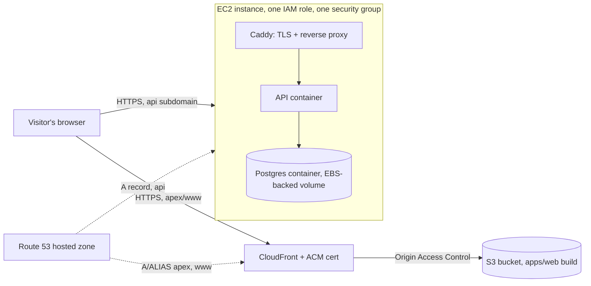
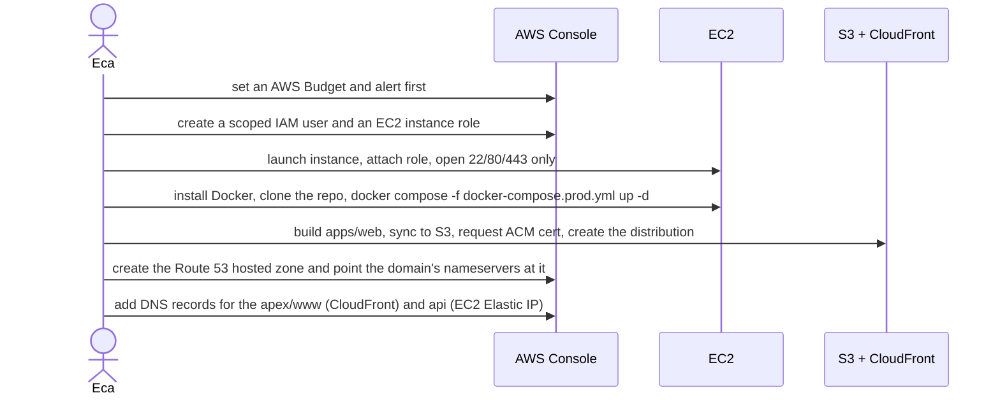

# Feature: AWS deployment

> Issue: none yet · Branch: `main` · Requested by Eca, 2026-09-23 · ADR: [0017](../../docs/adr/0017-deploy-on-a-single-ec2-instance-with-s3-and-cloudfront-for-the-web-app.md)

## Problem Statement

Bendike has only ever run on Eca's laptop. He is studying for the AWS Cloud Practitioner and Solutions Architect
certifications and wants the first real deployment to happen on AWS, built by hand in the console so the exam
material sticks, at close to $0 a month. This spec covers getting `apps/api` and `apps/web` reachable over HTTPS on
a real domain, and the guardrails (a budget alarm, least-privilege IAM) that keep a personal AWS account from
surprising him with a bill while he learns.

## Personas

| Persona   | Impact   | Notes                                                                            |
| --------- | -------- | -------------------------------------------------------------------------------- |
| Visitor   | Positive | Reaches Bendike over HTTPS on its own domain instead of `localhost`              |
| User      | Neutral  | Nothing changes about what they can do, only where it runs                       |
| Rigger    | Neutral  | Same                                                                             |
| Dropzone  | Neutral  | Same                                                                             |
| Authority | Neutral  | Same                                                                             |
| Admin     | Positive | Eca himself: gets a real environment, and the AWS console practice for his exams |

## Value Assessment

- **Primary value**: Personal/learning: doing IAM, EC2, S3, CloudFront, Route 53 and ACM by hand in the console is
  direct practice for the Cloud Practitioner and Solutions Architect exams.
- **Secondary value**: Customer: a real URL that riggers and dropzones can actually be invited to use.
- **Tertiary value**: Future: the manual setup documents the resources well enough to script them later (Terraform
  or the CDK), without having designed the architecture around a tool first.

## User Stories

### Story 1: The web app is reachable over HTTPS on a real domain

As a **Visitor**,
I want **`https://<domain>` to open the Bendike site**,
so that **I do not need `localhost` or an IP address to see it**.

#### Acceptance Criteria

- `apps/web` shall be built as static files and served from an S3 bucket that blocks all public access directly.
- A CloudFront distribution shall be the only public entry point to that bucket, using Origin Access Control, an ACM
  certificate for the domain, and a custom error response that sends any unknown path to `index.html` with a 200, so
  client-side routes work on a hard refresh.
- Visiting `http://<domain>` shall redirect to `https://<domain>`.

### Story 2: The API is reachable over HTTPS on a subdomain

As a **web app instance**,
I want **`https://api.<domain>` to reach the NestJS API**,
so that **the deployed web app has a real backend to call**.

#### Acceptance Criteria

- The API and Postgres shall run in Docker on one EC2 instance, using `docker-compose.prod.yml`.
- Caddy, running on the same instance, shall terminate TLS for `api.<domain>` with a certificate it obtains itself,
  and reverse-proxy to the API container.
- `GET https://api.<domain>/api/v1/services` shall return 200 with no certificate warning.
- Only ports 22 (from Eca's own IP), 80 and 443 shall be open on the instance's security group.

### Story 3: Data survives a restart

As **Eca**,
I want **the Postgres data to survive the instance rebooting or the containers restarting**,
so that **an EC2 maintenance event or a `docker compose restart` does not erase the database**.

#### Acceptance Criteria

- Postgres's data directory shall be a named Docker volume, backed by the instance's EBS root volume, not a
  container's writable layer.
- Every service in `docker-compose.prod.yml` shall have `restart: unless-stopped`, so a Docker daemon restart brings
  the stack back without a manual command.
- Eca shall be able to take a manual EBS snapshot of the volume as a backup.

### Story 4: A bill does not arrive by surprise

As **Eca**,
I want **an alert before AWS charges build up**,
so that **a mistake in the console (an idle Elastic IP, an oversized instance) does not turn into a bill he only
sees at the end of the month**.

#### Acceptance Criteria

- An AWS Budget with a monthly amount and an email alert shall exist before any billable resource is created.
- Every resource shall be tagged (for example `project=bendike`) so cost, if any, is attributable in Cost Explorer.
- IAM work shall use a named IAM user with only the permissions needed for this deployment, never the root account
  or its access keys, and the EC2 instance shall read/write AWS resources (if any) through an attached IAM role,
  never long-lived access keys stored on the box.

---

## Design

> Refer to `.github/copilot-instructions.md` for technical standards.

### Role Access

| Role      | Access                                              |
| --------- | --------------------------------------------------- |
| Visitor   | The public site and API, over HTTPS, same as today  |
| User      | None beyond Story 1/2 (nothing app-visible changes) |
| Rigger    | None beyond Story 1/2                               |
| Dropzone  | None beyond Story 1/2                               |
| Authority | None beyond Story 1/2                               |
| Admin     | SSHes into the EC2 instance to deploy and read logs |

### Components Affected

- `apps/api/Dockerfile` — production build of the API
- `docker-compose.prod.yml`, `Caddyfile` — the EC2-side stack (repo root; the existing `docker-compose.yml` stays for
  local development, unchanged)
- `.dockerignore` — keep the build context small
- AWS resources (created by hand in the console, not by this repo): an AWS Budget, an IAM user and an IAM role, a
  security group, one EC2 instance with an Elastic IP, one S3 bucket, one CloudFront distribution, two ACM
  certificates, a Route 53 hosted zone and its records

### Dependencies

- None new in the app. `caddy:2-alpine` and `postgres:17-alpine` are pulled as Docker images on the instance, not
  added to `package.json`.

### Data Model Changes

None.

### Diagrams

### Open Questions

- [ ] Whether to move the manual library (currently Google Drive) or rig photos (currently local disk / `uploads`
      volume) to S3 later; the `DocumentStorage` port from [ADR 0015](../../docs/adr/0015-the-manual-library-is-stored-in-google-drive-behind-a-storage-port.md)
      makes that an adapter, not a rewrite, whenever it happens.
- [ ] Whether to move outbound email from Resend to Amazon SES; no code change forces this, it is a cost/learning
      choice for later.
- [ ] Whether to script this with Terraform or the CDK once the manual setup is familiar, per the ADR.
- [ ] Whether to add a CI/CD pipeline (build on push, deploy over SSH) instead of deploying by hand each time.

---

## Tasks

> Each task is one working session. Tasks 2 onward are done by Eca in the AWS console, not by the coding agent;
> tick a box once Eca confirms it, or once a command run from this session (`curl`, `dig`) verifies it.

### Task 1: The deployable artifacts

**Objective**: A production Dockerfile for the API and a Compose file that runs it with Postgres and Caddy.

**Affected files**:

- `apps/api/Dockerfile`, `docker-compose.prod.yml`, `Caddyfile`, `.dockerignore`, this spec, the ADR

**Requirements**: Stories 2, 3

**Verification**:

- [x] `docker build -f apps/api/Dockerfile -t bendike-api .` succeeds from the repo root
- [x] `docker-compose.prod.yml` defines `postgres`, `api` and `caddy`, each with `restart: unless-stopped`, and a
      named volume for the Postgres data directory

**Done when**:

- [x] All verification steps pass

---

### Task 2: Account guardrails

**Objective**: A budget alert and a non-root IAM user exist before any billable resource does.

**Requirements**: Story 4

**Verification**:

- [x] An AWS Budget exists with a monthly amount and an email alert, confirmed in Billing → Budgets — two of
      them, a $1 zero-spend and a $10 monthly
- [x] Eca is working from a named IAM user (not root), confirmed by `aws sts get-caller-identity`; root and `eca`
      both carry MFA, and the account alias is `aws-eca`

**Done when**:

- [x] All verification steps pass

---

### Task 3: EC2, Docker and the API

**Depends on**: Task 1, Task 2

**Objective**: The API and Postgres running on an EC2 instance, reachable at `https://api.<domain>`.

**Requirements**: Stories 2, 3

**Verification**:

- [x] The security group allows only 80 and 443 — no SSH rule at all, since access is through Session Manager
- [x] `docker compose -f docker-compose.prod.yml ps` on the instance shows all three services healthy
- [x] `curl -I https://api.bendike.com/api/v1/services` returns 200 with a valid certificate (Let's Encrypt,
      issued 2026-09-24, obtained by Caddy unattended once DNS resolved)
- [ ] Stopping and starting the instance leaves the stack running without a manual command — not yet exercised

**Done when**:

- [ ] All verification steps pass

---

### Task 4: S3, CloudFront and the web app

**Depends on**: Task 2

**Objective**: `apps/web`'s build served at `https://<domain>`.

**Requirements**: Story 1

**Verification**:

- [ ] The S3 bucket blocks all public access; only CloudFront (via Origin Access Control) can read it
- [ ] `curl -I https://<domain>` returns 200 with a valid certificate; a client-side route (e.g. `/login`) also
      returns 200 on a hard refresh instead of CloudFront's default 403

**Done when**:

- [ ] All verification steps pass

---

### Task 5: The domain

**Depends on**: Task 3, Task 4

**Objective**: Route 53 owns the domain and points it at both.

**Requirements**: Stories 1, 2

**Verification**:

- [ ] `dig bendike.com` resolves to CloudFront — pending Task 4
- [x] `dig api.bendike.com` resolves to the instance's Elastic IP `3.88.123.203`
- [ ] Both `README.md` and the app's `CORS_ORIGIN`/`WEB_BASE_URL` environment values reflect the real domain

**Done when**:

- [ ] All verification steps pass

---

## Out of Scope

- Infrastructure as Code (Terraform, CDK, CloudFormation)
- CI/CD (deploys are manual for now)
- Moving the manual library or rig photos to S3
- Moving outbound email to SES
- A staging environment, a second Availability Zone, or any autoscaling

## Future Considerations

- Script this ADR's resources once the manual setup is understood
- A GitHub Actions job that builds the API image, pushes it, and redeploys over SSH
- An S3-backed `DocumentStorage` adapter alongside the Google Drive one
