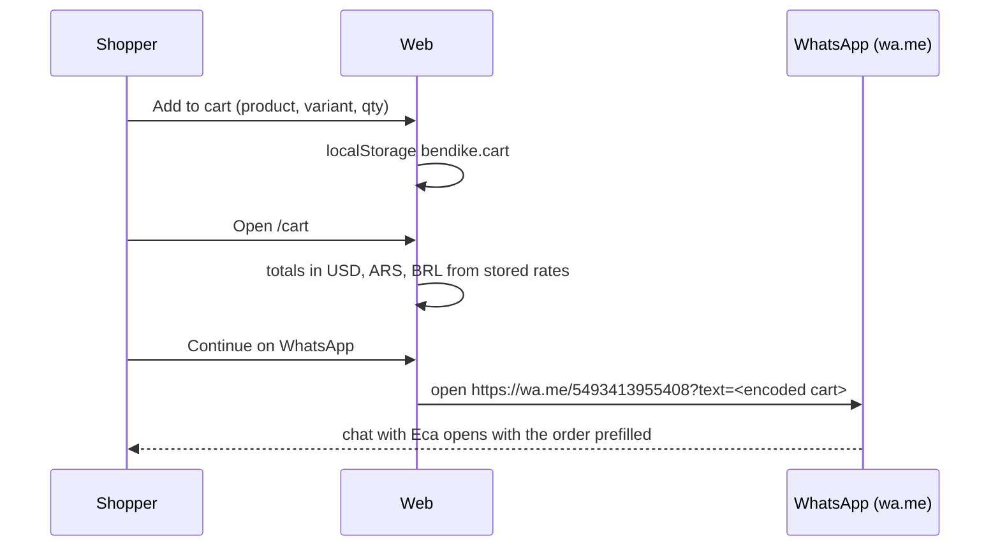

# Feature: Cart and WhatsApp checkout

> Issue: none yet · Branch: `feat/product-catalog` · ADR: [0003](../../docs/adr/0003-usd-pricing-derived-currencies-whatsapp-checkout.md) · Depends on: `product-catalog.md`

## Problem Statement

Shipping for wingsuits, parachutes and AADs varies by destination and product, so Eca does not sell online. A
shopper still needs a way to gather what they want and hand it to Eca in one message. The cart collects items and
the checkout step opens a WhatsApp conversation with Eca with the cart prefilled, instead of taking payment.

## Personas

| Persona  | Impact   | Notes                                                             |
| -------- | -------- | ----------------------------------------------------------------- |
| Visitor  | Positive | Can build a cart without an account and reach Eca in one tap      |
| User     | Positive | Same; the cart survives reloads on the same device                |
| Rigger   | Neutral  | May use it to order gear for customers                            |
| Dropzone | Neutral  | Same as rigger                                                    |
| Admin    | Positive | Receives structured orders on WhatsApp instead of loose questions |

## Value Assessment

- **Primary value**: Commercial — every WhatsApp message is a qualified lead with products, variants and totals.
- **Secondary value**: Efficiency — no payment provider, no order admin, no refunds to build before the business
  needs them.

## User Stories

### Story 1: Build a cart

As a **Visitor**,
I want **to add products with a chosen variant and quantity to a cart that survives a reload**,
so that I can **collect everything I want before contacting Eca**.

#### Acceptance Criteria

- When a visitor adds a product, the cart shall store the product slug, the chosen variant (if any), the quantity
  and the USD price at the time of adding, in `localStorage`.
- When the same product and variant is added again, the cart shall increase the quantity instead of adding a line.
- The navigation shall show a cart icon with the number of items, on every public page and in the app shell.
- The cart page at `/cart` shall list lines with image, name, variant, quantity controls, remove, and line totals.
- The cart page shall show the total in USD as the primary figure and the ARS and BRL equivalents as indicative.
- If a product in the cart is no longer active, then the cart page shall flag the line and exclude it from the total.

### Story 2: Check out on WhatsApp

As a **Visitor**,
I want **a checkout button that opens WhatsApp with my cart written out**,
so that I can **agree shipping and payment with Eca directly**.

#### Acceptance Criteria

- The cart page shall explain that shipping varies and that orders are completed with Eca on WhatsApp.
- When the visitor presses "Continue on WhatsApp", the web app shall open `https://wa.me/5493413955408` in a new tab
  with a prefilled message listing every line (name, variant, quantity, USD line total), the USD total, the
  indicative ARS and BRL totals with the rate date, and a placeholder for the shipping destination.
- The prefilled message shall be URL-encoded and shall stay under WhatsApp's practical length by summarising lines
  beyond the first twenty.
- If the cart is empty, then the checkout button shall be disabled and the page shall link back to the shop.
- The cart shall not be cleared automatically after opening WhatsApp; the visitor clears it.

---

## Design

> Refer to `.github/copilot-instructions.md` for technical standards.

### Role Access

| Role     | Access                     |
| -------- | -------------------------- |
| Visitor  | Cart and WhatsApp checkout |
| User     | Same                       |
| Rigger   | Same                       |
| Dropzone | Same                       |
| Admin    | Same                       |

### Components Affected

- `apps/web/src/cart/cart-context.tsx`, `use-cart.ts` — cart state in `localStorage` under `bendike.cart`
- `apps/web/src/cart/whatsapp-message.ts` — builds the prefilled message from cart lines and rates
- `apps/web/src/pages/cart/CartPage.tsx` — lines, totals, explanation, checkout button
- `apps/web/src/components/site/site-content.ts` — `WHATSAPP_NUMBER = '5493413955408'`
- `apps/web/src/components/site/SiteNav.tsx`, `components/AppShell.tsx` — cart icon with badge
- `apps/web/src/pages/shop/ProductPage.tsx` — Add to cart

### Dependencies

- `product-catalog.md` Tasks 1, 3, 4, 8 (contracts, product detail, exchange rates, product page)

### Data Model Changes

None on the server. Cart shape in `localStorage`:

```json
{
  "version": 1,
  "lines": [
    { "slug": "freak6", "variantId": "…", "variantLabel": "M / regular / custom", "quantity": 1, "unitPriceUsd": 2508 }
  ]
}
```

### Diagrams



### Open Questions

- [ ] Message language: English, Spanish, or both? Default: Spanish greeting, English body until told otherwise.
- [ ] Should signed-in users have the cart saved server-side too? Not until a payment decision exists.

---

## Tasks

### Task 1: Cart state

**Objective**: Add a cart context backed by `localStorage` with add, change quantity, remove and clear.

**Affected files**:

- `apps/web/src/cart/cart-context.tsx`, `use-cart.ts`, `cart-context.spec.tsx`, `main.tsx`

**Requirements**: Story 1

**Verification**:

- [ ] Adding the same product and variant twice yields one line with quantity 2; state survives a re-render from storage

**Done when**:

- [ ] All verification steps pass

---

### Task 2: Add to cart and cart badge

**Depends on**: Task 1

**Objective**: Wire the product page's Add to cart and show a badge count in `SiteNav` and `AppShell`.

**Affected files**:

- `apps/web/src/pages/shop/ProductPage.tsx`, `components/site/SiteNav.tsx`, `components/AppShell.tsx`, specs

**Verification**:

- [ ] Badge count equals total quantity; Add to cart is disabled until a full variant is chosen on products with options

**Done when**:

- [ ] All verification steps pass

---

### Task 3: Cart page with totals

**Depends on**: Task 1

**Objective**: Build `/cart` with lines, quantity controls, tri-currency totals and the shipping explanation.

**Affected files**:

- `apps/web/src/pages/cart/CartPage.tsx`, `CartPage.spec.tsx`, `App.tsx`

**Verification**:

- [ ] Totals recompute on quantity change; inactive products are flagged and excluded

**Done when**:

- [ ] All verification steps pass

---

### Task 4: WhatsApp handoff

**Depends on**: Task 3

**Objective**: Build the prefilled message and the Continue on WhatsApp button.

**Affected files**:

- `apps/web/src/cart/whatsapp-message.ts`, `whatsapp-message.spec.ts`, `pages/cart/CartPage.tsx`

**Requirements**: Story 2

**Verification**:

- [ ] Message contains every line, the USD total, ARS and BRL with the rate date, and a shipping placeholder; URL is `https://wa.me/5493413955408?text=…` and decodes back to the message
- [ ] Button is disabled on an empty cart

**Done when**:

- [ ] All verification steps pass

---

## Out of Scope

- Payments, orders, invoices, stock reservation
- Email or SMS alternatives to WhatsApp

## Future Considerations

- Server-side cart for signed-in users once orders exist
- Mercado Pago or Stripe when Eca wants to take payment online (new ADR)
