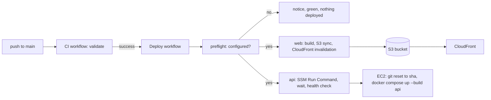
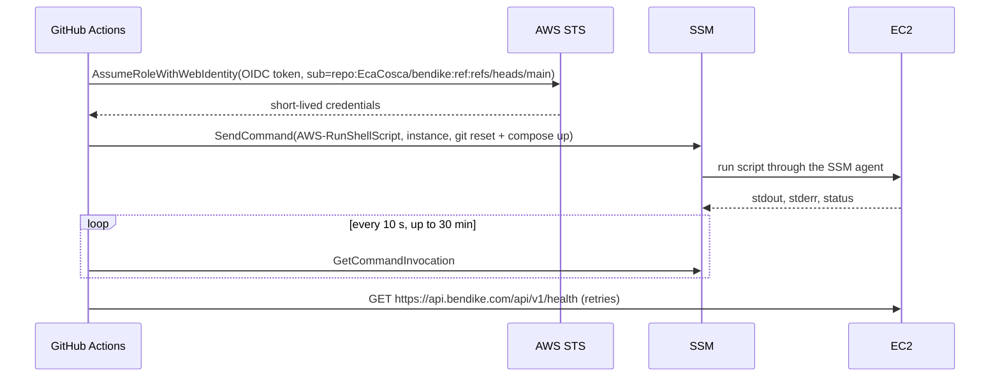

# Feature: Continuous deployment from GitHub Actions

> Issue: none yet · Branch: `main` · ADR: [0019](../../docs/adr/0019-deploys-run-from-github-actions-through-an-oidc-role-and-ssm-run-command.md) · Requested by Eca, 2026-09-24 · Extends: [aws-deployment.md](./aws-deployment.md)

## Problem Statement

Bendike runs on AWS (one EC2 instance for the API and Postgres, S3 and CloudFront for the web app), but every deploy
is a set of commands Eca types by hand: a Session Manager shell to pull and rebuild the API, and an S3 sync plus a
CloudFront invalidation from his laptop. Today the Learn section reached `main` with CI green and production kept
serving the previous build. Eca asked for a push to `main` to deploy on its own, without giving GitHub long-lived AWS
keys and without weakening the instance, which today accepts no SSH at all.

## Personas

| Persona  | Impact   | Notes                                                                     |
| -------- | -------- | ------------------------------------------------------------------------- |
| Visitor  | Positive | Sees new work minutes after it is merged instead of when Eca finds time   |
| User     | Positive | Same                                                                      |
| Rigger   | Positive | Same                                                                      |
| Dropzone | Positive | Same                                                                      |
| Admin    | Positive | Eca stops typing deploy commands; a failed deploy shows up red in Actions |

## Value Assessment

- **Primary value**: Efficiency — one push does what took two terminals and a checklist.
- **Secondary value**: Future — every deploy is the same script, so it cannot drift, and the exam material (IAM OIDC
  federation, SSM Run Command, least privilege) is learnt by setting it up once.
- **Risk**: a broken build could reach production; mitigated by deploying only after the CI workflow succeeds on the
  same commit.

## User Stories

### Story 1: Green CI on main deploys

As an **Admin**,
I want **a push to `main` that passes CI to deploy the web app and the API without me**,
so that I can **stop deploying by hand**.

#### Acceptance Criteria

- When the CI workflow completes with success for a commit on `main`, the Deploy workflow shall start for that same
  commit; when CI fails, the Deploy workflow shall not deploy.
- The Deploy workflow shall also run on manual dispatch for the current `main`.
- The Deploy workflow shall never run two deploys at once; a second one waits for the first.
- While the deploy configuration (role, region, bucket, distribution, instance, repo directory) is incomplete, the
  workflow shall end green with a notice naming what is missing, and deploy nothing, so an unconfigured repository
  stays green.

### Story 2: The web app reaches S3 and CloudFront

As an **Admin**,
I want **the built web app synced to the bucket and the cache invalidated**,
so that **visitors get the new build on the next load**.

#### Acceptance Criteria

- The workflow shall build `apps/web` from the validated commit with `npm ci` and `npm run build -w @bendike/web`.
- The workflow shall sync `dist/assets` with a one-year immutable cache header, then the rest of `dist` with a
  five-minute cache header, deleting files that no longer exist in the build.
- The workflow shall create one CloudFront invalidation for `/*` after the sync.

### Story 3: The API rebuilds on the instance

As an **Admin**,
I want **the instance to pull the validated commit and rebuild the API container**,
so that **the API and its migrations match the web app**.

#### Acceptance Criteria

- The workflow shall send one SSM Run Command to the instance that fetches `main`, resets the working copy to the
  validated commit, runs `docker compose -f docker-compose.prod.yml up -d --build api` and prunes old images.
- The workflow shall wait for the command to finish, print its output, and fail if the command did not succeed.
- After the command, the workflow shall request `GET /api/v1/health` on the production API with retries and fail if
  it does not answer 200.
- The instance shall keep accepting no SSH; deploys go through the SSM agent it already runs for Session Manager.

### Story 4: No long-lived keys

As an **Admin**,
I want **GitHub to assume an IAM role through OpenID Connect**,
so that **there is no access key to leak or rotate**.

#### Acceptance Criteria

- The workflow shall request an OIDC token (`id-token: write`) and assume a role whose trust policy accepts only this
  repository's `main` branch.
- The role's permissions shall be limited to: list and write the web bucket, create invalidations on the one
  distribution, send `AWS-RunShellScript` to the one instance, and read command invocations.
- No AWS access key shall be stored in GitHub secrets.

---

## Design

> Refer to `.github/copilot-instructions.md` for technical standards.

### Role Access

| Role     | Access                                                    |
| -------- | --------------------------------------------------------- |
| Visitor  | None; sees the result on the site                         |
| User     | None                                                      |
| Rigger   | None                                                      |
| Dropzone | None                                                      |
| Admin    | Eca configures the AWS side and can dispatch the workflow |

### Components Affected

- `.github/workflows/deploy.yml` — the workflow: `preflight`, `web`, `api`
- `README.md` — a "Deploy" section replacing the manual steps
- `.github/specs/aws-deployment.md` — its CI/CD open question now points here

### Dependencies

- GitHub repository **secrets**: `AWS_DEPLOY_ROLE_ARN` (the role below), `API_URL` (already used by the digest job).
- GitHub repository **variables**: `AWS_REGION`, `WEB_BUCKET`, `CLOUDFRONT_DISTRIBUTION_ID`, `EC2_INSTANCE_ID`,
  `EC2_REPO_DIR` (where the clone lives on the instance, for example `/home/ec2-user/bendike`), and optionally
  `VITE_GOOGLE_CLIENT_ID`.
- The instance role already carries `AmazonSSMManagedInstanceCore` (Session Manager works today), and Docker and
  git are installed on it (the manual deploy used them).
- Actions pinned to commit SHAs: `actions/checkout`, `actions/setup-node`, `aws-actions/configure-aws-credentials`.

### AWS resources Eca creates by hand (console, per ADR 0017)

1. **OIDC identity provider**: IAM → Identity providers → Add provider → OpenID Connect,
   URL `https://token.actions.githubusercontent.com`, audience `sts.amazonaws.com`.
2. **Role** `bendike-github-deploy`, trusted entity Web identity, that provider, audience `sts.amazonaws.com`, with
   this trust policy (replace the account id):

   ```json
   {
     "Version": "2012-10-17",
     "Statement": [
       {
         "Effect": "Allow",
         "Principal": { "Federated": "arn:aws:iam::<ACCOUNT_ID>:oidc-provider/token.actions.githubusercontent.com" },
         "Action": "sts:AssumeRoleWithWebIdentity",
         "Condition": {
           "StringEquals": {
             "token.actions.githubusercontent.com:aud": "sts.amazonaws.com",
             "token.actions.githubusercontent.com:sub": "repo:EcaCosca/bendike:ref:refs/heads/main"
           }
         }
       }
     ]
   }
   ```

3. **Permissions policy** on that role (replace bucket, distribution id, region, account and instance id):

   ```json
   {
     "Version": "2012-10-17",
     "Statement": [
       { "Effect": "Allow", "Action": "s3:ListBucket", "Resource": "arn:aws:s3:::<WEB_BUCKET>" },
       {
         "Effect": "Allow",
         "Action": ["s3:PutObject", "s3:DeleteObject", "s3:GetObject"],
         "Resource": "arn:aws:s3:::<WEB_BUCKET>/*"
       },
       {
         "Effect": "Allow",
         "Action": "cloudfront:CreateInvalidation",
         "Resource": "arn:aws:cloudfront::<ACCOUNT_ID>:distribution/<DISTRIBUTION_ID>"
       },
       {
         "Effect": "Allow",
         "Action": "ssm:SendCommand",
         "Resource": [
           "arn:aws:ec2:<REGION>:<ACCOUNT_ID>:instance/<INSTANCE_ID>",
           "arn:aws:ssm:<REGION>::document/AWS-RunShellScript"
         ]
       },
       { "Effect": "Allow", "Action": ["ssm:GetCommandInvocation", "ssm:ListCommandInvocations"], "Resource": "*" }
     ]
   }
   ```

4. In GitHub: Settings → Secrets and variables → Actions: the secret and the variables listed under Dependencies.

### Data Model Changes

None.

### Diagrams





### Open Questions

- [ ] Whether to add a staging environment; today there is one production and the spec deploys straight to it.
- [ ] Whether the web build should read `VITE_GOOGLE_CLIENT_ID` from a variable (as written) or the app should fetch
      it from the API at runtime.
- [ ] Whether to seed or run one-off scripts (such as `seed:learn`) from the workflow; today they stay a manual
      `tools` profile command on the instance.

---

## Tasks

### Task 1: The workflow

**Objective**: `deploy.yml` with the preflight, web and api jobs, pinned actions, least privilege, no secrets echoed.

**Affected files**: `.github/workflows/deploy.yml`

**Verification**:

- [x] `npx prettier --check .github/workflows` passes
- [x] Every third-party action is pinned to a commit SHA with a version comment
- [x] Pushing with the configuration missing ends the Deploy run green with the "not configured" notice

**Done when**:

- [x] All verification steps pass

---

### Task 2: The AWS side

**Depends on**: Task 1

**Objective**: OIDC provider, role, policy, GitHub secret and variables.

**Verification** (ticked once Eca confirms, or a Deploy run proves it):

- [ ] A Deploy run's `preflight` job reports configured
- [ ] The `web` job syncs and invalidates; `https://bendike.com/es/learn` shows the Learn section
- [ ] The `api` job finishes with `Status: Success` and the health check passes;
      `https://api.bendike.com/api/v1/learn/items` answers 200

**Done when**:

- [ ] All verification steps pass

---

### Task 3: Documentation

**Depends on**: Task 1

**Objective**: README "Deploy" section; the AWS spec's CI/CD question points here.

**Verification**:

- [x] README describes the automatic deploy and the configuration it needs, and no longer describes a manual deploy
      as the way to ship
- [x] `.github/specs/aws-deployment.md` Open Questions reference this spec

**Done when**:

- [x] All verification steps pass

---

## Out of Scope

- A staging environment or preview deploys for pull requests.
- Building the API image in Actions and pushing it to a registry; the instance builds it, as today.
- Running database seeds from the workflow.

## Future Considerations

- Terraform or CDK for the role and policy once the console setup is familiar (ADR 0017's own note).
- A Slack or WhatsApp notice when a deploy fails.
- Blue/green or a second instance if the API ever needs zero-downtime deploys; today `up --build` restarts it in
  seconds.
