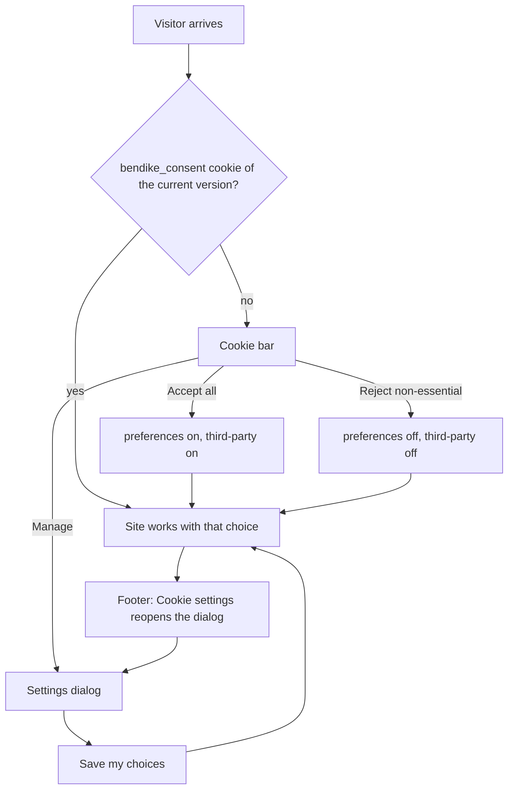
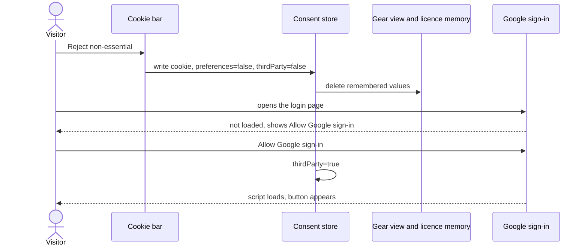

# Feature: Site footer and cookie consent

> Issue: none yet · Branch: `feat/footer-and-cookie-consent` · Requested by Eca, 2026-09-20

## Problem Statement

The public pages end in a thin footer with a logo, a line of text and two social icons, so a visitor has nowhere to go
next and no way to reach Eca or find the legal information. The site also stores small pieces of data in the browser
(the sign-in token, the language, the gear view, the licence number a rigger types) and can load Google's sign-in
script, with no notice to the visitor and no way to say no. Bendike needs a proper footer and a cookie consent bar
that lets a visitor accept, reject or fine-tune what is stored, links to a plain cookie policy, and really stops the
optional storage and the Google script until the visitor allows them.

## Personas

| Persona  | Impact   | Notes                                                                                       |
| -------- | -------- | ------------------------------------------------------------------------------------------- |
| Visitor  | Positive | Finds the way around, the contact details and the cookie policy; decides what may be stored |
| User     | Positive | Same choice, and can change it any time from the footer                                     |
| Rigger   | Neutral  | Their remembered licence number now depends on the preferences choice                       |
| Dropzone | Neutral  | Same as a user                                                                              |
| Admin    | Neutral  | Same as a user                                                                              |

## Value Assessment

- **Primary value**: Market: a credible footer and clear consent build trust with new visitors and are expected by
  visitors from regions with cookie rules.
- **Secondary value**: Future: the consent record and the categories are in place before analytics or other
  third-party tools are ever added.
- **Tertiary value**: Customer: one place to reach Eca and the legal information.

## User Stories

### Story 1: A footer worth scrolling to

As a **Visitor**,
I want **a footer with the main pages, how to reach Eca and the legal links**,
so that I can **find my way or get in touch from the bottom of any public page**.

#### Acceptance Criteria

- The web app shall show on every public page a footer with the Bendike brand and a line about what it is, links to
  Home, About, Shop and Services, Eca's email, WhatsApp, Instagram and LinkedIn, a link to the cookie policy, a
  "Cookie settings" button and the copyright with the current year.
- While the visitor is signed out, the footer shall link to Log in and Sign up; while signed in, it shall link to
  their gear instead.
- The web app shall keep the Shop and Services links in the visitor's current language.
- The web app shall lay the footer out in columns on a wide screen and stack them on a phone, with no horizontal
  scrolling.

### Story 2: The cookie bar

As a **Visitor**,
I want **to accept, reject or manage cookies the first time I arrive**,
so that I can **decide what the site may store on my device**.

#### Acceptance Criteria

- While the visitor has not made a choice, the web app shall show a bar at the bottom of every page with a short
  explanation, a link to the cookie policy and three buttons: "Accept all", "Reject non-essential" and "Manage".
- The web app shall give "Accept all" and "Reject non-essential" the same size and visual weight.
- When the visitor presses "Accept all", the web app shall record that preferences and third-party services are
  allowed and hide the bar; when they press "Reject non-essential", it shall record that they are not and hide the bar.
- When the visitor presses "Manage", or "Cookie settings" in the footer, the web app shall open a dialog with the
  three categories, each with a description: "Necessary" (always on, cannot be switched off), "Preferences" and
  "Third-party services", and "Save my choices", "Accept all" and "Reject non-essential" buttons.
- The web app shall remember the choice in a first-party cookie for 12 months, with the date it was made and the
  version of the policy it applied to.
- When the policy version changes, the web app shall ask again.
- The web app shall let the visitor change their mind at any time from the footer, and the change shall take effect
  at once.
- The web app shall not show the bar when printing.

### Story 3: The choice is honoured

As a **Visitor**,
I want **what I refuse not to be used**,
so that I can **trust the bar means it**.

#### Acceptance Criteria

- Where preferences are not allowed, the web app shall not read or write the remembered gear view or the remembered
  licence number, and when a visitor withdraws that permission, it shall delete both.
- Where third-party services are not allowed, the web app shall not load Google's sign-in script, and shall show, in
  place of the Google button, a short explanation with a button "Allow Google sign-in" that records the permission.
- The sign-in token that keeps a signed-in visitor signed in and the chosen language shall stay allowed, because the
  site does not work without them.

### Story 4: The cookie policy

As a **Visitor**,
I want **to read what is stored and why**,
so that I can **decide with the facts**.

#### Acceptance Criteria

- The web app shall serve `/cookies`, to everyone, with what cookies and browser storage are, a table of every item
  the site uses (name, type, category, what it is for, how long it lasts), the third party involved and what it does,
  how to change the choice, how to remove what is stored, Eca's contact details and the date the policy was last
  updated.
- The table shall list exactly the items the code uses, and a test shall fail if the code starts using a storage key
  the policy does not list.
- The page shall have a button that opens the cookie settings.

---

## Design

> Refer to `.github/copilot-instructions.md` for technical standards.

### Role Access

| Role     | Access                                    |
| -------- | ----------------------------------------- |
| Visitor  | Everything: footer, bar, settings, policy |
| User     | The same                                  |
| Rigger   | The same                                  |
| Dropzone | The same                                  |
| Admin    | The same                                  |

### Components Affected

- `apps/web/src/consent/` — storage, provider and hook, banner, settings dialog, policy page, storage inventory
- `apps/web/src/components/site/SiteFooter.tsx` — the new footer
- `apps/web/src/main.tsx`, `App.tsx` — provider, banner and the `/cookies` route
- `apps/web/src/pages/gear/gear-view.ts`, `apps/web/src/pages/packing/packing-draft.ts` — preferences gate
- `apps/web/src/auth/GoogleSignInSection.tsx`, `google-identity.ts` — third-party gate

### Dependencies

- None new. The choice is a first-party cookie set with `document.cookie`.

### Data Model Changes

None on the server. The browser keeps one cookie, `bendike_consent`, holding
`{ version, preferences, thirdParty, decidedAt }`.

### Diagrams

### Open Questions

- [ ] The banner, the settings and the policy are written in English for now; Spanish and Portuguese versions follow
      with the rest of the public site.
- [ ] Which lawyer or template the policy wording should be checked against before Bendike serves visitors from
      regions with cookie rules; this spec records the facts of what the code stores, not legal advice.
- [ ] Whether the sign-in token, which is kept in the browser's local storage, should move to a cookie the server can
      set as HttpOnly; out of scope here.

---

## Tasks

> Each task is one coding session. Tick the boxes in the same commit that delivers the work.

### Task 1: Consent core

**Objective**: Read and write the consent cookie, the provider and hook, and the check other code can call.

**Affected files**:

- `apps/web/src/consent/consent-storage.ts`, `ConsentProvider.tsx`, specs

**Requirements**: Stories 2, 3

**Verification**:

- [x] The cookie round-trips, expires after 12 months, is ignored when malformed or from another version; withdrawing
      preferences deletes the remembered values

**Done when**:

- [x] All verification steps pass

---

### Task 2: Cookie bar and settings

**Depends on**: Task 1

**Objective**: The bar, the settings dialog and their wiring at the top of the app.

**Affected files**:

- `apps/web/src/consent/CookieBanner.tsx`, `CookieSettingsDialog.tsx`, `apps/web/src/main.tsx`, specs

**Requirements**: Story 2

**Verification**:

- [x] The bar shows only without a choice; the three buttons work; the dialog saves the categories; the bar hides in print

**Done when**:

- [x] All verification steps pass

---

### Task 3: Honour the choice

**Depends on**: Task 1

**Objective**: Gate the remembered gear view and licence number and the Google sign-in script.

**Affected files**:

- `pages/gear/gear-view.ts`, `pages/packing/packing-draft.ts`, `auth/GoogleSignInSection.tsx`, `auth/google-identity.ts`, specs

**Requirements**: Story 3

**Verification**:

- [x] With preferences off nothing is read or written; with third-party off the Google script is never added and the
      Allow button works

**Done when**:

- [x] All verification steps pass

---

### Task 4: Cookie policy page

**Depends on**: Task 2

**Objective**: `/cookies` with the storage inventory table and a test that keeps it honest.

**Affected files**:

- `apps/web/src/consent/CookiePolicyPage.tsx`, `storage-inventory.ts`, `apps/web/src/App.tsx`, specs

**Requirements**: Story 4

**Verification**:

- [x] The table lists every storage key in the code; a test fails when a key is missing from it

**Done when**:

- [x] All verification steps pass

---

### Task 5: The footer

**Objective**: The new footer with columns, contact, legal links and the Cookie settings button.

**Affected files**:

- `apps/web/src/components/site/SiteFooter.tsx`, `site-content.ts`, specs

**Requirements**: Story 1

**Verification**:

- [x] Every link and the settings button work; signed-out and signed-in variants; verified in a browser at desktop and
      phone width; README and this spec updated

**Done when**:

- [x] All verification steps pass

---

## Out of Scope

- Analytics or advertising tools; none are used
- Server-side consent records
- Translating the bar and the policy
- A privacy policy page

## Future Considerations

- Spanish and Portuguese text
- An HttpOnly session cookie set by the API
