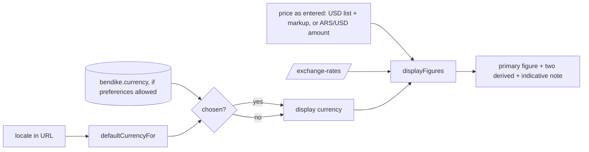
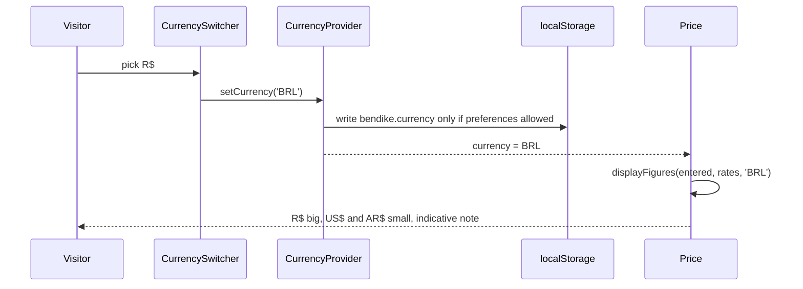

# Feature: Currency selector

> Issue: none yet · Branch: `main` · Requested by Eca, 2026-09-24 · Builds on: [product-catalog.md](./product-catalog.md), [rigging-services.md](./rigging-services.md), [cookie-consent-and-footer.md](./cookie-consent-and-footer.md), ADR [0003](../../docs/adr/0003-usd-pricing-derived-currencies-whatsapp-checkout.md)

## Problem Statement

Every price on the public site is shown the same way: the currency it was entered in as the big figure (US dollars
for the catalogue, pesos for services and used gear) and the other two currencies in small type beneath. A visitor in
Rosario reads a wingsuit in dollars and has to squint for the pesos; a visitor in São Paulo reads pesos for a repack
and has to find the reais. The site already lets the visitor pick a language from the navigation bar. Eca wants the
same for the currency: US$, AR$ or R$, chosen once, applied to every price.

## Personas

| Persona  | Impact   | Notes                                                                             |
| -------- | -------- | --------------------------------------------------------------------------------- |
| Visitor  | Positive | Primary audience: sees every price in the currency they think in                  |
| User     | Positive | Same, on the shop and services                                                    |
| Rigger   | Neutral  | Prices in the rigger workspace are not affected                                   |
| Dropzone | Positive | Same as visitor                                                                   |
| Admin    | Neutral  | Prices are still entered as today (USD list price, or a direct ARS or USD amount) |

## Value Assessment

- **Primary value**: Customer — a price you can read without converting is a price you can decide on.
- **Secondary value**: Market — Brazilian visitors see reais first, which the site says it supports but today shows
  in small type.
- **Efficiency**: fewer "how much is that in pesos?" WhatsApp messages.

## User Stories

### Story 1: Pick a currency

As a **Visitor**,
I want **a currency selector next to the language selector**,
so that I can **see prices in US$, AR$ or R$**.

#### Acceptance Criteria

- On every page under `/:locale/` (shop, product, services, learn), the navigation bar shall show a currency selector
  beside the language selector, with the options `US$`, `AR$` and `R$`, labelled for assistive technology with the
  translated word for currency.
- When the visitor picks a currency, the web app shall re-render every price on the page in that currency without a
  page reload and without changing the URL.
- While the visitor has not picked a currency, the web app shall default it from the page language: `es` → `AR$`,
  `pt` → `R$`, `en` → `US$`.
- When the visitor changes the language and has never picked a currency, the default shall follow the new language;
  when they have picked one, the pick shall win.

### Story 2: Read every price in the chosen currency

As a **Visitor**,
I want **the big figure in my currency and the other two small beneath**,
so that I can **compare quickly and still see the original**.

#### Acceptance Criteria

- The web app shall show, for every priced product, service and used item, the chosen currency as the primary
  figure and the other two currencies as derived figures, whatever currency the price was entered in, using the
  exchange rates the API already serves (`/api/v1/exchange-rates`).
- The primary figure shall be marked as converted (the existing "indicative, rates of {{date}}" note) whenever it is
  not the currency the price was entered in; when it is the entered currency, the note shall stay on the derived
  figures only, as today.
- If the exchange rates are unavailable, then the web app shall show the entered currency as the primary figure and
  no derived figures, as today, and the selector shall still work for the next load.
- The conversion arithmetic shall live in one pure function in `packages/shared` with tests, used by both the shop
  and the services price components, so the two cannot disagree.
- "Price on request" and "Price varies" prices shall stay as they are, in every currency.

### Story 3: Remember the choice, with consent

As a **Visitor**,
I want **the site to remember my currency**,
so that I can **not pick it again on every visit**.

#### Acceptance Criteria

- Where the visitor has allowed preference storage in the cookie consent, the web app shall store the chosen
  currency under the local storage key `bendike.currency` and read it on the next visit.
- While preference storage is not allowed, the web app shall keep the choice for the current page session only, in
  memory, and shall write nothing.
- When the visitor withdraws preference consent, the web app shall remove `bendike.currency` along with the other
  preference keys.
- The cookie policy inventory shall list `bendike.currency` under Preferences, so the existing inventory test fails
  if it is missing.

---

## Design

> Refer to `.github/copilot-instructions.md` for technical standards.

### Role Access

| Role     | Access                                        |
| -------- | --------------------------------------------- |
| Visitor  | Selector and converted prices on public pages |
| User     | Same                                          |
| Rigger   | Same on public pages; no change in `/app`     |
| Dropzone | Same                                          |
| Admin    | Same; admin tables keep the entered currency  |

### Components Affected

- `packages/shared/src/pricing.ts` — `DISPLAY_CURRENCIES`, `isCurrency`, `defaultCurrencyFor(locale)`,
  `displayFigures(entered: Money, rates, currency)` returning `{ primary, derived, primaryConverted }`; `priceFigures`
  becomes a call to it with the entered currency
- `packages/shared/src/pricing.spec.ts` — the arithmetic in every direction (USD, ARS, BRL entered; each displayed)
- `apps/web/src/currency/currency-storage.ts` — read and write `bendike.currency`, consent-aware
- `apps/web/src/currency/CurrencyProvider.tsx`, `currency-context.ts`, `use-currency.ts` — the chosen currency and its
  setter; default from the locale when nothing is chosen
- `apps/web/src/components/site/CurrencySwitcher.tsx` — the selector, rendered next to `LocaleSwitcher` in `SiteNav`
- `apps/web/src/components/Price.tsx`, `apps/web/src/pages/services/ServicePrice.tsx` — read the currency from the hook
- `apps/web/src/consent/consent-storage.ts` — `bendike.currency` joins `PREFERENCE_STORAGE_KEYS`
- `apps/web/src/consent/storage-inventory.ts` — the Preferences row
- `apps/web/src/main.tsx` — mount `CurrencyProvider` inside `ConsentProvider`
- `apps/web/src/i18n/locales/{en,es,pt}.json` — `nav.currency`

### Dependencies

- Exchange rates from the existing `exchange-rates` module (ARS and BRL per USD).
- Cookie consent's `preferences` category.

### Data Model Changes

None. Prices stay stored as entered; conversion happens in the browser.

### Diagrams

### Open Questions

- [ ] Should converted peso amounts be rounded to whole pesos (AR$ 2.160.000 instead of AR$ 2.160.000,00)? Default
      no: two decimals everywhere, as today.
- [ ] Should the WhatsApp enquiry message name the price in the chosen currency? Default no: the message keeps
      naming the item only, and the price conversation happens with Eca.
- [ ] Which ARS rate the shop uses (oficial, blue, MEP) is still the open question of ADR 0003; this feature only
      changes which figure is big.

---

## Tasks

### Task 1: Conversion in one place

**Objective**: `displayFigures` and `defaultCurrencyFor` in `packages/shared`, tested; `priceFigures` delegates.

**Affected files**: `packages/shared/src/pricing.ts`, `pricing.spec.ts`

**Verification**:

- [ ] Tests: USD entered shown in ARS and BRL; ARS entered shown in USD and BRL; BRL displayed from either; no rates
      gives the entered currency alone; `primaryConverted` is false only when the entered currency is displayed
- [ ] `npm run test:unit -w @bendike/shared` passes

**Done when**:

- [ ] All verification steps pass

---

### Task 2: The choice and its storage

**Depends on**: Task 1

**Objective**: Provider, hook, consent-aware storage, inventory row.

**Affected files**: `apps/web/src/currency/*`, `consent/consent-storage.ts`, `consent/storage-inventory.ts`, `main.tsx`

**Verification**:

- [ ] Tests: nothing chosen → the locale default; a pick is kept in memory; written to storage only with preference
      consent; removed when consent is withdrawn; inventory test passes with the new row

**Done when**:

- [ ] All verification steps pass

---

### Task 3: The selector and the prices

**Depends on**: Task 2

**Objective**: `CurrencySwitcher` in the nav; `Price` and `ServicePrice` render the chosen currency.

**Affected files**: `components/site/CurrencySwitcher.tsx`, `SiteNav.tsx`, `components/Price.tsx`,
`pages/services/ServicePrice.tsx`, locale JSON, specs

**Verification**:

- [ ] Tests: the switcher shows US$, AR$, R$ and is labelled; picking R$ makes the product card show `R$` first and
      `US$ · AR$` beneath with the indicative note; a service priced in pesos shown in US$ marks the primary as
      indicative; `/es/shop` defaults to AR$ and `/pt/services` to R$
- [ ] `npm run validate` passes

**Done when**:

- [ ] All verification steps pass
- [ ] README's shop paragraph mentions the currency selector

---

## Out of Scope

- Charging in any currency; there is no online payment.
- Letting admins enter prices in reais.
- Currency choice inside `/app` (gear, work queue), where no prices are shown.

## Future Considerations

- Whole-peso rounding if Eca prefers it.
- A per-account currency preference for signed-in users, next to their language.
