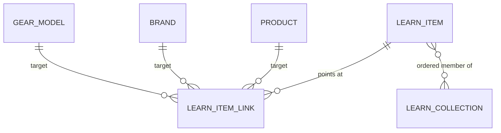
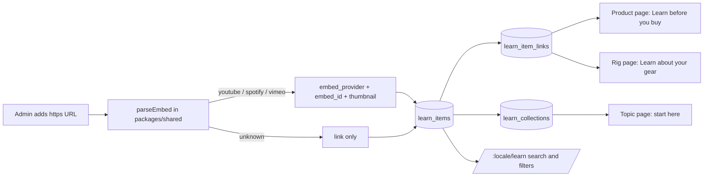
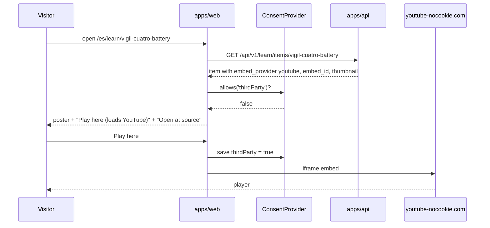

# Feature: Education and media (Learn)

> Issue: none yet · Branch: `main` (one contributor, see README) · ADR: [0018](../../docs/adr/0018-learning-resources-are-curated-links-with-consent-gated-embeds.md) · Briefed by Eca, 2026-09-24 · Builds on: [product-catalog.md](./product-catalog.md), [gear-tracking.md](./gear-tracking.md), [cookie-consent-and-footer.md](./cookie-consent-and-footer.md)

## Problem Statement

Skydivers come to Eca for information as much as for pack jobs: which AAD to buy, why a reserve is repacked every
180 days, how a wingsuit is sized, what a canopy does in turbulence. He answers the same questions again and again,
usually over WhatsApp, and the good material already exists in public: Squirrel's learn pages and channel, Brian
Germain's canopy videos and book, the FlySight and Vigil channels, and the skydiving podcasts he follows. Bendike
should hold that curated collection in one public place where anyone can find the right piece in seconds, where Eca
can send one link instead of re-explaining, and where each item in the shop points at the material a buyer should
see before deciding.

## Personas

| Persona  | Impact   | Notes                                                                                                  |
| -------- | -------- | ------------------------------------------------------------------------------------------------------ |
| Visitor  | Positive | Primary audience: finds videos, articles, podcasts and books by topic, level, format and language      |
| User     | Positive | Same, plus "learn about your gear" on their rig page and "learn before you buy" on every product       |
| Rigger   | Positive | Sends customers a link to the exact item or collection instead of explaining over WhatsApp             |
| Dropzone | Positive | Points students and new licence holders at the "start here" collections                                |
| Admin    | Positive | Curates the collection: adds items, links them to products, brands and gear models, orders collections |

## Value Assessment

- **Primary value**: Customer — a skydiver makes an informed decision and trusts the loft that helped them make it.
- **Secondary value**: Commercial — a buyer who has watched the manufacturer's material before asking buys the right
  thing, and the shop's WhatsApp handoff starts from an informed question.
- **Tertiary value**: Efficiency — Eca answers with a link. The same link goes to the next person who asks.

## Glossary

- **Item**: one piece of learning material: a video, an article, a podcast show or episode, a book, a channel, a
  course or a manufacturer's learn page. Bendike stores the link and metadata, never the content.
- **Collection**: an ordered, curated list of items with an introduction, for example "Buying your first AAD". The
  "start here" collection of a topic is the one Bendike shows first for that topic.
- **Topic**: one of a fixed list of subjects (below). An item has one or more topics.
- **Level**: who the item is for: `student`, `licensed`, `experienced`, `rigger` or `all`.
- **Embed**: a player Bendike can show in place of the link, recognised from the URL for YouTube, Spotify and Vimeo.

## User Stories

### Story 1: Find the right piece fast

As a **Visitor**,
I want **to browse and search the learning material by topic, format, level and language**,
so that I can **find the one video or episode that answers my question without scrolling through everything**.

#### Acceptance Criteria

- The web app shall serve `/:locale/learn` to everyone, in `es`, `en` and `pt`, with the site navigation and footer
  linking to it as "Learn" (translated).
- The page shall list active items as cards, 24 a page, each with thumbnail or format icon, title, source name,
  format, duration where known, content language, topics and level, newest curated first by default.
- The web app shall offer filters for topic, format, level and content language, a free-text search over title,
  summary, author and source name, and a sort by newest or by title, and shall write every filter, search and page
  into the URL query string so a filtered view can be shared as a link.
- When a visitor picks a topic, the web app shall show that topic's "start here" collection above the results when
  one exists.
- The API shall serve `GET /api/v1/learn/items` with `q`, `topic`, `type`, `level`, `lang`, `sort`, `page` and
  `pageSize` (max 48) parameters, returning items and a total, and shall return only active items to callers who are
  not admins.
- The API shall accept these fixed lists, defined once in `packages/shared`:
  - formats: `video`, `article`, `podcast`, `book`, `channel`, `course`, `page`
  - topics: `reserve_and_repack`, `aad`, `service_bulletins`, `canopy`, `wingsuit`, `weather`, `first_rig`,
    `gear_care`, `freefall`, `safety_culture`, `instruments`
  - levels: `student`, `licensed`, `experienced`, `rigger`, `all`
  - content languages: `en`, `es`, `pt`, `other`
- While the search returns nothing, the web app shall say so and offer to clear the filters, never an empty page.

### Story 2: Read, watch or listen in place

As a **Visitor**,
I want **to open an item and play it there when Bendike can, or go to the source when it cannot**,
so that I can **decide in one screen whether it is what I need**.

#### Acceptance Criteria

- The web app shall serve `/:locale/learn/:slug` for every active item with its title, summary, author, source,
  published date and duration where known, its topics and level, a "Open at source" link, a share button that copies
  the address, and a WhatsApp share link with the title and address in the message.
- Where the item's URL is a recognised YouTube, Spotify or Vimeo address, the API shall store the provider and embed
  id, derived by a pure function in `packages/shared` with tests, and the web app shall be able to show a player.
- While the visitor has not allowed third-party services in the cookie consent, the web app shall show the item's
  poster with a button "Play here (loads YouTube)" (or Spotify, Vimeo) that saves the third-party consent and then
  loads the player, following the same pattern as Google sign-in; it shall not load any third-party script or
  frame before that.
- Where a player is shown, the web app shall use the privacy-enhanced YouTube domain (`youtube-nocookie.com`) and
  the Spotify and Vimeo embed domains, and no other.
- The web app shall list the cookie-policy inventory entry for these embeds under "Third-party services", so the
  existing inventory test fails if the entry is missing.
- Below the item, the web app shall show "Related in the shop" (linked products and, where none, active products of a
  linked brand) and "More on this topic" (up to six other items sharing a topic).
- If the slug does not exist or the item is inactive, then the web app shall show the Learn page's not-found state
  with a link back to `/:locale/learn`, and the API shall respond 404.

### Story 3: Learn before you buy

As a **User**,
I want **to see the material about a product on the product page and about my gear on my rig page**,
so that I can **buy and maintain gear with the manufacturer's own explanations in front of me**.

#### Acceptance Criteria

- Where a product has linked items, the product page shall show a "Learn before you buy" section listing them; where it
  has none and its brand has linked items, the section shall show the brand's items; where neither exists, the section
  shall not render.
- The API shall serve `GET /api/v1/learn/for-product/:productId` returning the items for the product, then the
  brand, deduplicated, active only, in curated order.
- While signed in, the rig page shall show a "Learn about your gear" section with items linked to the gear models of
  the rig's components, grouped by component, and shall not render when there is nothing to show.
- The API shall serve `GET /api/v1/learn/for-rig/:rigId` to a caller who may read that rig, through
  `GearAccessService`, and shall respond 404 to anyone else, matching the rest of the gear API.
- The web app shall show the same "Learn about your gear" section on a component's page for that component's model.

### Story 4: Curate the collection

As an **Admin**,
I want **to add an item from its link, describe and tag it, link it to shop products, brands and gear models, and
build collections**,
so that I can **answer the next question with one address**.

#### Acceptance Criteria

- The web app shall serve `/app/admin/learn` to admins with a paginated table of all items (active and inactive),
  the same filters as the public page, and an "Add item" form.
- When an admin submits an `https` URL, the API shall derive the embed provider and id when recognised and, for
  YouTube, the thumbnail address, and shall create the item with slug, format, title, summary, author, source name,
  content language, topics, level, duration and published date; title and summary are `LocalizedText` with the
  same translation-overrides mechanism as products and services.
- If the URL is not `https`, or the slug is taken, or a topic, format, level or language is not in the fixed list,
  then the API shall respond 400 and store nothing.
- When an admin links an item to products, brands or gear models, the API shall replace the item's links with the
  given ids and respond 400 for an id that does not exist.
- When an admin creates or edits a collection, the API shall store slug, title, intro (both `LocalizedText`), topic,
  a `startHere` flag, an ordered list of item ids and an active flag; the API shall allow at most one "start here"
  collection per topic and respond 409 for a second.
- When an admin deactivates an item, the API shall keep it and its links and stop returning it from every public
  endpoint and from collections; the API shall not delete items.
- While signed in as a user, rigger or dropzone, when the caller opens `/app/admin/learn` or calls any
  `/api/v1/admin/learn/*` endpoint, the web app shall redirect to `/app` and the API shall respond 403.
- The API shall ship a seed script `npm run seed:learn -w @bendike/api`, idempotent by slug, with Eca's starting
  list: Squirrel Learn (page), Fly Squirrel TV (channel), Brian Germain's channel and his book, the FlySight and
  Vigil channels, and the four podcasts, each linked to the matching brand where one exists in the catalogue.

---

## Design

> Refer to `.github/copilot-instructions.md` for technical standards.

### Role Access

| Role     | Access                                                                                                 |
| -------- | ------------------------------------------------------------------------------------------------------ |
| Visitor  | Read `/:locale/learn`, item pages, collections, "Learn before you buy" on products                     |
| User     | Everything a visitor can, plus "Learn about your gear" on their own rigs and components                |
| Rigger   | Same as user, on their own gear and on linked customers' gear (through `GearAccessService`)            |
| Dropzone | Same as user, on the fleet it owns                                                                     |
| Admin    | Everything, plus `/app/admin/learn`: create, edit, deactivate items, link them, and manage collections |

### Components Affected

- `packages/shared/src/learn.ts` — `LEARN_FORMATS`, `LEARN_TOPICS`, `LEARN_LEVELS`, `CONTENT_LANGUAGES`,
  `LearnItemSummary`, `LearnItemDetail`, `LearnCollection`, `LearnQuery`, `parseEmbed(url)` (pure, tested),
  `youtubeThumbnail(id)`; exported from `packages/shared/src/index.ts`
- `apps/api/src/learn/` — new module: `entities/learn-item.entity.ts`, `entities/learn-collection.entity.ts`,
  `entities/learn-item-link.entity.ts`, `learn.service.ts`, `learn.controller.ts` (public),
  `learn-admin.controller.ts`, DTOs, `learn.service.spec.ts` on the in-memory manager
- `apps/api/src/database/migrations/<ts>-CreateLearn.ts` — tables below
- `apps/api/src/scripts/seed-learn.ts` and the `seed:learn` script in `apps/api/package.json`
- `apps/api/src/catalog/` — no schema change; the product detail endpoint stays as is, the web app calls
  `for-product` separately
- `apps/web/src/pages/learn/` — `LearnPage.tsx` (list, filters, URL state), `LearnItemPage.tsx`,
  `LearnFilters.tsx`, `LearnCard.tsx`, `EmbedPlayer.tsx` (consent-gated), `LearnCollectionStrip.tsx`, specs
- `apps/web/src/pages/shop/ProductPage.tsx` — "Learn before you buy" section
- `apps/web/src/pages/gear/RigPage.tsx`, `ItemPage.tsx` — "Learn about your gear" section
- `apps/web/src/pages/admin/LearnAdminPage.tsx` — admin table, item form, links picker, collections
- `apps/web/src/App.tsx` — routes `/:locale/learn`, `/:locale/learn/:slug`, `/app/admin/learn`
- `apps/web/src/components/site/site-content.ts`, `SiteFooter.tsx` — "Learn" in navigation and footer
- `apps/web/src/consent/storage-inventory.ts` — entry for YouTube, Spotify and Vimeo embeds
- `apps/web/src/i18n/locales/{en,es,pt}.json` — Learn strings, topic, format and level labels

### Dependencies

- No new packages. Players are plain `<iframe>` elements to the providers' embed domains.
- Brands `squirrel`, `flysight` and `vigil` exist in the catalogue for the seed to link to.
- Cookie consent's `thirdParty` category ([cookie-consent-and-footer.md](./cookie-consent-and-footer.md)).

### Data Model Changes

- `learn_items`: `id uuid`, `slug varchar(160) unique`, `format learn_format`, `title jsonb`, `summary jsonb`,
  `translation_overrides jsonb`, `author varchar(160) null`, `source_name varchar(160)`, `url varchar(2000)`,
  `embed_provider varchar(20) null` (`youtube`, `spotify`, `vimeo`), `embed_id varchar(120) null`,
  `thumbnail_url varchar(2000) null`, `content_language varchar(5)`, `topics text[]`, `level varchar(20)`,
  `duration_minutes int null`, `published_at date null`, `position int default 0`, `active bool default true`,
  `created_by uuid`, `created_at`, `updated_at`. Index on `active`, GIN index on `topics`.
- `learn_item_links`: `item_id uuid`, `target_kind varchar(12)` (`product`, `brand`, `gear_model`), `target_id uuid`,
  primary key on the three. No foreign key across kinds; the service validates the target exists.
- `learn_collections`: `id`, `slug unique`, `title jsonb`, `intro jsonb`, `topic varchar(40)`, `start_here bool`,
  `active bool`, timestamps; partial unique index on `(topic) where start_here`.
- `learn_collection_items`: `collection_id`, `item_id`, `position`, primary key `(collection_id, item_id)`.

### Diagrams

### Open Questions

- [ ] The first Spotify show (`3WjzoEn19X2rCimimh9C5N`) came without a name; Eca to confirm the title.
- [ ] The Brian Germain book: Eca wrote "the canopy and his pilot"; the published title is "The Parachute and its
      Pilot". Confirm before seeding.
- [ ] Should riggers be able to suggest an item for Eca to approve? Eca said he curates; suggestions are a later
      phase unless he wants them now.
- [ ] Manufacturer match by name: link brand items to rigs whose component manufacturer equals the brand name, so
      a Vigil AAD shows Vigil's channel without an explicit gear-model link. Cheap, but risks wrong matches for
      shared names; default no until asked.
- [ ] Episode-level items for podcasts (a single episode about AADs) versus show-level only. The schema allows both;
      the seed starts with shows.

---

## Tasks

> Each task should be completable in a single coding agent session. Complete in order unless noted.

### Task 1: Shared vocabulary and embed parser

**Objective**: Define the fixed lists, the contracts and `parseEmbed` in `packages/shared`.

**Context**: The API validates against these lists and the web app renders labels from them; the parser is the only
place that knows provider URLs, so it must be pure and tested.

**Affected files**:

- `packages/shared/src/learn.ts`, `packages/shared/src/learn.spec.ts`, `packages/shared/src/index.ts`

**Requirements**: Story 1 fixed lists; Story 2 embed derivation.

**Verification**:

- [ ] `parseEmbed` recognises `youtube.com/watch?v=`, `youtu.be/`, `youtube.com/@channel` (as `channel`, no embed),
      `open.spotify.com/show/`, `open.spotify.com/episode/`, `vimeo.com/<id>`, and returns `null` for anything else
- [ ] `npm run test:unit -w @bendike/shared` passes

**Done when**:

- [ ] All verification steps pass
- [ ] Code follows patterns in `.github/copilot-instructions.md`

---

### Task 2: Entities, migration and public read API

**Depends on**: Task 1

**Objective**: Store items, links and collections and serve the public list, item, for-product and for-rig endpoints.

**Affected files**:

- `apps/api/src/learn/entities/*.ts`, `apps/api/src/learn/learn.service.ts`, `learn.controller.ts`, DTOs,
  `learn.module.ts`, `apps/api/src/app.module.ts`
- `apps/api/src/database/migrations/<ts>-CreateLearn.ts`

**Requirements**: Story 1 API criteria; Story 2 404 and detail; Story 3 `for-product` and `for-rig`.

**Verification**:

- [ ] Service tests on the in-memory manager: filters combine, inactive items hidden, `for-product` falls back to
      brand and deduplicates, `for-rig` returns 404 through `GearAccessService` for a stranger and items for the owner
- [ ] `npm run test:unit -w @bendike/api` and `npm run typecheck` pass

**Done when**:

- [ ] All verification steps pass
- [ ] Migration applies on a fresh database

---

### Task 3: Admin API and seed

**Depends on**: Task 2

**Objective**: Create, edit, deactivate and link items, manage collections, and seed Eca's starting list.

**Affected files**:

- `apps/api/src/learn/learn-admin.controller.ts`, DTOs, `learn.service.ts`
- `apps/api/src/scripts/seed-learn.ts`, `apps/api/package.json`

**Requirements**: Story 4 API criteria.

**Verification**:

- [ ] Tests: 403 for user, rigger and dropzone on every admin endpoint; 400 on a non-https URL and on an unknown topic;
      409 on a second start-here collection for a topic; links replaced, unknown id rejected
- [ ] `npm run seed:learn -w @bendike/api` twice leaves the same rows and links Squirrel, FlySight and Vigil brands

**Done when**:

- [ ] All verification steps pass

---

### Task 4: Learn page with filters, search and shareable URLs

**Depends on**: Task 2

**Objective**: The public list at `/:locale/learn` with filters, search, sort and pagination held in the URL.

**Affected files**:

- `apps/web/src/pages/learn/LearnPage.tsx`, `LearnFilters.tsx`, `LearnCard.tsx`, `LearnCollectionStrip.tsx`, specs
- `apps/web/src/App.tsx`, `apps/web/src/components/site/site-content.ts`, `SiteFooter.tsx`
- `apps/web/src/i18n/locales/{en,es,pt}.json`

**Requirements**: Story 1 web criteria.

**Verification**:

- [ ] Tests: filters write to and read from the query string; empty state offers to clear; start-here strip appears
      only when a topic is picked and a collection exists; "Learn" appears in nav and footer in all three locales
- [ ] `npm run test:unit -w @bendike/web` passes

**Done when**:

- [ ] All verification steps pass

---

### Task 5: Item page with consent-gated player

**Depends on**: Task 4

**Objective**: `/:locale/learn/:slug` with the player behind third-party consent, share links, related shop items
and more on the topic.

**Affected files**:

- `apps/web/src/pages/learn/LearnItemPage.tsx`, `EmbedPlayer.tsx`, specs
- `apps/web/src/consent/storage-inventory.ts`, `apps/web/src/consent/CookiePolicyPage.tsx` if the table needs a row

**Requirements**: Story 2.

**Verification**:

- [ ] Tests: no `<iframe>` rendered while `thirdParty` is false; clicking "Play here" saves consent and renders the
      iframe on `youtube-nocookie.com`; unknown slug shows the not-found state; WhatsApp share link carries the title
- [ ] The inventory test in `storage-inventory.spec.ts` passes with the new entry

**Done when**:

- [ ] All verification steps pass

---

### Task 6: Learn before you buy, learn about your gear

**Depends on**: Task 5

**Objective**: Sections on the product page, the rig page and the component page.

**Affected files**:

- `apps/web/src/pages/shop/ProductPage.tsx`, `apps/web/src/pages/gear/RigPage.tsx`, `ItemPage.tsx`, specs
- `apps/web/src/api/learn-api.ts`

**Requirements**: Story 3.

**Verification**:

- [ ] Tests: section absent when the API returns nothing; product falls back to brand items; rig section grouped by
      component
- [ ] `npm run test:unit -w @bendike/web` passes

**Done when**:

- [ ] All verification steps pass

---

### Task 7: Admin page

**Depends on**: Task 3

**Objective**: `/app/admin/learn` to add, edit, deactivate and link items and to manage collections.

**Affected files**:

- `apps/web/src/pages/admin/LearnAdminPage.tsx`, `LearnItemForm.tsx`, `LearnLinksPicker.tsx`,
  `LearnCollectionsPanel.tsx`, specs, `apps/web/src/App.tsx`

**Requirements**: Story 4 web criteria.

**Verification**:

- [ ] Tests: pasting a YouTube URL fills provider and thumbnail preview; a user is redirected to `/app`; links picker
      searches products, brands and gear models
- [ ] `npm run validate` passes

**Done when**:

- [ ] All verification steps pass
- [ ] README "What you can do today" gains a Learn paragraph and the route table gains the three routes

---

## Out of Scope

- Hosting any video, audio or PDF: the manual library remains the place for files, for riggers only.
- Suggestions or comments from users and riggers (candidate for phase 2).
- View counts, analytics or "most watched" (needs consent thinking of its own).
- Automatic import of a channel's videos from YouTube or a show's episodes from Spotify.
- Machine translation of titles and summaries beyond the existing overrides mechanism.

## Future Considerations

- Rigger suggestions with admin approval, and a "suggested by" credit.
- Episode-level items pulled from a show's RSS feed, tagged by topic.
- A "send to customer" action from the rigger work queue that prefills WhatsApp with a Learn link.
- Notification-inbox notice when Eca adds an item to a topic a user has gear in.
- Manufacturer-name matching between brands and gear models if explicit links prove too much work to maintain.
