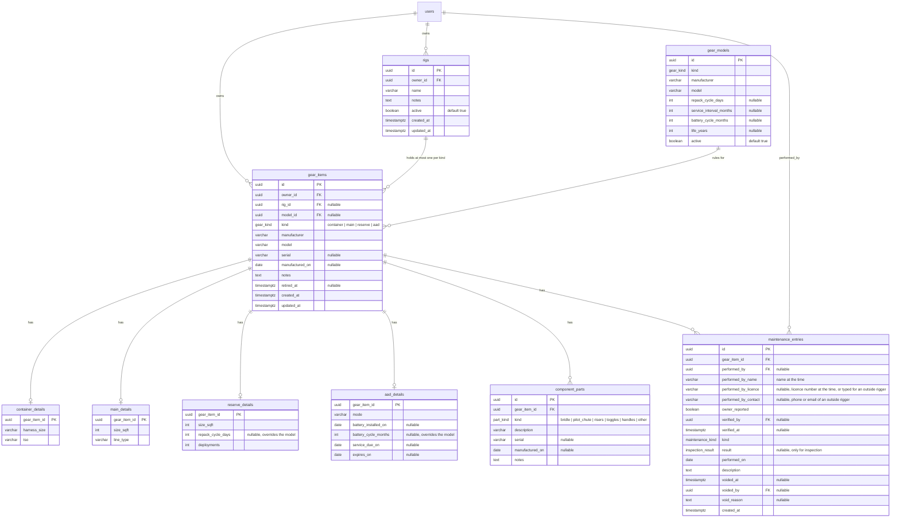
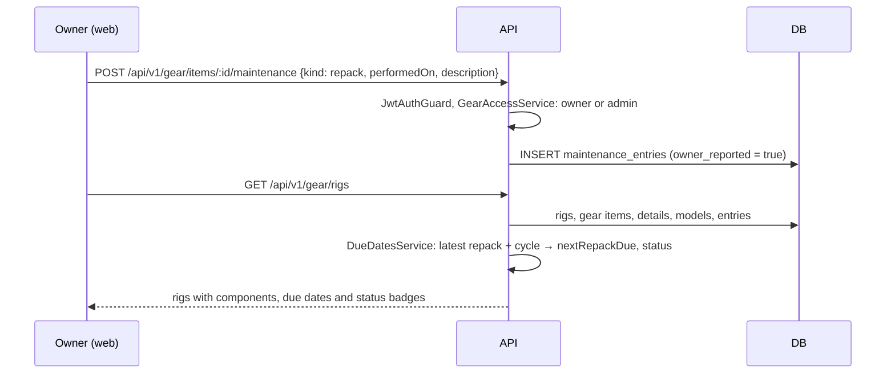
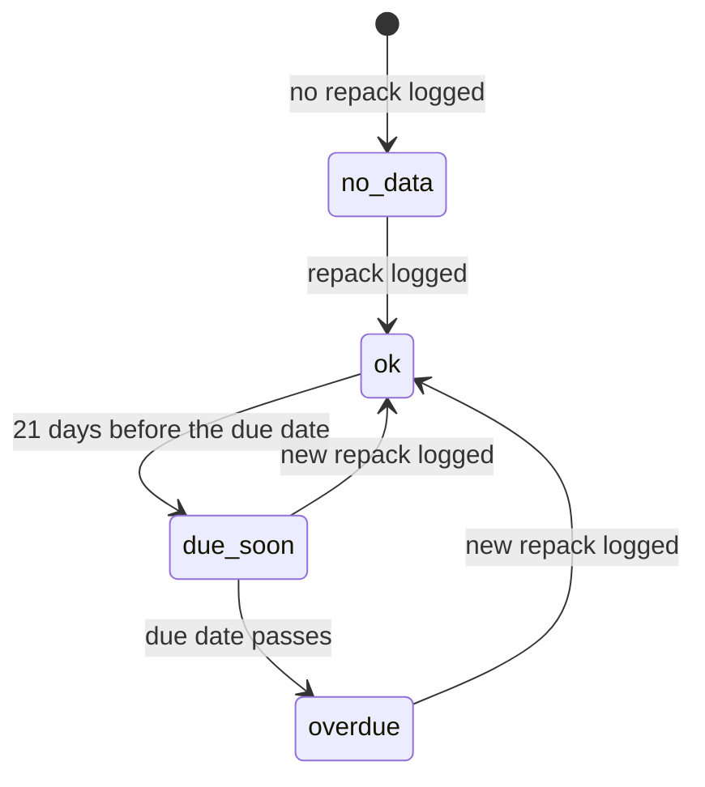

# Feature: Gear tracking (rigs, components and maintenance log)

> Issue: none yet · Branch: `feat/gear-tracking` (to be created) · ADR: [0004](../../docs/adr/0004-gear-items-and-maintenance-log.md) (amended 2026-09-19), [0012](../../docs/adr/0012-riggers-reach-gear-through-confirmed-links-and-dropzones-own-fleets.md) · Requested by Eca, 2026-09-11, reshaped 2026-09-19 so riggers are the first customer

## Problem Statement

A rig's safety-critical dates live on a packing data card in the reserve tray, in a rigger's memory and, for a
dropzone, in a spreadsheet: when the reserve was last repacked, when the AAD needs its battery, service or
replacement, what was done to the main. Bendike should hold each owner's rigs, the components each rig is made of
(container, main, reserve, AAD and their small parts), what has been done to each one, and the dates coming up with
a colour that says how urgent they are. The owner is a skydiver or a dropzone. Riggers, who are the first customers,
reach this data through [rigger-workspace.md](./rigger-workspace.md); this spec is the foundation both build on.

Related specs, in build order: this one, then [rigger-workspace.md](./rigger-workspace.md), then
[repack-reminders.md](./repack-reminders.md), then [service-bulletins-and-grounding.md](./service-bulletins-and-grounding.md).

## Personas

| Persona  | Impact   | Notes                                                                                        |
| -------- | -------- | -------------------------------------------------------------------------------------------- |
| Visitor  | Neutral  | No gear without an account                                                                   |
| User     | Positive | A dashboard of their rigs and spare gear, each with what is due and everything ever done     |
| Rigger   | Neutral  | Works through the rigger workspace; this spec gives them no access on its own                |
| Dropzone | Positive | A catalogue of everything the dropzone owns, rig by rig, with the same colours               |
| Admin    | Positive | Sees any owner's gear, maintains the model catalogue and imports a dropzone's existing fleet |

## Value Assessment

- **Primary value**: Customer — the product's core promise: nobody jumps out-of-date gear because nobody knew.
- **Secondary value**: Efficiency — replaces a dropzone's spreadsheet, whose links are typed text and whose rules
  live in people's heads.
- **Tertiary value**: Future — the log and the model catalogue feed reminders, bulletins and resale history.

## User Stories

### Story 1: My gear dashboard

As a **User** or **Dropzone**,
I want **one page listing my rigs, my spare gear and what is due, colour coded**,
so that I can **see at a glance whether everything I own is current**.

#### Acceptance Criteria

- The web app shall serve `/app/gear` to users and dropzones, listing the signed-in account's rigs, each with its
  container, main, reserve and AAD (or an empty slot), the next due dates and a status badge; for a dropzone the
  page is titled "Fleet".
- The web app shall list components that belong to no rig in a "Spare gear" section with their own status.
- The web app shall colour every status with a colour, an icon and a word, never a colour alone: red and "Overdue",
  yellow and "Due soon", green and "OK", grey and "No data".
- The web app shall show summary counts (overdue, due soon, no data) at the top and shall let the visitor filter
  by status and component kind, search by name or serial, and sort by name or by most urgent first.
- While a rig is inactive, the web app shall show it under "Inactive" with a grey badge, and its components shall
  not count in the summary.
- The web app shall show the gear as a grid by default, with an Equipment table (one row per component: rig,
  component, manufacturer, model, serial, date of manufacture, status, next due and notes; spare gear included) and a
  Rigs table (status, the four components, next due, last inspection and notes), and shall offer the card layout as an
  alternative that it remembers per browser.
- The grid shall be paginated, 25 rows a page by default with 10, 50 and 100 as options, and shall go back to the
  first page when a filter, the sort or the table changes; the search, status and component filters and the sort
  shall apply to the grid as they do to the cards.
- The API shall only return an account's own gear to users and dropzones; a request for another account's gear
  shall respond 404.
- The web app shall serve `/app/gear/:rigId` with the rig, its components with their details and parts, and the
  combined maintenance history newest first.

### Story 2: Rigs, components and parts

As a **User** or **Dropzone**,
I want **to add a container, main, reserve or AAD with its details, assign it to a rig and move it later**,
so that I can **describe my gear once and follow it when I change a rig**.

#### Acceptance Criteria

- When the account creates a rig, the API shall store a name and optional notes, mark it active and return it with
  four empty slots.
- The API shall create a gear item of a given kind with the shared fields (manufacturer, model, serial, date of
  manufacture, notes) and the kind's detail fields, and shall accept a component with no rig.
- If a rig already has a component of that kind, then assigning another shall respond 409.
- If the component and the rig have different owners, then assigning shall respond 409.
- When a component is unassigned or moved to another rig, the API shall keep its history and log an `assembly`
  entry on the component.
- When a component is retired, the API shall keep it and its history but hide it from active rigs and from due
  dates.
- The API shall let an account mark a rig inactive and active again without losing anything.
- The API shall store optional parts on a component (kind: bridle, pilot chute, risers, toggles, handles or other;
  description, serial, date of manufacture, notes), with no due dates.
- The detail fields shall be: container (harness size, TSO); main (size in square feet, line type); reserve (size,
  repack cycle in days, deployments count); AAD (mode, battery installed on, service due on, expires on).

### Story 3: Rules per model

As an **Admin**,
I want **to record, per manufacturer and model, the repack cycle, AAD service interval, battery cycle and life**,
so that I can **stop typing every AAD date by hand and let each component inherit its rules**.

#### Acceptance Criteria

- The API shall let only admins create, edit and deactivate gear models with manufacturer, model, kind, and any of:
  repack cycle in days, AAD service interval in months, battery cycle in months, life in years.
- When a component is created with a model from the catalogue, the API shall copy nothing but shall compute its due
  dates from the model's values; a value set on the component itself overrides the model's.
- If a component has no model and no value of its own, then the API shall use 180 days for a reserve's repack
  cycle and shall leave the AAD dates to the dates typed on the component.
- The web app shall offer an autocomplete of catalogue models on the component form and shall still accept a
  free-text manufacturer and model.

### Story 4: Maintenance log

As a **User** or **Dropzone**,
I want **to record work done to a component and read everything ever done to it**,
so that I can **keep a complete history, including work done elsewhere**.

#### Acceptance Criteria

- The API shall let the owner add a maintenance entry to their own gear item with `performedOn`, `kind`
  (`repack`, `reline`, `kill_line`, `inspection`, `repair`, `battery`, `aad_service`, `assembly`, `other`),
  `description` and the person who did the work, and shall mark it `owner_reported`.
- The web app shall ask an owner who did the work and offer "Someone outside Bendike"; when chosen, the web app
  shall require that person's name and ask for a phone or email and a licence number, and the API shall keep them
  on the entry (`performedByName`, `performedByContact`, `performedByLicence`) for later reference.
- The web app shall offer the outside riggers the owner has used before, so the details are typed once.
- While an owner-reported `repack`, `aad_service` or `repair` entry is neither verified nor voided, the API shall
  report the rig as grounded pending verification with the entry as the reason, and the web app shall show it as
  GROUNDED, distinct from the status colours, saying who packed it and that a rigger must verify it.
- When an admin verifies an entry, the API shall record who and when and the rig shall stop being grounded for that
  reason; a linked rigger verifies through [rigger-workspace.md](./rigger-workspace.md).
- The API shall count an unverified entry towards the due date, so the rig is not also shown overdue.
- The API shall let an inspection entry carry a `result` of `passed`, `needs_work` or `grounded`, and shall accept
  inspection entries only from admins here and from linked riggers through `rigger-workspace.md`; if an owner
  submits an `inspection` entry, then the API shall respond 403.
- The API shall never edit or delete an entry. When the author or an admin voids an entry with a reason, the API
  shall keep it, mark it voided with who and when, and leave it out of due-date calculations.
- If a user or a dropzone tries to add an entry to gear they do not own, then the API shall respond 404.
- The web app shall show entries per component and merged per rig, newest first, with kind, date, who, text, an
  "Unverified" marker on owner-reported entries and a struck-through style on voided ones.

### Story 5: Due dates and colours

As a **User**, **Dropzone** or **Rigger**,
I want **the next repack, AAD battery, AAD service and AAD expiry computed for me and coloured by urgency**,
so that I can **trust one place instead of my memory**.

#### Acceptance Criteria

- The API shall compute `nextRepackDue` as the latest non-voided `repack` entry's date plus the reserve's repack
  cycle; if no repack has been logged, then the status shall be `no_data` and the rig shall show "No repack
  logged".
- The API shall compute `batteryDue` as the latest non-voided `battery` entry's date plus the AAD's battery cycle,
  falling back to `batteryInstalledOn` plus the cycle; `serviceDueOn` is the model's service interval after the
  latest `aad_service` entry, falling back to the typed date; `expiresOn` is the typed date or the model's life
  after the date of manufacture.
- The API shall report each due date with a status: `overdue` when the date has passed, `due_soon` when it falls
  within the window, `ok` otherwise, `no_data` when it cannot be computed. The window is 21 days for a reserve
  repack and 90 days for each AAD date.
- The API shall report a rig's status as its worst component status in the order overdue, due soon, no data, ok.
- When an `aad_service` entry is logged with a next service date, the API shall store it as the AAD's service due
  date; a model's service interval, where there is one, takes precedence and is counted from the latest entry.
- The API shall report a rig's readiness as `airworthy` or `grounded` with its reasons; in this spec the only reason
  is `pending_verification`, and `service-bulletins-and-grounding.md` adds the others.
- The API shall compute every status against the current date in the `America/Argentina/Buenos_Aires` time zone.

---

## Design

> Refer to `.github/copilot-instructions.md` for technical standards.

### Role Access

| Role     | Access                                                                                                           |
| -------- | ---------------------------------------------------------------------------------------------------------------- |
| Visitor  | None                                                                                                             |
| User     | Own rigs, components, parts and owner-reported entries; read and write                                           |
| Rigger   | Own gear like any account; access to linked owners' gear comes from [rigger-workspace.md](./rigger-workspace.md) |
| Dropzone | Own fleet, components, parts and owner-reported entries; read and write                                          |
| Admin    | Everything, including the model catalogue and the fleet import                                                   |

### Components Affected

- `packages/shared/src/gear.ts` — `GEAR_KINDS`, `PART_KINDS`, `MAINTENANCE_KINDS`, `INSPECTION_RESULTS`, `Rig`,
  `GearItem` with kind details and parts, `GearModel`, `MaintenanceEntry`, request contracts
- `packages/shared/src/due-dates.ts` — `DueStatus`, `DUE_WINDOWS`, pure computation of every due date and status
- `apps/api/src/gear/` — entities (`Rig`, `GearItem`, `ContainerDetails`, `MainDetails`, `ReserveDetails`,
  `AadDetails`, `ComponentPart`, `GearModel`, `MaintenanceEntry`), `GearService`, `GearAccessService` (the single
  place that decides who may touch which owner's gear), `DueDatesService`, controllers, DTOs
- `apps/api/src/database/migrations/1758000000000-CreateGear.ts`
- `apps/api/scripts/import-fleet.ts` — one-off fleet importer
- `apps/web/src/pages/gear/` — `GearPage` (dashboard), `RigPage`, `GearItemForm`, `PartForm`,
  `MaintenanceEntryForm`, `StatusBadge`, `pages/admin/GearModelsPage.tsx`
- `apps/web/src/components/AppShell.tsx` — Gear link (touched by another workstream; keep the change to one link)

### Dependencies

- `user-accounts-and-roles.md` (roles and guards); the `dropzone` role is used as an owner.
- `rigging-services.md` phase 2 completes a request into a maintenance entry through this spec's service.
- [rigger-workspace.md](./rigger-workspace.md) extends `GearAccessService` with linked riggers.

### Data Model Changes

Constraints: `UNIQUE (rig_id, kind) WHERE rig_id IS NOT NULL`; `UNIQUE (manufacturer, model, kind)` on
`gear_models`; `result` only when `kind = 'inspection'`; an entry has no `updated_at` because it is never edited;
`rigs.owner_id = gear_items.owner_id` for any assigned item (checked in the service, since a cross-table check
needs a trigger); one detail row per gear item whose table matches its kind (checked in the service).

Status colours on the web: overdue red, due soon amber-yellow, ok green, no data grey; every badge also carries an
icon and text so the colour is never the only signal.

### Diagrams

### Open Questions

- [ ] Reserve repack cycle in Argentina: 180 days is the default; confirm it is the rule Eca follows.
- [ ] Unverified work grounds every owner's rig, including a skydiver with no rigger of their own, who must link a
      rigger to clear it. Decided 2026-09-19 for safety; revisit if it blocks individual skydivers.
- [ ] Yellow windows of 21 days (reserve) and 90 days (AAD) come from the dropzone's spreadsheet; confirm them.
- [ ] Which models and rules go into the catalogue at first? Eca supplies the manufacturers' figures; the spec ships
      the mechanism and no invented values.
- [ ] Should a canopy's reline (by jump count) get a due date? Needs jump counts; left out of phase 1.
- [ ] Photos of components and data cards: later.

---

## Tasks

> Tasks 1 to 6 are API and shared code and can be built without a UI. The rigger workspace starts after Task 5.

### Task 1: Shared gear contracts and due-date rules

**Objective**: Define kinds, shapes, windows and the pure due-date and status computation once, fully tested.

**Affected files**:

- `packages/shared/src/gear.ts`, `due-dates.ts`, `due-dates.spec.ts`, `index.ts`

**Requirements**: Story 5

**Verification**:

- [x] Table-driven tests: no repack logged is `no_data`; ok; due soon at exactly 21 days; overdue the day after;
      AAD due soon at exactly 90 days; battery falls back to the installed date; a voided entry is ignored; the worst
      status of a rig follows overdue, due soon, no data, ok
- [x] Dates are compared in `America/Argentina/Buenos_Aires`, including around midnight UTC

**Done when**:

- [x] All verification steps pass

---

### Task 2: Entities and migration

**Depends on**: Task 1

**Objective**: Persist rigs, gear items, the four detail tables, parts, models and maintenance entries with the
constraints above.

**Affected files**:

- `apps/api/src/gear/entities/*.entity.ts`, migration, `data-source.ts`

**Verification**:

- [x] Migration applies and reverts on docker Postgres with existing users present
- [x] A second component of one kind on a rig fails the unique index; an entry with a result and a kind other than
      inspection fails the check

**Done when**:

- [x] All verification steps pass

---

### Task 3: Gear model catalogue API

**Depends on**: Task 2

**Objective**: Admin-only create, edit, deactivate and list of gear models.

**Affected files**:

- `apps/api/src/gear/gear-models.controller.ts`, `gear-models.service.ts`, DTOs, specs

**Requirements**: Story 3

**Verification**:

- [x] Admin can create; user, rigger and dropzone get 403; a duplicate manufacturer, model and kind is 409

**Done when**:

- [x] All verification steps pass

---

### Task 4: Rigs, components and parts API

**Depends on**: Task 2

**Objective**: Create, read, update, assign, unassign, retire and inactivate rigs and components, and manage parts,
scoped by `GearAccessService` to the owner (user or dropzone) or an admin.

**Affected files**:

- `apps/api/src/gear/gear-access.service.ts`, `rigs.controller.ts`, `gear-items.controller.ts`, `gear.service.ts`,
  DTOs, specs

**Requirements**: Stories 1, 2

**Verification**:

- [x] Another account's rig is 404; a dropzone can create a rig and components; duplicate kind on a rig is 409;
      cross-owner assignment is 409; assignment logs an `assembly` entry; a spare component is accepted

**Done when**:

- [x] All verification steps pass

---

### Task 5: Maintenance entries API

**Depends on**: Task 4

**Objective**: Add owner-reported entries and void entries, with inspection results and the append-only rule.

**Affected files**:

- `apps/api/src/gear/maintenance.controller.ts`, `maintenance.service.ts`, DTOs, specs

**Requirements**: Story 4

**Verification**:

- [x] There is no edit or delete route; voiding needs a reason and keeps the row; a result on a non-inspection
      entry is 400; an owner's inspection entry is 403; a user cannot add to another owner's gear

**Done when**:

- [x] All verification steps pass

---

### Task 6: Due dates and status on the read models

**Depends on**: Tasks 1, 3, 5

**Objective**: Attach computed due dates and statuses to the rig list, rig detail and spare-gear responses, using
the model's rules where a component has a model.

**Affected files**:

- `apps/api/src/gear/due-dates.service.ts`, `gear.service.ts`, specs

**Requirements**: Story 5

**Verification**:

- [x] Worst status per rig; "No repack logged" when the log is empty; a component inherits its model's cycle and
      its own value overrides it; an inactive rig and a retired component are excluded

**Done when**:

- [x] All verification steps pass

---

### Task 7: Web: dashboard and rig page

**Depends on**: Task 6

**Objective**: `/app/gear` and `/app/gear/:rigId` with slots, spare gear, summary counts, filters, sort, search and
status badges that carry colour, icon and text.

**Affected files**:

- `apps/web/src/pages/gear/*`, `apps/web/src/App.tsx`, `apps/web/src/components/AppShell.tsx` (one link), specs

**Requirements**: Story 1

**Verification**:

- [x] Overdue is red, due soon yellow, ok green, no data grey, each with an icon and a word
- [x] Filtering by status and kind and sorting by most urgent work; a dropzone sees "Fleet" as the title
- [x] Verified in a browser at desktop and phone width

**Done when**:

- [x] All verification steps pass

---

### Task 8: Web: forms and the model catalogue page

**Depends on**: Task 7

**Objective**: Forms per kind with the right detail fields, parts, the add-entry form with the kind picker, the void
dialog, and the admin gear-models page.

**Affected files**:

- `apps/web/src/pages/gear/GearItemForm.tsx`, `PartForm.tsx`, `MaintenanceEntryForm.tsx`,
  `pages/admin/GearModelsPage.tsx`, specs

**Requirements**: Stories 2, 3, 4

**Verification**:

- [x] The reserve form shows that an empty repack cycle means the model's cycle or 180 days; the catalogue model
      picker fills manufacturer and model and links the rules; the entry form requires date, kind and description; an
      outside rigger's name is required for a repack, AAD service or repair; a voided entry stays visible and struck
      through

**Done when**:

- [x] All verification steps pass

---

### Task 9: Fleet import script

**Depends on**: Task 6

**Objective**: Import a dropzone's fleet from CSV exports of its spreadsheet (rigs, containers, AADs, reserves,
canopies) into one owner account, linking components by serial and creating one `repack` entry per reserve from its
last fold date.

**Affected files**:

- `apps/api/scripts/import-fleet.ts`, `apps/api/package.json` (script), spec for the parsing

**Verification**:

- [x] A dry run prints what would be created and every row it cannot link (missing serial, non-date value such as a
      year typed as `1017`); the real run is idempotent by serial
- [x] The importer reads a path argument; the spreadsheet itself is never committed (it holds real serials and
      contact details)

**Done when**:

- [x] All verification steps pass

---

### Task 10: Web: grid view

**Depends on**: Task 7

**Objective**: A paginated Equipment table and Rigs table on `/app/gear`, shown by default, next to the card layout.

**Affected files**:

- `apps/web/src/pages/gear/GearGrid.tsx`, `gear-grid.ts`, `gear-view.ts`, `GearPage.tsx`,
  `apps/web/src/components/AppShell.tsx` (wide layout), specs

**Requirements**: Story 1

**Verification**:

- [x] The Equipment table lists manufacturer, model, serial, date of manufacture, status, next due and notes for
      every component including spares; the Rigs table lists each rig with its four components
- [x] Paging, rows per page, and the return to page one when filters change work; the filters and sort apply
- [x] The grid is the default and the choice of cards or grid is remembered
- [x] Verified in a browser at desktop and phone width (the table scrolls sideways inside its own box)

**Done when**:

- [x] All verification steps pass

---

## Out of Scope

- Rigger access, links between riggers and owners, the work queue: [rigger-workspace.md](./rigger-workspace.md)
- Emails and WhatsApp reminders: [repack-reminders.md](./repack-reminders.md)
- Service bulletins and grounding: [service-bulletins-and-grounding.md](./service-bulletins-and-grounding.md)
- Jump counts and canopy reline limits
- Photos and document attachments

## Future Considerations

- Transferring a component to a new owner with its history, and starting a used-gear listing from a component
- Per-owner override of the yellow windows
- Jump counts per component and reline limits, fed by a manifest integration
