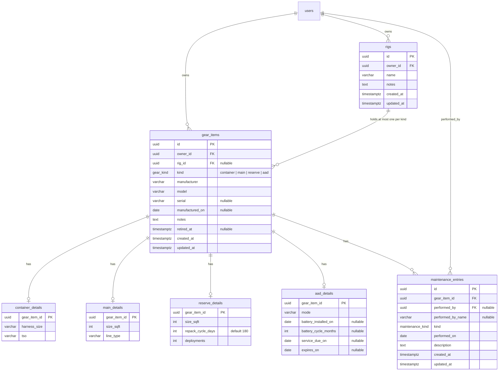

# Feature: Gear tracking (rigs and maintenance log)

> Issue: none yet · Branch: `feat/gear-tracking` (to be created) · ADR: [0004](../../docs/adr/0004-gear-items-and-maintenance-log.md) · Requested by Eca, 2026-09-11

## Problem Statement

A skydiver's safety-critical dates live on a packing data card in the reserve tray and in the rigger's memory: when
the reserve was last repacked, when the AAD battery or unit expires, what was done to the main. Bendike should hold
each skydiver's rigs, with the four components a rig is made of (container, main canopy, reserve canopy, AAD), the
notes and maintenance history of each component (a reline, a kill-line change, a repack, a battery), and the dates
coming up, so the skydiver, their rigger and later the automated reminders all look at the same record.

## Personas

| Persona  | Impact   | Notes                                                                          |
| -------- | -------- | ------------------------------------------------------------------------------ |
| Visitor  | Neutral  | No gear without an account                                                     |
| User     | Positive | Sees every rig, what is due and everything ever done to each component         |
| Rigger   | Positive | Logs the work they do on a customer's gear and sees the history before working |
| Dropzone | Neutral  | Phase 1 has no dropzone view; a "gear jumping here" view is a later spec       |
| Admin    | Positive | Same as rigger, on any account                                                 |

## Value Assessment

- **Primary value**: Customer — this is the product's core promise: nobody jumps out-of-date gear because nobody
  knew.
- **Secondary value**: Future — the log is the data source for automated reminders, bulletins and, one day, resale
  history.

## User Stories

### Story 1: My rigs

As a **User**,
I want **to list my rigs and see, per rig, its components and what is due next**,
so that I can **know at a glance whether I am current**.

#### Acceptance Criteria

- The web app shall serve `/app/gear` listing the signed-in account's rigs, each with its container, main, reserve
  and AAD (or an empty slot) and the next due dates with a status: ok, due within 30 days, overdue.
- When the account creates a rig, the API shall store a name and optional notes and return it with four empty slots.
- The API shall only return an account's own gear to users; a request for another account's gear shall respond 404.
- The web app shall serve `/app/gear/:rigId` with the rig, its components, their details and the combined
  maintenance history newest first.

### Story 2: Components

As a **User**,
I want **to add a container, main, reserve or AAD with its details and assign it to a rig**,
so that I can **describe my gear once and move components between rigs when I change something**.

#### Acceptance Criteria

- The API shall create a gear item of a given kind with the shared fields (manufacturer, model, serial, date of
  manufacture, notes) and the kind's detail fields.
- If a rig already has a component of that kind, then assigning another shall respond 409.
- When a component is unassigned or moved to another rig, the API shall keep its history and log an `assembly`
  entry on the component.
- When a component is retired, the API shall keep it and its history but hide it from active rigs.
- The detail fields shall be: container (harness size, TSO); main (size in square feet, line type); reserve (size,
  repack cycle in days, default 180, deployments count); AAD (mode, battery installed on, battery cycle in months,
  service due on, expires on).

### Story 3: Maintenance log

As a **Rigger**,
I want **to log work done to a component with a date, a kind, a description and who did it**,
so that I can **leave a record of every reline, kill line, repack and battery**.

#### Acceptance Criteria

- The API shall let the owner, any rigger and any admin add a maintenance entry to a gear item with `performedOn`,
  `kind` (`repack`, `reline`, `kill_line`, `inspection`, `repair`, `battery`, `aad_service`, `assembly`, `other`),
  `description`, and optional `performedByName` for work done outside Bendike.
- When a rigger or admin adds an entry, the API shall record their account as `performedBy`.
- If a user or a dropzone tries to add an entry to gear they do not own, then the API shall respond 403.
- The API shall let only the author or an admin edit or delete an entry, and shall keep entries when a component is
  retired.
- The web app shall show entries per component and merged per rig, newest first, with kind, date, who and text.

### Story 4: Due dates

As a **User**,
I want **the next repack and the AAD battery, service and expiry dates computed for me**,
so that I can **trust one place instead of my memory**.

#### Acceptance Criteria

- The API shall compute `nextRepackDue` as the latest `repack` entry's date plus the reserve's repack cycle; if no
  repack has been logged, then it shall be empty and the rig shall show "no repack logged".
- The API shall compute `batteryDue` as the latest `battery` entry's date plus the AAD's battery cycle, falling back
  to `batteryInstalledOn` plus the cycle; `serviceDueOn` and `expiresOn` are stored dates.
- The API shall report each due date with a status: ok (more than 30 days), due soon (30 days or fewer), overdue.
- The rig list and rig page shall show the worst status of a rig as its badge.

---

## Design

> Refer to `.github/copilot-instructions.md` for technical standards.

### Role Access

| Role     | Access                                                                 |
| -------- | ---------------------------------------------------------------------- |
| Visitor  | None                                                                   |
| User     | Own rigs, components and entries; read and write                       |
| Rigger   | Own gear as a user, plus add maintenance entries to any account's gear |
| Dropzone | Own gear as a user (phase 1); no view of others' gear                  |
| Admin    | Everything                                                             |

### Components Affected

- `packages/shared/src/gear.ts` — `GEAR_KINDS`, `MAINTENANCE_KINDS`, `Rig`, `GearItem` with kind details,
  `MaintenanceEntry`, `DueStatus`, request contracts
- `apps/api/src/gear/` — entities (`Rig`, `GearItem`, `ContainerDetails`, `MainDetails`, `ReserveDetails`,
  `AadDetails`, `MaintenanceEntry`), `GearService`, `DueDatesService` (pure), controllers, DTOs
- `apps/api/src/database/migrations/1758000000000-CreateGear.ts`
- `apps/web/src/pages/gear/` — `GearPage` (rig list), `RigPage`, `GearItemForm`, `MaintenanceEntryForm`,
  `DueBadge`
- `apps/web/src/components/AppShell.tsx` — Gear link

### Dependencies

- `user-profile-and-email-verification.md` is not required, but the rigger's `performedBy` shows their name.
- `notifications-inbox.md` phase 2 consumes `DueDatesService`.

### Data Model Changes



Constraints: `UNIQUE (rig_id, kind) WHERE rig_id IS NOT NULL`; `rigs.owner_id = gear_items.owner_id` for any
assigned item (checked in the service, since a cross-table check needs a trigger); one detail row per gear item
whose table matches its kind (checked in the service).

### Diagrams

```mermaid
sequenceDiagram
  participant Rigger as Rigger (web)
  participant API
  participant DB
  participant Owner as Skydiver (web)
  Rigger->>API: POST /api/v1/gear/items/:id/maintenance {kind: repack, performedOn, description}
  API->>API: JwtAuthGuard; owner, rigger or admin
  API->>DB: INSERT maintenance_entries (performed_by = rigger)
  Owner->>API: GET /api/v1/gear/rigs/:rigId
  API->>DB: rig, gear items, details, entries
  API->>API: DueDatesService: latest repack + cycle → nextRepackDue, status
  API-->>Owner: rig with components, history and due badges
```

### Open Questions

- [ ] Reserve repack cycle in Argentina: 180 days is the placeholder default; confirm the rule Eca follows.
- [ ] AAD rules per model (Vigil Cuatro: 20-year life, no scheduled service; Cypres: maintenance at fixed years):
      should Bendike pre-fill `expires_on` and `service_due_on` from manufacturer and model? Phase 1: typed by hand.
- [ ] Should a rigger see a list of their customers' rigs? Needs a rigger–customer relation; later spec.
- [ ] Photos of components and data cards: later.

---

## Tasks

### Task 1: Shared gear contracts and due-date rules

**Objective**: Define kinds, shapes and the pure due-date computation once, fully tested.

**Affected files**:

- `packages/shared/src/gear.ts`, `due-dates.ts`, `due-dates.spec.ts`, `index.ts`

**Verification**:

- [ ] Table-driven tests: no repack logged, ok, due soon at exactly 30 days, overdue; battery fallback to installed date

**Done when**:

- [ ] All verification steps pass

---

### Task 2: Entities and migration

**Depends on**: Task 1

**Objective**: Persist rigs, gear items, the four detail tables and maintenance entries with the constraints above.

**Affected files**:

- `apps/api/src/gear/entities/*.entity.ts`, migration, `data-source.ts`

**Verification**:

- [ ] Migration applies and reverts on docker Postgres; second component of a kind on one rig fails the unique index

**Done when**:

- [ ] All verification steps pass

---

### Task 3: Rigs and gear items API

**Depends on**: Task 2

**Objective**: Create, read, update, assign, unassign and retire rigs and items, owner-scoped.

**Affected files**:

- `apps/api/src/gear/rigs.controller.ts`, `gear-items.controller.ts`, `gear.service.ts`, DTOs, specs

**Requirements**: Stories 1, 2

**Verification**:

- [ ] Another account's rig is 404; duplicate kind on a rig is 409; assignment logs an `assembly` entry

**Done when**:

- [ ] All verification steps pass

---

### Task 4: Maintenance entries API

**Depends on**: Task 3

**Objective**: Add, edit and delete entries with the owner, rigger and admin rules.

**Requirements**: Story 3

**Verification**:

- [ ] Rigger can add to any gear; user cannot add to others'; only author or admin edits

**Done when**:

- [ ] All verification steps pass

---

### Task 5: Due dates on the rig read models

**Depends on**: Tasks 1, 4

**Objective**: Attach computed due dates and statuses to rig list and rig detail responses.

**Requirements**: Story 4

**Verification**:

- [ ] Worst status per rig; "no repack logged" when the log is empty

**Done when**:

- [ ] All verification steps pass

---

### Task 6: Web: gear list and rig page

**Depends on**: Tasks 3, 5

**Objective**: `/app/gear` and `/app/gear/:rigId` with slots, due badges and history.

**Verification**:

- [ ] Empty slot offers "Add" for that kind; badges follow status; history merges all components

**Done when**:

- [ ] All verification steps pass

---

### Task 7: Web: component and maintenance forms

**Depends on**: Task 6

**Objective**: Forms per kind with the right detail fields, and an add-entry form with the kind picker.

**Verification**:

- [ ] Reserve form defaults repack cycle to 180; entry form requires date, kind and description

**Done when**:

- [ ] All verification steps pass

---

## Out of Scope

- Automated reminders (notifications phase 2 consumes this spec's due dates)
- Service bulletins by make and model
- Dropzone view of gear jumping at the DZ
- Photos and document attachments

## Future Considerations

- Bulletins table matched to `manufacturer` and `model`, feeding `service_bulletin` notices
- Pre-filled AAD rules per manufacturer and model
- Rigger–customer relation so riggers see their customers' rigs
