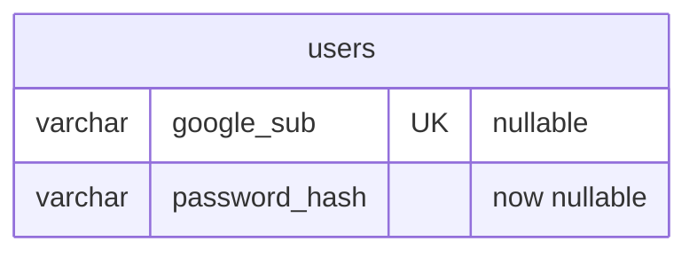
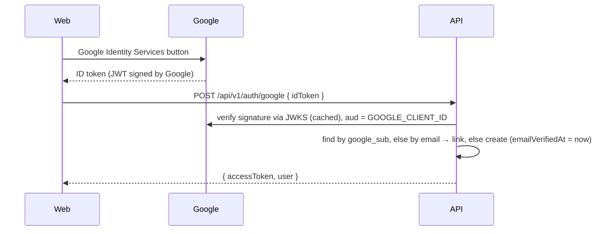

# Feature: Sign in with Google

> Issue: none yet · Branch: `feat/google-sign-in` (to be created) · ADR: [0005](../../docs/adr/0005-google-sign-in-alongside-passwords.md) · Requested by Eca, 2026-09-11

## Scope amendment (2026-09-19)

The account model in the code today has only `displayName` and a required password; the names, phone and
`emailVerifiedAt` this spec assumes arrive with [user-profile-and-email-verification.md](./user-profile-and-email-verification.md).
Phase 1 therefore ships the sign-in itself against today's model, and Story 2 waits for the profile spec:

- The new account's `displayName` is the token's `name`, falling back to the local part of its email. When the
  profile spec lands, it maps the token's `given_name` and `family_name` to `firstName` and `lastName` and sets
  `emailVerifiedAt` for Google accounts.
- Story 2 (complete the profile) and `profileComplete` move to the profile spec.
- `POST /auth/google` responds 503 while `GOOGLE_CLIENT_ID` is unset, and the web button renders only when
  `VITE_GOOGLE_CLIENT_ID` is set, so the app runs unchanged without a Google Cloud project.
- The account summary reports `authMethods` (`password`, `google` or both).

## Problem Statement

Skydivers will not remember another password. Most of them have a Gmail address, and Eca asked for Gmail
authentication. Bendike should let people sign up and sign in with their Google account, land in the same account
model and the same Bendike token as password users, and treat a Google-verified email as verified.

## Personas

| Persona  | Impact   | Notes                                                         |
| -------- | -------- | ------------------------------------------------------------- |
| Visitor  | Positive | One tap to create an account                                  |
| User     | Positive | No password to remember; email already verified               |
| Rigger   | Positive | Same                                                          |
| Dropzone | Neutral  | Dropzones usually have a shared mailbox; password login stays |
| Admin    | Positive | Fewer "I forgot my password" messages                         |

## Value Assessment

- **Primary value**: Market — lower sign-up friction for skydivers arriving from Instagram.
- **Secondary value**: Efficiency — no verification email needed for Google accounts.

## User Stories

### Story 1: Sign in with Google

As a **Visitor**,
I want **a "Continue with Google" button on the login and register pages**,
so that I can **enter Bendike without creating a password**.

#### Acceptance Criteria

- The login and register pages shall show a Google sign-in button rendered by Google Identity Services.
- When Google returns an ID token, the web app shall send it to `POST /api/v1/auth/google`.
- The API shall verify the token's signature, audience (Bendike's client id), issuer and expiry with Google's
  library; if verification fails, then the API shall respond 401.
- If the token's email is not verified by Google, then the API shall respond 401.
- If an account already has the token's `google_sub`, then the API shall sign that account in.
- If no account has the token's `google_sub` or email, then the API shall create one with role `user`, the token's
  name as display name, no password, and a `google_sub` link.
- If an account with the token's email exists, then the API shall link `google_sub` to it on first use and sign it
  in.
- The API shall respond with the same `AuthResponse` as password login.

### Story 2: Complete the profile (deferred to the profile spec)

As a **User** who signed in with Google,
I want **to be asked for my WhatsApp phone once**,
so that I can **be reached like every other account**.

#### Acceptance Criteria

- While a signed-in account has no phone, the web app shall show the "complete your profile" step before the
  dashboard, asking for the phone and confirming the names.
- The API shall report `profileComplete: false` on the account summary until the phone is set.

### Story 3: Password accounts keep working

As a **Dropzone**,
I want **email and password login to remain available**,
so that I can **share one login for the operation**.

#### Acceptance Criteria

- The API shall keep `POST /auth/register` and `POST /auth/login` unchanged.
- If an account was created by Google and has no password, then password login shall respond 401 with a message
  pointing to Google sign-in.
- The account summary shall report `authMethods`, and the admin account list shall show whether an account uses
  Google, a password, or both.

---

## Design

> Refer to `.github/copilot-instructions.md` for technical standards.

### Role Access

| Role     | Access                                     |
| -------- | ------------------------------------------ |
| Visitor  | Google sign-in and sign-up                 |
| User     | Google sign-in; link Google to own account |
| Rigger   | Same                                       |
| Dropzone | Same                                       |
| Admin    | Same, plus auth method on the account list |

### Components Affected

- `packages/shared/src/contracts.ts` — `GoogleSignInRequest`, `UserSummary.profileComplete`, `authMethods`
- `apps/api/src/auth/google/` — `GoogleTokenVerifier` (wraps `google-auth-library`), `google-auth.controller.ts`,
  service changes in `auth.service.ts`
- `apps/api/src/users/user.entity.ts` — `googleSub` (unique, nullable), `passwordHash` becomes nullable
- `apps/api/src/database/migrations/1758200000000-AddGoogleSignIn.ts`
- `apps/web/src/pages/AdminUsersPage.tsx` — "Sign-in" column
- `apps/api/src/config/app.config.service.ts` — `GOOGLE_CLIENT_ID`
- `apps/web/src/auth/GoogleSignInButton.tsx`, `auth-api.ts`, `pages/LoginPage.tsx`, `pages/RegisterPage.tsx`,
  `pages/CompleteProfilePage.tsx`

### Dependencies

- A Google Cloud project with an OAuth 2.0 Web client id (free); authorised JavaScript origins for localhost and
  the Vercel domain.
- `google-auth-library` on the API for ID token verification (new dependency).
- Google Identity Services script on the web (`https://accounts.google.com/gsi/client`); the button renders even
  if MUI styling differs.

### Data Model Changes

### Diagrams

### Open Questions

- [ ] Which Google account owns the Cloud project: Eca's Gmail? Needed to create the client id.
- [ ] Should linking Google to an existing password account require the password once? Phase 1: no, the email
      match is trusted because Google verified it and Bendike required verification for password accounts.

---

## Tasks

### Task 1: Contracts, entity, migration and config

**Objective**: `googleSub`, nullable password hash, `GOOGLE_CLIENT_ID` (optional), `authMethods` on the summary.

**Requirements**: Story 3

**Verification**:

- [x] Migration applies and reverts on a database that already has users
- [x] The summary of a password account reports `['password']`, a Google-only account `['google']`, a linked one both
- [x] `GOOGLE_CLIENT_ID` unset is valid configuration

**Done when**:

- [x] All verification steps pass

---

### Task 2: Token verification and sign-in endpoint

**Depends on**: Task 1

**Objective**: `POST /auth/google` with create, link and sign-in paths.

**Requirements**: Story 1, Story 3

**Verification**:

- [x] A token that fails verification, or whose email Google has not verified, is 401
- [x] A new email creates a `user` account with no password; a known `google_sub` signs in; an existing email links
- [x] A Google-only account cannot password-login and is told to use Google
- [x] With `GOOGLE_CLIENT_ID` unset the endpoint is 503

**Done when**:

- [x] All verification steps pass

---

### Task 3: Web button and admin column

**Depends on**: Task 2

**Objective**: Google button on login and register (only when `VITE_GOOGLE_CLIENT_ID` is set), and the "Sign-in"
column on the admin account list. The complete-profile step belongs to the profile spec.

**Requirements**: Story 1, Story 3

**Verification**:

- [x] The button posts the token, stores the session and lands on `/app` (or the page the visitor came from)
- [x] Without a client id no button renders and the password form is unchanged
- [x] The admin list shows Google, Password or both for each account

**Done when**:

- [x] All verification steps pass

---

## Out of Scope

- Apple, Facebook or other providers
- Google One Tap prompts

## Future Considerations

- Password reset for password accounts
- Unlinking Google from an account
