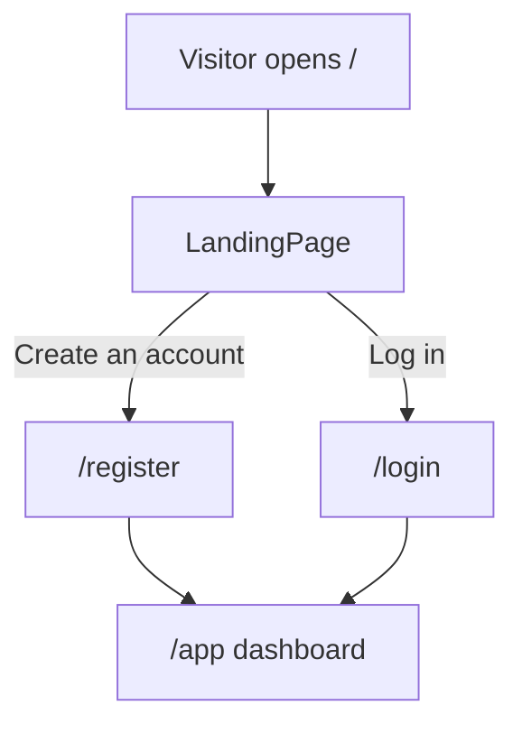

# Feature: Landing page

> Issue: none yet · Branch: `feat/landing-page-copy` (when picked up) · Status: **DRAFT, awaiting the product briefing**

## Problem Statement

A visitor who arrives at Bendike has no idea what it is, who it is for, or why they should create an account.
The current page at `/` is a scaffold placeholder: it shows the name, a generic tagline and one sentence per role.
The real copy, structure and imagery depend on a briefing from the product owner that has not happened yet.

## Personas

| Persona | Impact   | Notes                                                       |
| ------- | -------- | ----------------------------------------------------------- |
| Visitor | Positive | Primary audience; must understand Bendike in under a minute |
| User    | Neutral  | Signed-in users skip straight to `/app`                     |
| Rigger  | Positive | Should see why becoming a rigger is worth it                |
| Admin   | Neutral  | Same page, no admin-specific content                        |

## Value Assessment

- **Primary value**: Market — the landing page is how new users and riggers find out Bendike exists.
- **Secondary value**: Customer — clear expectations up front reduce sign-ups that churn immediately.

## User Stories

### Story 1: Understand Bendike

As a **Visitor**,
I want **to read what Bendike is and what each role does**,
so that I can **decide whether to create an account and which role I want to grow into**.

#### Acceptance Criteria

- While a visitor is not signed in, the web app shall show the landing page at `/`.
- The landing page shall render an H1 with the product name and one H2 per role (`user`, `rigger`, `dropzone`, `admin`).
- The landing page shall offer a "Create an account" call to action linking to `/register` and a "Log in" link to `/login`.
- When a signed-in person opens `/`, the web app shall still show the landing page with the top bar in its signed-in state.
- The landing page shall render without calling the API.

#### Notes

Everything below the H1 is placeholder copy until the briefing lands. The tests assert structure (headings, links),
not wording, so the copy can change without touching them.

---

## Design

> Refer to `.github/copilot-instructions.md` for technical standards.

### Role Access

| Role     | Access                       |
| -------- | ---------------------------- |
| Visitor  | Full page, anonymous top bar |
| User     | Full page, signed-in top bar |
| Rigger   | Full page, signed-in top bar |
| Dropzone | Full page, signed-in top bar |
| Admin    | Full page, signed-in top bar |

### Components Affected

- `apps/web/src/pages/LandingPage.tsx` — copy, sections, imagery
- `apps/web/src/pages/LandingPage.spec.tsx` — structure assertions
- `apps/web/src/theme/theme.ts` — palette if the briefing brings brand colours

### Dependencies

- None. Static page, no API calls.

### Data Model Changes

None.

### Diagrams

### Open Questions

To be answered in the product briefing (dictated by the product owner):

- [ ] What is Bendike, in one sentence a stranger understands?
- [ ] Is Bendike about skydiving? "Rigger" plus "dropzone" reads that way; confirm before the copy says so.
- [ ] What does a **rigger** actually do here (parachute inspection, repacks, repairs, reserve packing)?
- [ ] What is a **dropzone** account: the venue, its operator, or a staff login? Who registers it and who vets it?
- [ ] Who is the **user**: a skydiver, a student, someone who owns gear? What do they come to Bendike to get?
- [ ] What happens between a user and a rigger (a request, a booking, a match, a review)?
- [ ] Tone: playful, technical, safety-first, community?
- [ ] Brand assets: name styling, colours, logo, photography or illustration?
- [ ] Is there a geographic or community scope (a city, a club, a federation)?
- [ ] Any legal or safety disclaimer that belongs above the fold?

---

## Tasks

### Task 1: Placeholder structure

**Objective**: Ship a landing page with the final structure and placeholder copy so routing and tests exist.

**Context**: Lets the rest of the app link to `/` today; copy is swapped in Task 2.

**Affected files**:

- `apps/web/src/pages/LandingPage.tsx`
- `apps/web/src/pages/LandingPage.spec.tsx`

**Requirements**:

- Story 1: headings, calls to action, no API calls

**Verification**:

- [x] `npm run test:unit -w @bendike/web -- LandingPage` passes

**Done when**:

- [x] All verification steps pass
- [x] Code follows patterns in `.github/copilot-instructions.md`

---

### Task 2: Real copy and sections

**Depends on**: Task 1 and the product briefing

**Objective**: Replace placeholder text with the briefed copy and add the sections the briefing calls for.

**Affected files**:

- `apps/web/src/pages/LandingPage.tsx`
- `apps/web/src/pages/LandingPage.spec.tsx` (only if new sections add structure worth asserting)

**Requirements**:

- Story 1 with the Open Questions resolved

**Verification**:

- [ ] `npm run test:unit -w @bendike/web -- LandingPage` passes
- [ ] The page reads correctly at 400px and 1280px widths

**Done when**:

- [ ] All verification steps pass
- [ ] Every Open Question above is either answered in the copy or moved to Out of Scope

---

## Out of Scope

- SEO metadata, analytics, cookie banners
- A CMS for the copy

## Future Considerations

- A scroll-driven or animated version once the story is known (see the `scrollcraft` skill)
- Localisation if the audience is not English-first
