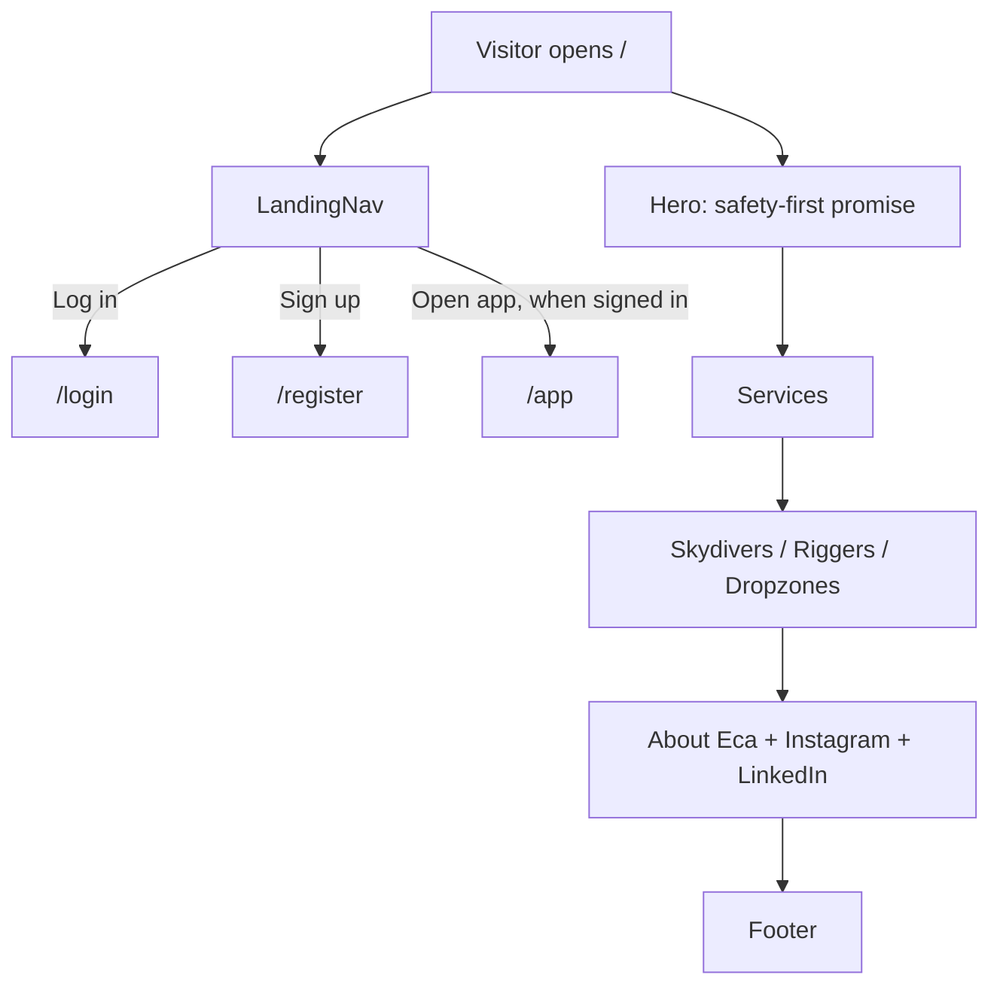

# Feature: Landing page

> Issue: none yet · Branch: `feat/landing-page-copy` · Briefing: dictated by Enrique Coscarelli on 2026-09-11

## Problem Statement

A visitor who arrives at Bendike has no idea what it is, who is behind it, or why they should create an account.
Bendike is a new company: a rigging loft in Argentina owned by Enrique "Eca" Coscarelli, plus the software he
builds so skydivers, riggers and dropzones stay on top of reserve repacks, AAD service and manufacturer service
bulletins. The landing page has to say that clearly, put Eca forward as the person behind it, make safety the
headline, link to his Instagram and LinkedIn, and lead into the sign-in flow.

## Personas

| Persona  | Impact   | Notes                                                                      |
| -------- | -------- | -------------------------------------------------------------------------- |
| Visitor  | Positive | Primary audience; must understand Bendike and who Eca is in under a minute |
| User     | Positive | A skydiver sees why tracking repacks, AADs and bulletins matters to them   |
| Rigger   | Positive | Sees a loft and a platform that lets them offer services and log pack jobs |
| Dropzone | Positive | Sees how gear status across their DZ becomes visible                       |
| Admin    | Neutral  | Same page, no admin-specific content                                       |

## Value Assessment

- **Primary value**: Market — the landing page is how skydivers, riggers and dropzones find out Bendike exists and
  who Eca is.
- **Secondary value**: Customer — a safety-first message sets expectations for what the software will nag you about.

## User Stories

### Story 1: Understand Bendike

As a **Visitor**,
I want **to read what Bendike does and who it is for**,
so that I can **decide whether to create an account**.

#### Acceptance Criteria

- While a visitor is not signed in, the web app shall show the landing page at `/`.
- The landing page shall render exactly one H1 stating the safety-first promise.
- The landing page shall render a services section naming rigging services, repack and AAD tracking, service
  bulletin alerts, and software.
- The landing page shall render an audiences section with one heading each for skydivers, riggers and dropzones.
- The landing page shall render without calling the API.

### Story 2: Meet Eca

As a **Visitor**,
I want **to know who is behind Bendike**,
so that I can **trust the loft and the software with my gear**.

#### Acceptance Criteria

- The landing page shall render an about teaser naming Enrique "Eca" Coscarelli, stating that he is from
  Argentina, owns a rigging loft there, and is also a programmer, with a link to the full About page at `/about`.
- The about teaser shall state that safety is the main priority.

### Story 3: Reach Eca

As a **Visitor**,
I want **links to Eca's Instagram and LinkedIn**,
so that I can **follow the loft and contact him**.

#### Acceptance Criteria

- The landing page shall render a link to Eca's Instagram and a link to his LinkedIn, each opening in a new tab
  with `rel="noopener noreferrer"`.
- The social links shall appear in the about teaser and in the footer.
- Every public page and the signed-in app shell shall show a floating WhatsApp button in the bottom-right corner
  that opens `https://wa.me/5493413955408` in a new tab with a short greeting prefilled.

### Story 5: See who Bendike is an authorized dealer for

As a **Visitor**,
I want **to see the brands Bendike sells as an authorized dealer**,
so that I can **trust the shop and jump to that brand's products** (briefing of Eca, 2026-09-18).

#### Acceptance Criteria

- The landing page shall show a brand strip directly below the hero, titled "Authorized dealer for", with the
  Squirrel, Vigil and FlySight logos.
- The brand strip shall show the logos in greyscale so it stays within the site palette, scroll continuously as a carousel, pause while the visitor hovers or focuses it, and stay
  still with every logo visible for visitors who prefer reduced motion.
- When a visitor selects a logo, the web app shall open the shop filtered to that brand.
- Each logo shall have the brand name as its accessible name, and the repeated copy the carousel needs for a
  seamless loop shall be hidden from assistive technology.

### Story 4: Get in

As a **Visitor**,
I want **a navigation bar with Log in and Sign up**,
so that I can **enter the app from anywhere on the page**.

#### Acceptance Criteria

- While a visitor is not signed in, the navigation shall show a "Log in" link to `/login` and a "Sign up" link to
  `/register`.
- While signed in, the navigation shall replace those with an "Open app" link to `/app`.
- The navigation shall link to the Home and About pages (see `about-page.md`); the hero keeps an in-page anchor to
  the services section.

---

## Design

> Refer to `.github/copilot-instructions.md` for technical standards.

### Role Access

| Role     | Access                                         |
| -------- | ---------------------------------------------- |
| Visitor  | Full page, navigation shows Log in and Sign up |
| User     | Full page, navigation shows Open app           |
| Rigger   | Full page, navigation shows Open app           |
| Dropzone | Full page, navigation shows Open app           |
| Admin    | Full page, navigation shows Open app           |

### Components Affected

- `apps/web/src/components/site/site-content.ts` — site name, navigation links, social handles (shared with the About page)
- `apps/web/src/components/site/SiteNav.tsx`, `SiteFooter.tsx`, `SocialLinks.tsx`, `SitePage.tsx` — shared public-site chrome
- `apps/web/src/components/site/WhatsAppFab.tsx` — floating WhatsApp button, also mounted in `components/AppShell.tsx`
- `apps/web/src/pages/landing/landing-content.ts` — every landing string (hero, services, audiences, about teaser)
- `apps/web/src/pages/landing/HeroSection.tsx` — headline, promise, calls to action
- `apps/web/src/pages/landing/ServicesSection.tsx` — four service cards
- `apps/web/src/pages/landing/AudiencesSection.tsx` — skydivers, riggers, dropzones
- `apps/web/src/pages/landing/BrandCarousel.tsx` — authorized-dealer logo strip (Story 5); logos in `apps/web/public/brands/`
  with their sources in `design/brands/`
- `apps/web/src/pages/landing/AboutSection.tsx` — Eca teaser, Argentina, safety, social links, link to `/about`
- `apps/web/src/pages/landing/LandingPage.tsx` — composition
- `apps/web/src/pages/landing/LandingPage.spec.tsx` — structure assertions
- `apps/web/src/theme/theme.ts` — brand palette and typography
- `apps/web/index.html` — title, description, web font

### Dependencies

- Google Fonts (Inter) loaded from `index.html`; the page still renders with the system fallback if it is blocked.
- `@mui/icons-material` for section and social icons (already a dependency).

### Data Model Changes

None.

### Diagrams

### Open Questions

Resolved by the 2026-09-11 briefing:

- [x] What is Bendike? A rigging loft in Argentina and the software that keeps skydivers current on repacks, AADs
      and service bulletins. Safety is the main priority.
- [x] Is Bendike about skydiving? Yes.
- [x] Who is behind it? Enrique "Eca" Coscarelli, from Argentina, rigger and programmer.
- [x] LinkedIn: `https://www.linkedin.com/in/enrique-coscarelli/`.
- [x] Instagram: `@ecacoscarelli`.
- [x] Dedicated About page: yes, see `about-page.md`.

Still open:

- [ ] A photo of Eca or the loft for the about teaser (an initials avatar stands in today).
- [x] Logo and brand colours: Eca's winged sun-with-eye mark (2026-09-14), gold `#E0A406` on navy `#0B2545`.
      Originals in `design/logos/`, web cuts generated into `apps/web/public/brand/` (gold and white, three sizes,
      favicons). Typeface: Futura (Ableton-style) where installed or licensed, Jost from Google Fonts as the free
      fallback until a Futura PT licence is bought.
- [ ] Spanish version of the page.
- [ ] What a dropzone account can do beyond signing in (belongs to a later spec).

---

## Tasks

### Task 1: Placeholder structure

**Objective**: Ship a landing page with headings, calls to action and tests so routing exists.

**Verification**:

- [x] `npm run test:unit -w @bendike/web -- LandingPage` passes

**Done when**:

- [x] All verification steps pass

---

### Task 2: Real copy, sections and brand

**Depends on**: Task 1 and the product briefing

**Objective**: Replace the placeholder with the briefed content in a content module, sectioned layout and brand
theme.

**Context**: The briefing resolved what Bendike is and who Eca is. Copy lives in one module so wording can change
without touching layout or tests.

**Affected files**:

- `apps/web/src/pages/landing/*`
- `apps/web/src/theme/theme.ts`
- `apps/web/index.html`
- `apps/web/src/App.tsx`

**Requirements**:

- Stories 1 to 4

**Verification**:

- [x] `npm run test:unit -w @bendike/web -- LandingPage` passes
- [x] `npm run validate` passes
- [x] The page reads correctly at 400px and 1280px widths (manual, dev server)

**Done when**:

- [x] All verification steps pass
- [x] Every resolved Open Question above is reflected in the copy

---

### Task 3: Imagery and brand

**Depends on**: Task 2

**Objective**: Add a real photo and apply the final logo and colours.

**Affected files**:

- `apps/web/src/pages/landing/AboutSection.tsx`
- `apps/web/src/theme/theme.ts`

**Verification**:

- [ ] Eca has reviewed the copy and the look
- [ ] `npm run validate` passes

**Done when**:

- [ ] All verification steps pass
- [ ] The remaining Open Questions are answered or moved to Out of Scope

---

### Task 4: Authorized-dealer brand carousel

**Objective**: Add the brand strip below the hero with the Squirrel, Vigil and FlySight logos.

**Affected files**:

- `apps/web/src/pages/landing/BrandCarousel.tsx`, `BrandCarousel.spec.tsx`, `landing-content.ts`, `LandingPage.tsx`,
  `LandingPage.spec.tsx`
- `apps/web/public/brands/*`, `design/brands/*`

**Requirements**: Story 5

**Verification**:

- [x] Each logo links to `/shop?brand=<slug>` and is reachable by its brand name; the looping copy is `aria-hidden`
- [x] The strip renders below the hero and the page still has exactly one H1
- [x] Viewed in a browser at desktop and phone width: no horizontal page scroll, logos crisp, motion pauses on hover; logos shown in greyscale (Eca, 2026-09-18)

**Done when**:

- [x] All verification steps pass

---

## Out of Scope

- SEO beyond title and description, analytics, cookie banners
- A CMS for the copy
- Contact form or email capture (no email address was provided)

## Future Considerations

- Spanish localisation, since the loft is in Argentina
- A scroll-driven version once there is photography of the loft (see the `scrollcraft` skill)
