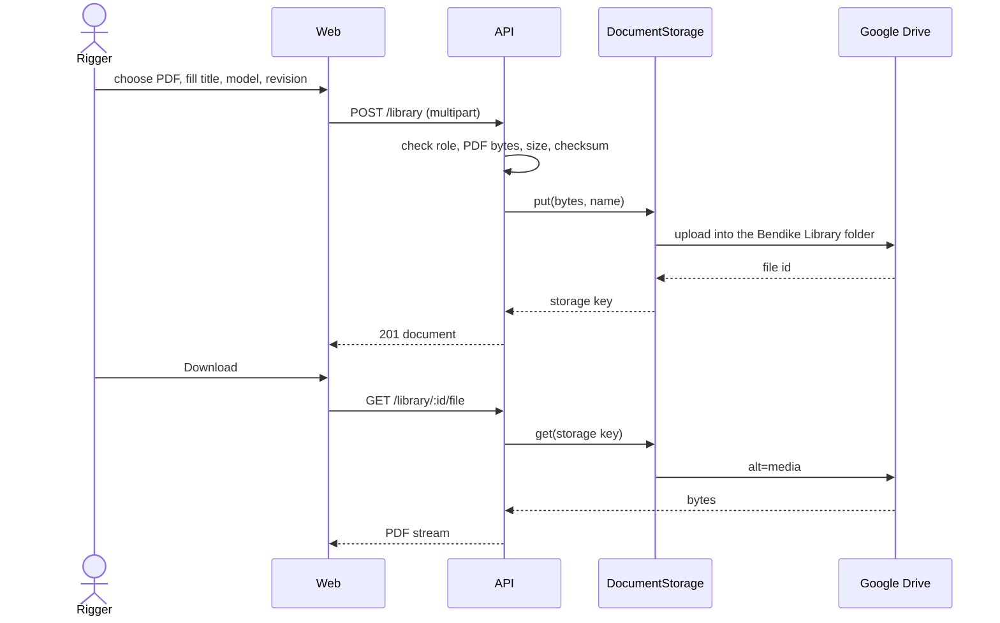
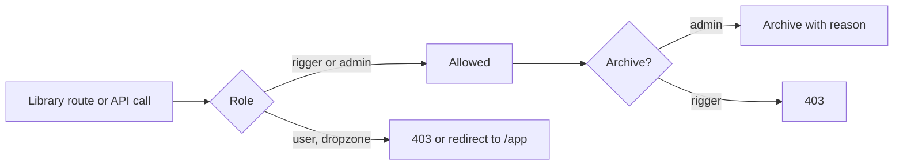

# Feature: Manual library

> Issue: none yet · Branch: `feat/manual-library` · ADR: [0015](../../docs/adr/0015-the-manual-library-is-stored-in-google-drive-behind-a-storage-port.md) · Requested by Eca, 2026-09-20 · Followed by: [packing-sheets.md](./packing-sheets.md)

## Problem Statement

A rigger has to follow the manufacturer's manual for every container, reserve and AAD they pack, and the manuals live
on manufacturers' websites. Manufacturers change the file, move it, or go out of business, and the version a rigger
followed is then gone. Bendike should keep its own copy of each manual, findable by manufacturer and model, so that a
rigger always has the document to hand and the copy outlives the manufacturer's site. Riggers and admins use it;
nobody else sees it.

## Personas

| Persona  | Impact   | Notes                                                                                         |
| -------- | -------- | --------------------------------------------------------------------------------------------- |
| Visitor  | Neutral  | Nothing visible                                                                               |
| User     | Neutral  | Cannot see the Library; the manuals are the manufacturers' copyright, kept for riggers        |
| Rigger   | Positive | Finds, downloads and adds manuals by manufacturer and model, and sees the source and revision |
| Dropzone | Neutral  | Cannot see the Library                                                                        |
| Admin    | Positive | Everything a rigger can do, and can archive a document that is wrong or superseded            |

## Value Assessment

- **Primary value**: Customer, safety: the manual a rigger follows is always available, in the revision Bendike
  holds, even when the manufacturer's site is gone.
- **Secondary value**: Efficiency: one upload, then every rigger finds it by model without searching the web.
- **Tertiary value**: Future: the packing sheet ([packing-sheets.md](./packing-sheets.md)) records which stored
  revision was followed.

## User Stories

### Story 1: Add a manual to the Library

As a **Rigger**,
I want **to upload a manual I downloaded and say which model and revision it is**,
so that I can **keep a copy that survives the manufacturer's website**.

#### Acceptance Criteria

- When a rigger or admin uploads a PDF with a title and a kind, the API shall store the file in the configured document
  storage and create a Library document holding its title, kind, manufacturer, optional catalogue model, revision,
  language, source link, file name, size and SHA-256 checksum, and who added it.
- The API shall accept only PDF files, up to 25 MB, judged by the file's first bytes and not by its name.
- If the file is not a PDF, then the API shall respond 400, and if it is over the limit, then the API shall respond 413,
  and in both cases store nothing.
- If a document with the same checksum is already in the Library, then the API shall respond 409 naming the existing
  document.
- If the storage cannot be reached, then the API shall respond 502 and create no Library document, so a row never
  points at a file that is not there.
- Where a source link is given, the API shall accept only an `https` link, and shall keep it as a reference without
  fetching it.
- The API shall accept the kinds `manual`, `service_bulletin` and `other`.

### Story 2: Find and download a manual

As a **Rigger**,
I want **to search the Library by manufacturer, model and text and download a document**,
so that I can **open the right manual at the loft or on a phone at the dropzone**.

#### Acceptance Criteria

- The web app shall serve `/app/library` to riggers and admins, listing documents with title, kind, manufacturer,
  model, revision, language, size, date added and who added it, paginated 25 a page.
- The web app shall let the visitor filter by kind and search by title, manufacturer or model.
- When a rigger or admin asks to download a document, the API shall stream the stored file through an authenticated
  endpoint with the original file name; the API shall not expose a public or shareable storage link.
- While signed in as a user or a dropzone, when the visitor opens `/app/library` or calls the Library API, the web
  app shall redirect to `/app` and the API shall respond 403.
- The web app shall show a "Library" link in the navigation to riggers and admins only.
- Where a document is linked to a catalogue model, the API shall return the documents for a model when asked with
  that model's id, newest revision first.

### Story 3: Archive a document

As an **Admin**,
I want **to archive a wrong or superseded document with a reason**,
so that I can **stop it being offered without losing the stored file**.

#### Acceptance Criteria

- When an admin archives a document with a reason, the API shall mark it archived with who, when and why, and shall
  keep the stored file.
- While a document is archived, the API shall leave it out of listings unless an admin asks for archived documents.
- If a rigger who is not an admin tries to archive a document, then the API shall respond 403.
- The API shall never delete a stored file.

---

## Design

> Refer to `.github/copilot-instructions.md` for technical standards.

### Role Access

| Role     | Access                                                               |
| -------- | -------------------------------------------------------------------- |
| Visitor  | None                                                                 |
| User     | None (403, and the route redirects)                                  |
| Rigger   | List, download and upload                                            |
| Dropzone | None (403, and the route redirects)                                  |
| Admin    | Everything a rigger can do, and archive, and list archived documents |

### Components Affected

- `packages/shared/src/library.ts` — document kinds, view and request types, size limit, https-link rule
- `apps/api/src/library/` — entity, service, controller, module, PDF check
- `apps/api/src/storage/` — `DocumentStorage` port, Google Drive adapter, local-disk adapter, module and factory
- `apps/api/src/database/migrations/` — `library_documents`
- `apps/api/src/config/` — Drive settings
- `apps/api/scripts/authorize-drive.ts` — one-time script that authorises the app and creates the folder
- `apps/web/src/pages/library/` — page, upload dialog, api client
- `apps/web/src/App.tsx`, `apps/web/src/components/AppShell.tsx` — route and navigation link

### Dependencies

- `google-auth-library`, already installed for Google sign-in, for the OAuth refresh-token client
- The Google Drive REST API v3, called with `fetch`; no new package
- multer, already a transitive dependency of `@nestjs/platform-express`

### Data Model Changes

`library_documents`: `id`, `title`, `kind` (`manual | service_bulletin | other`), `manufacturer`, `model_id`
(nullable, references `gear_models`), `revision` (nullable), `language` (nullable), `source_url` (nullable),
`file_name`, `mime_type`, `size_bytes`, `sha256` (unique), `storage_key`, `added_by`, `added_by_name` (a snapshot),
`created_at`, `archived_at`,
`archived_by`, `archive_reason`.

### Diagrams

### Open Questions

- [ ] Eca must create a Google Cloud OAuth client (type Desktop app) and run `npm run drive:authorize -w @bendike/api`
      once; that prints the refresh token and the folder id to put in the environment. Until then the API stores
      files on local disk under `LIBRARY_LOCAL_DIR` (`./library-files`), which is fine for development only.
- [ ] Fetching a manual straight from its link is left out: a server that fetches user-supplied links needs
      protection against reaching internal addresses, and uploading a downloaded file is one extra click.

---

## Tasks

> Each task is one coding session. Tick the boxes in the same commit that delivers the work.

### Task 1: Shared contracts

**Objective**: Types, kinds, limits and the https-link rule the API and web app share.

**Affected files**:

- `packages/shared/src/library.ts`, `library.spec.ts`, `packages/shared/src/index.ts`

**Requirements**: Story 1 (kinds, size, https link)

**Verification**:

- [x] `npm run test:unit -w @bendike/shared` passes; only `https` links are valid; the limit is 25 MB

**Done when**:

- [x] All verification steps pass

---

### Task 2: Storage port and adapters

**Depends on**: Task 1

**Objective**: A `DocumentStorage` port with a local-disk adapter, a Google Drive adapter and a factory that picks
Drive when it is configured.

**Affected files**:

- `apps/api/src/storage/*`, `apps/api/src/config/app.config.service.ts` (+ spec), `apps/api/.env.example`

**Requirements**: Story 1 (storage, 502 on failure)

**Verification**:

- [x] The local adapter stores and returns bytes under a generated key and never trusts a caller's file name as a path
- [x] The Drive adapter, tested with a fake `fetch`, refreshes its token, uploads into the configured folder,
      downloads by id, and turns any failure into a storage error
- [x] Without Drive settings the factory returns the local adapter

**Done when**:

- [x] All verification steps pass

---

### Task 3: Library API

**Depends on**: Task 2

**Objective**: Migration, entity, service and controller for upload, list, download and archive.

**Affected files**:

- `apps/api/src/library/*`, `apps/api/src/database/migrations/*CreateLibrary.ts`, `apps/api/src/app.module.ts`

**Requirements**: Stories 1, 2, 3

**Verification**:

- [x] Only riggers and admins reach any Library route; users and dropzones get 403
- [x] A non-PDF, an oversized file, a duplicate checksum and an http source link are refused; a failed storage write
      leaves no row
- [x] Listing filters by kind, text and model, hides archived documents from riggers, and pages
- [x] Only an admin can archive; the file is kept

**Done when**:

- [x] All verification steps pass

---

### Task 4: One-time Drive authorisation script

**Depends on**: Task 2

**Objective**: A script that walks Eca through Google's consent once, creates the "Bendike Library" folder and
prints the three environment values.

**Affected files**:

- `apps/api/scripts/authorize-drive.ts`, `apps/api/package.json`, README section

**Verification**:

- [ ] The script's pure parts (consent URL, token exchange request, folder request) are unit tested with a fake
      `fetch`; the live run is done by Eca and reported in the spec's Open Questions

**Done when**:

- [ ] All verification steps pass

---

### Task 5: Web Library page

**Depends on**: Task 3

**Objective**: `/app/library` with list, filters, pagination, upload dialog, download, admin archive, the
navigation link and the role guard.

**Affected files**:

- `apps/web/src/pages/library/*`, `apps/web/src/App.tsx`, `apps/web/src/components/AppShell.tsx`

**Requirements**: Stories 2, 3

**Verification**:

- [ ] Riggers see the link and the page; users and dropzones neither
- [ ] Upload with a chosen model shows the document in the list; download opens the file; an error message shows
      when the API refuses
- [ ] Verified in a browser at desktop and phone width

**Done when**:

- [ ] All verification steps pass, README and this spec updated

---

## Out of Scope

- Fetching a manual from a link on the server
- Reading or searching inside the PDFs
- Sharing a document outside Bendike, or a public link
- Deleting stored files

## Future Considerations

- Suggest a stored manual on the packing sheet ([packing-sheets.md](./packing-sheets.md))
- Watching a manufacturer's bulletin page for changes
