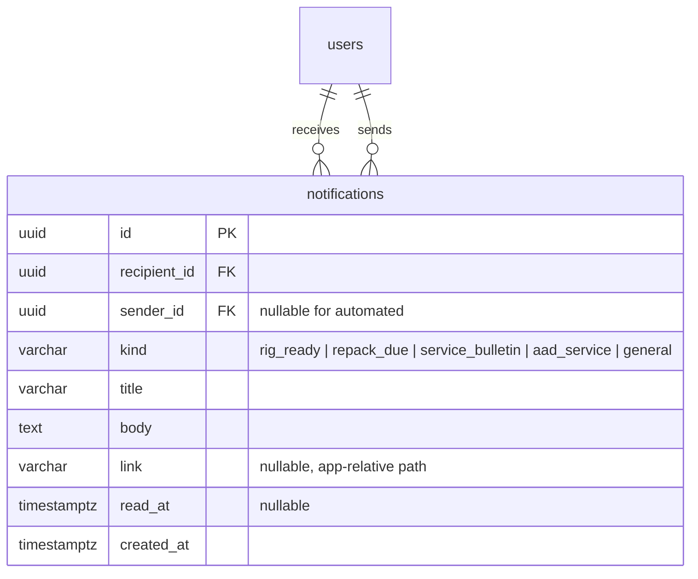
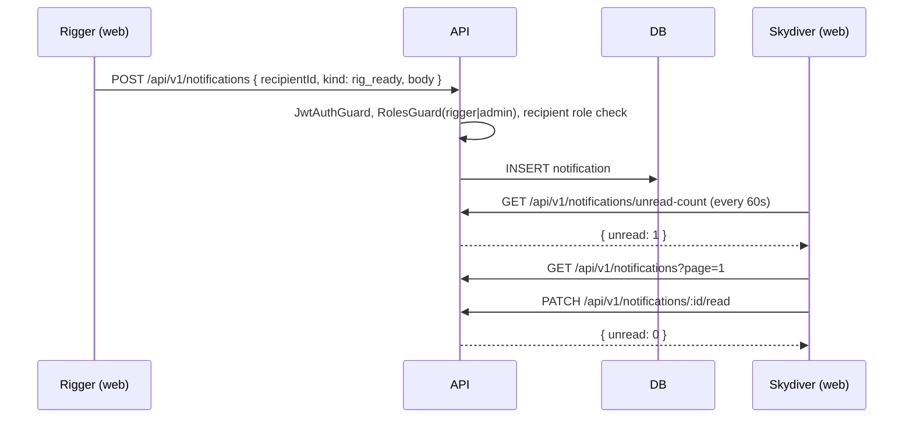

# Feature: Notifications inbox

> Issue: none yet · Branch: `feat/notifications-inbox` (to be created) · Requested by Eca, 2026-09-11

## Problem Statement

Once a skydiver signs in, Bendike has nothing to tell them. The whole point of the software is to keep gear
current, and that means messages: "your rig is ready for pickup", "you are due a repack", "a service bulletin
affects your gear", "send your AAD in for a battery change". Those messages need a home in the app (an inbox), a
way to notice them (a bell with an unread badge), and a way for Eca or a rigger to send them today, before the
automated reminders exist.

## Personas

| Persona  | Impact   | Notes                                                                         |
| -------- | -------- | ----------------------------------------------------------------------------- |
| Visitor  | Neutral  | No inbox until signed in                                                      |
| User     | Positive | Sees what is due or ready in one place; never misses a bulletin               |
| Rigger   | Positive | Sends pickup and due notices to customers instead of chasing them on WhatsApp |
| Dropzone | Positive | Receives notices addressed to the dropzone account; sending is a later phase  |
| Admin    | Positive | Sends notices to anyone; sees delivery                                        |

## Value Assessment

- **Primary value**: Customer — the inbox is the safety loop closing: the right person told at the right time.
- **Secondary value**: Efficiency — riggers stop chasing customers one by one.

## User Stories

### Story 1: Notice and read

As a **User**,
I want **a bell in the app bar that shows how many unread messages I have, and an inbox that lists them**,
so that I can **see what needs my attention the moment I sign in**.

#### Acceptance Criteria

- While signed in, the app shell shall show a bell icon with a badge equal to the number of unread notifications,
  and no badge when there are none.
- When the signed-in account opens `/app/inbox`, the web app shall list their notifications newest first, unread
  ones visually distinct, in pages of 20.
- When the account opens a notification, the web app shall mark it read and the badge shall decrease.
- The inbox shall offer "Mark all as read".
- Each notification shall show a kind, a title, a body, when it was sent and, if present, a link into the app.
- The API shall only ever return an account's own notifications; a request for another account's shall respond 403
  or 404, never the data.

### Story 2: Send a notice

As a **Rigger** or **Admin**,
I want **to send a notification of a given kind to a specific account**,
so that I can **tell a customer their rig is ready or their repack is due**.

#### Acceptance Criteria

- The API shall let an admin send a notification to any account and let a rigger send one to any account with the
  user role.
- If a user or a dropzone tries to send, then the API shall respond 403.
- The notification kinds shall be exactly: `rig_ready`, `repack_due`, `service_bulletin`, `aad_service`,
  `general`; each with a default title the sender can override.
- When a notification is created, the API shall record who sent it and when.
- The web app shall give admins and riggers a "Send notice" form on the account list (admins) or on a simple
  recipient search (riggers).

### Story 3: Automated reminders (phase 2, separate spec)

As a **User**,
I want **Bendike to warn me on its own when my repack or AAD service is due or a bulletin matches my gear**,
so that I can **never be surprised at the dropzone**.

#### Notes

Requires a gear model (rigs, reserves, AADs with dates, bulletins by make and model). This spec only guarantees
that automated senders can create the same notification kinds through the same service. See the future
`gear-tracking.md`.

---

## Design

> Refer to `.github/copilot-instructions.md` for technical standards.

### Role Access

| Role     | Access                                            |
| -------- | ------------------------------------------------- |
| Visitor  | None                                              |
| User     | Read own inbox, mark read                         |
| Rigger   | Read own inbox; send to accounts with role `user` |
| Dropzone | Read own inbox                                    |
| Admin    | Read own inbox; send to any account               |

### Components Affected

- `packages/shared/src/notifications.ts` — `NotificationKind`, `NotificationSummary`, `SendNotificationRequest`, `UnreadCount`
- `apps/api/src/notifications/` — `Notification` entity, service, controller, DTOs, `NotificationSender` (the
  only writer, used later by automated jobs)
- `apps/api/src/database/migrations/1757800000000-CreateNotifications.ts`
- `apps/web/src/notifications/` — `use-unread-count.ts`, `notifications-api.ts`
- `apps/web/src/components/AppShell.tsx` — bell with badge
- `apps/web/src/pages/inbox/InboxPage.tsx`, `pages/admin/SendNoticeDialog.tsx`

### Dependencies

- `user-accounts-and-roles.md` (accounts, roles, guards)
- Polling every 60 seconds for the unread count is enough for phase 1; no websockets.

### Data Model Changes

Index on `(recipient_id, read_at, created_at desc)` for the badge and the inbox.

### Diagrams

### Open Questions

- [ ] Should notifications also go out by email or WhatsApp? Phase 1 is in-app only.
- [ ] Retention: keep forever, or archive read notices after a year?
- [ ] Can a rigger send to any user, or only to users linked to them as customers? Phase 1: any user; tighten
      when a rigger–customer relation exists.

---

## Tasks

### Task 1: Shared notification contracts

**Objective**: Define kinds, summary shape and send request once.

**Affected files**:

- `packages/shared/src/notifications.ts`, `notifications.spec.ts`, `index.ts`

**Verification**:

- [ ] Kinds tuple has exactly the five kinds; default titles exist for each

**Done when**:

- [ ] All verification steps pass

---

### Task 2: Entity, migration and sender service

**Depends on**: Task 1

**Objective**: Persist notifications and expose a single `NotificationSender.send()` used by controllers and later jobs.

**Affected files**:

- `apps/api/src/notifications/notification.entity.ts`, `notification-sender.ts`, specs
- `apps/api/src/database/migrations/1757800000000-CreateNotifications.ts`

**Verification**:

- [ ] Sender records sender id, kind, default title when none given

**Done when**:

- [ ] All verification steps pass

---

### Task 3: Read endpoints

**Depends on**: Task 2

**Objective**: List own notifications paginated, unread count, mark one read, mark all read.

**Affected files**:

- `apps/api/src/notifications/notifications.controller.ts`, `notifications.service.ts`, specs

**Requirements**: Story 1

**Verification**:

- [ ] Another account's notification id returns 404; mark-all only touches the caller's rows

**Done when**:

- [ ] All verification steps pass

---

### Task 4: Send endpoint with role rules

**Depends on**: Task 2

**Objective**: `POST /notifications` for admins (any recipient) and riggers (user recipients only).

**Affected files**:

- `apps/api/src/notifications/notifications.controller.ts`, `dto/send-notification.dto.ts`, specs

**Requirements**: Story 2

**Verification**:

- [ ] Admin to dropzone allowed; rigger to dropzone 403; user 403; unknown recipient 404

**Done when**:

- [ ] All verification steps pass

---

### Task 5: Bell, badge and inbox page

**Depends on**: Task 3

**Objective**: Poll the unread count, show the bell badge in `AppShell`, build `/app/inbox` with paging and mark-read.

**Affected files**:

- `apps/web/src/notifications/*`, `components/AppShell.tsx`, `pages/inbox/InboxPage.tsx`, `App.tsx`, specs

**Requirements**: Story 1

**Verification**:

- [ ] Badge hidden at zero; opening a notification decrements the badge without a reload

**Done when**:

- [ ] All verification steps pass

---

### Task 6: Send notice form

**Depends on**: Tasks 4, 5

**Objective**: Let admins send from the account list and riggers from a recipient search.

**Affected files**:

- `apps/web/src/pages/admin/SendNoticeDialog.tsx`, `pages/AdminUsersPage.tsx`, `pages/RiggerSendPage.tsx`, specs

**Requirements**: Story 2

**Verification**:

- [ ] Kind picker prefills the title; user and dropzone never see the form

**Done when**:

- [ ] All verification steps pass

---

## Out of Scope

- Automated reminders from gear data (future `gear-tracking.md`)
- Email, SMS or WhatsApp delivery
- Real-time push (websockets)

## Future Considerations

- Gear tracking spec: rigs, reserves, AADs, service bulletins by make and model, and the rules that emit
  `repack_due`, `aad_service` and `service_bulletin` automatically
- Preferences: which kinds a user wants, and where
