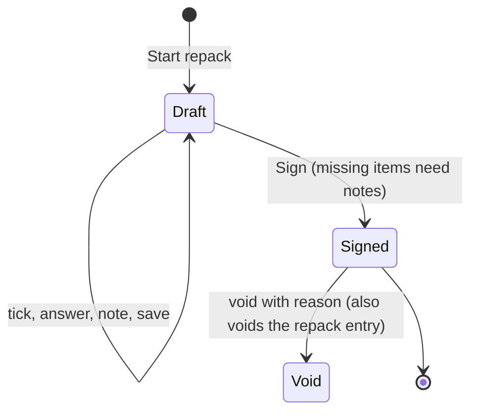
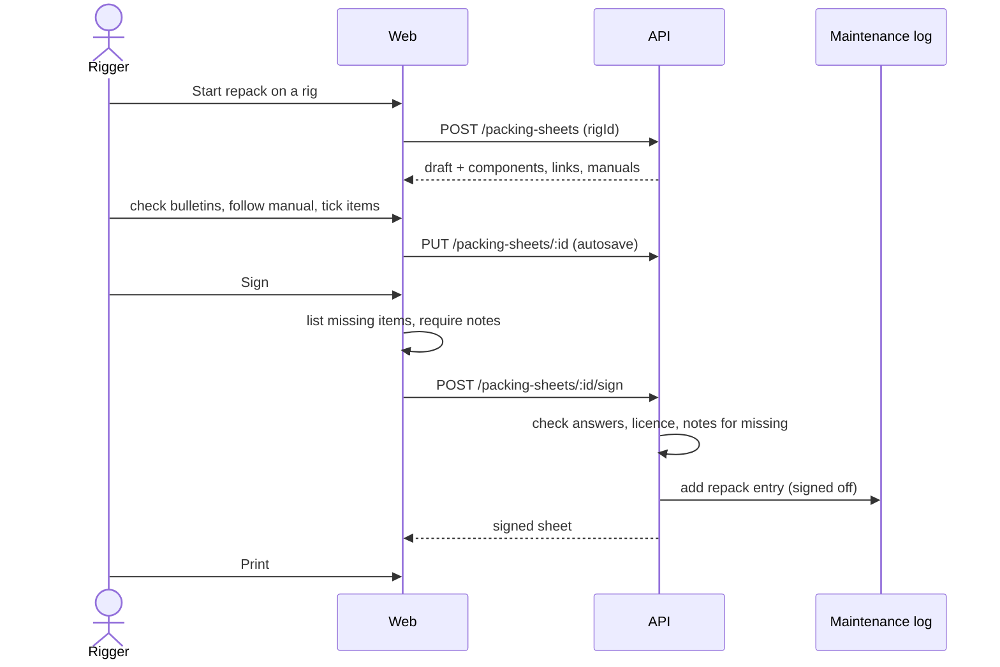

# Feature: Reserve packing sheets and digital logbook

> Issue: none yet · Branch: `feat/packing-sheets` · ADR: [0016](../../docs/adr/0016-a-packing-sheet-is-a-signed-snapshot-that-writes-the-repack-entry.md) · Depends on: [manual-library.md](./manual-library.md) Tasks 1 to 3, [gear-tracking.md](./gear-tracking.md), [service-bulletins-and-grounding.md](./service-bulletins-and-grounding.md) · Requested by Eca, 2026-09-20

## Problem Statement

In Argentina a reserve repack has to follow the manufacturer's manual and be recorded on the CIAC/ANAC "Planilla
plegados" checklist, signed by the rigger. Today Eca repeats the same preparation for every pack job: find the
bulletins page for each component, find the manual, write the component details again, then fill in and sign a
paper form. Bendike should walk the rigger through that process, remember what it already knows about the rig, make
sure nothing is skipped without a written reason, produce the signed form to print, and keep every sheet as a
digital reserve packing logbook.

## Personas

| Persona  | Impact   | Notes                                                                                 |
| -------- | -------- | ------------------------------------------------------------------------------------- |
| Visitor  | Neutral  | Nothing visible                                                                       |
| User     | Positive | Can open and print the signed sheets of their own rigs: their reserve packing logbook |
| Rigger   | Positive | Runs the pack job in one place, with links, manual and checklist, signs it, prints it |
| Dropzone | Positive | Can open and print the sheets of its fleet's rigs                                     |
| Admin    | Positive | Everything a rigger can do; can void a sheet                                          |

## Value Assessment

- **Primary value**: Customer, safety: no checklist item and no bulletin check is skipped without a written reason.
- **Secondary value**: Efficiency: component details, links and manual are prepared once and reused at every repack.
- **Tertiary value**: Future: a signed, immutable sheet per repack is the record an authority or a buyer can ask for.

## User Stories

### Story 1: Start a pack job on a rig

As a **Rigger**,
I want **to start a packing sheet for a rig from its page**,
so that I can **work through the repack in one place and leave and come back without losing my ticks**.

#### Acceptance Criteria

- The web app shall show a "Start repack" button on the rig page to a rigger or admin who may sign off the rig.
- When a rigger starts a pack job, the API shall create a draft sheet for the rig's reserve, prefilled with the
  owner's name, phone and email, and the date of today, and shall return it.
- If the rig has no reserve, then the API shall respond 400 saying so.
- If the same rigger already has a draft for that rig, then the API shall return that draft instead of creating a
  second one.
- While a sheet is a draft, the API shall let its author, or an admin, save it repeatedly, and shall let nobody else
  see it.
- If the actor cannot sign off the rig's owner's gear, then the API shall respond 404.

### Story 2: Bulletins and manuals at hand

As a **Rigger**,
I want **each component's bulletins page and manual offered to me**,
so that I can **check the bulletins and follow the right manual without searching the web**.

#### Acceptance Criteria

- The web app shall list the reserve, the container and the AAD of the rig, each with manufacturer, model, serial and
  date of manufacture, taken from the gear records.
- When a component's catalogue model has a bulletins link, the API shall offer it, and where the model has none but
  another model of the same manufacturer does, the API shall offer that link marked as the manufacturer's.
- Where a component has open service bulletins matched by Bendike, the web app shall list them beside its link.
- The API shall list the Library documents stored for each component's model, newest revision first, and the rigger
  can choose the one followed; the sheet then records its title and revision.
- Where a component has no bulletins link, the web app shall let a rigger or admin paste an `https` link, and the API
  shall save it on the model so the next pack job offers it.
- If a component is not linked to a catalogue model, then the web app shall say so and shall not offer to save a link.

### Story 3: The checklist

As a **Rigger**,
I want **the CIAC/ANAC checklist as ticks, with the same answers as the paper form**,
so that I can **fill in digitally exactly what I would write by hand**.

#### Acceptance Criteria

- The web app shall show the 36 checklist items of the CIAC/ANAC "Planilla plegados", each in English and Spanish, in
  the paper form's two columns, and the two yes/no answers "bulletins checked" and "MARD connected".
- The sheet shall record the checklist version it was filled in with, so a later change to the template never
  rewrites an old sheet.
- When the rigger ticks an item or answers a question, the web app shall save the draft.

### Story 4: Missing boxes, notes and signing

As a **Rigger**,
I want **to be told about anything I left unticked and to write why in the Notes**,
so that I can **sign a rig that has no MARD or no RSL, or one where I changed the AAD, and have that written on the sheet**.

#### Acceptance Criteria

- When the rigger presses Sign, the web app shall list every item that is not ticked, every yes/no answer that is
  "no", and any of the reserve, container or AAD that the rig lacks, before anything is signed.
- If any of those exist and the Notes are empty, then the API shall respond 400 saying the notes must explain them,
  and shall not sign.
- If the bulletins-checked or MARD-connected question is unanswered, then the API shall respond 400 naming it.
- If the rigger's licence number is empty, then the API shall respond 400.
- When a rigger signs, the API shall, in one transaction, set the sheet number to the rigger's next number, snapshot
  the reserve, container and AAD details, the list of what was missing, the rigger's name and licence and the time,
  lock the sheet, and add a `repack` maintenance entry on the reserve for the sheet's date, signed off by the rigger.
- While a sheet is signed, the API shall reject any change to it.
- If the sheet's date is in the future, then the API shall respond 400.

### Story 5: Print the signed form

As a **Rigger**,
I want **a printable page laid out like the paper form**,
so that I can **print it, sign it by hand and hand it to the owner**.

#### Acceptance Criteria

- The web app shall serve a print-ready page for a signed sheet with the sheet number, owner details, the element
  table, the two yes/no answers, the checklist with its ticks, the notes, the manual followed, and the rigger's name,
  licence and signature line.
- When the visitor prints the page, the web app shall hide the navigation and every button.
- While a sheet is void, the web app shall mark the page VOID with the reason.

### Story 6: The digital logbook

As a **User**, **Dropzone** or **Rigger**,
I want **to see every signed sheet for a rig or a reserve**,
so that I can **look up who packed it, when, and what was noted**.

#### Acceptance Criteria

- The web app shall show, on the rig page and on the reserve's page, the signed sheets newest first with number,
  date, rigger, the count of missing items and a link to the sheet.
- The API shall let anyone who can read the rig's gear read its signed sheets, and shall respond 404 to anyone else.
- When the author or an admin voids a signed sheet with a reason, the API shall also void its repack entry in the
  same transaction and keep the sheet.
- The API shall never delete or edit a signed sheet.

---

## Design

> Refer to `.github/copilot-instructions.md` for technical standards.

### Role Access

| Role     | Access                                                                                                         |
| -------- | -------------------------------------------------------------------------------------------------------------- |
| Visitor  | None                                                                                                           |
| User     | Read and print signed sheets of their own rigs; cannot start or sign                                           |
| Rigger   | Start, save, sign and void their own sheets on linked owners' rigs; see Library manuals; save a bulletins link |
| Dropzone | Read and print signed sheets of its own fleet; cannot start or sign                                            |
| Admin    | Everything a rigger can do on any rig, and void any sheet                                                      |

### Components Affected

- `packages/shared/src/packing-sheets.ts` — checklist template, sheet contracts, missing and problem rules
- `packages/shared/src/gear.ts` — `bulletinsUrl` on model views
- `apps/api/src/gear/` — `bulletinsUrl` on `GearModel`, model views, a link-setting endpoint
- `apps/api/src/packing-sheets/` — entity, service, controller, module
- `apps/api/src/database/migrations/` — `packing_sheets`, `gear_models.bulletins_url`
- `apps/web/src/pages/gear/RigPage.tsx`, `ItemPage.tsx` — Start repack button and the logbook
- `apps/web/src/pages/packing/` — job page, checklist, missing-items dialog, printable sheet, api client
- `apps/web/src/App.tsx` — routes `/app/gear/:rigId/packing/:sheetId` and `/app/gear/:rigId/packing/:sheetId/print`

### Dependencies

- The Library ([manual-library.md](./manual-library.md)) for the documents offered as the manual
- `GearAccessService` for read and sign-off rights, `MaintenanceService` rules for the repack entry
- The browser's print function; no PDF library

### Data Model Changes

`gear_models.bulletins_url` (nullable text).

`packing_sheets`: `id`, `rig_id`, `reserve_item_id`, `owner_id`, `rigger_id`, `status` (`draft | signed`),
`sheet_no` (null until signed; unique per rigger), `performed_on`, `checklist_version`, `checked_ids` (text array),
`bulletins_checked` and `mard_connected` (nullable boolean), `owner_name`, `owner_address`, `owner_phone`,
`owner_email`, `manual_document_id` (nullable), `manual_label` (nullable), `notes`, `elements` (JSON, set at signing),
`missing` (JSON, set at signing), `rigger_name`, `rigger_licence`, `signed_at`, `entry_id` (nullable), `created_at`,
`updated_at`. A sheet is void when its entry is void.

### Diagrams

### Open Questions

- [ ] Whether ANAC accepts the digital sheet alone or wants the wet-signed paper kept: the sheet supports both, and a
      scan of the signed paper is left for a later step.
- [ ] The checklist wording is copied from the form Eca supplied on 2026-09-20 as version `ciac-anac-1`; a change
      from CIAC or a manual adds a new version and leaves old sheets as they were.
- [ ] Where the paper form gives a line in one language only, the other language on screen is Claude's translation;
      Eca to review the wording.
- [ ] Rigger licence number lives on the signature for now; the rigger-profile spec will store it on the account.

---

## Tasks

> Each task is one coding session. Tick the boxes in the same commit that delivers the work.

### Task 1: Shared checklist and rules

**Objective**: The checklist template, the contracts, and the pure rules for what is missing and what blocks signing.

**Affected files**:

- `packages/shared/src/packing-sheets.ts`, `packing-sheets.spec.ts`, `packages/shared/src/index.ts`

**Requirements**: Stories 3, 4

**Verification**:

- [x] The template has 36 items with unique ids, Spanish and English labels, in two columns
- [x] `missingItems`, `sheetProblems` and `signingBlockers` cover unticked items, "no" answers, unanswered questions, a
      rig without container or AAD, empty notes and empty licence

**Done when**:

- [x] All verification steps pass

---

### Task 2: Bulletins link on models

**Depends on**: Task 1

**Objective**: A link per model, resolved with the manufacturer fallback, and an endpoint riggers and admins use to save it.

**Affected files**:

- `apps/api/src/gear/*` (entity, views, dto, service, controller), migration, `packages/shared/src/gear.ts`,
  `apps/web/src/pages/gear/GearModelsPage.tsx` (field)

**Requirements**: Story 2 (link, fallback, saving)

**Verification**:

- [x] A model's own link wins; a same-manufacturer link is marked as the manufacturer's; nothing otherwise
- [x] Only `https` links are saved; users and dropzones get 403

**Done when**:

- [x] All verification steps pass

---

### Task 3: Packing sheets API, draft

**Depends on**: Tasks 1, 2 and [manual-library.md](./manual-library.md) Task 3

**Objective**: Migration, entity, and the service to start, resume, read and save a draft with its components, links and manuals.

**Affected files**:

- `apps/api/src/packing-sheets/*`, migration, `apps/api/src/app.module.ts`

**Requirements**: Stories 1, 2

**Verification**:

- [x] A rigger starts and resumes a draft; a rig without a reserve is refused; another rigger or a user gets 404
- [x] The job view carries each component's details, resolved link, open bulletins and Library manuals
- [x] Saving a draft ignores fields it may not change and never touches a signed sheet

**Done when**:

- [x] All verification steps pass

---

### Task 4: Sign, list, read and void

**Depends on**: Task 3

**Objective**: Signing with the missing-items rule, the repack entry, per-rigger numbers, listings, read access and voiding.

**Affected files**:

- `apps/api/src/packing-sheets/*`

**Requirements**: Stories 4, 6

**Verification**:

- [x] Signing with missing items and empty notes is refused; with notes it succeeds and stores what was missing
- [x] Signing writes one repack entry on the reserve and numbers sheets 1, 2, 3 per rigger without gaps
- [x] A signed sheet cannot change; voiding voids the entry and keeps the sheet
- [x] Owners and dropzones can read signed sheets, not drafts; strangers get 404

**Done when**:

- [x] All verification steps pass

---

### Task 5: Web pack job

**Depends on**: Task 4

**Objective**: The job page: components with links and manuals, header answers, checklist, notes, the missing-items
dialog and signing; and the Start repack button.

**Affected files**:

- `apps/web/src/pages/packing/*`, `apps/web/src/pages/gear/RigPage.tsx`, `apps/web/src/App.tsx`

**Requirements**: Stories 1, 2, 3, 4

**Verification**:

- [x] Ticks and answers autosave; leaving and returning restores them
- [x] Sign lists everything missing and needs notes; a rig with no MARD can be signed with "No MARD on this unit"
- [x] Verified in a browser at desktop and phone width

**Done when**:

- [x] All verification steps pass

---

### Task 6: Printable sheet and logbook

**Depends on**: Task 5

**Objective**: The print page laid out like the paper form, VOID marking, and the signed-sheet lists on the rig and reserve pages.

**Affected files**:

- `apps/web/src/pages/packing/PackingSheetPrintPage.tsx`, `apps/web/src/pages/gear/RigPage.tsx`, `ItemPage.tsx`

**Requirements**: Stories 5, 6

**Verification**:

- [x] The print view shows every field of the paper form and hides navigation and buttons in `@media print`
- [x] The rig and reserve pages list signed sheets newest first; a void sheet says so
- [x] README and this spec updated

**Done when**:

- [x] All verification steps pass

---

## Out of Scope

- Kill-line, reline and main canopy inspection sheets; this is the reserve pack form
- A PDF generated on the server
- Attaching a scan of the signed paper
- Changing the form per manufacturer (later versions of the template)
- Reminders that a sheet is unsigned

## Future Considerations

- The work queue's quick "Log repack" opens a packing sheet instead
- A model-specific step list taken from a manual
- Storing the rigger's licence on their profile
