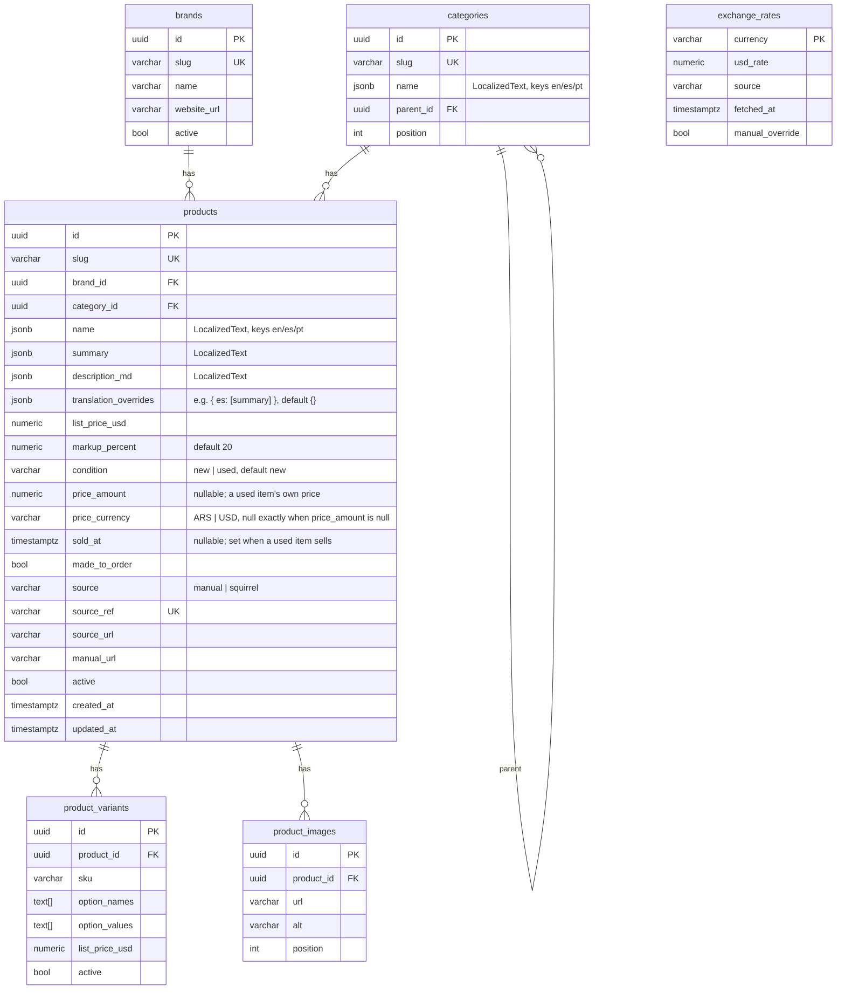
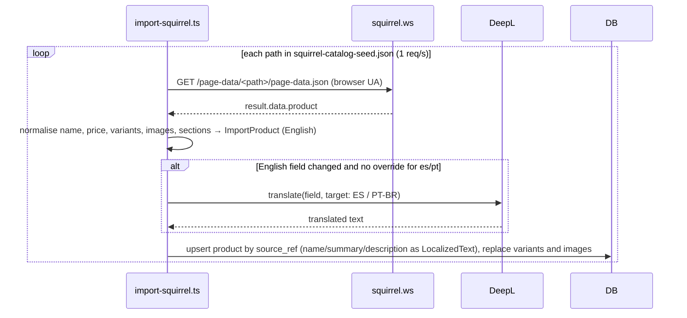
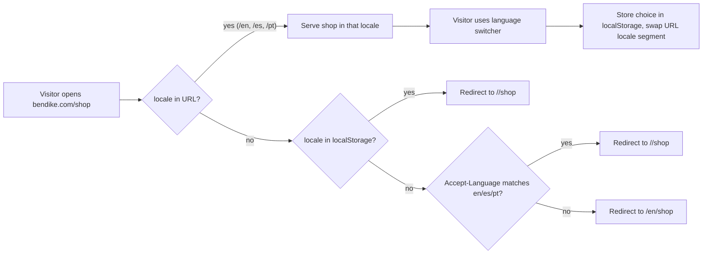

# Feature: Product catalog

> Issue: none yet · Branch: `feat/product-catalog` (stacked on `feat/landing-page-copy`) · ADR:
> [0003](../../docs/adr/0003-usd-pricing-derived-currencies-whatsapp-checkout.md),
> [0007](../../docs/adr/0007-trilingual-catalog-locale-routing-and-machine-translation.md) · Briefing: Eca,
> 2026-09-11, extended 2026-09-17 (trilingual copy, product list)

## Problem Statement

Bendike is an official retailer for Squirrel (wingsuits, tracking suits, BASE and skydiving canopies, containers,
pilot chutes, stash bags, sliders, travel bags, a book and assorted accessories), Vigil (the Cuatro AAD) and
FlySight (FlySight 2). Today none of that is visible on bendike: there is no product database, no shop and no way
for a skydiver to see what Eca sells or what it costs in dollars, pesos or reais. Squirrel alone has 53 products
(checked in at `apps/api/scripts/squirrel-catalog-seed.json`) with large size matrices, so the catalog must be
imported, not typed. Eca's customers read English, Spanish and Portuguese, so every product's name, summary and
description need all three, not just the English Squirrel publishes.

## Personas

| Persona  | Impact   | Notes                                                                  |
| -------- | -------- | ---------------------------------------------------------------------- |
| Visitor  | Positive | Browses the shop without an account, sees prices in USD, ARS and BRL   |
| User     | Positive | Same as visitor; later specs tie purchases to the account              |
| Rigger   | Positive | Sees the gear Eca stocks, can point customers to it                    |
| Dropzone | Positive | Same as rigger                                                         |
| Admin    | Positive | Manages products, prices and exchange rates without a database console |

## Value Assessment

- **Primary value**: Commercial — the shop is how Bendike's retail business becomes visible and generates orders.
- **Secondary value**: Efficiency — importing Squirrel's catalog from their published data replaces hand entry of
  thousands of variants; machine-translating that copy at import time replaces hand-typing it three times.
- **Secondary value**: Market — Spanish and Portuguese copy makes the shop legible to skydivers outside Eca's
  English-speaking customers, without which the ARS/BRL prices already on the page ring hollow.

## User Stories

### Story 1: Browse the catalog

As a **Visitor**,
I want **to browse products by category and brand, search, sort and page through results**,
so that I can **find the gear I am after without scrolling through everything**.

#### Acceptance Criteria

- The web app shall serve the shop at `/:locale/shop`, where `:locale` is `en`, `es` or `pt`, to every visitor,
  signed in or not.
- The shop shall list products in pages of 12 by default and let the visitor change page; the page, filters, search
  and sort shall be reflected in the URL query string so a link reproduces the view.
- The shop shall filter by category (with subcategories), by brand, and by availability (in stock or made to order).
- The shop shall search by product name and summary in the current locale and sort by name, price ascending and
  price descending.
- When no product matches, the shop shall say so and offer to clear the filters.
- The shop shall show a breadcrumb (Shop, category, subcategory) and a category navigation on every catalog page,
  with category and breadcrumb names shown in the current locale.

### Story 1a: Browse in your language

As a **Visitor**,
I want **the shop, cart and product pages available in English, Spanish or Portuguese, with a switcher and a URL
that carries my choice**,
so that I can **read the site in the language I understand and share a link that opens in the same language**.

#### Acceptance Criteria

- The web app shall serve the shop and cart under a locale prefix (`/en/...`, `/es/...`, `/pt/...`) and shall reject
  no other segment there; an unrecognised prefix shall behave as a 404, not fall back silently to English.
- When a visitor opens an unprefixed shop or cart URL, the web app shall redirect once to a locale detected from the
  browser's `Accept-Language` header, defaulting to `en` when no supported language is found.
- The site shall show a language switcher on every shop and cart page that swaps the locale segment of the current
  URL and keeps the visitor on the same page (same category, filters, product or cart contents).
- The web app shall remember the visitor's last chosen locale in `localStorage` and use it the next time they land
  on an unprefixed shop or cart URL, before falling back to `Accept-Language`.
- While a product or category has no translation yet for the current locale, the page shall show the English text
  rather than a blank field.

### Story 2: See a product

As a **Visitor**,
I want **a product page with images, description, variants and the price in USD, ARS and BRL**,
so that I can **decide what to order and in which configuration**.

#### Acceptance Criteria

- The web app shall serve `/:locale/shop/<slug>` for every active product, where `<slug>` is the same for every
  locale.
- The product page shall show the product's name, summary and description in the current locale, falling back to
  English where a translation is missing.
- The product page shall show the Bendike price in USD as the primary figure, computed as the manufacturer's list
  price plus the product's markup percentage (default 20%).
- The product page shall show the ARS and BRL equivalents computed from the stored exchange rates, labelled as
  indicative with the rate source and date.
- If a product has variants, the product page shall let the visitor pick one value per option and shall show the
  variant's own USD list price when it has one.
- While a product is made to order, the product page shall say so and shall not imply stock.
- The product page shall link back to its category and show related products from the same category.

### Story 3: Keep prices honest

As an **Admin**,
I want **exchange rates refreshed daily from a provider and overridable by hand**,
so that I can **show the peso rate I actually sell at**.

#### Acceptance Criteria

- The API shall expose `GET /api/v1/exchange-rates` returning one entry per currency (`ARS`, `BRL`) with the USD
  rate, source and fetch time.
- When an admin calls `POST /api/v1/exchange-rates/refresh`, the API shall fetch the provider rates and update every
  currency that is not manually overridden.
- When an admin calls `PUT /api/v1/exchange-rates/:currency` with a rate, the API shall store it as a manual
  override until the admin clears it.
- If the provider is unreachable, then the API shall keep the last stored rates and report the failure.
- When the API starts and any rate is older than 24 hours or missing, the API shall attempt one refresh.

### Story 4: Manage the catalog

As an **Admin**,
I want **to create, edit, deactivate and re-import products**,
so that I can **keep the shop current as brands change their lines**.

#### Acceptance Criteria

- The API shall expose admin-only endpoints to create and update brands, categories, products, variants and images,
  and to deactivate a product.
- If a user, rigger or dropzone calls an admin catalog endpoint, then the API shall respond 403.
- The import script shall read Squirrel's published page data for every product path listed in
  `apps/api/scripts/squirrel-catalog-seed.json`, normalise it, and upsert products, variants and images keyed by
  their source reference, so running it twice changes nothing.
- The import script shall fetch at most one page per second, identify itself with a browser user agent, and keep
  a local cache of the fetched JSON.
- When a product's English name, summary or description changes on import, the import script shall machine-translate
  the changed field into Spanish and Portuguese (Brazil) and store all three locales, unless that locale and field
  is listed in the product's `translation_overrides`, in which case the stored value is left untouched.
- The seed script shall create the Vigil Cuatro (USD 1,800 list price) and the FlySight 2 (USD 300 list price) as
  active products with the default 20% markup, with English, Spanish and Portuguese copy written from the
  manufacturers' published specifications and a photo linked from the manufacturer's site. A product that already
  exists with a price is left untouched, so re-running the seed never overwrites an admin's edits.
- When an admin edits a product's name, summary or description for one locale through the admin catalog endpoint,
  the API shall record that locale and field in `translation_overrides` so a later import does not overwrite it.

### Story 5: Sell used gear

As an **Admin**,
I want **to list used gear with my own photos, a price in pesos or dollars, and mark it sold**,
so that I can **sell second-hand rigs and canopies next to the new stock, and buyers can filter for them**
(briefing of Eca, 2026-09-19).

#### Acceptance Criteria

- The shop shall filter by condition (new or used), and the filter shall be reflected in the URL query string like
  the others.
- The shop shall not list a sold item unless the visitor turns on "Include sold" (`sold=1` in the URL).
- While an item is used, the shop and the product page shall label it "Used", and while it is sold, label it
  "Sold".
- A used item's price shall be shown in the currency Eca set it in (ARS or USD) as the primary figure, with the
  other two of ARS, USD and BRL beneath as indicative figures from the stored exchange rates, and without the
  markup that applies to new products.
- The product page of a sold item shall stay reachable and shall not offer the WhatsApp contact button.
- The product page of an unsold used item shall offer an "Ask on WhatsApp" button that opens
  `https://wa.me/5493413955408` with a message in the visitor's locale naming the item.
- The web app shall serve `/app/admin/used-gear` to admins, listing every used item (listed, sold or inactive) with
  controls to add one, edit its English, Spanish and Portuguese name, summary and description, change its price and
  currency, category and brand, upload and remove photos, and mark it sold or available again.
- When an admin creates a used item from English copy, the API shall machine-translate the Spanish and Portuguese
  copy and derive a unique slug from the name.
- When an admin uploads photos for a product, the API shall store only JPEG, PNG or WebP files up to 5 MB, judged by
  the file's leading bytes, under a server-generated name, and shall serve them at `/uploads/products/...`.
- If an upload is not an accepted image, then the API shall respond 400, and if it is over 5 MB, then 413, and store
  nothing in either case.
- If a user, rigger or dropzone calls a used-item or upload endpoint, then the API shall respond 403.

---

## Design

> Refer to `.github/copilot-instructions.md` for technical standards.

### Role Access

| Role     | Access                                                                            |
| -------- | --------------------------------------------------------------------------------- |
| Visitor  | `GET /catalog/*`, `GET /exchange-rates`, `/:locale/shop`, `/:locale/shop/:slug`   |
| User     | Same as Visitor                                                                   |
| Rigger   | Same as Visitor                                                                   |
| Dropzone | Same as Visitor                                                                   |
| Admin    | Everything above plus every write endpoint under `/catalog` and `/exchange-rates` |

### Components Affected

- `packages/shared/src/locale.ts` — `LOCALES`, `Locale`, `isLocale`, `LocalizedText<T>` (see ADR 0007)
- `packages/shared/src/catalog.ts` — `Currency`, `Brand`, `Category`, `ProductSummary`, `ProductDetail`,
  `ProductVariant`, `ProductImage`, `ExchangeRates`, `CatalogQuery`, `Page<T>`; `name`, `summary` and
  `description_md` typed as `LocalizedText`
- `packages/shared/src/pricing.ts` — `bendikePriceUsd(listPriceUsd, markupPercent)`, `convert(usd, rate)`,
  `formatMoney(amount, currency)` (en-US, es-AR, pt-BR)
- `apps/api/src/catalog/` — entities (`Brand`, `Category`, `Product`, `ProductVariant`, `ProductImage`), read
  controller, admin controller, services, DTOs, slugs
- `apps/api/src/exchange-rates/` — `ExchangeRate` entity, provider client, service, controller, startup refresh
- `apps/api/src/translation/` — DeepL client, `translateProductCopy`, `AppConfigService` additions for
  `DEEPL_API_KEY` / `DEEPL_API_URL`
- `apps/api/src/database/migrations/1757700000000-CreateCatalog.ts`
- `apps/api/scripts/import-squirrel.ts`, `apps/api/scripts/squirrel-catalog-seed.json`, `apps/api/scripts/seed-catalog.ts`
- `apps/web/src/i18n/` — i18next setup, `en.json` / `es.json` / `pt.json` UI string bundles, `LocaleProvider`,
  `useLocale`
- `apps/web/src/pages/shop/` — `ShopPage` (filters, pagination, breadcrumb, category nav), `ProductPage`,
  `catalog-api.ts`, `useCatalogQuery` (URL query state)
- `apps/web/src/components/site/site-content.ts`, `SiteNav.tsx` — Shop link, category nav, `LocaleSwitcher`
- `apps/web/src/components/Price.tsx` — tri-currency price display
- `apps/web/src/App.tsx` — `/:locale/shop`, `/:locale/shop/:slug` routes and the unprefixed-URL redirect
- `apps/web/public/brand/` — logo files from Eca (pending)

### Dependencies

- Exchange rates: `https://open.er-api.com/v6/latest/USD` (free, no key, daily). Provider URL is configuration
  (`EXCHANGE_RATE_PROVIDER_URL`). `dolarapi.com` is a candidate for Argentine-specific rates later.
- Squirrel data: `page-data.json` behind each product page. squirrel.ws sits behind Cloudflare's bot challenge, so a
  plain HTTP request with a browser user agent returns 403 (verified 2026-09-18); the importer drives headless Chromium
  through Playwright (dev dependency of `@bendike/api`) and captures the `page-data.json` response instead.
- Images are referenced by URL on the manufacturers' CDNs, not copied, until Eca confirms reuse terms.
- Translation: DeepL API (`DEEPL_API_KEY`, `DEEPL_API_URL`), new dependency, see ADR 0007.
- Web i18n: `i18next` and `react-i18next` (new dependency), see ADR 0007.

### Data Model Changes



`list_price_usd` on a product is nullable so seeded products can exist before Eca sets a price; a product cannot be
activated while it is null. Money is `numeric(12,2)`; rates are `numeric(14,6)`. `name`, `summary` and
`description_md` are `jsonb` shaped `{ "en": "...", "es": "...", "pt": "..." }` (`LocalizedText`, ADR 0007); a
missing key falls back to `en` at read time, never at write time.

### Diagrams

```mermaid
sequenceDiagram
  participant Web
  participant API
  participant DB
  Web->>API: GET /api/v1/catalog/products?category=wingsuits&brand=squirrel&page=2&pageSize=12&sort=price-asc
  API->>DB: SELECT active products JOIN brand, category, first image ... LIMIT 12 OFFSET 12
  API-->>Web: { items, page, pageSize, total }
  Web->>API: GET /api/v1/exchange-rates
  API-->>Web: { base: "USD", rates: { ARS: {...}, BRL: {...} } }
  Web->>Web: price = bendikePriceUsd(list, markup); ARS = convert(price, rates.ARS)
```





### Open Questions

- [x] Prices (Eca, 2026-09-18): FlySight 2 USD 300 and Vigil Cuatro USD 1,800, both manufacturer list prices with
      the usual +20%. Neither manufacturer's site publishes a price, so these come from Eca.
- [ ] Whether Eca holds stock of the Vigil Cuatro and FlySight 2 or orders them per sale (both currently show as in
      stock).
- [ ] Which ARS rate Eca sells at (official, MEP, blue); default is the provider's market rate with admin override.
- [x] Squirrel copy and photos: Squirrel confirmed in writing (2026-09-18) that Eca may reuse the English website copy and
      photos on his dealer site. Images are still linked from Squirrel's CDN, not copied. FlySight and Vigil copy is
      written from their public specification pages (features, advantages), not pasted, and their photos are linked
      from their own sites; a written OK from each manufacturer is still to be requested.
- [ ] Squirrel apparel (`/store/`) is out of scope unless Eca wants it; the 53-product list (2026-09-17) does not
      include it.
- [ ] Logo files: Eca is sending them; they go in `apps/web/public/brand/` and replace the text wordmark in `SiteNav`.
- [ ] Category grouping proposed from the 53-product list: Wingsuits, Tracking Suits, Parachutes (parent) with
      BASE Canopies / Skydiving Canopies as children, Containers, Pilot Chutes, Stash Bags, Accessories, Sliders,
      Travel Bags, Books, Wingsuit Accessories. Needs Eca's confirmation before the seed script hard-codes it.
- [ ] DeepL account and API key: Eca needs to create one (free tier is enough at this volume) and add
      `DEEPL_API_KEY` to `apps/api/.env`.
- [ ] Review workflow for machine-translated copy: this spec ships the translation and the override mechanism, not
      an admin UI to review translations field by field. Until an admin catalog UI exists (Out of Scope), Eca reviews
      by reading the shop in Spanish and Portuguese and editing via the admin API directly.

---

## Tasks

### Task 1: Shared locale and catalog contracts, pricing helpers

**Objective**: Define the locale type, the catalog types, the paginated query contract and the pure pricing
functions once.

**Context**: Every other task, API and web, imports these types; getting `LocalizedText` right here means no
downstream task invents its own shape for translated fields.

**Affected files**:

- `packages/shared/src/locale.ts`, `packages/shared/src/locale.spec.ts`
- `packages/shared/src/catalog.ts`, `packages/shared/src/pricing.ts`, `packages/shared/src/pricing.spec.ts`, `packages/shared/src/index.ts`

**Requirements**: Story 2 (price computation), Story 1 (query contract), Story 1a (`LocalizedText`)

**Verification**:

- [x] `npm run test:unit -w @bendike/shared` passes
- [x] `bendikePriceUsd(2090, 20)` is `2508.00`; `convert` rounds to 2 decimals; `formatMoney` uses the right locale per currency
- [x] `isLocale('en')` is true, `isLocale('fr')` is false

**Done when**:

- [x] All verification steps pass

---

### Task 2: Catalog entities and migration

**Depends on**: Task 1

**Objective**: Persist brands, categories, products, variants, images and exchange rates, with translatable
product and category fields stored as `jsonb`.

**Affected files**:

- `apps/api/src/catalog/entities/*.entity.ts`, `apps/api/src/exchange-rates/exchange-rate.entity.ts`
- `apps/api/src/database/migrations/1757700000000-CreateCatalog.ts`, `apps/api/src/database/data-source.ts`

**Requirements**: Story 1a (`jsonb` `name`/`summary`/`description_md`/`translation_overrides`)

**Verification**:

- [x] `npm run typecheck -w @bendike/api` passes
- [x] Migration applies and reverts cleanly against the docker Postgres
- [x] A product's `name` round-trips as `{ en, es, pt }` through TypeORM

**Done when**:

- [x] All verification steps pass

---

### Task 3: Translation service

**Depends on**: Task 1

**Objective**: Wrap the DeepL API behind a single function that translates one field into Spanish and Portuguese
(Brazil), and fails soft.

**Context**: Both the importer (Task 7) and the admin write endpoints (Task 6) need to translate a changed field
without duplicating the DeepL call or its error handling.

**Affected files**:

- `apps/api/src/translation/translation.service.ts`, `translation.service.spec.ts`, `deepl-client.ts`
- `apps/api/src/config/app.config.service.ts` (`DEEPL_API_KEY`, `DEEPL_API_URL`)

**Requirements**: Story 4 (translate on import), Story 1a (fall back to English on failure)

**Verification**:

- [x] Unit test with a mocked DeepL client: a successful call returns `{ es, pt }`; a failed or missing-key call
      returns `null` per locale rather than throwing
- [x] `translateProductCopy` never calls DeepL for a locale/field listed in `translation_overrides`

**Done when**:

- [x] All verification steps pass

---

### Task 4: Public catalog read endpoints

**Depends on**: Task 2

**Objective**: Serve brands, the category tree, the paginated and filtered product list, and product detail, with
`name`/`summary`/`description_md` returned as full `LocalizedText` objects.

**Affected files**:

- `apps/api/src/catalog/catalog.controller.ts`, `catalog.service.ts`, `dto/catalog-query.dto.ts`, matching specs

**Requirements**: Story 1, Story 2, Story 1a

**Verification**:

- [x] Filters combine (category includes descendants, brand, availability, search); sort and pagination are validated (`pageSize` 1..48)
- [x] Search matches a product whose current-locale `name`/`summary` contains the term, passed as a `locale` query param
- [x] Inactive products never appear; unknown slug returns 404

**Done when**:

- [x] All verification steps pass

---

### Task 5: Exchange rates

**Depends on**: Task 2

**Objective**: Store, refresh and override USD rates for ARS and BRL.

**Affected files**:

- `apps/api/src/exchange-rates/*`, `apps/api/src/config/app.config.service.ts` (`EXCHANGE_RATE_PROVIDER_URL`)

**Requirements**: Story 3

**Verification**:

- [x] Refresh updates non-overridden rows and leaves overrides alone; provider failure keeps old rates and returns a clear error
- [x] Startup refresh runs only when rates are missing or older than 24h (unit test with a fake clock)

**Done when**:

- [x] All verification steps pass

---

### Task 6: Admin catalog write endpoints

**Depends on**: Tasks 3, 4

**Objective**: Let admins create and update brands, categories, products, variants and images, deactivate
products, and edit a single locale of a translatable field without it being overwritten by the next import.

**Affected files**:

- `apps/api/src/catalog/catalog-admin.controller.ts`, `dto/*.dto.ts`, matching specs

**Requirements**: Story 4

**Verification**:

- [x] Every endpoint is behind `JwtAuthGuard` + `RolesGuard` with `@Roles(Role.Admin)`; user, rigger and dropzone get 403
- [x] Activating a product without a list price is rejected with 400
- [x] `PATCH` of `name.es` adds `es: ["name"]` to `translation_overrides`; a later import leaves it untouched

**Done when**:

- [x] All verification steps pass

---

### Task 7: Squirrel importer and manual seeds

**Depends on**: Tasks 2, 3

**Objective**: Import the Squirrel catalog idempotently, machine-translate changed English copy into Spanish and
Portuguese, and seed Vigil Cuatro and FlySight 2 as active, priced products.

**Affected files**:

- `apps/api/scripts/import-squirrel.ts`, `apps/api/scripts/squirrel-catalog-seed.json`, `apps/api/scripts/seed-catalog.ts`, `apps/api/package.json` (scripts)

**Requirements**: Story 4

**Verification**:

- [x] Normaliser unit tests against a checked-in sample page-data JSON (Freak 6): name, price, variant options and values, image URLs, sections to markdown
- [x] Running the importer twice against docker Postgres yields identical row counts and does not re-call the translation service for unchanged English text
- [x] Fetch cadence is at most one request per second
- [x] A product with an override in `translation_overrides` keeps its overridden field after a re-import that changes the English source

**Done when**:

- [x] All verification steps pass

---

### Task 8: Web i18n scaffolding and locale switcher

**Depends on**: Task 1

**Objective**: Set up `i18next`/`react-i18next`, the `:locale` route layout with redirect-on-missing-locale, and a
language switcher, independent of any specific page.

**Context**: Tasks 9 and 10 (shop and product pages) and the cart spec's checkout task both render inside this
locale layout and use its `useLocale` hook; building it once here avoids three different locale-detection
implementations.

**Affected files**:

- `apps/web/src/i18n/i18n.ts`, `en.json`, `es.json`, `pt.json`, `LocaleProvider.tsx`, `useLocale.ts`
- `apps/web/src/components/site/LocaleSwitcher.tsx`, `SiteNav.tsx`
- `apps/web/src/App.tsx` (`/:locale` layout route, redirect logic), `main.tsx`

**Requirements**: Story 1a

**Verification**:

- [x] `/shop` (no locale) redirects to `/es/shop` when `Accept-Language: es` and no stored preference exist
- [x] Visiting `/fr/shop` renders the app's not-found state, not a silent fallback to English
- [x] Using the switcher on `/es/shop/freak6` navigates to `/pt/shop/freak6`, same product (scroll position not separately verified)

**Done when**:

- [x] All verification steps pass

---

### Task 9: Shop listing with filters, pagination and navigation

**Depends on**: Tasks 4, 5, 8

**Objective**: Build `/:locale/shop` with category navigation, brand and availability filters, search, sort,
pagination and breadcrumbs, all driven by the URL, with category names and UI strings in the current locale.

**Affected files**:

- `apps/web/src/pages/shop/ShopPage.tsx`, `useCatalogQuery.ts`, `catalog-api.ts`, `ProductCard.tsx`, `components/Price.tsx`, specs
- `apps/web/src/components/site/site-content.ts`, `SiteNav.tsx`, `App.tsx`

**Requirements**: Story 1, Story 2 (price display), Story 1a

**Verification**:

- [x] Changing a filter updates the query string and resets to page 1; reloading the URL restores the view
- [x] Empty state offers to clear filters; prices show USD first with ARS and BRL beneath
- [x] Category names and breadcrumb render in `es` on `/es/shop`, in `pt` on `/pt/shop`

**Done when**:

- [x] All verification steps pass

---

### Task 10: Product page

**Depends on**: Task 9

**Objective**: Build `/:locale/shop/:slug` with gallery, localized description, variant selection, tri-currency
price, made-to-order notice and related products.

**Affected files**:

- `apps/web/src/pages/shop/ProductPage.tsx`, `VariantPicker.tsx`, specs

**Requirements**: Story 2, Story 1a

**Verification**:

- [x] Picking variant values narrows to a single variant and its price; unknown slug shows a not-found state
- [x] A product missing a Spanish description shows the English text on `/es/shop/:slug` instead of a blank section

**Done when**:

- [x] All verification steps pass

---

## Phase 2: used gear (ADR 0011)

### Task 11: Shared contracts for condition, direct price and sold

**Objective**: Add `ProductCondition`, the direct price and `sold` to the catalog types, add the condition and
include-sold query fields, and move the peso/dollar/real derivation into `pricing.ts` as `priceFigures` for products
and services to share.

**Affected files**:

- `packages/shared/src/catalog.ts`, `pricing.ts`, `pricing.spec.ts`, `services.ts`, `services.spec.ts`

**Requirements**: Story 5

**Verification**:

- [x] `npm run test:unit -w @bendike/shared` passes; `priceFigures` covers peso, dollar, missing rates and no price
- [x] Services still compile and pass after the rename

**Done when**:

- [x] All verification steps pass

---

### Task 12: Condition, direct price and sold in the database and public API

**Depends on**: Task 11

**Objective**: Add the columns, expose them, filter by `condition`, hide sold items unless `includeSold`, and sort
prices correctly across new and used items.

**Affected files**:

- `apps/api/src/database/migrations/<next-timestamp>-AddUsedGearToProducts.ts`, `catalog/entities/product.entity.ts`,
  `catalog/product-mapper.ts`, `catalog/catalog.service.ts`, `catalog/dto/catalog-query.dto.ts`, matching specs

**Requirements**: Story 5

**Verification**:

- [x] Migration applies and reverts on docker Postgres; an active product with neither price is rejected
- [x] `condition=used` returns only used items; a sold item appears only with `includeSold=true`
- [x] `sort=price-asc` orders a peso-priced used item and a dollar-priced new item by their USD equivalent

**Done when**:

- [x] All verification steps pass

---

### Task 13: Image upload endpoint and static serving

**Depends on**: Task 12

**Objective**: Accept product photos, validate them by their bytes, store them under `UPLOADS_DIR`, serve them
statically, and delete the file when its image row is deleted.

**Affected files**:

- `apps/api/src/config/app.config.service.ts` (`UPLOADS_DIR`), `apps/api/src/main.ts`,
  `apps/api/src/uploads/image-type.ts`, `image-storage.service.ts`, `catalog/catalog-admin.controller.ts`,
  `apps/api/.gitignore` entry for `uploads/`, `apps/web/vite.config.ts` (proxy `/uploads`), matching specs

**Requirements**: Story 5

**Verification**:

- [x] A GIF renamed `.jpg` and a non-image are rejected with 400, an oversized file with 413, and nothing is written
- [x] A real JPEG uploaded for a product is fetchable at its `/uploads/products/...` URL
- [x] A user or dropzone account gets 403

**Done when**:

- [x] All verification steps pass

---

### Task 14: Admin used-item endpoints

**Depends on**: Task 12, Task 13, Task 3 (translation service)

**Objective**: List, create (with machine translation and a unique slug), update and mark used items sold.

**Affected files**:

- `apps/api/src/catalog/used-items-admin.controller.ts`, `used-items-admin.service.ts`, `dto/*.dto.ts`,
  `apps/api/src/catalog/dto/create-brand.dto.ts` (website optional), matching specs

**Requirements**: Story 5

**Verification**:

- [x] Two items with the same name get different slugs; an amount without a currency is 400
- [x] Marking sold sets `sold_at`; marking available clears it; both are 403 for non-admins

**Done when**:

- [x] All verification steps pass

---

### Task 15: Web: condition and sold filters, badges, direct price, contact button

**Depends on**: Task 12

**Objective**: Add the condition filter and "Include sold" to the shop, "Used" and "Sold" labels, the direct price
display, and the WhatsApp button on unsold used items.

**Affected files**:

- `apps/web/src/pages/shop/ShopPage.tsx`, `catalog-query.ts`, `ProductCard.tsx`, `ProductPage.tsx`,
  `apps/web/src/components/Price.tsx`, `apps/web/src/i18n/locales/*.json`, matching specs

**Requirements**: Story 5

**Verification**:

- [x] Choosing Used puts `condition=used` in the URL and refetches; Include sold adds `sold=1`
- [x] A sold item shows the badge and no contact button; an unsold used item's button names it in the locale

**Done when**:

- [x] All verification steps pass

---

### Task 16: Web: admin used-gear page with photo upload

**Depends on**: Task 14, Task 13

**Objective**: Build `/app/admin/used-gear` to add and edit used items, upload and remove photos, and mark sold.

**Affected files**:

- `apps/web/src/pages/usedgear/UsedGearAdminPage.tsx`, `UsedItemCreateDialog.tsx`, `UsedItemEditDialog.tsx`, `used-gear-admin-api.ts`, specs,
  `apps/web/src/App.tsx`, `apps/web/src/pages/DashboardPage.tsx`

**Requirements**: Story 5

**Verification**:

- [x] Creating an item with a photo shows it in the list and in the shop; marking it sold hides it from the default shop
- [x] A user or dropzone account cannot reach the route (`RequireRole`)

**Done when**:

- [x] All verification steps pass

---

## Out of Scope

- Cart and checkout handoff (see `cart-and-whatsapp-checkout.md`)
- Online payment, orders table, stock levels
- Squirrel apparel and Squirrel's "supercustom" configurator
- Admin web UI for new (imported) products (API first; UI in a later spec), except the used-gear page in Story 5 —
  including any UI to review or re-run a machine translation; overrides are set through the admin API only for now
- Structured used-gear fields (jump count, date of manufacture, serial): Eca writes them in the description for now
- Selling used gear through the cart (still WhatsApp only)
- Translating the landing page, about story or authenticated app into Spanish or Portuguese

## Future Considerations

- Admin catalog UI, including a translation review screen
- Argentine rate selection (dolarapi) if the official rate is not the one Eca sells at
- Extending the `/:locale` prefix to the landing page and about story
