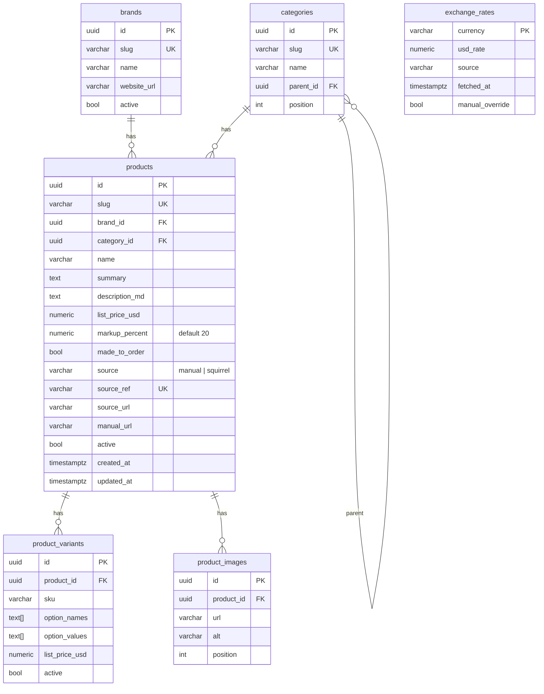
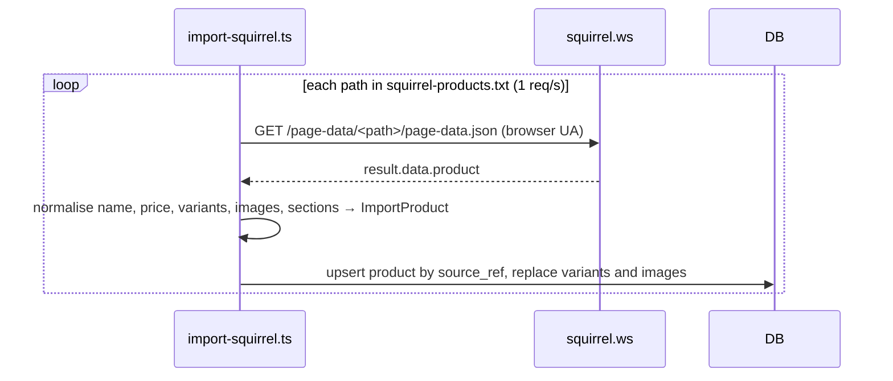

# Feature: Product catalog

> Issue: none yet · Branch: `feat/product-catalog` (stacked on `feat/landing-page-copy`) · ADR: [0003](../../docs/adr/0003-usd-pricing-derived-currencies-whatsapp-checkout.md) · Briefing: Eca, 2026-09-11

## Problem Statement

Bendike is an official retailer for Squirrel (wingsuits, tracking suits, parachutes, BASE equipment), Vigil (the
Cuatro AAD) and FlySight (FlySight 2). Today none of that is visible on bendike: there is no product database, no
shop and no way for a skydiver to see what Eca sells or what it costs in dollars, pesos or reais. Squirrel alone has
about fifty products with large size and colour matrices, so the catalog must be imported, not typed.

## Personas

| Persona  | Impact   | Notes                                                                  |
| -------- | -------- | ---------------------------------------------------------------------- |
| Visitor  | Positive | Browses the shop without an account, sees prices in USD, ARS and BRL   |
| User     | Positive | Same as visitor; later specs tie purchases to the account              |
| Rigger   | Positive | Sees the gear Eca stocks, can point customers to it                    |
| Dropzone | Positive | Same as rigger                                                         |
| Admin    | Positive | Manages products, prices and exchange rates without a database console |

## Value Assessment

- **Primary value**: Commercial — the shop is how Bendike's retail business becomes visible and generates orders.
- **Secondary value**: Efficiency — importing Squirrel's catalog from their published data replaces hand entry of
  thousands of variants.

## User Stories

### Story 1: Browse the catalog

As a **Visitor**,
I want **to browse products by category and brand, search, sort and page through results**,
so that I can **find the gear I am after without scrolling through everything**.

#### Acceptance Criteria

- The web app shall serve the shop at `/shop` to every visitor, signed in or not.
- The shop shall list products in pages of 12 by default and let the visitor change page; the page, filters, search
  and sort shall be reflected in the URL query string so a link reproduces the view.
- The shop shall filter by category (with subcategories), by brand, and by availability (in stock or made to order).
- The shop shall search by product name and summary and sort by name, price ascending and price descending.
- When no product matches, the shop shall say so and offer to clear the filters.
- The shop shall show a breadcrumb (Shop, category, subcategory) and a category navigation on every catalog page.

### Story 2: See a product

As a **Visitor**,
I want **a product page with images, description, variants and the price in USD, ARS and BRL**,
so that I can **decide what to order and in which configuration**.

#### Acceptance Criteria

- The web app shall serve `/shop/<slug>` for every active product.
- The product page shall show the Bendike price in USD as the primary figure, computed as the manufacturer's list
  price plus the product's markup percentage (default 20%).
- The product page shall show the ARS and BRL equivalents computed from the stored exchange rates, labelled as
  indicative with the rate source and date.
- If a product has variants, the product page shall let the visitor pick one value per option and shall show the
  variant's own USD list price when it has one.
- While a product is made to order, the product page shall say so and shall not imply stock.
- The product page shall link back to its category and show related products from the same category.

### Story 3: Keep prices honest

As an **Admin**,
I want **exchange rates refreshed daily from a provider and overridable by hand**,
so that I can **show the peso rate I actually sell at**.

#### Acceptance Criteria

- The API shall expose `GET /api/v1/exchange-rates` returning one entry per currency (`ARS`, `BRL`) with the USD
  rate, source and fetch time.
- When an admin calls `POST /api/v1/exchange-rates/refresh`, the API shall fetch the provider rates and update every
  currency that is not manually overridden.
- When an admin calls `PUT /api/v1/exchange-rates/:currency` with a rate, the API shall store it as a manual
  override until the admin clears it.
- If the provider is unreachable, then the API shall keep the last stored rates and report the failure.
- When the API starts and any rate is older than 24 hours or missing, the API shall attempt one refresh.

### Story 4: Manage the catalog

As an **Admin**,
I want **to create, edit, deactivate and re-import products**,
so that I can **keep the shop current as brands change their lines**.

#### Acceptance Criteria

- The API shall expose admin-only endpoints to create and update brands, categories, products, variants and images,
  and to deactivate a product.
- If a user, rigger or dropzone calls an admin catalog endpoint, then the API shall respond 403.
- The import script shall read Squirrel's published page data for every product path in the checked-in list,
  normalise it, and upsert products, variants and images keyed by their source reference, so running it twice
  changes nothing.
- The import script shall fetch at most one page per second, identify itself with a browser user agent, and keep
  a local cache of the fetched JSON.
- The seed script shall create the Vigil Cuatro and the FlySight 2 as inactive products with their known facts and
  no price, so they cannot appear in the shop until an admin sets a price and activates them.

---

## Design

> Refer to `.github/copilot-instructions.md` for technical standards.

### Role Access

| Role     | Access                                                                            |
| -------- | --------------------------------------------------------------------------------- |
| Visitor  | `GET /catalog/*`, `GET /exchange-rates`, `/shop`, `/shop/:slug`                   |
| User     | Same as Visitor                                                                   |
| Rigger   | Same as Visitor                                                                   |
| Dropzone | Same as Visitor                                                                   |
| Admin    | Everything above plus every write endpoint under `/catalog` and `/exchange-rates` |

### Components Affected

- `packages/shared/src/catalog.ts` — `Currency`, `Brand`, `Category`, `ProductSummary`, `ProductDetail`,
  `ProductVariant`, `ProductImage`, `ExchangeRates`, `CatalogQuery`, `Page<T>`
- `packages/shared/src/pricing.ts` — `bendikePriceUsd(listPriceUsd, markupPercent)`, `convert(usd, rate)`,
  `formatMoney(amount, currency)` (en-US, es-AR, pt-BR)
- `apps/api/src/catalog/` — entities (`Brand`, `Category`, `Product`, `ProductVariant`, `ProductImage`), read
  controller, admin controller, services, DTOs, slugs
- `apps/api/src/exchange-rates/` — `ExchangeRate` entity, provider client, service, controller, startup refresh
- `apps/api/src/database/migrations/1757700000000-CreateCatalog.ts`
- `apps/api/scripts/import-squirrel.ts`, `apps/api/scripts/squirrel-products.txt`, `apps/api/scripts/seed-catalog.ts`
- `apps/web/src/pages/shop/` — `ShopPage` (filters, pagination, breadcrumb, category nav), `ProductPage`,
  `catalog-api.ts`, `useCatalogQuery` (URL query state)
- `apps/web/src/components/site/site-content.ts`, `SiteNav.tsx` — Shop link
- `apps/web/src/components/Price.tsx` — tri-currency price display
- `apps/web/public/brand/` — logo files from Eca (pending)

### Dependencies

- Exchange rates: `https://open.er-api.com/v6/latest/USD` (free, no key, daily). Provider URL is configuration
  (`EXCHANGE_RATE_PROVIDER_URL`). `dolarapi.com` is a candidate for Argentine-specific rates later.
- Squirrel data: `https://squirrel.ws/page-data/<path>/page-data.json`, fetched with a browser user agent.
- Images are referenced by URL on the manufacturers' CDNs, not copied, until Eca confirms reuse terms.

### Data Model Changes



`list_price_usd` on a product is nullable so seeded products can exist before Eca sets a price; a product cannot be
activated while it is null. Money is `numeric(12,2)`; rates are `numeric(14,6)`.

### Diagrams

```mermaid
sequenceDiagram
  participant Web
  participant API
  participant DB
  Web->>API: GET /api/v1/catalog/products?category=wingsuits&brand=squirrel&page=2&pageSize=12&sort=price-asc
  API->>DB: SELECT active products JOIN brand, category, first image ... LIMIT 12 OFFSET 12
  API-->>Web: { items, page, pageSize, total }
  Web->>API: GET /api/v1/exchange-rates
  API-->>Web: { base: "USD", rates: { ARS: {...}, BRL: {...} } }
  Web->>Web: price = bendikePriceUsd(list, markup); ARS = convert(price, rates.ARS)
```



### Open Questions

- [ ] Vigil Cuatro USD list price and whether Eca holds stock.
- [ ] FlySight 2 USD list price (flysight.ca shows no price on the home page).
- [ ] Which ARS rate Eca sells at (official, MEP, blue); default is the provider's market rate with admin override.
- [ ] Squirrel and FlySight copy and photos: confirm the retailer agreement covers reuse on bendike. Until then
      images are linked from their CDNs, not copied.
- [ ] Squirrel apparel (`/store/`) is out of scope unless Eca wants it.
- [ ] Logo files: Eca is sending them; they go in `apps/web/public/brand/` and replace the text wordmark in `SiteNav`.

---

## Tasks

### Task 1: Shared catalog contracts and pricing helpers

**Objective**: Define the catalog types, the paginated query contract and the pure pricing functions once.

**Affected files**:

- `packages/shared/src/catalog.ts`, `packages/shared/src/pricing.ts`, `packages/shared/src/pricing.spec.ts`, `packages/shared/src/index.ts`

**Requirements**: Story 2 (price computation), Story 1 (query contract)

**Verification**:

- [ ] `npm run test:unit -w @bendike/shared` passes
- [ ] `bendikePriceUsd(2090, 20)` is `2508.00`; `convert` rounds to 2 decimals; `formatMoney` uses the right locale per currency

**Done when**:

- [ ] All verification steps pass

---

### Task 2: Catalog entities and migration

**Depends on**: Task 1

**Objective**: Persist brands, categories, products, variants, images and exchange rates.

**Affected files**:

- `apps/api/src/catalog/entities/*.entity.ts`, `apps/api/src/exchange-rates/exchange-rate.entity.ts`
- `apps/api/src/database/migrations/1757700000000-CreateCatalog.ts`, `apps/api/src/database/data-source.ts`

**Verification**:

- [ ] `npm run typecheck -w @bendike/api` passes
- [ ] Migration applies and reverts cleanly against the docker Postgres

**Done when**:

- [ ] All verification steps pass

---

### Task 3: Public catalog read endpoints

**Depends on**: Task 2

**Objective**: Serve brands, the category tree, the paginated and filtered product list, and product detail.

**Affected files**:

- `apps/api/src/catalog/catalog.controller.ts`, `catalog.service.ts`, `dto/catalog-query.dto.ts`, matching specs

**Requirements**: Story 1, Story 2

**Verification**:

- [ ] Filters combine (category includes descendants, brand, availability, search); sort and pagination are validated (`pageSize` 1..48)
- [ ] Inactive products never appear; unknown slug returns 404

**Done when**:

- [ ] All verification steps pass

---

### Task 4: Exchange rates

**Depends on**: Task 2

**Objective**: Store, refresh and override USD rates for ARS and BRL.

**Affected files**:

- `apps/api/src/exchange-rates/*`, `apps/api/src/config/app.config.service.ts` (`EXCHANGE_RATE_PROVIDER_URL`)

**Requirements**: Story 3

**Verification**:

- [ ] Refresh updates non-overridden rows and leaves overrides alone; provider failure keeps old rates and returns a clear error
- [ ] Startup refresh runs only when rates are missing or older than 24h (unit test with a fake clock)

**Done when**:

- [ ] All verification steps pass

---

### Task 5: Admin catalog write endpoints

**Depends on**: Task 3

**Objective**: Let admins create and update brands, categories, products, variants and images, and deactivate products.

**Affected files**:

- `apps/api/src/catalog/catalog-admin.controller.ts`, `dto/*.dto.ts`, matching specs

**Requirements**: Story 4

**Verification**:

- [ ] Every endpoint is behind `JwtAuthGuard` + `RolesGuard` with `@Roles(Role.Admin)`; user, rigger and dropzone get 403
- [ ] Activating a product without a list price is rejected with 400

**Done when**:

- [ ] All verification steps pass

---

### Task 6: Squirrel importer and manual seeds

**Depends on**: Task 2

**Objective**: Import the Squirrel catalog idempotently and seed Vigil Cuatro and FlySight 2 as inactive products.

**Affected files**:

- `apps/api/scripts/import-squirrel.ts`, `apps/api/scripts/squirrel-products.txt`, `apps/api/scripts/seed-catalog.ts`, `apps/api/package.json` (scripts)

**Requirements**: Story 4

**Verification**:

- [ ] Normaliser unit tests against a checked-in sample page-data JSON (Freak 6): name, price, variant options and values, image URLs, sections to markdown
- [ ] Running the importer twice against docker Postgres yields identical row counts
- [ ] Fetch cadence is at most one request per second

**Done when**:

- [ ] All verification steps pass

---

### Task 7: Shop listing with filters, pagination and navigation

**Depends on**: Tasks 3, 4

**Objective**: Build `/shop` with category navigation, brand and availability filters, search, sort, pagination and breadcrumbs, all driven by the URL.

**Affected files**:

- `apps/web/src/pages/shop/ShopPage.tsx`, `useCatalogQuery.ts`, `catalog-api.ts`, `ProductCard.tsx`, `components/Price.tsx`, specs
- `apps/web/src/components/site/site-content.ts`, `SiteNav.tsx`, `App.tsx`

**Requirements**: Story 1, Story 2 (price display)

**Verification**:

- [ ] Changing a filter updates the query string and resets to page 1; reloading the URL restores the view
- [ ] Empty state offers to clear filters; prices show USD first with ARS and BRL beneath

**Done when**:

- [ ] All verification steps pass

---

### Task 8: Product page

**Depends on**: Task 7

**Objective**: Build `/shop/:slug` with gallery, description, variant selection, tri-currency price, made-to-order notice and related products.

**Affected files**:

- `apps/web/src/pages/shop/ProductPage.tsx`, `VariantPicker.tsx`, specs

**Requirements**: Story 2

**Verification**:

- [ ] Picking variant values narrows to a single variant and its price; unknown slug shows a not-found state

**Done when**:

- [ ] All verification steps pass

---

## Out of Scope

- Cart and checkout handoff (see `cart-and-whatsapp-checkout.md`)
- Online payment, orders table, stock levels
- Squirrel apparel and Squirrel's "supercustom" configurator
- Admin web UI for products (API first; UI in a later spec)

## Future Considerations

- Admin catalog UI
- Argentine rate selection (dolarapi) if the official rate is not the one Eca sells at
- Spanish and Portuguese product copy
