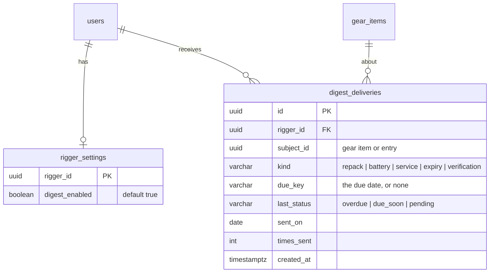
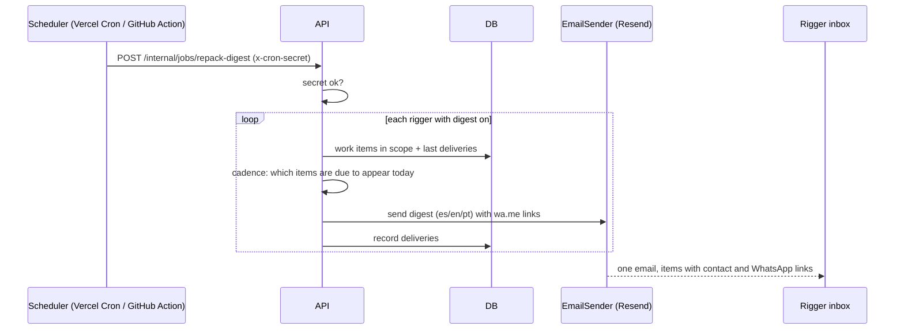

# Feature: Repack reminders (daily digest email with a WhatsApp link)

> Issue: none yet · Branch: `feat/repack-reminders` (to be created) · ADR: [0014](../../docs/adr/0014-repack-reminders-are-a-daily-digest-email-sent-by-a-cron-triggered-endpoint.md) · Depends on: [rigger-workspace.md](./rigger-workspace.md) Tasks 1 to 5 · Requested by Eca, 2026-09-19

## Problem Statement

A rigger can only act on a repack before the date, and the way a repack starts is a message to the owner. Riggers
should not have to open Bendike to find out what is coming: Bendike should email them once a day with everything
that needs attention, each item carrying the owner's contact details and a link that opens WhatsApp with a
ready-written message to the owner, so the rigger only has to press send.

## Personas

| Persona  | Impact   | Notes                                                                                   |
| -------- | -------- | --------------------------------------------------------------------------------------- |
| Visitor  | Neutral  | Nothing visible                                                                         |
| User     | Neutral  | Receives a WhatsApp message from their rigger; no email from Bendike in this spec       |
| Rigger   | Positive | One email a day with what is overdue or coming up, and a one-tap WhatsApp for each      |
| Dropzone | Neutral  | Its rigger contacts it about fleet rigs the same way; dropzone notices are a later spec |
| Admin    | Positive | Can preview and trigger the digest to test it; sets up the email provider               |

## Value Assessment

- **Primary value**: Customer — nobody jumps a reserve past its repack because the rigger was reminded in time.
- **Secondary value**: Efficiency — the first message to the customer is already written, in their language.
- **Tertiary value**: Future — the same email port carries verification and password emails later.

## User Stories

### Story 1: The daily digest

As a **Rigger**,
I want **one email a day listing what is overdue, what is coming up and what needs my decision**,
so that I can **start my day knowing what to do**.

#### Acceptance Criteria

- The API shall build, for each rigger with an active link, a digest of: overdue items, items inside their yellow
  window (21 days for a reserve repack, 90 days for an AAD date), and, once
  [service-bulletins-and-grounding.md](./service-bulletins-and-grounding.md) ships, open bulletin matches, rigs
  grounded awaiting clearance and owner-reported work awaiting verification.
- The digest shall list, for each item: the rig, the owner's name, the component, what is due, the due date, days
  to go or days overdue, the status, the owner's phone and email, and a WhatsApp link.
- When a digest has no items, the API shall send nothing.
- The API shall include an item the day it becomes yellow and then again weekly while it stays yellow; and the day
  it becomes overdue and then every three days while it stays overdue; it shall stop when the due date is renewed.
- The API shall record each delivery in `digest_deliveries` and shall not send the same item twice on one day, so
  running the job twice in a day sends one email.
- Where a rigger turned the digest off, the API shall skip them.
- The API shall write the email in the rigger's language and shall order items overdue first, then by date.
- The API shall only include owners with an active link, and only their phone and email.

### Story 2: A WhatsApp link that starts the conversation

As a **Rigger**,
I want **a link in the email that opens WhatsApp to the owner with a message already written**,
so that I can **kick off the conversation with one tap**.

#### Acceptance Criteria

- The API shall build the link as `https://wa.me/<phone digits>?text=<encoded message>` from the owner's phone in
  international form.
- The message shall be written in the owner's language (Spanish, English or Portuguese, defaulting to Spanish), and
  shall name the rigger, the rig, the component and the date, and ask to arrange the repack or service.
- If the owner has no phone, then the API shall put a `mailto:` link to the owner's email in its place.
- The web work queue and the email shall use the same message builder so the two never differ.

### Story 3: Sending, scheduling and safety

As an **Admin**,
I want **the digest to run by itself every morning and to be testable without sending real mail**,
so that I can **trust it and try it safely**.

#### Acceptance Criteria

- The API shall expose `POST /api/v1/internal/jobs/repack-digest`, accepted only with the `CRON_SECRET` in the
  `x-cron-secret` header; without or with a wrong secret it shall respond 401.
- When the scheduler calls it, the API shall send the digests for the current day in the
  `America/Argentina/Buenos_Aires` time zone, around 07:00.
- The API shall let an admin call the same job with `dryRun=true`, returning what it would send to whom without
  sending or recording anything.
- Where no email provider is configured, the API shall use the console adapter that writes the message to the API
  log, so development and tests never send mail.
- Where `EMAIL_OVERRIDE_TO` is set, the API shall send every email to that address instead of the real recipient,
  with the intended recipient in the subject, so a test run never reaches a rigger or an owner.
- If the email provider fails for one rigger, then the API shall record the failure, continue with the others and
  retry that rigger on the next run.
- The API shall never log an email body in production.

### Story 4: The rigger's switch

As a **Rigger**,
I want **to turn the daily digest off and on**,
so that I can **stop the emails while I am away**.

#### Acceptance Criteria

- The web app shall show a "Daily digest" switch on the rigger's work page, on by default.
- When the rigger changes the switch, the API shall store it and the next run shall respect it.

---

## Design

> Refer to `.github/copilot-instructions.md` for technical standards.

### Role Access

| Role     | Access                                                |
| -------- | ----------------------------------------------------- |
| Visitor  | None                                                  |
| User     | None                                                  |
| Rigger   | Receives the digest; turns their own digest on or off |
| Dropzone | None                                                  |
| Admin    | Preview (dry run) and trigger the job                 |

The job endpoint is not part of any role's API; it is authorised by a shared secret only.

### Components Affected

- `packages/shared/src/reminders.ts` — `DigestItem`, `digestCadence` (pure: when an item is due to be included)
- `packages/shared/src/whatsapp.ts` — `repackWhatsappMessage` (introduced in the rigger workspace spec)
- `apps/api/src/email/` — `EmailSender` port, `ConsoleEmailSender`, `ResendEmailSender`, `email.module.ts`
- `apps/api/src/reminders/` — `DigestBuilder`, `DigestRenderer` (subject, HTML and text in es/en/pt),
  `DigestJobService`, `digest-job.controller.ts`, `DigestDelivery` and `RiggerSettings` entities
- `apps/api/src/config/app.config.service.ts` — `EMAIL_PROVIDER`, `RESEND_API_KEY`, `EMAIL_FROM`, `EMAIL_OVERRIDE_TO`, `CRON_SECRET`
- `apps/api/src/database/migrations/1758400000000-CreateDigestDeliveries.ts`
- `apps/web/src/pages/work/DigestSwitch.tsx`
- `.github/workflows/repack-digest.yml` or `vercel.json` cron entry — the scheduler call
- `README.md`, `apps/api/.env.example` — the new variables and how to create the Resend key

### Dependencies

- [rigger-workspace.md](./rigger-workspace.md) Tasks 1 to 5 (links, work queue, WhatsApp builder)
- A Resend account with a verified sending domain (Eca creates it), or any provider behind the same port
- `user-profile-and-email-verification.md` for owners' phone and language; until then owners without a phone get
  the `mailto:` fallback and the message defaults to Spanish

### Data Model Changes

Unique on `(rigger_id, subject_id, kind, due_key)`. Renewing a due date changes `due_key`, which starts a new
cadence.

### Diagrams

### Open Questions

- [ ] Resend account and sending domain: Eca must create them and add the key; until then the console adapter runs.
- [ ] Cadence for a yellow item (weekly) and an overdue one (every three days): are those the right rhythms?
- [ ] Send hour: 07:00 Buenos Aires is a guess; Eca may prefer another.
- [ ] Should the owner also get a reminder of their own repack? Left to `notifications-inbox.md` phase 2.

---

## Tasks

### Task 1: Cadence rules and message builder

**Objective**: Pure functions that decide which items appear in today's digest, and the WhatsApp and `mailto:`
links, fully tested.

**Affected files**:

- `packages/shared/src/reminders.ts`, `reminders.spec.ts`, `whatsapp.ts` (if not yet created), `index.ts`

**Requirements**: Stories 1, 2

**Verification**:

- [x] Table-driven: first day yellow, day 3 skipped, day 7 included; first day overdue, every third day after;
      a renewed due date restarts the cadence
- [x] The link is `wa.me` with digits only and an encoded message per locale; no phone falls back to `mailto:`

**Done when**:

- [x] All verification steps pass

---

### Task 2: Email port and adapters

**Objective**: An `EmailSender` port, a console adapter and a Resend adapter, selected by configuration.

**Affected files**:

- `apps/api/src/email/*`, `apps/api/src/config/app.config.service.ts`, `.env.example`, specs

**Requirements**: Story 3

**Verification**:

- [x] With `EMAIL_PROVIDER` unset the console adapter is used; with `EMAIL_OVERRIDE_TO` set every message goes to that address; the Resend adapter posts to Resend's API with the key
      and returns failures to the caller; secrets never appear in logs

**Done when**:

- [x] All verification steps pass

---

### Task 3: Digest builder, renderer and delivery records

**Depends on**: Tasks 1, 2

**Objective**: Build each rigger's digest from the work queue, apply the cadence, render it in three languages, and
record deliveries; add `digest_deliveries` and `rigger_settings`.

**Affected files**:

- `apps/api/src/reminders/*`, migration, specs

**Requirements**: Story 1

**Verification**:

- [x] An empty digest sends nothing; running twice in a day sends once; an owner without a link never appears;
      overdue items come first; the text is in the rigger's language and the WhatsApp text in the owner's

**Done when**:

- [x] All verification steps pass

---

### Task 4: The job endpoint

**Depends on**: Task 3

**Objective**: The secret-guarded job route with an admin dry run and per-rigger failure isolation.

**Affected files**:

- `apps/api/src/reminders/digest-job.controller.ts`, `digest-job.service.ts`, specs

**Requirements**: Story 3

**Verification**:

- [x] No secret and a wrong secret are 401; the dry run sends and records nothing; one failing rigger does not
      stop the others and is retried on the next run

**Done when**:

- [x] All verification steps pass

---

### Task 5: Rigger switch

**Depends on**: Task 3

**Objective**: The API setting and the "Daily digest" switch on the work page.

**Affected files**:

- `apps/api/src/reminders/rigger-settings.controller.ts`, `apps/web/src/pages/work/DigestSwitch.tsx`, specs

**Requirements**: Story 4

**Verification**:

- [x] Turning it off makes the next run skip that rigger; only the rigger changes their own switch

**Done when**:

- [x] All verification steps pass

---

### Task 6: Scheduling and setup docs

**Depends on**: Task 4

**Objective**: The scheduler entry, README steps to create the Resend key and set the variables, and an end-to-end
run against the local database.

**Affected files**:

- `.github/workflows/repack-digest.yml` (or `vercel.json`), `README.md`, `apps/api/.env.example`

**Verification**:

- [x] With the console adapter and the test rigger, dropzone and user accounts, a call to the job prints one digest with
      the right items, contact details and a working `wa.me` link
- [x] Without the secret the workflow's call would be rejected

**Done when**:

- [x] All verification steps pass

---

## Out of Scope

- Reminders to owners by email or WhatsApp (their inbox arrives with `notifications-inbox.md` phase 2)
- Sending WhatsApp messages from Bendike itself: the link opens the rigger's own WhatsApp, and a business API is a
  different project
- Per-rigger cadence or send hour

## Future Considerations

- Automatic reminders to owners, with the rigger's contact and a "book a repack" link tied to `rigging-services.md`
- A weekly summary for a dropzone
