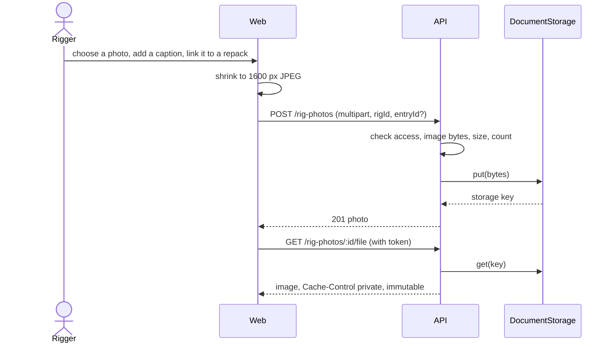
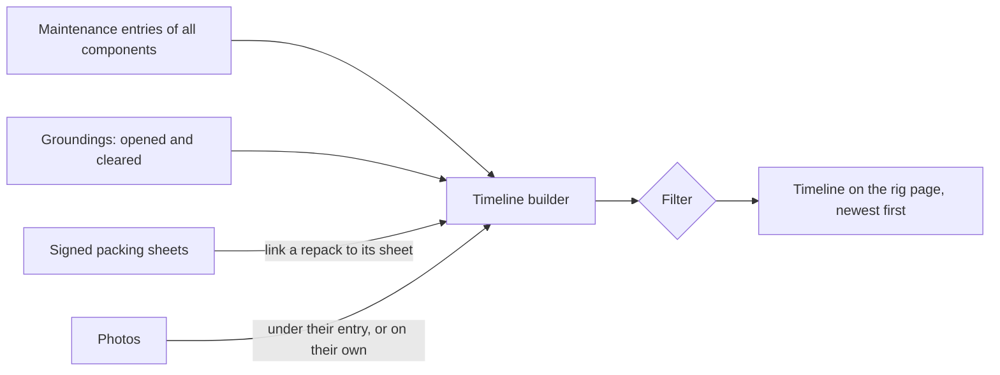

# Feature: Rig photos and rig history

> Issue: none yet · Branch: `feat/rig-photos-and-history` · ADR: [0015](../../docs/adr/0015-the-manual-library-is-stored-in-google-drive-behind-a-storage-port.md) (photos use the same storage port) · Depends on: [gear-tracking.md](./gear-tracking.md), [packing-sheets.md](./packing-sheets.md) · Requested by Eca, 2026-09-20

## Problem Statement

A rig is a physical thing that several people handle over years, and today Bendike shows it only as rows of text.
Riggers and owners want to see what the rig looks like and what is being worked on, and an owner wants one place that
tells the whole story of their rig: every repack, service, inspection, grounding and photo, in date order. The data is
mostly there in the maintenance log and the groundings, but it is a table for riggers to act on, not a history an owner
can read.

## Personas

| Persona  | Impact   | Notes                                                                                             |
| -------- | -------- | ------------------------------------------------------------------------------------------------- |
| Visitor  | Neutral  | Nothing visible                                                                                   |
| User     | Positive | Sees their rig's photos and a readable history of every repack, service, inspection and grounding |
| Rigger   | Positive | Photographs the rig they are working on and finds it again by picture; sees the same history      |
| Dropzone | Positive | Sees a picture of each rig in its fleet and the history behind it                                 |
| Admin    | Positive | Everything a rigger can do; can remove any photo                                                  |

## Value Assessment

- **Primary value**: Customer: owners and dropzones can see and trust what has been done to a rig.
- **Secondary value**: Efficiency: a photo identifies the right rig at the loft faster than a name and a serial.
- **Tertiary value**: Future: photos with dates are evidence of a rig's condition at each visit.

## User Stories

### Story 1: Add photos to a rig

As a **User**, **Rigger** or **Dropzone**,
I want **to add photos to a rig**,
so that I can **show what it looks like and what is being worked on**.

#### Acceptance Criteria

- When the owner, a rigger who may sign off the rig, or an admin adds a JPEG, PNG or WebP photo to a rig, the API
  shall store it in the document storage and record its caption, when it was added and who added it.
- The API shall accept up to 8 MB per photo and up to 20 photos per rig, judged by the file's first bytes and not
  by its name.
- If the file is not a supported image, then the API shall respond 400; if it is too large, then the API shall respond
  413; and if the rig already has 20 photos, then the API shall respond 409; in every case store nothing.
- Where a photo is about one piece of recorded work, the API shall let the person link it to that maintenance entry of
  the rig.
- If the storage cannot be reached, then the API shall respond 502 and record no photo.
- Before uploading, the web app shall shrink a photo whose longest side is over 1600 pixels and send it as a JPEG, so
  that a phone photo is not refused for its size.
- If the actor cannot see the rig, then the API shall respond 404.

### Story 2: See the photos

As a **User**, **Dropzone** or **Rigger**,
I want **to see a rig's photos on its page and a picture of it on the lists**,
so that I can **recognise the rig at a glance**.

#### Acceptance Criteria

- The web app shall show a gallery of the rig's photos on the rig page, newest first, with the caption, the date and
  who added it, and shall open a photo larger when it is pressed.
- The API shall stream a photo only through an authenticated endpoint to someone who can read the rig, and shall
  answer with a long-lived private cache header because a stored photo never changes.
- The web app shall show the newest photo of each rig as its cover on the gear dashboard, in the card view and in the
  rigs table, and a neutral placeholder for a rig with no photo.
- The API shall answer a request for the covers of an owner's rigs with the newest photo id of each, to anyone who can
  read that owner's gear.

### Story 3: Remove a photo

As a **User** or **Rigger**,
I want **to remove a photo I should not have added**,
so that I can **keep the rig's pictures right**.

#### Acceptance Criteria

- When the person who added a photo, the rig's owner or an admin removes it, the API shall hide it from every list and
  cover, record who removed it and when, and keep the stored file.
- If anyone else tries to remove a photo, then the API shall respond 403.

### Story 4: The rig history

As a **User**, **Dropzone** or **Rigger**,
I want **one readable timeline of everything that happened to a rig**,
so that I can **see every repack, service, inspection and grounding, with the photos, in date order**.

#### Acceptance Criteria

- The web app shall show on the rig page a timeline, newest first, that merges the rig's maintenance entries for all
  its components, its groundings (when opened and when cleared) and its photos.
- Each work event shall show its date, the kind of work, the component, the description, who did it, whether it is
  verified, unverified or void, and, for a repack recorded by a packing sheet, a link to that sheet.
- Each photo linked to a piece of work shall appear under that work; every other photo shall appear as its own event.
- The web app shall let the visitor narrow the timeline to repacks, services, inspections, groundings or photos.
- The web app shall keep the existing table of entries, with its verify and void actions, one click away, and shall
  show the timeline first.
- While the rig has no history, the web app shall say so.

---

## Design

> Refer to `.github/copilot-instructions.md` for technical standards.

### Role Access

| Role     | Access                                                                                                  |
| -------- | ------------------------------------------------------------------------------------------------------- |
| Visitor  | None                                                                                                    |
| User     | Their own rigs: view, add and remove their own photos, remove any photo on their rig, read the timeline |
| Rigger   | Rigs of linked owners: view, add photos, remove their own photos, read the timeline                     |
| Dropzone | Its own fleet: view, add and remove photos, read the timeline                                           |
| Admin    | Everything, on any rig                                                                                  |

### Components Affected

- `packages/shared/src/rig-photos.ts` — photo contracts, limits and the pure timeline builder
- `packages/shared/src/packing-sheets.ts` — `entryId` on the sheet summary, so the timeline can link a repack to its sheet
- `apps/api/src/rig-photos/` — entity, service, controller, module
- `apps/api/src/database/migrations/` — `rig_photos`
- `apps/web/src/pages/rigphotos/` — authenticated image, client resize, gallery, upload and remove dialogs, covers
- `apps/web/src/pages/gear/RigPage.tsx`, `GearPage.tsx`, `GearGrid.tsx` — gallery, covers, timeline
- `apps/web/src/pages/history/` — timeline component

### Dependencies

- The `DocumentStorage` port from [manual-library.md](./manual-library.md): photos go to the same Drive folder, or local
  disk in development. No public URL is ever produced.
- The canvas of the browser to shrink a photo; no new package.

### Data Model Changes

`rig_photos`: `id`, `rig_id`, `entry_id` (nullable, references `maintenance_entries`), `storage_key`, `file_name`,
`mime_type`, `size_bytes`, `caption`, `added_by`, `added_by_name` (a snapshot), `created_at`, `removed_at`, `removed_by`.

### Diagrams

### Open Questions

- [ ] Whether a photo should also be offered at the repack itself, on the job page: for now it is added from the rig
      page and linked to the repack afterwards.
- [ ] Photos are stored as they are uploaded (after the browser shrinks them); there is no server-side thumbnail, so
      the covers load the shrunken photo.

---

## Tasks

> Each task is one coding session. Tick the boxes in the same commit that delivers the work.

### Task 1: Shared contracts and the timeline builder

**Objective**: Photo types and limits, and the pure functions that merge the history into a timeline and filter it.

**Affected files**:

- `packages/shared/src/rig-photos.ts`, `rig-photos.spec.ts`, `packing-sheets.ts`, `index.ts`

**Requirements**: Story 4

**Verification**:

- [x] Entries, groundings and photos merge newest first; a photo linked to an entry sits under it; a repack entry
      links to its sheet; filters narrow by category

**Done when**:

- [x] All verification steps pass

---

### Task 2: Photos API

**Depends on**: Task 1

**Objective**: Migration, entity, service and controller to add, list, stream, list covers and remove.

**Affected files**:

- `apps/api/src/rig-photos/*`, migration, `apps/api/src/app.module.ts`, `apps/api/src/packing-sheets/*` (summary `entryId`)

**Requirements**: Stories 1, 2, 3

**Verification**:

- [x] The owner, linked riggers and admins can add; strangers get 404
- [x] A non-image, an oversized file, a 21st photo and a failed storage write are refused and leave nothing behind
- [x] The file streams with a private immutable cache header; a removed photo disappears from lists and covers but
      its file is kept; only the adder, the owner or an admin can remove

**Done when**:

- [x] All verification steps pass

---

### Task 3: Gallery, upload and covers (web)

**Depends on**: Task 2

**Objective**: An authenticated image component, the client-side shrink, the gallery with upload, viewer and remove on
the rig page, and covers on the dashboard.

**Affected files**:

- `apps/web/src/pages/rigphotos/*`, `RigPage.tsx`, `GearPage.tsx`, `GearGrid.tsx`

**Requirements**: Stories 1, 2, 3

**Verification**:

- [x] Upload, viewer, caption, link to work and remove work; a rig with no photo shows a placeholder
- [x] Covers show on the cards and in the rigs table, and only for rigs the account can read
- [x] Verified in a browser at desktop and phone width

**Done when**:

- [x] All verification steps pass

---

### Task 4: Rig history timeline (web)

**Depends on**: Tasks 1, 3

**Objective**: The timeline component on the rig page with its filters, and the toggle to the existing table.

**Affected files**:

- `apps/web/src/pages/history/*`, `RigPage.tsx`

**Requirements**: Story 4

**Verification**:

- [x] The timeline shows work, groundings and photos in date order with sheet links and statuses; filters narrow it;
      the table stays available with its actions; an empty rig says so
- [x] Verified in a browser as an owner, a dropzone and a rigger; README and this spec updated

**Done when**:

- [x] All verification steps pass

---

## Out of Scope

- Server-side thumbnails or image processing
- Photos of a single component, or of a spare, outside a rig
- Video, or documents other than images
- Sharing a photo outside Bendike, or a public link
- Deleting stored files

## Future Considerations

- Add photos from the repack job page and attach them to the signed sheet
- A printed history page for a rig (a "service record" for a buyer)
- Server-side thumbnails once the number of photos grows
