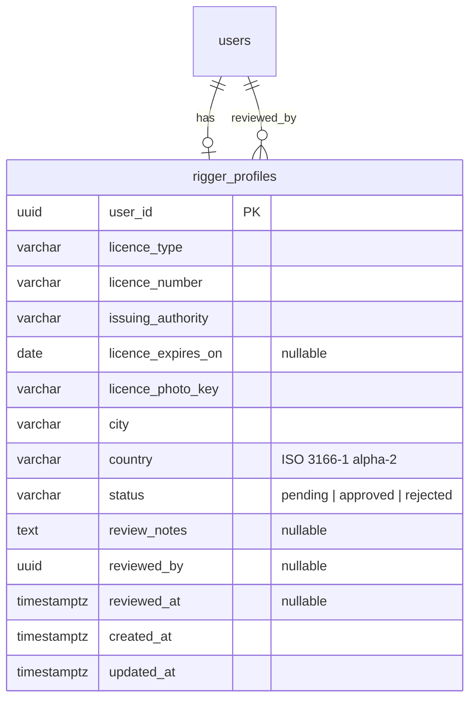

# Feature: Rigger profile and licence verification

> Issue: none yet · Branch: `feat/rigger-profile` (to be created) · Requested by Eca, 2026-09-11 · Depends on: `user-profile-and-email-verification.md`

## Problem Statement

Anyone can register on Bendike, but only a certified rigger may log repacks and offer services. Eca needs to see a
rigger's licence before promoting them: licence type and number, who issued it, a photograph of the licence, plus
the person's full name, where they work from, a WhatsApp phone and an email. That information belongs in a section
only riggers and applicants see, with an admin review that ends in the account being promoted to `rigger`.

## Personas

| Persona  | Impact   | Notes                                                                        |
| -------- | -------- | ---------------------------------------------------------------------------- |
| Visitor  | Neutral  | Nothing visible                                                              |
| User     | Positive | Can apply to become a rigger from their profile                              |
| Rigger   | Positive | Keeps licence and location current; sees their verified status               |
| Dropzone | Neutral  | Later: sees verified riggers who work at the DZ                              |
| Admin    | Positive | Reviews licences with the photo in front of them and promotes with one click |

## Value Assessment

- **Primary value**: Customer — a skydiver handing a reserve to a Bendike rigger knows the licence was checked.
- **Secondary value**: Efficiency — the promotion decision has everything it needs on one screen.

## User Stories

### Story 1: Apply as a rigger

As a **User**,
I want **to submit my rigger licence details and a photo of the licence**,
so that I can **be verified and promoted to rigger**.

#### Acceptance Criteria

- While signed in as a user with no rigger profile, the profile page shall offer "I am a rigger" leading to
  `/app/rigger`.
- When the account submits the form, the API shall require `licenceType`, `licenceNumber`, `issuingAuthority`,
  `city`, `country` and a licence photo, and shall accept an optional `licenceExpiresOn`.
- Full name, WhatsApp phone and email shall come from the account's profile (see the profile spec) and be shown
  read-only on the form with a link to edit them; if the phone is missing, then the form shall block submission
  until it is added.
- The API shall accept a licence photo as JPEG or PNG up to 5 MB, store it privately, and keep only a storage key
  on the profile.
- When the form is submitted, the API shall set the profile status to `pending` and notify every admin with a
  `general` notification "New rigger application".

### Story 2: Review and promote

As an **Admin**,
I want **to see pending rigger applications with the licence photo, approve or reject them**,
so that I can **promote only riggers whose licence I have checked**.

#### Acceptance Criteria

- The web app shall list rigger profiles by status at `/app/admin/riggers` with name, location, licence type and
  number, phone (as a WhatsApp link), email and a link to view the photo.
- When an admin approves, the API shall set the status to `approved`, record the reviewer and time, promote the
  account to `rigger`, and notify the applicant.
- When an admin rejects, the API shall require a reason, set the status to `rejected`, keep the profile, and
  notify the applicant with the reason; the applicant may edit and resubmit.
- The API shall serve the licence photo only to the owner and to admins, through a short-lived signed URL or an
  authenticated endpoint; the photo shall never be publicly addressable.
- If a user, rigger or dropzone calls any review endpoint, then the API shall respond 403.

### Story 3: Maintain the rigger profile

As a **Rigger**,
I want **to see and update my licence, location and photo**,
so that I can **stay verified when my licence renews**.

#### Acceptance Criteria

- While signed in as a rigger, the app shell shall show a "Rigger" entry leading to `/app/rigger`; users without a
  profile see it only as the application link, dropzones never see it.
- When an approved rigger changes licence number, type, authority or photo, the API shall set the status back to
  `pending` and notify admins; changing city, country or expiry shall not.
- If `licenceExpiresOn` is in the past, then the rigger page and the admin list shall flag the licence as expired.

---

## Design

> Refer to `.github/copilot-instructions.md` for technical standards.

### Role Access

| Role     | Access                                                              |
| -------- | ------------------------------------------------------------------- |
| Visitor  | None                                                                |
| User     | Create and edit own rigger profile (application), see own status    |
| Rigger   | Edit own rigger profile, see own status and photo                   |
| Dropzone | None in this spec                                                   |
| Admin    | List, view photos, approve, reject; everything above on any account |

### Components Affected

- `packages/shared/src/rigger.ts` — `RiggerProfile`, `RiggerStatus`, request contracts
- `apps/api/src/rigger/` — `RiggerProfile` entity, service, applicant controller, admin controller, DTOs
- `apps/api/src/storage/` — `FileStorage` port (`put`, `getSignedUrl`, `delete`) with a local-disk adapter for
  dev and tests and one cloud adapter
- `apps/api/src/database/migrations/1758100000000-CreateRiggerProfiles.ts`
- `apps/web/src/pages/rigger/RiggerProfilePage.tsx`, `pages/admin/RiggerApplicationsPage.tsx`,
  `components/AppShell.tsx` (Rigger entry), `pages/ProfilePage.tsx` ("I am a rigger")

### Dependencies

- `user-profile-and-email-verification.md` for name, phone and email
- `notifications-inbox.md` for the admin and applicant notices
- Photo storage: see Open Questions; the port keeps the choice swappable

### Data Model Changes



Full name, phone and email are not duplicated here; they are read from `users`.

### Diagrams

```mermaid
sequenceDiagram
  participant User as Applicant (web)
  participant API
  participant Store as File storage
  participant Admin as Admin (web)
  User->>API: POST /api/v1/rigger/profile (multipart: fields + photo)
  API->>API: validate type, size; owner must have phone
  API->>Store: put(licence-photos/<userId>/<uuid>.jpg)
  API->>API: upsert rigger_profile status=pending; notify admins
  Admin->>API: GET /api/v1/admin/rigger-profiles?status=pending
  Admin->>API: GET /api/v1/admin/rigger-profiles/:userId/photo → signed URL
  Admin->>API: POST /api/v1/admin/rigger-profiles/:userId/approve
  API->>API: status=approved, users.role=rigger, notify applicant
```

### Open Questions

- [ ] Photo storage: Vercel Blob (fits the Vercel hosting plan, free tier), Cloudinary, or S3? Recommendation:
      Vercel Blob behind the `FileStorage` port; local disk in dev. Needs an ADR when chosen.
- [ ] Licence types to offer in the picker: Argentine authority names, FAA Senior and Master Rigger, others? Free
      text with suggestions until Eca lists them.
- [ ] Should approved riggers appear in a public directory? Not in this spec.

---

## Tasks

### Task 1: Contracts and entity

**Objective**: Shared rigger types, entity and migration.

**Verification**:

- [ ] `npm run typecheck` passes; migration applies and reverts

**Done when**:

- [ ] All verification steps pass

---

### Task 2: File storage port with local adapter

**Objective**: `FileStorage` interface, local-disk adapter under a configurable directory, unit tests.

**Verification**:

- [ ] Put, signed URL (local: authenticated endpoint) and delete round-trip; non-image and oversized files rejected

**Done when**:

- [ ] All verification steps pass

---

### Task 3: Applicant endpoints

**Depends on**: Tasks 1, 2

**Objective**: Create and update own rigger profile with photo upload; status rules on edits.

**Requirements**: Stories 1, 3

**Verification**:

- [ ] Missing phone blocks submission; licence field edits reset to pending; location edits do not

**Done when**:

- [ ] All verification steps pass

---

### Task 4: Admin review endpoints

**Depends on**: Task 3

**Objective**: List by status, photo access, approve (promotes), reject (requires reason), notifications.

**Requirements**: Story 2

**Verification**:

- [ ] Approve sets role rigger and notifies; reject without reason is 400; non-admin 403; photo never public

**Done when**:

- [ ] All verification steps pass

---

### Task 5: Web pages and shell entry

**Depends on**: Tasks 3, 4

**Objective**: `/app/rigger` form and status, `/app/admin/riggers` review list, shell entry by role.

**Verification**:

- [ ] Dropzone never sees the entry; expired licence flagged; admin can open the photo

**Done when**:

- [ ] All verification steps pass

---

## Out of Scope

- Public rigger directory and rigger–customer relation
- Dropzone verification (similar flow, separate spec)
- OCR of the licence photo

## Future Considerations

- Dropzone verification with the same review pattern
- Reminders to the rigger before `licenceExpiresOn`
