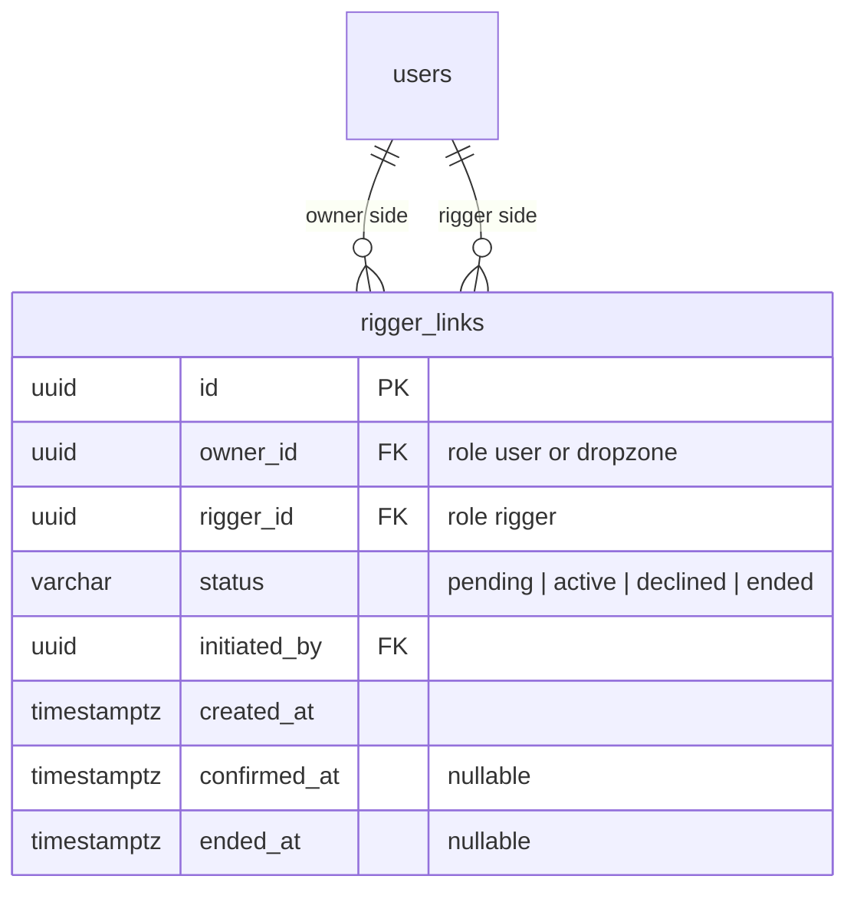
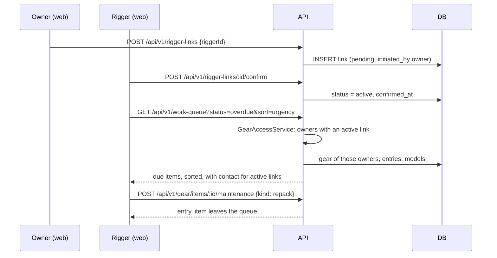

# Feature: Rigger workspace (links, work queue and inspections)

> Issue: none yet · Branch: `feat/rigger-workspace` (to be created) · ADR: [0012](../../docs/adr/0012-riggers-reach-gear-through-confirmed-links-and-dropzones-own-fleets.md) · Depends on: [gear-tracking.md](./gear-tracking.md) Tasks 1 to 6 · Requested by Eca, 2026-09-19

## Problem Statement

Riggers are Bendike's first customers. A rigger looks after one or more dropzones and after individual skydivers,
and today keeps all of it in paper logbooks, a dropzone's spreadsheet and their memory. They need a single place that
says what work is coming up across everyone they look after, lets them log what they did in a tap, lets them record
whether a rig was inspected, and lets each dropzone and skydiver see that record. Access has to follow who has
agreed to work with whom, because the work queue shows owners' contact details.

## Personas

| Persona  | Impact   | Notes                                                                                   |
| -------- | -------- | --------------------------------------------------------------------------------------- |
| Visitor  | Neutral  | Nothing visible                                                                         |
| User     | Positive | Picks their rigger, sees when they were last inspected and by whom                      |
| Rigger   | Positive | One sorted queue of rigs and AADs that need work, quick logging, contact in one tap     |
| Dropzone | Positive | Assigns its riggers, sees the last inspection and the rigger for every rig in its fleet |
| Admin    | Positive | Sees everything, can create or end any link                                             |

## Value Assessment

- **Primary value**: Customer — riggers stop chasing dates across notebooks and messages.
- **Secondary value**: Efficiency — logging a repack is one action, and the contact for the customer sits on the row.
- **Tertiary value**: Market — Bendike becomes the tool a rigger brings their dropzones and customers onto.

## User Stories

### Story 1: Links between riggers and owners

As a **User** or **Dropzone**,
I want **to choose the rigger who looks after my gear**,
so that I can **let them see my rigs and log work on them**.

As a **Rigger**,
I want **to add a dropzone or a customer I already work for**,
so that I can **see their gear without waiting for them to find me**.

#### Acceptance Criteria

- The web app shall let a user or dropzone search approved riggers by name or city and send a link request.
- The web app shall let a rigger add an owner by email or WhatsApp phone, and the API shall create a `pending` link.
- If no account matches the email or phone the rigger typed, then the API shall respond 404 and the web app shall
  say the person must create a Bendike account first.
- When the other side confirms, the API shall set the link `active`; when they decline, the API shall set it
  `declined`; while a link is `pending`, the API shall give the rigger no access.
- The API shall let either side end an active link, and shall remove the rigger's access at once.
- The API shall allow a rigger many active links and an owner many riggers; a dropzone may therefore have several.
- The API shall show a rigger an owner's phone and email only while the link is active.
- Where the rigger profile spec has shipped, the API shall offer only riggers whose profile is approved; until then
  every account with the role `rigger` counts as approved.
- If a user, rigger or dropzone tries to create a link between two other accounts, then the API shall respond 403.

### Story 2: The work queue

As a **Rigger**,
I want **one list of every reserve repack and AAD date coming up across the owners I look after**,
so that I can **plan my week and never miss one**.

#### Acceptance Criteria

- The web app shall serve `/app/work` to riggers, listing due items (a component and the date that is due) across
  every owner with an active link.
- Each row shall show the owner (person or dropzone), the rig, the component, what is due, the due date, days to go
  or days overdue, and the status badge from `gear-tracking.md` (red, yellow, green, grey with icon and word).
- The web app shall sort by urgency by default and let the rigger sort by due date, owner, dropzone or rig.
- The web app shall filter by owner, component kind, what is due (repack, battery, service, expiry), status and
  "due within N days", and search by serial or rig name.
- The web app shall show counts at the top: overdue, due soon, no data, open inspections, and grounded rigs once
  [service-bulletins-and-grounding.md](./service-bulletins-and-grounding.md) ships.
- The API shall return the queue in pages of 25 and shall only ever include gear of owners with an active link.
- When the rigger presses "Contact" on a row, the web app shall open WhatsApp to the owner's phone with a message in
  the owner's language naming the rig, the component and the date; if the owner has no phone, the web app shall
  offer a `mailto:` link instead.
- The web app shall serve a "Customers and dropzones" list with, per owner, the number of rigs and how many are
  overdue or due soon.

### Story 3: Log work in a tap

As a **Rigger**,
I want **to log a repack, a battery, a reline or any other work on a component**,
so that I can **keep the customer's record accurate and clear the item from my queue**.

#### Acceptance Criteria

- The API shall let a rigger add a maintenance entry to gear of an owner with an active link, recording the
  rigger's account, their name and their licence number at that moment; it shall not mark the entry
  `owner_reported`.
- When the rigger presses "Log repack" on a queue row, the web app shall open a form with today's date, a
  description and an optional note, and one confirmation shall create the `repack` entry and update the row's
  status.
- The API shall let a rigger void an entry they wrote, with a reason; it shall never edit or delete it.
- If a rigger tries to add an entry to gear of an owner they have no active link with, then the API shall respond 404.
- The web app shall list, in the queue, every owner-reported `repack`, `aad_service` or `repair` entry awaiting
  verification on gear of a linked owner, with who packed it and their contact, and shall count them at the top.
- When a rigger verifies such an entry, the API shall record who and when, and the rig shall stop being grounded for
  that reason; when the rigger voids it with a reason, the API shall keep it voided and the due date shall fall back
  to the last verified work.
- If a rigger tries to verify an entry on gear of an owner they have no active link with, then the API shall
  respond 404.
- While the rigger's licence has expired (from the rigger profile), the web app shall warn before logging and the
  API shall still record the entry.

### Story 4: Inspections and what the owner sees

As a **Rigger**,
I want **to record that I inspected a rig and what I found**,
so that I can **tell the dropzone whether a rig is ready to jump**.

As a **Dropzone** or **User**,
I want **to see whether my rig was inspected, by whom, when and with what result**,
so that I can **know at a glance that it is ready**.

#### Acceptance Criteria

- The API shall let a rigger add an `inspection` entry with a `result` of `passed`, `needs_work` or `grounded` and
  a description, on a rig of a linked owner.
- The web app shall show, on every rig in the dashboard and on the rig page, the last inspection: date, rigger's
  name and result, and the rigger or riggers linked to the owner.
- While a rig's latest inspection is `grounded`, the web app shall show it prominently as grounded until a
  rigger records a later `passed` inspection or the grounding is cleared
  ([service-bulletins-and-grounding.md](./service-bulletins-and-grounding.md)).
- If a rig has no inspection, then the web app shall say "Never inspected" in grey.
- If a dropzone or user tries to write an inspection, then the API shall respond 403.

### Story 5: Scan a rig

As a **Rigger** or **Dropzone**,
I want **a QR label on a rig that opens its page**,
so that I can **pull up the record standing next to the rig**.

#### Acceptance Criteria

- The web app shall let an owner print a label from the rig page showing the rig's name and a QR code to
  `/app/gear/:rigId`.
- When a signed-in rigger with an active link opens that address, the web app shall show the rig; when anyone
  without access opens it, the API shall respond 404 and the page shall say the rig is not available.
- While the visitor is not signed in, the web app shall send them to sign in and back to the rig afterwards.

### Story 6: Contact details on every account

As a **User**, **Dropzone** or **Rigger**,
I want **to keep my WhatsApp phone and my language on my account**,
so that I can **be reached by my rigger in my language**.

#### Acceptance Criteria

- The API shall store an optional `phone` in international form and a `locale` (`es`, `en` or `pt`, default `es`) on
  every account, and shall let an account read and change its own.
- The web app shall serve `/app/profile` with the display name, phone and language, and a link from the app shell.
- If a phone is not a plausible international number, then the API shall respond 400.
- Where `user-profile-and-email-verification.md` ships, it takes over these fields and the page; this story is the
  minimum the rigger workspace needs to send a WhatsApp message.

---

## Design

> Refer to `.github/copilot-instructions.md` for technical standards.

### Role Access

| Role     | Access                                                                                              |
| -------- | --------------------------------------------------------------------------------------------------- |
| Visitor  | None                                                                                                |
| User     | Choose and end their riggers; see inspections on their own rigs                                     |
| Rigger   | Links, work queue, entries, inspections and contact details, for owners with an active link only    |
| Dropzone | Assign and end riggers; see inspections and the assigned riggers on its fleet; cannot write entries |
| Admin    | Everything, including creating and ending any link                                                  |

### Components Affected

- `packages/shared/src/rigger-workspace.ts` — `RiggerLink`, `LinkStatus`, `WorkItem`, `WorkQueueQuery`, sorting
  and filtering helpers
- `packages/shared/src/whatsapp.ts` — `repackWhatsappMessage(locale, …)` (shared with
  [repack-reminders.md](./repack-reminders.md))
- `apps/api/src/gear/gear-access.service.ts` — extended so a rigger's scope is the owners with an active link
- `apps/api/src/rigger-links/` — `RiggerLink` entity, service, controller, DTOs
- `apps/api/src/work-queue/` — `WorkQueueService`, controller
- `apps/api/src/database/migrations/1758300000000-CreateRiggerLinks.ts`
- `apps/web/src/pages/work/` — `WorkQueuePage`, `CustomersPage`, `LogRepackDialog`, `ContactButton`
- `apps/web/src/pages/links/` — `MyRiggerPage` (owner side), link request and confirm components
- `apps/web/src/pages/gear/` — inspection form, "Last inspection" block, `RigLabelPage` (QR; new dependency `qrcode`)
- `apps/web/src/components/AppShell.tsx` — Work link for riggers, My rigger link for owners

### Dependencies

- [gear-tracking.md](./gear-tracking.md) Tasks 1 to 6
- `user-profile-and-email-verification.md` for phone and name; until it ships the contact button falls back to
  email
- `rigger-profile-and-license.md` for the licence number stored on each entry (nullable until then)
- `notifications-inbox.md` for "X wants to link with you" notices (in-app when it exists; otherwise the link
  requests are listed on the receiving side's page)

### Data Model Changes

Partial unique index on `(owner_id, rigger_id)` where `status IN ('pending', 'active')`. `WorkItem` is a computed
read model, not a table: one row per component per due kind, built from the gear read models of the rigger's scope.

### Diagrams

### Open Questions

- [ ] Can a rigger invite someone who has no Bendike account yet (an email invitation), or is "create an account
      first" enough for now? Phase 1: create an account first.
- [ ] Should an owner who leaves Bendike or is ended by every rigger keep the log visible to the last rigger? Phase
      1: no, access ends with the link.
- [ ] Dropzone staff accounts (a manifest person who looks at the fleet): ADR 0012 defers them.

---

## Tasks

### Task 1: Shared contracts and queue helpers

**Objective**: Define link statuses, the work item shape, the queue query and the pure sorting and filtering, plus
the shared WhatsApp message builder for repack contacts in Spanish, English and Portuguese.

**Affected files**:

- `packages/shared/src/rigger-workspace.ts`, `whatsapp.ts`, specs, `index.ts`

**Requirements**: Story 2

**Verification**:

- [x] Urgency sort puts overdue before due soon before no data before ok, then by date
- [x] The WhatsApp text names the rig, the component and the date in each locale and is URL-safe

**Done when**:

- [x] All verification steps pass

---

### Task 2: Links entity, migration and the access boundary

**Depends on**: Task 1

**Objective**: Persist links and extend `GearAccessService` so a rigger reaches exactly the gear of owners with an
active link. This is the security boundary and is tested before anything uses it.

**Affected files**:

- `apps/api/src/rigger-links/rigger-link.entity.ts`, migration, `apps/api/src/gear/gear-access.service.ts`, specs

**Requirements**: Story 1

**Verification**:

- [x] Migration applies and reverts; a second pending or active link for one pair fails the index
- [x] A rigger reaches gear of an active link, gets 404 for a pending, declined, ended or absent one; admin reaches
      all

**Done when**:

- [x] All verification steps pass

---

### Task 3: Links API

**Depends on**: Task 2

**Objective**: Request, confirm, decline, end and list links from either side, plus the rigger search.

**Affected files**:

- `apps/api/src/rigger-links/*.controller.ts`, `*.service.ts`, DTOs, specs

**Requirements**: Story 1

**Verification**:

- [x] Both directions work and need the other side's confirmation; an unknown email or phone is 404; a third
      party is 403; contact details appear only on active links

**Done when**:

- [x] All verification steps pass

---

### Task 4: Rigger entries and inspections

**Depends on**: Task 2

**Objective**: Let linked riggers add and void entries and inspections with the name and licence snapshot, using the
gear-tracking maintenance service.

**Affected files**:

- `apps/api/src/gear/maintenance.service.ts`, `maintenance.controller.ts`, specs

**Requirements**: Stories 3, 4

**Verification**:

- [x] Rigger without a link gets 404; the entry stores rigger, name and licence; the entry is not owner-reported;
      dropzone and user get 403 on an inspection; voiding needs a reason

**Done when**:

- [x] All verification steps pass

---

### Task 5: Work queue API

**Depends on**: Tasks 2, 4

**Objective**: `GET /work-queue` returning due items in scope with filters, sorting, counts and pages of 25, and the
customers summary.

**Affected files**:

- `apps/api/src/work-queue/*`, specs

**Requirements**: Story 2

**Verification**:

- [x] Items of owners without an active link never appear; filters, sort orders and counts are correct; a logged
      repack removes the item on the next call; contact fields only for active links

**Done when**:

- [x] All verification steps pass

---

### Task 6: Web: links pages

**Depends on**: Task 3

**Objective**: "My rigger" for owners (search, request, confirm, end) and the rigger's pending requests and
"Customers and dropzones" list.

**Affected files**:

- `apps/web/src/pages/links/*`, `apps/web/src/pages/work/CustomersPage.tsx`, `App.tsx`, specs

**Requirements**: Story 1

**Verification**:

- [x] Both flows complete in the browser with the test rigger, dropzone and user accounts; declined and ended links
      disappear from the active lists

**Done when**:

- [x] All verification steps pass

---

### Task 7: Web: work queue and quick logging

**Depends on**: Tasks 5, 6

**Objective**: `/app/work` with filters, sort, counts, coloured badges, the "Log repack" dialog and the "Contact"
button.

**Affected files**:

- `apps/web/src/pages/work/*`, specs

**Requirements**: Stories 2, 3

**Verification**:

- [x] Overdue rows are red and yellow ones yellow, each with icon and word
- [x] Logging a repack from a row updates the row without a reload; Contact opens `wa.me` with the localized text
- [x] Verified in a browser at desktop and phone width

**Done when**:

- [x] All verification steps pass

---

### Task 8: Web: inspections and QR label

**Depends on**: Tasks 4, 7

**Objective**: The inspection form for riggers, the "Last inspection" block for dropzones and users, and the
printable QR label.

**Affected files**:

- `apps/web/src/pages/gear/*`, `RigLabelPage.tsx`, `apps/web/package.json` (`qrcode`), specs

**Requirements**: Stories 4, 5

**Verification**:

- [x] A dropzone sees date, rigger and result after a rigger inspects; "Never inspected" before any
- [x] The QR code opens the rig for a linked rigger and shows the unavailable page to anyone else

**Done when**:

- [x] All verification steps pass

---

### Task 9: Contact details (phone and language)

**Objective**: Store `phone` and `locale` on accounts and give the owner a small profile page to edit them.

**Affected files**:

- `apps/api/src/users/*`, migration `1758250000000-AddContactToUsers.ts`, `apps/web/src/pages/ProfilePage.tsx`,
  `App.tsx`, `AppShell.tsx`, specs

**Requirements**: Story 6

**Verification**:

- [x] `PATCH /users/me` rejects a non-numeric phone and an unknown locale; the account summary carries both; the
      page saves and shows them

**Done when**:

- [x] All verification steps pass

---

## Out of Scope

- Grounding and bulletins: [service-bulletins-and-grounding.md](./service-bulletins-and-grounding.md)
- Emails: [repack-reminders.md](./repack-reminders.md)
- Invitations for people without an account, dropzone staff accounts
- Payments and invoicing for repacks

## Future Considerations

- Team riggers: one rigger delegating to an assistant
- A rigger's public profile and booking, tied to `rigging-services.md`
