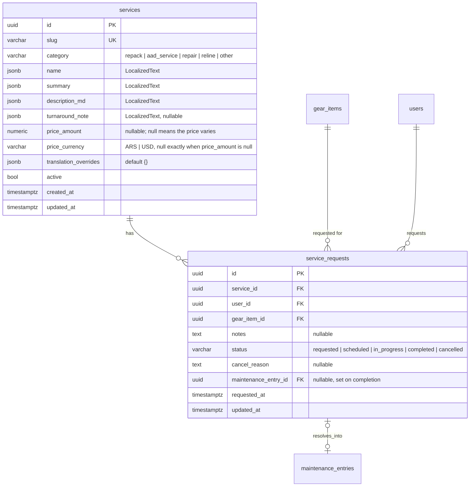
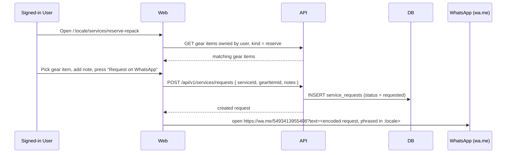
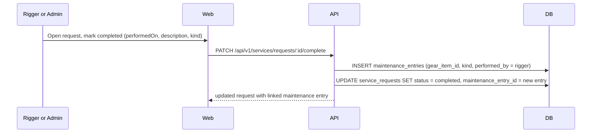

# Feature: Rigging services and requests

> Issue: none yet · Branch: `feat/rigging-services` (to be created) · ADR:
> [0003](../../docs/adr/0003-usd-pricing-derived-currencies-whatsapp-checkout.md),
> [0008](../../docs/adr/0008-service-requests-resolve-into-maintenance-entries.md) · Depends on:
> `product-catalog.md` (phase 1), `gear-tracking.md` (phase 2) · Briefing: Eca, 2026-09-17, extended 2026-09-18
> (peso pricing, admin-managed services, phased delivery)

## Problem Statement

Bendike sells gear, but Eca's main trade is the work he does with his hands: reserve repacks, sending an AAD in for
repair, battery exchange or manufacturer service, patchwork and relines. None of that is visible on bendike today —
a skydiver has to already know to ask on WhatsApp, with no price shown and no record beyond that chat. Because a
service is tied to a specific piece of gear a customer already owns, a request needs to know which gear it is for,
and once Eca does the work, that fact belongs in the same maintenance log `gear-tracking.md` already builds — not
typed a second time.

## Personas

| Persona  | Impact   | Notes                                                                           |
| -------- | -------- | ------------------------------------------------------------------------------- |
| Visitor  | Positive | Sees what Eca offers and what it costs before ever contacting him               |
| User     | Positive | Requests a service for gear they already track, with a record instead of a chat |
| Rigger   | Positive | Sees incoming requests and completing one logs the maintenance entry for free   |
| Dropzone | Neutral  | Sees the same public services page as everyone; no gear of their own to request |
| Admin    | Positive | Manages the services catalog and every request, same as a rigger                |

## Value Assessment

- **Primary value**: Commercial — repacks, AAD service, patchwork and relines are Eca's core paid work; a priced,
  discoverable services page turns an ad hoc WhatsApp question into a lead with a number attached.
- **Secondary value**: Efficiency — a request that already names the gear item and, on completion, writes the
  maintenance entry itself, replaces Eca describing the same job twice (once to the customer, once in the log).

## Delivery phases

Requests need `gear-tracking.md`'s `gear_items` and `maintenance_entries`, which are not built yet. Eca wants the
services section visible now, and to add services and change their copy and prices himself, so delivery is split
(decision of 2026-09-18):

- **Phase 1, public services section (Tasks 1 to 7 below)**: the services catalog in English, Spanish and
  Portuguese, prices, detail pages with an "Ask on WhatsApp" button that works for anyone, and an admin page where
  Eca adds services and edits copy and prices. No gear picker, no `service_requests` table.
- **Phase 2, requests (Tasks 8 to 13)**: requesting a service for a tracked gear item, request tracking, and
  completing a request into a maintenance entry. Starts once `gear-tracking.md` Tasks 1 to 5 and `rigger-workspace.md` Tasks 2 and 4 exist (a rigger completes a request into an entry only for gear of an owner they are linked to).

Prices are set in **Argentine pesos** for what Eca quotes today (sport rig reserve repack AR$55.000, tandem reserve
repack AR$90.000), so a service stores an amount and a currency (`ARS` or `USD`), both optional. A service with no
price shows "Price varies, ask on WhatsApp" (patchwork and AAD service, which depend on the job). This supersedes
the flat USD price in ADR 0008's first version.

## User Stories

### Story 1: Browse services

As a **Visitor**,
I want **to see the rigging services Eca offers, their price and what gear each one applies to**,
so that I can **decide what I need before contacting him**.

#### Acceptance Criteria

- The web app shall serve `/:locale/services` listing every active service with its name, summary and price.
- While a service has a price, the web app shall show it in the currency it was set in as the primary figure, with
  the other two of ARS, USD and BRL beneath as indicative figures derived from the stored exchange rates.
- While a service has no price, the web app shall show "Price varies, ask on WhatsApp" instead.
- The web app shall serve `/:locale/services/<slug>` with the full description, the price and the turnaround note
  when the service has one.
- When a visitor presses "Ask on WhatsApp" on a service, the web app shall open `https://wa.me/5493413955408` with a
  message in the visitor's current locale naming the service.
- While a visitor is not signed in, the service detail page shall show a "Sign in to request this service" prompt
  instead of the request form.

### Story 2: Request a service

As a **User**,
I want **to request a service for a specific piece of my tracked gear and reach Eca on WhatsApp with it prefilled**,
so that I can **ask without re-explaining what gear I have**.

#### Acceptance Criteria

- While signed in, the service detail page shall list only the visitor's own active gear items whose kind is in the
  service's applicable gear kinds.
- If the visitor has no matching gear item, then the page shall say so and link to adding gear in `/app/gear`
  instead of showing the request form.
- When the visitor picks a gear item, adds an optional note and presses "Request on WhatsApp", the API shall create
  a `service_requests` row with status `requested`, then the web app shall open `https://wa.me/5493413955408` with a
  message in the visitor's current locale naming the service, the gear item (kind, manufacturer, model), the price
  and the note.
- The API shall reject a request for a gear item the caller does not own with 403.

### Story 3: Track my requests

As a **User**,
I want **to see the status of every service I have requested**,
so that I can **know whether Eca has started without messaging him again**.

#### Acceptance Criteria

- The web app shall serve `/app/service-requests` listing the signed-in account's own requests, newest first, with
  the service name, the gear item, the status and, once completed, a link to the maintenance entry it created.
- The API shall only return an account's own requests to that account; admins and riggers see every request through
  the management endpoint in Story 4, not this one.

### Story 4: Manage and complete requests

As a **Rigger**,
I want **to see every incoming service request and, when I finish the work, record it once**,
so that I can **keep the customer's maintenance log accurate without a second data-entry pass**.

#### Acceptance Criteria

- The web app shall serve a service-request management view listing every request, filterable by status, for any
  rigger or admin account.
- When a rigger or admin moves a request to `scheduled`, `in_progress` or `cancelled` (with a reason), the API shall
  store the new status and, for `cancelled`, the reason.
- When a rigger or admin completes a request with a performed-on date, a description and a maintenance kind (default
  from the service's category), the API shall create a `maintenance_entries` row on the gear item (`performed_by`
  the caller) and set the request's status to `completed` and its `maintenance_entry_id` to the new entry.
- If a user or a dropzone calls a request-management endpoint, then the API shall respond 403.

### Story 5: Manage the services catalog

As an **Admin**,
I want **to create, edit and deactivate services with their price and applicable gear kinds**,
so that I can **add or retire an offering without a database console**.

#### Acceptance Criteria

- The API shall expose admin-only endpoints to create and update a service (name, summary, description, category,
  applicable gear kinds, turnaround note, price) in English, Spanish and Portuguese, and to deactivate it.
- If a user, rigger or dropzone calls an admin services endpoint, then the API shall respond 403.
- The API shall accept a service with no price, and a price only as an amount together with a currency (`ARS` or
  `USD`); an amount without a currency, or a currency without an amount, shall be rejected with 400.
- When an admin creates a service with English copy only, the API shall machine-translate the Spanish and Portuguese
  copy, the same way `product-catalog.md` does for products.
- The web app shall serve `/app/admin/services` to admins, listing every service (active or not) with controls to
  create one, edit its English, Spanish and Portuguese name, summary and description, its price and currency, its
  turnaround note, and to activate or deactivate it.
- When an admin edits one locale of a translatable field, the API shall record it in `translation_overrides` so a
  later re-seed does not overwrite it, the same rule `product-catalog.md` uses for products.
- The seed script shall create these active services, and running it twice shall change nothing: Reserve repack,
  sport rig (`repack`, AR$55.000), Reserve repack, tandem rig (`repack`, AR$90.000), AAD service: repair, battery
  exchange or manufacturer service (`aad_service`, no price), Patchwork (`repair`, no price) and Reline (`reline`, no
  price).

---

## Design

> Refer to `.github/copilot-instructions.md` for technical standards.

### Role Access

| Role     | Access                                                                               |
| -------- | ------------------------------------------------------------------------------------ |
| Visitor  | `GET /services/*`, `/:locale/services`, `/:locale/services/:slug`                    |
| User     | Same as Visitor, plus create and read their own `service_requests`                   |
| Rigger   | Same as User, plus read and update every `service_requests` row (status, completion) |
| Dropzone | Same as Visitor                                                                      |
| Admin    | Everything above plus every write endpoint under `/services` (catalog CRUD)          |

### Components Affected

- `packages/shared/src/services.ts` — `SERVICE_CATEGORIES`, `ServiceCategory`, `SERVICE_REQUEST_STATUSES`,
  `ServiceRequestStatus`, `ServiceSummary`, `ServiceDetail`, `ServiceRequestSummary`, request/response contracts.
  Uses `LocalizedText` from `product-catalog.md` Task 1 and `GearKind` from `gear-tracking.md` Task 1.
- `apps/api/src/services/` — `Service` and `ServiceRequest` entities, public controller, request controller
  (create, list own), management controller (rigger/admin), admin catalog controller, services, DTOs
- `apps/api/src/database/migrations/<next-timestamp>-CreateServices.ts`
- `apps/api/scripts/seed-services.ts`
- `apps/web/src/pages/services/` — `ServicesPage`, `ServiceDetailPage` (gear picker, WhatsApp request), specs
- `apps/web/src/pages/services/MyServiceRequestsPage.tsx` — `/app/service-requests`
- `apps/web/src/pages/services/ServiceRequestsAdminPage.tsx` — rigger/admin management view
- `apps/web/src/cart/whatsapp-message.ts` pattern reused as `apps/web/src/services/service-whatsapp-message.ts`
- `apps/web/src/components/site/site-content.ts`, `SiteNav.tsx` — Services nav link
- `apps/web/src/components/AppShell.tsx` — "My service requests" link; rigger/admin management link

### Dependencies

- `gear-tracking.md` Tasks 1, 2, 3, 4 (`GearKind`, `gear_items`, `MaintenanceKind`, `maintenance_entries`,
  the gear items API) — hard prerequisite, not yet built. `service_requests.gear_item_id` and the completion flow
  in Story 4 need these tables and the ownership rules they define.
- `product-catalog.md` Task 1 (`LocalizedText`), Task 3 (translation service, reused for service copy) and Task 8
  (web i18n scaffolding, the `:locale` route layout and switcher).
- `cart-and-whatsapp-checkout.md`'s WhatsApp message pattern and `WHATSAPP_NUMBER` constant.
- ADR 0008 for why price is flat (no markup) and why the request is server-persisted rather than WhatsApp-only.

### Data Model Changes

`gear_items` and `maintenance_entries` are defined in `gear-tracking.md` and are not changed by this spec; the only
new foreign keys live on `service_requests`. Phase 1 creates only `services` (without `applicable_gear_kinds`);
phase 2's migration adds `service_requests` and the `applicable_gear_kinds` column. Money is `numeric(12,2)`, matching `product-catalog.md`.

### Diagrams

### Open Questions

- [x] Prices: sport reserve repack AR$55.000 and tandem AR$90.000 (Eca, 2026-09-18); patchwork and AAD service vary.
- [ ] Should the peso price be re-confirmed before each price change, or does Eca edit it himself in the admin page
      (assumed: he edits it himself)?
- [ ] Turnaround note per service: fill in now or leave empty until Eca has real lead times.
- [ ] Whether a rigger sees every request or only ones assigned to them: only Eca exists as a rigger today, so v1
      gives every rigger and admin the full list; a rigger-customer relation is `gear-tracking.md`'s open question,
      not this spec's.
- [ ] Confirm which gear kinds apply to Patchwork: proposed `container`, `main`, `reserve` (fabric repair), not
      `aad`.

---

## Tasks

> Phase 1 (Tasks 1 to 7) ships the public services section. Phase 2 (Tasks 8 to 13) adds requests once
> `gear-tracking.md` exists. Each task is completable in one agent session.

### Task 1: Shared service contracts

**Objective**: Define service categories, price currencies and the catalog types once.

**Affected files**:

- `packages/shared/src/services.ts`, `services.spec.ts`, `index.ts`

**Requirements**: Story 1, Story 5

**Verification**:

- [x] `npm run test:unit -w @bendike/shared` passes
- [x] A helper turns a price amount and currency into USD, ARS and BRL figures using stored exchange rates, and
      returns nothing when the service has no price

**Done when**:

- [x] All verification steps pass

---

### Task 2: Service entity and migration

**Depends on**: Task 1

**Objective**: Persist services with localized copy, an optional price and currency, and `translation_overrides`.

**Affected files**:

- `apps/api/src/services/entities/service.entity.ts`
- `apps/api/src/database/migrations/<next-timestamp>-CreateServices.ts`, `data-source.ts`

**Verification**:

- [x] `npm run typecheck -w @bendike/api` passes
- [x] Migration applies and reverts cleanly against the docker Postgres
- [x] A row with an amount and no currency violates a check constraint

**Done when**:

- [x] All verification steps pass

---

### Task 3: Public services read endpoints

**Depends on**: Task 2

**Objective**: List active services and serve one by slug.

**Affected files**:

- `apps/api/src/services/services.controller.ts`, `services.service.ts`, `services.module.ts`, matching specs

**Requirements**: Story 1

**Verification**:

- [x] Inactive services never appear; unknown or inactive slug returns 404
- [x] Services are ordered by `position`, then slug

**Done when**:

- [x] All verification steps pass

---

### Task 4: Admin services endpoints

**Depends on**: Task 3, `product-catalog.md` Task 3 (translation service)

**Objective**: Let admins list every service, create one (with machine translation), edit its fields, edit one locale
of a copy field, and activate or deactivate it.

**Affected files**:

- `apps/api/src/services/services-admin.controller.ts`, `services-admin.service.ts`, DTOs, matching specs

**Requirements**: Story 5

**Verification**:

- [x] Every endpoint is behind `JwtAuthGuard` + `RolesGuard` with `@Roles(Role.Admin)`; user, rigger and dropzone
      get 403
- [x] An amount without a currency, or a currency without an amount, is rejected with 400
- [x] Editing `name.es` records `es: ["name"]` in `translation_overrides`
- [x] Creating a service asks the translation service for Spanish and Portuguese and keeps English when it returns
      nothing

**Done when**:

- [x] All verification steps pass

---

### Task 5: Seed script

**Depends on**: Task 2

**Objective**: Seed the five services Eca offers today, idempotently.

**Affected files**:

- `apps/api/scripts/seed-services.ts`, `apps/api/package.json` (scripts)

**Requirements**: Story 5

**Verification**:

- [x] Running the seed twice yields the same five rows; the two reserve repacks carry AR$55.000 and AR$90.000
- [x] The public endpoint lists all five

**Done when**:

- [x] All verification steps pass

---

### Task 6: Web: services list and detail

**Depends on**: Task 3, `product-catalog.md` Task 8 (web i18n scaffolding), Task 5 (exchange rates)

**Objective**: Build `/:locale/services` and `/:locale/services/:slug` with the price display and the "Ask on
WhatsApp" button, and a Services link in the site navigation.

**Affected files**:

- `apps/web/src/pages/services/ServicesPage.tsx`, `ServiceDetailPage.tsx`, `services-api.ts`,
  `service-whatsapp-message.ts`, `ServicePrice.tsx`, specs
- `apps/web/src/components/site/SiteNav.tsx`, `apps/web/src/i18n/locales/*.json`, `apps/web/src/App.tsx`

**Requirements**: Story 1

**Verification**:

- [x] A priced service shows its own currency first with the others beneath; an unpriced one shows "Price varies,
      ask on WhatsApp"
- [x] The WhatsApp link names the service in the current locale

**Done when**:

- [x] All verification steps pass

---

### Task 7: Web: admin services page

**Depends on**: Task 4

**Objective**: Build `/app/admin/services` so Eca can add services and edit their copy, price, currency, turnaround
note and active flag without touching the API.

**Affected files**:

- `apps/web/src/pages/services/ServicesAdminPage.tsx`, `ServiceForm.tsx`, `services-admin-api.ts`, specs
- `apps/web/src/App.tsx`, `apps/web/src/components/AppShell.tsx`

**Requirements**: Story 5

**Verification**:

- [x] Creating a service from the form adds it to the list; editing a Spanish description saves it
- [x] A user or dropzone account cannot reach the route (`RequireRole`)

**Done when**:

- [x] All verification steps pass

---

## Phase 2: requests (after `gear-tracking.md`)

### Task 8: ServiceRequest entity, gear kinds and migration

**Depends on**: Task 2, `gear-tracking.md` Task 2 (`gear_items` must exist)

**Objective**: Persist service requests and add `applicable_gear_kinds` to `services`.

**Affected files**:

- `apps/api/src/services/entities/service-request.entity.ts`, `service.entity.ts`
- `apps/api/src/database/migrations/<next-timestamp>-CreateServiceRequests.ts`, `data-source.ts`

**Verification**:

- [ ] `npm run typecheck -w @bendike/api` passes
- [ ] Migration applies and reverts cleanly against the docker Postgres, after `gear-tracking.md`'s migration

**Done when**:

- [ ] All verification steps pass

---

### Task 9: Service request creation

**Depends on**: Task 8, `gear-tracking.md` Task 3 (gear items API and ownership rules)

**Objective**: Let a signed-in user create a request for their own matching gear item.

**Affected files**:

- `apps/api/src/services/service-requests.controller.ts`, `service-requests.service.ts`, DTOs, matching specs

**Requirements**: Story 2, Story 3

**Verification**:

- [ ] Requesting for a gear item the caller does not own responds 403
- [ ] Requesting a gear kind not in the service's `applicable_gear_kinds` responds 400
- [ ] `GET` own requests returns only the caller's

**Done when**:

- [ ] All verification steps pass

---

### Task 10: Service request management and completion

**Depends on**: Task 9, `gear-tracking.md` Task 4 (maintenance entries API)

**Objective**: Let a rigger or admin transition a request's status and complete it into a maintenance entry.

**Affected files**:

- `apps/api/src/services/service-requests-admin.controller.ts`, DTOs, matching specs

**Requirements**: Story 4

**Verification**:

- [ ] User and dropzone accounts get 403 on every management endpoint
- [ ] Completing a request inserts exactly one `maintenance_entries` row and links `maintenance_entry_id`
- [ ] Cancelling a request stores the reason and never touches `maintenance_entries`

**Done when**:

- [ ] All verification steps pass

---

### Task 11: Web: request flow on the service page

**Depends on**: Task 6, Task 9

**Objective**: Add the gear picker and the request-then-WhatsApp flow to the service detail page.

**Affected files**:

- `apps/web/src/pages/services/ServiceDetailPage.tsx`, `service-whatsapp-message.ts`, specs

**Requirements**: Story 2

**Verification**:

- [ ] Signed-out visitor still sees "Ask on WhatsApp" plus a sign-in prompt for requests
- [ ] A user with no matching gear sees the "add gear first" link instead of the form
- [ ] Requesting opens WhatsApp with the service, gear item and price in the current locale

**Done when**:

- [ ] All verification steps pass

---

### Task 12: Web: my service requests

**Depends on**: Task 9

**Objective**: Build `/app/service-requests` for a signed-in user's own request history.

**Affected files**:

- `apps/web/src/pages/services/MyServiceRequestsPage.tsx`, `App.tsx`, `components/AppShell.tsx`

**Requirements**: Story 3

**Verification**:

- [ ] Only the signed-in account's requests appear; a completed request links to its maintenance entry

**Done when**:

- [ ] All verification steps pass

---

### Task 13: Web: rigger and admin request management

**Depends on**: Task 10

**Objective**: Build the management view listing every request with status filters and a completion form.

**Affected files**:

- `apps/web/src/pages/services/ServiceRequestsAdminPage.tsx`, `App.tsx`, `components/AppShell.tsx`

**Requirements**: Story 4

**Verification**:

- [ ] Completing a request from the form shows the new maintenance entry without a page reload
- [ ] A user or dropzone account cannot reach the route (`RequireRole`)

**Done when**:

- [ ] All verification steps pass

---

## Out of Scope

- Payment for services (person-to-person, same as the shop)
- Scheduling or calendar integration
- Splitting requests among multiple riggers (single pool for now)
- Dropzone-initiated requests for gear they do not own

## Future Considerations

- Rigger–customer assignment once `gear-tracking.md`'s rigger relation exists
- Turnaround estimates driven by actual backlog instead of a static note
- Notifying a user when their gear is due, with a one-tap request (ties into `notifications-inbox.md`)
