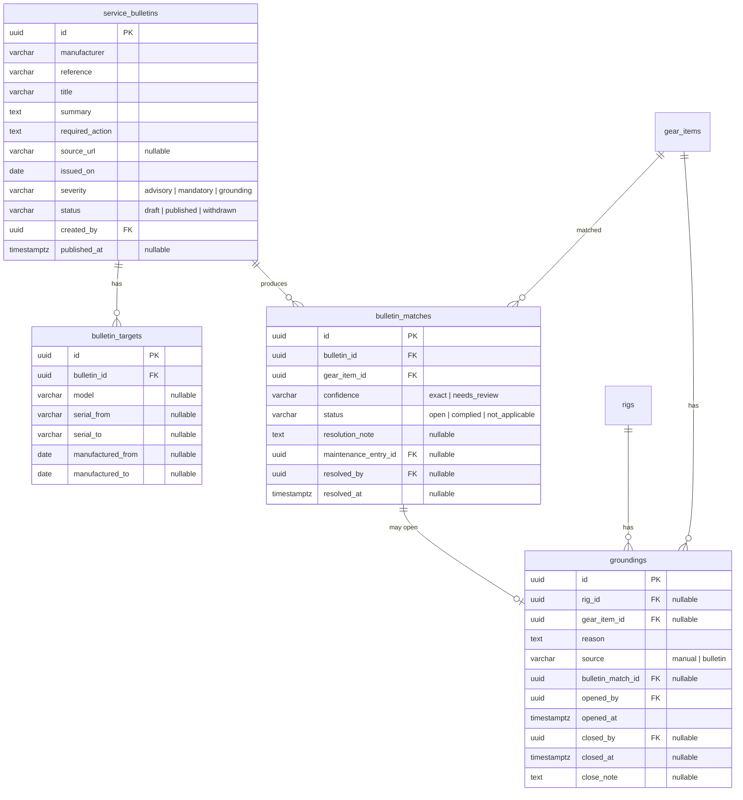
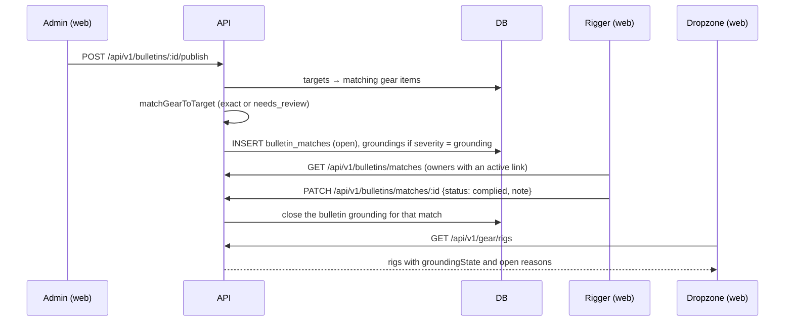
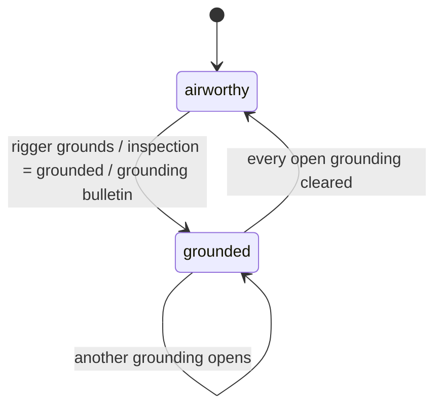

# Feature: Service bulletins and grounding

> Issue: none yet · Branch: `feat/service-bulletins-and-grounding` (to be created) · ADR: [0013](../../docs/adr/0013-grounding-is-an-auditable-record-and-service-bulletins-ground-through-matches.md), [0012](../../docs/adr/0012-riggers-reach-gear-through-confirmed-links-and-dropzones-own-fleets.md) · Depends on: [rigger-workspace.md](./rigger-workspace.md) Tasks 1 to 5 · Requested by Eca, 2026-09-19

## Problem Statement

Manufacturers publish service bulletins that apply to some models, some serial ranges or some manufacture dates. Today
a bulletin reaches a rigger by email or a forum post, and finding out which rigs it touches means searching a
notebook or a spreadsheet. When a rigger decides a rig is not fit to jump, the dropzone finds out by word of mouth.
Bendike should let Eca enter a bulletin once, find every component it applies to across the riggers' gear, let each
rigger review and resolve those matches, and let a rigger ground a rig until they give the green light, with the
dropzone and owner able to see the state and the reason.

## Personas

| Persona  | Impact   | Notes                                                                                       |
| -------- | -------- | ------------------------------------------------------------------------------------------- |
| Visitor  | Neutral  | Nothing visible                                                                             |
| User     | Positive | Sees that their rig is grounded and why, and when it is cleared; cannot clear it themselves |
| Rigger   | Positive | Sees which of their gear a bulletin affects, resolves each match and grounds or clears rigs |
| Dropzone | Positive | Sees, on every rig of its fleet, whether it is grounded, the reason and who decided         |
| Admin    | Positive | Enters and publishes bulletins once; can ground or clear on any rig                         |

## Value Assessment

- **Primary value**: Customer — safety: an affected component is found the day the bulletin is published, not
  when someone remembers.
- **Secondary value**: Efficiency — one entry by Eca replaces every rigger searching their own records.
- **Tertiary value**: Future — grounding and bulletin history are the audit trail a dropzone or an authority may ask
  for.

## User Stories

### Story 1: Publish a bulletin

As an **Admin**,
I want **to enter a manufacturer's bulletin once with what it applies to**,
so that I can **let Bendike find every affected component**.

#### Acceptance Criteria

- The API shall let only admins create, edit, publish and withdraw bulletins.
- A bulletin shall have a manufacturer, a reference, a title, a summary, a required action, an optional source
  link, an issue date and a severity: `advisory`, `mandatory` or `grounding`.
- A bulletin shall have one or more targets, each with an optional model, an optional serial range (from, to) and
  an optional manufacture-date range (from, to); a target with none of them applies to the whole manufacturer.
- When an admin publishes a bulletin, the API shall find every gear item that matches a target and create an
  `open` match for it.
- While a bulletin is a draft, the API shall create no matches and show it to admins only.
- When an admin withdraws a bulletin, the API shall keep it and its matches and stop showing it to riggers as
  open.

### Story 2: Matching that never guesses silently

As a **Rigger**,
I want **the matching to be exact where it can be and to flag what it cannot decide**,
so that I can **trust that nothing was missed and nothing was falsely accused**.

#### Acceptance Criteria

- The API shall compare the manufacturer and the model after normalising case, spaces and hyphens; it shall not
  match on similar names.
- When a target has a serial range and the component's serial and both range ends are digits only, the API shall
  compare them as numbers.
- If a serial range is present and the component's serial is empty or not digits only (for example
  `VR-360 007284`), then the API shall create the match with `confidence` `needs_review` instead of skipping it.
- If a manufacture-date range is present and the component has no date of manufacture, then the API shall create
  the match with `needs_review`.
- When a gear item is created or its manufacturer, model, serial or date of manufacture changes, the API shall
  match it against every published bulletin and create any missing matches.
- The API shall create at most one match per bulletin and gear item.

### Story 3: Review and resolve matches

As a **Rigger**,
I want **to see the matches on my owners' gear and resolve each one**,
so that I can **show the bulletin was handled for every affected component**.

#### Acceptance Criteria

- The web app shall serve `/app/work/bulletins` to riggers, listing published bulletins with the number of open
  matches in the rigger's scope, and, per bulletin, the matches with owner, rig, component and confidence.
- When a rigger resolves a match as `complied`, the API shall require a description or a linked maintenance entry
  and record who and when.
- When a rigger resolves a match as `not_applicable`, the API shall require a reason and record who and when.
- The API shall only show and accept matches on gear of owners with an active link to the rigger; anything else
  shall respond 404.
- The work queue and the digest shall count open matches and list them.

### Story 4: Ground a rig and give the green light

As a **Rigger**,
I want **to ground a rig, or one of its components, with a reason, and clear it when I am satisfied**,
so that I can **tell the dropzone and the owner not to jump it**.

#### Acceptance Criteria

- The API shall let a rigger with an active link to the owner, or an admin, open a grounding on a rig or a
  component with a reason.
- The API shall treat a rig as grounded while any open grounding exists on the rig or on any of its components, or
  while owner-reported work on it awaits verification (`gear-tracking.md`); the rig shall report every reason.
- When a rigger or admin clears a grounding, the API shall require a note and record who and when; it shall never
  delete a grounding.
- If a user or a dropzone tries to open or clear a grounding, then the API shall respond 403.
- When a bulletin with severity `grounding` is published, the API shall open a grounding on each matched rig with
  `source` `bulletin`, and the API shall close it only when its match is resolved.
- While a rig's latest non-void inspection result is `grounded` and no later `passed` inspection exists, the API
  shall report the rig as grounded with the inspection as the reason. The inspection log is the record; no separate
  grounding row is created, so recording a `passed` inspection is what releases it.
- The web app shall let a rigger ground a rig from a match, from the rig page and from the work queue in two taps,
  and clear it from the rig page.

### Story 5: What owners and dropzones see

As a **Dropzone** or **User**,
I want **a clear banner when a rig is grounded, with the reason, who decided and when**,
so that I can **keep it off the load until the rigger clears it**.

#### Acceptance Criteria

- The web app shall show a grounded rig with a dark "GROUNDED" badge, an icon and the word, distinct from the
  status colours, in the dashboard, the rig page and the fleet catalogue.
- The rig page shall list open groundings with reason, rigger, date and source, and closed ones as history.
- The web app shall state on the banner that grounding is advisory and that the rigger clears it.
- When a grounding opens or closes, the API shall notify the owner through the notification service where it
  exists (`service_bulletin` for bulletin groundings, `general` otherwise), and the digest shall include rigs
  grounded awaiting clearance.
- The API shall only show groundings to the owner, linked riggers and admins.

---

## Design

> Refer to `.github/copilot-instructions.md` for technical standards.

### Role Access

| Role     | Access                                                                                |
| -------- | ------------------------------------------------------------------------------------- |
| Visitor  | None                                                                                  |
| User     | Read groundings on their own rigs and notices about bulletins that match their gear   |
| Rigger   | Read matches in scope; resolve them; open and clear groundings on linked owners' gear |
| Dropzone | Read groundings and history on its own fleet                                          |
| Admin    | Create, edit, publish and withdraw bulletins; everything a rigger can do on any gear  |

### Components Affected

- `packages/shared/src/bulletins.ts` — `Severity`, `BulletinTarget`, `MatchConfidence`, pure
  `matchGearToTarget`, `normalizeName`, `Grounding` contracts
- `apps/api/src/bulletins/` — entities `ServiceBulletin`, `BulletinTarget`, `BulletinMatch`; service, admin
  controller, rigger controller, DTOs
- `apps/api/src/grounding/` — `Grounding` entity, service, controller; `groundingState` added to the gear read
  models
- `apps/api/src/gear/gear.service.ts` — call the matcher when a component is created or edited
- `apps/api/src/database/migrations/1758500000000-CreateBulletinsAndGroundings.ts`
- `apps/web/src/pages/admin/BulletinsPage.tsx`, `BulletinForm.tsx`
- `apps/web/src/pages/work/BulletinsPage.tsx`, `ResolveMatchDialog.tsx`, `GroundDialog.tsx`, `ClearGroundingDialog.tsx`
- `apps/web/src/pages/gear/GroundedBanner.tsx`, `StatusBadge.tsx` (grounded variant)

### Dependencies

- [rigger-workspace.md](./rigger-workspace.md) (links, `GearAccessService`, inspections)
- [repack-reminders.md](./repack-reminders.md) (digest sections for matches and grounded rigs)
- `notifications-inbox.md` for owner notices; without it the banner and history are the only signal

### Data Model Changes

Constraints: `UNIQUE (bulletin_id, gear_item_id)` on `bulletin_matches`; a grounding names a rig or a component,
never neither and never both; a grounding with `source = 'bulletin'` has a `bulletin_match_id`; nothing is deleted.

### Diagrams

### Open Questions

- [ ] Does a `mandatory` bulletin (not `grounding`) need a deadline, so that an unresolved match turns red after
      it? Phase 1: no deadline; open matches are listed and counted.
- [ ] Should a rigger be able to run an ad-hoc cross-reference (manufacturer, model, serial range) over their gear
      before Eca publishes a bulletin? Phase 1: no; Eca publishes, the matching does the rest.
- [ ] Where do bulletins come from in practice (manufacturer emails, sites)? Phase 1: Eca types them.
- [ ] Legal wording for the advisory banner: confirm with Eca.

---

## Tasks

### Task 1: Shared contracts and pure matching

**Objective**: Define severities, targets, confidence and groundings, and the pure `matchGearToTarget` with
normalisation and the numeric serial and date range rules.

**Affected files**:

- `packages/shared/src/bulletins.ts`, `bulletins.spec.ts`, `index.ts`

**Requirements**: Story 2

**Verification**:

- [x] Table-driven: `PD` equals `pd`; `VR-360` equals `vr 360`; serial 1500 is inside 1000-2000; `VR-360 007284` with
      a range is `needs_review`; a missing date of manufacture with a date range is `needs_review`; an unrelated
      manufacturer never matches; a target with no fields matches the manufacturer

**Done when**:

- [x] All verification steps pass

---

### Task 2: Entities and migration

**Depends on**: Task 1

**Objective**: Persist bulletins, targets, matches and groundings with the constraints above.

**Affected files**:

- `apps/api/src/bulletins/*.entity.ts`, `apps/api/src/grounding/grounding.entity.ts`, migration, `data-source.ts`

**Verification**:

- [x] Migration applies and reverts; a second match for one bulletin and item fails; a grounding with both a rig
      and a component, or neither, fails

**Done when**:

- [x] All verification steps pass

---

### Task 3: Bulletins admin API and match generation

**Depends on**: Task 2

**Objective**: Create, edit, publish and withdraw bulletins (admin only) and generate matches on publish.

**Affected files**:

- `apps/api/src/bulletins/bulletins.controller.ts`, `bulletins.service.ts`, DTOs, specs

**Requirements**: Story 1

**Verification**:

- [x] Rigger, user and dropzone get 403 on writes; a draft creates no matches; publishing creates one open match per
      affected component; withdrawing keeps the rows

**Done when**:

- [x] All verification steps pass

---

### Task 4: Re-match when gear changes

**Depends on**: Task 3

**Objective**: Run the matcher when a component is created or its identifying fields change.

**Affected files**:

- `apps/api/src/gear/gear.service.ts`, `apps/api/src/bulletins/bulletins.service.ts`, specs

**Requirements**: Story 2

**Verification**:

- [x] A component added after publication gets its match; editing a serial into range creates one; editing it out
      does not delete an existing match

**Done when**:

- [x] All verification steps pass

---

### Task 5: Groundings API and the derived state

**Depends on**: Task 2

**Objective**: Open and clear groundings with the role rules, derive `groundingState` on the gear read models, and
report a `grounded` inspection as a reason on the rig.

**Affected files**:

- `apps/api/src/grounding/*`, `apps/api/src/gear/gear.service.ts`, `maintenance.service.ts`, specs

**Requirements**: Story 4

**Verification**:

- [x] A rig is grounded while any open grounding exists on it or a component; user and dropzone get 403; clearing
      needs a note; a `grounded` inspection grounds the rig until a later `passed` one; a bulletin grounding cannot be cleared directly

**Done when**:

- [x] All verification steps pass

---

### Task 6: Matches API for riggers

**Depends on**: Tasks 3, 5

**Objective**: List and resolve matches in the rigger's scope, closing the bulletin grounding on resolution.

**Affected files**:

- `apps/api/src/bulletins/matches.controller.ts`, `matches.service.ts`, specs

**Requirements**: Story 3

**Verification**:

- [x] Matches on gear without an active link are 404; `complied` needs a note or an entry; `not_applicable` needs a
      reason; resolving closes the grounding

**Done when**:

- [x] All verification steps pass

---

### Task 7: Web: admin bulletins

**Depends on**: Task 3

**Objective**: The admin list and the form with targets and severity, the publish and withdraw actions.

**Affected files**:

- `apps/web/src/pages/admin/BulletinsPage.tsx`, `BulletinForm.tsx`, `App.tsx`, specs

**Requirements**: Story 1

**Verification**:

- [x] Only admins reach it; publishing shows how many components matched

**Done when**:

- [x] All verification steps pass

---

### Task 8: Web: rigger matches and grounding actions

**Depends on**: Tasks 5, 6

**Objective**: `/app/work/bulletins` with resolve dialogs, and the ground and clear dialogs from a match, the rig
page and the work queue.

**Affected files**:

- `apps/web/src/pages/work/*`, `pages/gear/RigPage.tsx`, specs

**Requirements**: Stories 3, 4

**Verification**:

- [x] Grounding from the work queue takes two taps; clearing needs a note; `needs_review` matches are visibly
      marked

**Done when**:

- [x] All verification steps pass

---

### Task 9: Web: what owners see, digest and notices

**Depends on**: Tasks 5, 8

**Objective**: The grounded badge and banner for owners and dropzones, open groundings and history on the rig page,
the grounded count on the work page, the digest sections and the owner notices.

**Affected files**:

- `apps/web/src/pages/gear/GroundedBanner.tsx`, `StatusBadge.tsx`, `apps/api/src/reminders/digest-builder.ts`,
  specs

**Requirements**: Story 5

**Verification**:

- [x] A dropzone sees the dark GROUNDED badge, the reason, the rigger and the date, and cannot clear it
- [x] The digest for the test rigger lists an open match and a grounded rig
- [x] Verified in a browser with the test rigger, dropzone and user accounts

**Done when**:

- [x] All verification steps pass

---

## Out of Scope

- Integrations that fetch bulletins from manufacturers
- Notifying manufacturers or authorities
- Enforcing grounding anywhere outside Bendike (manifest systems)
- Ad-hoc cross-reference tool for riggers

## Future Considerations

- A deadline on `mandatory` bulletins
- A public bulletin page for the community
- Manifest integration so a grounded rig cannot be assigned to a load
