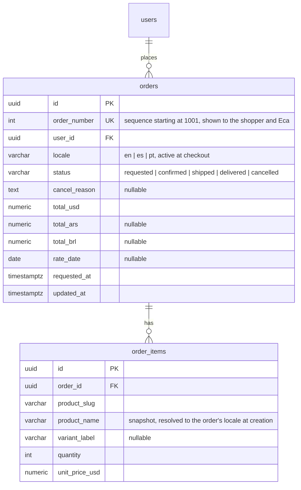
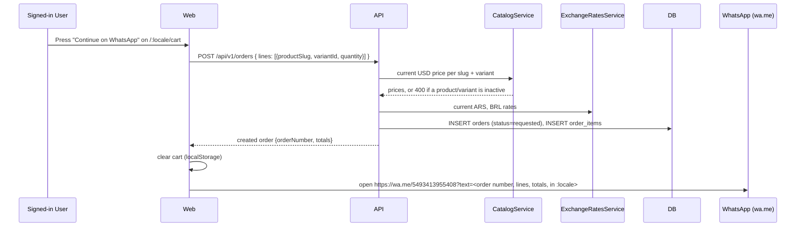
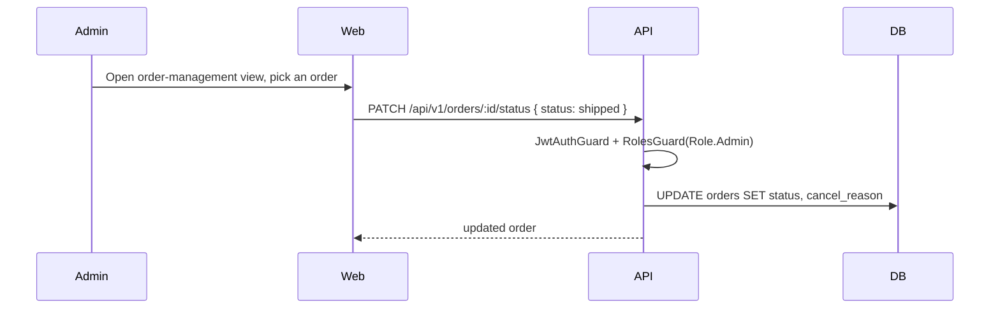

# Feature: Shop order tracking

> Issue: none yet · Branch: `feat/shop-order-tracking` (to be created) · ADR:
> [0010](../../docs/adr/0010-checkout-requires-sign-in.md) · Depends on: `cart-and-whatsapp-checkout.md`,
> `product-catalog.md` · Briefing: Eca, 2026-09-18, via a gap flagged in `user-profile-and-email-verification.md`

## Problem Statement

`cart-and-whatsapp-checkout.md` hands a cart to Eca over WhatsApp and persists nothing: not the order, not its
status, not a record either side can check later. A shopper who orders a rig has no way to see that it happened or
where it stands, and Eca has no list of what is outstanding beyond his WhatsApp inbox. This spec persists an order
the moment checkout is confirmed, gives it a status Eca updates by hand as he ships gear (no payment provider exists
to drive this automatically), and gives the shopper a page to see their own order status and history — the same
treatment `rigging-services.md` already gives service requests.

## Personas

| Persona  | Impact   | Notes                                                                                 |
| -------- | -------- | ------------------------------------------------------------------------------------- |
| Visitor  | Neutral  | Still browses and builds a cart freely; asked to sign in only at checkout             |
| User     | Positive | Sees every order they've placed and its status without messaging Eca                  |
| Rigger   | Neutral  | Same as User for their own purchases; no special access to others' orders             |
| Dropzone | Neutral  | Same as User                                                                          |
| Admin    | Positive | One list of every order instead of a WhatsApp inbox; moves orders through real status |

## Value Assessment

- **Primary value**: Commercial — an order that exists as a database row survives past a WhatsApp scrollback and
  gives Eca a queue instead of a chat he has to remember to check.
- **Secondary value**: Customer — a shopper who bought a $2,500 wingsuit can check where it stands without pinging
  Eca again, the same trust `rigging-services.md`'s tracking already builds for service work.

## User Stories

### Story 1: Checking out creates an order

As a **User**,
I want **pressing "Continue on WhatsApp" to create an order I can look up later**,
so that I can **have a record that doesn't depend on a WhatsApp thread staying intact**.

#### Acceptance Criteria

- When a signed-in user presses "Continue on WhatsApp" with a non-empty cart, the API shall create an order with
  status `requested` and one order item per cart line, pricing each line from the product's current USD price in
  the catalog looked up by slug and variant, not the price stored in the cart.
- If a cart line's product or variant is no longer active, then the API shall reject the whole order with 400
  naming the slug, and the web app shall flag that line on the cart page instead of opening WhatsApp.
- The API shall compute the order's USD total from the repriced lines and its ARS and BRL totals from the current
  exchange rates, storing the rate date used.
- When the order is created, the web app shall clear the cart and open `https://wa.me/5493413955408` with a
  message naming the order number, its lines and totals, phrased in the shopper's current locale.
- If order creation fails, then the web app shall leave the cart untouched, show an error, and not open WhatsApp.

### Story 2: Track my orders

As a **User**,
I want **to see the status of every order I've placed and my order history**,
so that I can **know where things stand without messaging Eca again**.

#### Acceptance Criteria

- The web app shall serve `/app/orders` listing the signed-in account's own orders, newest first, with the order
  number, item count, USD total and status.
- The web app shall serve `/app/orders/:id` with the full line items (product, variant, quantity, unit and line
  USD price), the USD/ARS/BRL totals with the rate date, the status, and the cancellation reason when cancelled.
- The API shall only return an account's own orders to that account; a request for another account's order shall
  respond 404.

### Story 3: Manage orders

As an **Admin**,
I want **to see every order and move it through its real status by hand**,
so that I can **keep the record honest about what's actually happening with a shipment**.

#### Acceptance Criteria

- The web app shall serve an order-management view listing every order, filterable by status, for admin accounts.
- When an admin moves an order to `confirmed`, `shipped`, `delivered` or `cancelled` (with a reason for
  cancellation), the API shall store the new status and, for `cancelled`, the reason.
- If a user, rigger or dropzone calls an order-management endpoint, then the API shall respond 403.

---

## Design

> Refer to `.github/copilot-instructions.md` for technical standards.

### Role Access

| Role     | Access                                                                              |
| -------- | ----------------------------------------------------------------------------------- |
| Visitor  | None (browses and carts per `cart-and-whatsapp-checkout.md`; must sign in to order) |
| User     | Create own order at checkout; read own orders and order detail                      |
| Rigger   | Same as User                                                                        |
| Dropzone | Same as User                                                                        |
| Admin    | Everything above, plus every order filterable by status, plus status transitions    |

### Components Affected

- `packages/shared/src/orders.ts` — `ORDER_STATUSES`, `OrderStatus`, `OrderSummary`, `OrderDetail`, `OrderItem`,
  `CreateOrderRequest`, `UpdateOrderStatusRequest`
- `apps/api/src/orders/` — `Order`, `OrderItem` entities; `OrdersService` (reprices against `CatalogService` and
  `ExchangeRatesService` in-process, no HTTP hop); `orders.controller.ts` (create, list own, read own);
  `orders-admin.controller.ts` (list all, filter, update status); DTOs
- `apps/api/src/database/migrations/<next-timestamp>-CreateOrders.ts`
- `apps/web/src/pages/cart/CartPage.tsx` — sign-in gate before checkout, calls order creation, clears the cart on
  success, opens WhatsApp with the order number
- `apps/web/src/cart/whatsapp-message.ts` — takes the created order's number and id
- `apps/web/src/pages/orders/` — `OrdersPage.tsx` (`/app/orders`), `OrderDetailPage.tsx` (`/app/orders/:id`),
  `OrdersAdminPage.tsx` (status management)
- `apps/web/src/pages/ProfilePage.tsx` — "My orders" panel
- `apps/web/src/components/AppShell.tsx` — "My orders" link; admin orders link

### Dependencies

- `cart-and-whatsapp-checkout.md` — this spec changes that page's checkout step (sign-in gate, cart cleared on
  success, order number in the WhatsApp message); see that spec's updated Story 2 and Task 4.
- `product-catalog.md` Task 3 (products and variants read model) and Task 5 (exchange rates) — repricing needs
  both; hard prerequisite.
- `user-profile-and-email-verification.md` Task 7 (`ProfilePage` exists) — for the profile panel task.
- [ADR 0010](../../docs/adr/0010-checkout-requires-sign-in.md) for why checkout now requires sign-in.

### Data Model Changes

Money is `numeric(12,2)`, matching `product-catalog.md`. `order_number` is a Postgres sequence, not the row's
`id`, because Eca reads it out on WhatsApp and a UUID is not something anyone reads aloud.

### Diagrams

### Open Questions

- [ ] Order numbering starting at 1001 is a placeholder; confirm Eca doesn't already have an invoice-numbering
      convention from before Bendike existed.
- [ ] Order confirmation and status-change emails: phase 1 has none; ties to
      `user-profile-and-email-verification.md`'s `EmailSender` once that exists.
- [ ] Shopper-initiated cancellation: phase 1 is admin-only, since Eca negotiates everything on WhatsApp anyway.

---

## Tasks

### Task 1: Shared order contracts

**Objective**: Define order statuses and the catalog/summary/detail types once.

**Context**: Every other task imports these; `OrderStatus` intentionally does not share a type with
`ServiceRequestStatus` (`rigging-services.md`) because shipping and service work have different lifecycles.

**Affected files**:

- `packages/shared/src/orders.ts`, `orders.spec.ts`, `index.ts`

**Requirements**: Story 1, Story 3

**Verification**:

- [ ] `npm run test:unit -w @bendike/shared` passes

**Done when**:

- [ ] All verification steps pass

---

### Task 2: Order and OrderItem entities and migration

**Depends on**: Task 1

**Objective**: Persist orders and their line items, with `order_number` generated by a database sequence.

**Affected files**:

- `apps/api/src/orders/entities/order.entity.ts`, `order-item.entity.ts`
- `apps/api/src/database/migrations/<next-timestamp>-CreateOrders.ts`, `data-source.ts`

**Verification**:

- [ ] `npm run typecheck -w @bendike/api` passes
- [ ] Migration applies and reverts cleanly against the docker Postgres
- [ ] Two orders created back to back get sequential, non-colliding `order_number` values

**Done when**:

- [ ] All verification steps pass

---

### Task 3: Order creation with server-side repricing

**Depends on**: Task 2, `product-catalog.md` Task 3 (catalog read model), Task 5 (exchange rates)

**Objective**: `POST /api/v1/orders` that reprices every line from the catalog and rejects inactive products.

**Affected files**:

- `apps/api/src/orders/orders.controller.ts`, `orders.service.ts`, DTOs, matching specs

**Requirements**: Story 1

**Verification**:

- [ ] A line priced by the client at $1 is stored at the catalog's real price, not $1
- [ ] A line for an inactive product responds 400 naming the slug; no order is created
- [ ] `totalUsd` equals the sum of repriced lines; `totalArs`/`totalBrl` use the current exchange rate and store
      `rateDate`
- [ ] An unauthenticated request responds 401

**Done when**:

- [ ] All verification steps pass

---

### Task 4: Own-order read endpoints

**Depends on**: Task 3

**Objective**: `GET /api/v1/orders` and `GET /api/v1/orders/:id`, scoped to the caller.

**Affected files**:

- `apps/api/src/orders/orders.controller.ts`, `orders.service.ts`, matching specs

**Requirements**: Story 2

**Verification**:

- [ ] `GET /orders` returns only the caller's orders, newest first
- [ ] `GET /orders/:id` for another account's order responds 404

**Done when**:

- [ ] All verification steps pass

---

### Task 5: Admin order management endpoints

**Depends on**: Task 2

**Objective**: List every order with a status filter and transition an order's status.

**Affected files**:

- `apps/api/src/orders/orders-admin.controller.ts`, DTOs, matching specs

**Requirements**: Story 3

**Verification**:

- [ ] Every endpoint is behind `JwtAuthGuard` + `RolesGuard` with `@Roles(Role.Admin)`; user, rigger and dropzone
      get 403
- [ ] Setting status to `cancelled` without a reason is 400; with a reason it stores it
- [ ] Filtering by `status=shipped` returns only orders in that status

**Done when**:

- [ ] All verification steps pass

---

### Task 6: Web: checkout creates and clears into an order

**Depends on**: Task 3, `cart-and-whatsapp-checkout.md` Tasks 1, 3, 4 (cart state, cart page, WhatsApp handoff)

**Objective**: Gate checkout behind sign-in, call order creation, clear the cart on success, and include the order
number in the WhatsApp message.

**Affected files**:

- `apps/web/src/pages/cart/CartPage.tsx`, `apps/web/src/cart/whatsapp-message.ts`, `apps/web/src/orders/orders-api.ts`,
  matching specs

**Requirements**: Story 1

**Verification**:

- [ ] A signed-out visitor pressing "Continue on WhatsApp" is sent to sign in and returned to `/cart`
- [ ] On success the cart is empty and WhatsApp opens with the order number in the message
- [ ] On a 400 from an inactive line, the cart is untouched, the line is flagged, and WhatsApp does not open

**Done when**:

- [ ] All verification steps pass

---

### Task 7: Web: order history and detail

**Depends on**: Task 4

**Objective**: Build `/app/orders` and `/app/orders/:id`.

**Affected files**:

- `apps/web/src/pages/orders/OrdersPage.tsx`, `OrderDetailPage.tsx`, `App.tsx`, `components/AppShell.tsx`

**Requirements**: Story 2

**Verification**:

- [ ] Only the signed-in account's orders appear; opening another account's order id shows a not-found state
- [ ] Status and cancellation reason (when present) are visible on the detail page

**Done when**:

- [ ] All verification steps pass

---

### Task 8: Web: admin order management

**Depends on**: Task 5

**Objective**: Build the admin view listing every order with a status filter and a status-change control.

**Affected files**:

- `apps/web/src/pages/orders/OrdersAdminPage.tsx`, `App.tsx`, `components/AppShell.tsx`

**Requirements**: Story 3

**Verification**:

- [ ] Changing status from the UI updates the row without a page reload
- [ ] A user or dropzone account cannot reach the route (`RequireRole`)

**Done when**:

- [ ] All verification steps pass

---

### Task 9: Web: order history panel on the profile page

**Depends on**: Task 7, `user-profile-and-email-verification.md` Task 7 (`ProfilePage` exists)

**Objective**: Add a "My orders" panel to `/app/profile`, matching the shape of that spec's "My rigs" and "My
service requests" panels.

**Affected files**:

- `apps/web/src/pages/ProfilePage.tsx`

**Requirements**: Story 2

**Verification**:

- [ ] An account with no orders sees an empty state and a link to `/:locale/shop`
- [ ] "See all" navigates to `/app/orders`

**Done when**:

- [ ] All verification steps pass

---

## Out of Scope

- Payment, invoices, refunds (unchanged from `cart-and-whatsapp-checkout.md`)
- Shopper-initiated cancellation
- Order confirmation or status-change emails
- Editing an order's lines after creation (cancel and re-order instead)

## Future Considerations

- Order confirmation and status-change emails once `user-profile-and-email-verification.md`'s `EmailSender` exists
- Shopper-initiated cancellation while status is still `requested`
- Sequential order numbers on packing slips or invoices if Eca wants paperwork beyond the app
