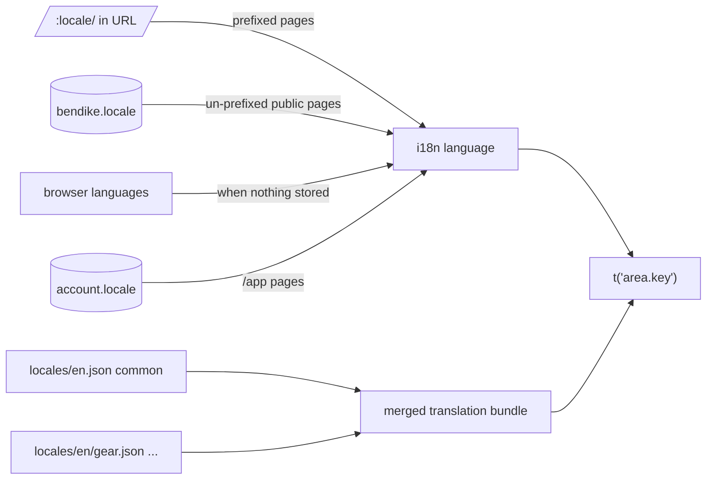
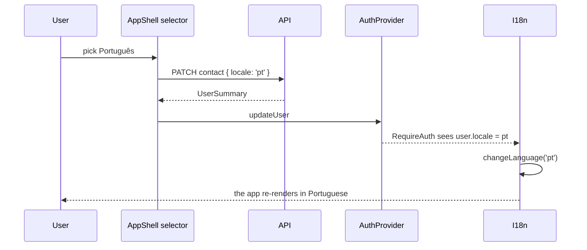

# Feature: Site-wide localisation

> Issue: none yet · Branch: `main` · ADR: [0020](../../docs/adr/0020-one-language-source-per-surface-and-per-area-translation-files.md) · Requested by Eca, 2026-09-29 · Builds on: [landing-page.md](./landing-page.md), [about-page-scroll-story.md](./about-page-scroll-story.md), [trilingual-copy-backfill.md](./trilingual-copy-backfill.md), [currency-selector.md](./currency-selector.md)

## Problem Statement

Bendike speaks three languages on the shop, the services, the Learn section, the landing page and the About story,
and English everywhere else: the login and sign-up forms, the cookie bar and policy, the not-found page's shell, and
the whole signed-in app (gear, rigs, work queue, library, packing sheets, bulletins, photos, profile, admin). A
skydiver from Rosario who registers in Spanish lands in an English dashboard, and a rigger who set Portuguese in
their profile still reads "Log repack". Eca asked for every view, every component, in the three languages.

## Personas

| Persona  | Impact   | Notes                                                                                        |
| -------- | -------- | -------------------------------------------------------------------------------------------- |
| Visitor  | Positive | Login, sign-up, cookie bar, cookie policy and 404 in the language of the page they came from |
| User     | Positive | The gear dashboard, rig pages and profile in the language set on the account                 |
| Rigger   | Positive | Work queue, customers, library, packing job and bulletins in their language                  |
| Dropzone | Positive | The fleet and its rigs in their language                                                     |
| Admin    | Positive | Admin screens too; Eca reads them in Spanish if he wants                                     |

## Value Assessment

- **Primary value**: Customer — the app is safety software for Argentine and Brazilian jumpers; instructions like
  "unverified work grounds the rig" must be read in the reader's own language.
- **Secondary value**: Market — the site stops looking half-translated the moment someone signs in.
- **Future**: one convention for every string, so the next feature is trilingual from its first commit.

## Glossary

- **Prefixed page**: a public page under `/:locale/` (shop, services, learn, about). Its language is the URL.
- **Un-prefixed public page**: `/`, `/login`, `/register`, `/cookies`, the 404 page. No locale in the URL.
- **App page**: anything under `/app/`, behind login.
- **Area file**: one translation file per area of the app and per language, for example
  `i18n/locales/es/gear.json`, holding the keys under one top-level namespace (`gear.*`).

## User Stories

### Story 1: One language per surface

As a **Visitor or User**,
I want **every page to pick its language the same way its neighbours do**,
so that I can **switch once and not be surprised**.

#### Acceptance Criteria

- Prefixed pages shall keep taking their language from the URL, as today.
- Un-prefixed public pages shall take their language from the stored choice (`bendike.locale`, a necessary item)
  or, failing that, the browser's languages, through the existing `detectLocaleFromEnvironment`.
- The navigation bar on un-prefixed public pages shall show the language selector; picking a language there shall
  store it and re-render the page in place, without navigating.
- App pages shall take their language from the account's `locale`; when a signed-in user loads any `/app` page, the
  interface language shall become the account language.
- The app bar shall show a language selector; picking a language there shall save it on the account (the existing
  contact update) and re-render the app in place. The profile page's language field shall stay in step.
- When a visitor registers or logs in, the account language shall not override the page language until they enter
  `/app`.

### Story 2: Every string translated

As a **User, Rigger, Dropzone or Admin**,
I want **every label, button, heading, empty state, error message written by the web app, dialog and table header
in my language**,
so that I can **use the app without English**.

#### Acceptance Criteria

- The web app shall render no English-only interface string on any page when the language is `es` or `pt`. Data
  entered by people (rig names, notes, manufacturer names, serials, product copy) is shown as entered.
- Fixed vocabularies (gear kinds, maintenance kinds, due kinds, bulletin severities and statuses, library document
  kinds, roles, Learn topics and formats) shall be translated through keyed maps, never through string literals in
  components.
- Dates the web app formats shall use the interface language (`Intl.DateTimeFormat(language)`) through one helper;
  numbers and money keep the currency formatting they already have.
- Messages the API returns (validation errors, "not found" texts) are shown as received and are out of scope here.
- Emails, the printable packing sheet and WhatsApp messages already have their own localisation and are unchanged.

### Story 3: Missing translations cannot ship

As an **Admin**,
I want **the build to fail when a language is missing a key**,
so that I can **never see English creep back in**.

#### Acceptance Criteria

- A unit test shall load every area file for `en`, `es` and `pt` and fail if any key exists in one language and not
  in the others, if any value is empty, or if two area files share a top-level namespace.
- The test shall also fail if a translation file contains a key that no source file references, so dead keys are
  removed with the code that used them.

---

## Design

> Refer to `.github/copilot-instructions.md` for technical standards.

### Role Access

| Role     | Access                                                   |
| -------- | -------------------------------------------------------- |
| Visitor  | Public pages in the stored or URL language               |
| User     | App in the account language, changeable from the app bar |
| Rigger   | Same                                                     |
| Dropzone | Same                                                     |
| Admin    | Same, including the admin screens                        |

### Components Affected

- `apps/web/src/i18n/i18n.ts` — loads `locales/{en,es,pt}.json` (the common file) plus one area file per language
  from `locales/<lng>/<area>.json` and merges them into the single `translation` namespace
- `apps/web/src/i18n/locales/<lng>/{auth,consent,app,gear,work,library,packing,bulletins,admin}.json` — new area files
- `apps/web/src/i18n/locales.spec.ts` — the parity and dead-key test
- `apps/web/src/i18n/format-date.ts` — `formatDate(value, language, options)`
- `apps/web/src/auth/RequireAuth.tsx` — switches the interface language to the account language once the user is loaded
- `apps/web/src/components/AppShell.tsx` — translated labels and the account language selector
- `apps/web/src/components/site/LocaleSwitcher.tsx`, `SiteNav.tsx` — the selector works on un-prefixed pages (store and
  re-render) and the nav's own buttons are translated
- `apps/web/src/pages/LoginPage.tsx`, `RegisterPage.tsx`, `auth/GoogleSignInSection.tsx` — `auth.*`
- `apps/web/src/consent/CookieBanner.tsx`, `CookieSettingsDialog.tsx`, `CookiePolicyPage.tsx` — `consent.*`, including
  the storage inventory's purposes and durations
- `apps/web/src/pages/DashboardPage.tsx`, `ProfilePage.tsx`, `AdminUsersPage.tsx` — `app.*`
- `apps/web/src/pages/gear/**`, `pages/history/**`, `pages/rigphotos/**` — `gear.*`
- `apps/web/src/pages/work/**`, `pages/links/**` — `work.*`
- `apps/web/src/pages/library/**` — `library.*`
- `apps/web/src/pages/packing/**` — `packing.*` (the checklist wording stays in the shared package where it lives)
- `apps/web/src/pages/bulletins/**` — `bulletins.*`
- `apps/web/src/pages/usedgear/**`, `pages/services/Services*Dialog.tsx`, `ServicesAdminPage.tsx`,
  `pages/learn/LearnAdminPage.tsx`, `LearnItemDialogs.tsx`, `LearnCollectionsPanel.tsx`, `learn-labels.ts` — `admin.*`

### Conventions for every area

- Components call `useTranslation()` and `t('area.section.key')`. No `getFixedT` outside the nav and the 404 page,
  which have no locale context of their own.
- Keys are English-readable and stable (`gear.rig.logRepack`), never the English sentence itself.
- Vocabulary maps become key maps: `KIND_LABEL_KEYS: Record<GearKind, string>` holding keys, rendered with `t()`.
- Interpolation for counts and names: `t('gear.rig.components', { count })` with `_one`/`_other` plurals where the
  three languages need them.
- Spanish is the Argentine register the site already uses (`vos`: "Intentá de nuevo", "Elegí"); Portuguese is
  Brazilian. The terminology follows `apps/api/src/translation/glossary.ts` (repack = plegado / dobragem,
  rig = equipo / equipamento, canopy = velamen / velame, reserve = reserva).
- Tests keep asserting English: the test i18n instance starts in `en`, so existing expectations stay valid. Tests
  that assert Spanish or Portuguese call `i18n.changeLanguage` first.

### Dependencies

- `i18next` and `react-i18next`, already installed.
- The account `locale` field and the contact update endpoint, already there.

### Data Model Changes

None.

### Diagrams

### Open Questions

- [ ] Should the app bar language change also store `bendike.locale`, so the public pages follow the account after
      logout? Default yes: the two stay in step.
- [ ] The checklist items of the packing sheet are bilingual (es/en) in the shared package by design of the paper
      form; a Portuguese column is a separate decision with Eca's rigging authority wording.
- [ ] Whether admin screens deserve the same care as user screens or may keep terse English labels. Default: same
      care; Eca reads them in Spanish.

---

## Tasks

### Task 1: Plumbing

**Objective**: Area files, merged bundle, parity test, date helper, language per surface.

**Affected files**: `i18n/i18n.ts`, `i18n/locales.spec.ts`, `i18n/format-date.ts`, `i18n/locales/<lng>/*.json`,
`auth/RequireAuth.tsx`, `components/site/LocaleSwitcher.tsx`, `components/site/SiteNav.tsx`

**Verification**:

- [ ] `locales.spec.ts` fails when a key is removed from one language and passes when all three match
- [ ] Rendering an `/app` route with a user whose locale is `pt` switches `i18n.language` to `pt`
- [ ] The selector on `/login` stores the locale and re-renders without navigating

**Done when**:

- [ ] All verification steps pass

---

### Task 2: Public un-prefixed pages and the app shell

**Depends on**: Task 1

**Objective**: `auth.*`, `consent.*`, `app.*` for login, sign-up, Google section, cookie bar, settings dialog, cookie
policy (including the inventory rows), app bar with language selector, dashboard, profile, admin users.

**Verification**:

- [ ] Existing specs pass unchanged in English; new assertions render `/login` and the cookie bar in Spanish
- [ ] `npm run test:unit -w @bendike/web` passes

**Done when**:

- [ ] All verification steps pass

---

### Task 3: Gear, history and photos

**Depends on**: Task 1

**Objective**: `gear.*` for every file under `pages/gear`, `pages/history`, `pages/rigphotos`, including the kind,
entry, due-date and status label maps.

**Verification**:

- [ ] No string literal rendered to the user remains in those folders (reviewed with a grep for JSX text and
      `label=`/`placeholder=`/`helperText=`/`aria-label=` literals)
- [ ] The gear specs pass; one new assertion renders the gear page in Portuguese

**Done when**:

- [ ] All verification steps pass

---

### Task 4: Work, links, library, packing, bulletins

**Depends on**: Task 1

**Objective**: `work.*`, `library.*`, `packing.*`, `bulletins.*` for the rigger surfaces.

**Verification**:

- [ ] Same grep review; the packing job page keeps the bilingual checklist untouched
- [ ] Those specs pass

**Done when**:

- [ ] All verification steps pass

---

### Task 5: Admin screens

**Depends on**: Task 1

**Objective**: `admin.*` for used gear, services admin, Learn admin and the Learn label maps.

**Verification**:

- [ ] Same grep review; admin specs pass

**Done when**:

- [ ] All verification steps pass

---

### Task 6: Close out

**Depends on**: Tasks 2 to 5

**Objective**: `npm run validate` green, README updated, this spec ticked.

**Verification**:

- [ ] `npm run validate` passes
- [ ] README's "Who is behind it" and role table mention that the whole site and app are in the three languages

**Done when**:

- [ ] All verification steps pass

---

## Out of Scope

- Translating API error messages and Swagger.
- A fourth language.
- Translating people's data (rig names, notes, serials).
- A Portuguese column on the packing checklist.

## Future Considerations

- Per-field machine translation suggestions for admins, reusing the DeepL port.
- Moving `/login`, `/register` and `/cookies` under `/:locale/` if search engines ever matter for them.
