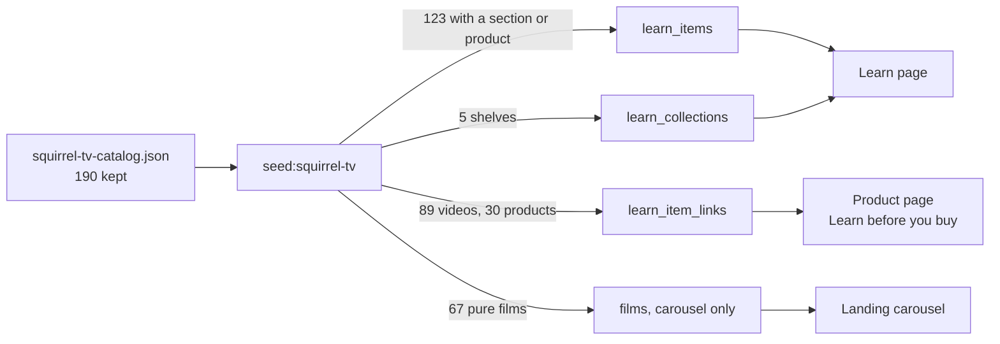

# Feature: Squirrel TV library

> Issue: none yet · Branch: `main` · Requested by Eca, 2026-09-25 · Builds on:
> [education-and-media.md](./education-and-media.md), [product-catalog.md](./product-catalog.md),
> [landing-page.md](./landing-page.md)

## Problem Statement

Squirrel publishes 260 videos on YouTube that explain the gear we sell — how to pack it, how to fly it, what each
suit is for — and none of it reaches our customers. A rigger deciding between an Aura 6 and a Corvid 3 has to leave
our shop and go hunting on a manufacturer's channel. Eca has triaged all 260 by hand: 70 dropped, 72 assigned to a
Learn section, 89 attached to specific products, 94 marked as promotional footage. The decisions exist as data; the
site does not use them.

## Personas

| Persona  | Impact   | Notes                                                                                        |
| -------- | -------- | -------------------------------------------------------------------------------------------- |
| Visitor  | Positive | Sees the manufacturer's own explanation on the product page before deciding to buy.          |
| User     | Positive | Finds packing and technique material grouped by subject on the Learn page.                   |
| Rigger   | Positive | Packing & rigging shelf collects the pro-pack, flat-pack and brake-stow videos in one place. |
| Dropzone | Neutral  | No change.                                                                                   |
| Admin    | Positive | Can edit or retire any imported item through the existing Learn admin page.                  |

## Value Assessment

- **Primary value**: Commercial — 30 products gain the manufacturer's own video on the page where the buying
  decision happens. Wingsuits carry the most: Freak 6 and Corvid 3 get 20 videos each, Aura 6 gets 19.
- **Secondary value**: Market — 67 brand films give the landing page motion it currently lacks, at no production cost.
- **Secondary value**: Efficiency — the triage is already done and stored; a seed turns it into rows without anyone
  re-deciding 260 times.

## Glossary

- **Triage file** — `apps/api/scripts/squirrel-tv-catalog.json`, 190 kept videos with a Learn section, a promo flag
  and the product slugs each one attaches to. Produced from Eca's pass over all 260; the source of truth for this work.
- **Pure film** — a video marked promo that names no product: a season reel, a trip film, a single notable jump.

---

## User Stories

### Story 1: The manufacturer explains it on the product page

As a **Visitor**,
I want **to watch Squirrel's own videos about a suit on that suit's page**,
so that I can **judge it without leaving the shop for YouTube**.

#### Acceptance Criteria

- When a visitor opens a product page for a product with linked items, the web app shall show the existing "Learn
  before you buy" section listing them in curated order.
- The seed shall link each video in the triage file to every product named in its `products` array, as a
  `learn_item_links` row with `target_kind` `product`.
- If a product slug in the triage file matches no product in the catalogue, then the seed shall skip that link, report
  the slug on stdout, and continue with the rest.

### Story 2: Shelves on the Learn page

As a **User**,
I want **the Learn page grouped into the sections Eca sorted the videos into**,
so that I can **go straight to packing, or technique, or reviews**.

#### Acceptance Criteria

- The system shall offer the topics `packing`, `reviews` and `wingsuit_base` in addition to the existing eleven.
- The seed shall create one active collection per Learn section — Technique & safety, Packing & rigging, Gear
  knowledge, Before you buy, Reviews — each holding its videos in duration order, longest first.
- When a visitor opens the Learn page, the web app shall show those collections alongside the existing ones.
- Each imported item shall carry `format` `video`, `source_name` "Squirrel TV", `embed_provider` `youtube`, the video
  id as `embed_id`, the `i.ytimg.com` thumbnail, and its duration rounded up to whole minutes.

### Story 3: Films on the landing page

As a **Visitor**,
I want **to see Squirrel footage moving on the landing page**,
so that I can **tell at a glance what this shop is about**.

#### Acceptance Criteria

- The web app shall show a carousel of pure films on the landing page, following the existing `BrandCarousel` pattern.
- While the visitor has not accepted third-party consent, the carousel shall show thumbnails and titles only and shall
  render no `<iframe>`, matching `EmbedPlayer`.
- When the landing page loads, the carousel shall pick its films in a shuffled order so repeat visitors do not see the
  same three first.
- The carousel shall not auto-advance. Revised 2026-09-25 from "shall not auto-advance under reduced motion":
  each card carries a title and a caption, and text that slides away while it is being read fights the reader.
  `BrandCarousel` can marquee because a logo carries no words. Horizontal scroll with snap points instead.
- If the films endpoint returns nothing or fails, then the carousel shall not render.
- The carousel shall show at most 18 of the films, so nobody is asked to scroll past sixty-seven cards.

### Story 4: Our words, not theirs

As an **Admin**,
I want **each video to carry a summary we wrote**,
so that **the shop reads as ours and not as a mirror of a supplier's marketing**.

#### Acceptance Criteria

- The seed shall write a Bendike-authored summary for every item and shall not copy Squirrel's YouTube description
  into `summary`.
- If a video has no Bendike summary in the seed data, then the seed shall fail with the video's title rather than
  import it with an empty or borrowed summary.

---

## Design

> Refer to `.github/copilot-instructions.md` for technical standards.

### Role Access

| Role     | Access                                                                  |
| -------- | ----------------------------------------------------------------------- |
| Visitor  | Read: product sections, Learn collections, landing carousel.            |
| User     | Read, same as Visitor.                                                  |
| Rigger   | Read, same as Visitor.                                                  |
| Dropzone | Read, same as Visitor.                                                  |
| Admin    | Read plus edit and retire every imported item via the Learn admin page. |

### Components Affected

- `packages/shared/src/learn.ts` — three new entries in `LEARN_TOPICS`. No migration: `topics` is `text[]` and
  `learn_collections.topic` is `varchar(40)`, so neither is a database enum.
- `apps/api/scripts/seed-squirrel-tv.ts` — new, idempotent, reads the triage file and upserts items, links and
  collections by slug. Follows `seed-learn.ts`.
- `apps/api/scripts/squirrel-tv-summaries.json` — new, one Bendike-written line per imported video.
- `apps/api/src/learn/learn.controller.ts`, `learn.service.ts` — a films endpoint for the carousel.
- `apps/web/src/pages/landing/FilmCarousel.tsx` — new, sibling of `BrandCarousel`.
- `apps/web/src/pages/landing/LandingPage.tsx` — mounts the carousel.
- `apps/api/package.json` — `seed:squirrel-tv` script.

### Dependencies

- The triage file, already committed.
- YouTube thumbnails from `i.ytimg.com`, hot-linked. Decided 2026-09-25: Google-served, no key, no quota, and the
  videos embed from YouTube anyway — mirroring them to S3 would buy nothing. This is the opposite call from the
  product images, which were mirrored because Squirrel is a supplier who could cut us off.

### Data Model Changes

None. `learn_items`, `learn_item_links`, `learn_collections` and `learn_collection_items` all exist from
[education-and-media.md](./education-and-media.md) and already carry every field this needs.

What the triage file's fields become:

| Triage field   | Becomes                                                      |
| -------------- | ------------------------------------------------------------ |
| `learnSection` | membership of the matching collection                        |
| `products`     | one `learn_item_links` row each, `target_kind` `product`     |
| `promo`        | not stored; decides whether a pure film reaches the carousel |
| `seconds`      | `duration_minutes`, rounded up                               |
| `thumbnail`    | `thumbnail_url`                                              |
| `id`           | `embed_id`, and the `slug` as `sqtv-<id>`                    |

What gets imported, from the 190 kept videos:

| Group                                      |                        Count | Where it lands                         |
| ------------------------------------------ | ---------------------------: | -------------------------------------- |
| Has a Learn section, a product, or both    |                          123 | `learn_items`                          |
| Pure films (promo, no product, no section) |                           67 | landing carousel only, not Learn items |
| Product links                              | 89 videos across 30 products | `learn_item_links`                     |

### Diagrams

### Open Questions

- [x] Settled 2026-09-25: a film is a learn item with `format: 'film'`. Format is the axis that says what a thing
      is, so a season reel being a different format from a tutorial is simply true, and `format` is a `varchar(20)`,
      not a database enum, so it costs no migration. It keeps films editable in the existing admin page, which a
      static list would not. `LEARN_BROWSABLE_FORMATS` is the list the Learn page filters and browses by — everything
      except `film` — so the format never appears as a dropdown option or a valid `?type=` value.
- [ ] Whether the Reviews shelf should name the reviewer in the card. Eca has not said; the titles already carry the
      name ("A6 Alpinist: Dan Darby Review") so the default is no extra field.
- [ ] Spanish and Portuguese. Every product in production currently has `es == en == pt` because DeepL is not
      configured there, so imported summaries will be English in all three locales too. Tracked separately; this spec
      does not fix it, and Task 1 should not pretend otherwise.

---

## Tasks

> Each task should be completable in a single coding agent session.
> Tasks are sequenced by dependency. Complete in order unless noted.

### Task 1: Topics and the summaries file

- [x] Add `packing`, `reviews` and `wingsuit_base` to `LEARN_TOPICS` in `packages/shared/src/learn.ts`
- [x] Write `apps/api/scripts/squirrel-tv-summaries.json`: one Bendike-authored line for each of the 123 videos that
      become items, keyed by video id. Written from the video, not copied from Squirrel's description.
- [x] Verify `npm run test:unit -w @bendike/shared` and `npm run typecheck` pass
- [x] Verify the label maps in `apps/web/src/pages/learn/learn-labels.ts` cover the three new topics
- [x] `npm run lint` and `npm run test:unit -w @bendike/web` pass (555 tests)
- [x] Summaries live under a `summaries` key, not at the top level: three YouTube ids in this set begin with `_`,
      so a sibling `_README` key would have been indistinguishable from a video

### Task 2: The seed

- [x] Add `apps/api/scripts/seed-squirrel-tv.ts` and the `seed:squirrel-tv` npm script
- [x] Upsert items by slug `sqtv-<id>`; upsert the five collections; replace each item's links and collection memberships
- [x] Skip and report product slugs that match nothing; fail loudly on a missing summary
- [x] Verify running it twice leaves the same row counts — 123 items, 204 links, 72 memberships, stable across runs
- [x] Verify `GET /api/v1/learn/for-product/<id>` returns a product's videos — checked against a local database on
      `hayduke-2` (14) and `corvid-3` (20). Aura 6 is not in the local catalogue, so the count could not be checked
      there; the seed reports the unmatched slug rather than failing, which is how that was noticed.
- [x] `link.position` is numbered per product, not per video. The service sorts a product's videos by it, so it
      describes the pairing; numbering by the order a video lists its products put a 47-second clip above a
      five-minute explainer on the Hayduke page.
- [x] `npm run lint`, `npm run typecheck` and `npm run test:unit -w @bendike/api` (648 tests) pass

### Task 3: Films endpoint

- [x] `film` added to `LEARN_FORMATS`; `LEARN_BROWSABLE_FORMATS` is everything the Learn page browses
- [x] `GET /api/v1/learn/films` serves them; `search()` and `related()` exclude them
- [x] The seed gives a video with no section and no product `format: 'film'` — 67 of them
- [x] `parseLearnQuery` validates `?type=` against the browsable list, so the URL cannot ask for a film on a page
      that never returns one. An existing test caught this: it had used `type=film` as its example of a bogus value.
- [x] Service tests: films kept off search, off related, and an inactive film kept out of the carousel
- [x] Verified against a real database — `/learn/films` returns 67, `/learn/items` returns 123 with no film among
      them, `/learn/items?type=film` returns 0

### Task 4: Landing carousel

- [x] Add `FilmCarousel.tsx` and mount it in `LandingPage.tsx`, between the audiences and about sections
- [x] Shuffled per load, capped at 18, absent when the endpoint is empty or fails
- [x] No `<iframe>` at all, so the consent gate has nothing to hold back — cards are a thumbnail and a caption that
      open YouTube in a new tab. Thumbnails before consent match what `EmbedPlayer` already does.
- [x] Copy lives in `landing-content.ts`, not i18n: the landing page is not internationalised yet, and `BrandCarousel`
      does the same
- [x] Tests: cards link out, no iframe, empty state, fetch failure, the 18 cap
- [x] `npm run lint`, `npm run typecheck`, 560 web tests and 651 api tests pass
- [ ] Update the README "What you can do today" with the Squirrel TV library
- [ ] Run `seed:squirrel-tv` on the instance

---

## Out of Scope

- Translating the imported copy. The whole catalogue has this problem, not just these items.
- Mirroring YouTube thumbnails to S3. Decided against; see Dependencies.
- The 70 dropped videos. They stay dropped; the triage file does not carry them.
- A dedicated `/films` page. Considered and deferred 2026-09-25 in favour of the carousel.

## Future Considerations

- Spotify shows already have a home in this model (`embed_provider` `spotify`); the same seed shape would carry them.
- If Squirrel publishes new videos, re-running the scrape and the triage tool extends the file rather than replacing it.
