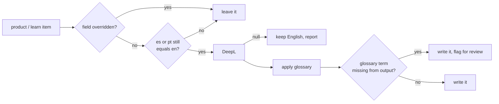

# Feature: Trilingual copy backfill

> Issue: none yet · Branch: `main` · Requested by Eca, 2026-09-25 · Builds on:
> [product-catalog.md](./product-catalog.md), [education-and-media.md](./education-and-media.md),
> [squirrel-tv-library.md](./squirrel-tv-library.md)

## Problem Statement

The shop advertises itself in three languages and serves one. Every product in production has
`es == pt == en`, and so does every one of the 190 Squirrel TV items: `DEEPL_API_KEY` is empty on the
instance, `HttpDeepLClient.translate` returns `null` without a key, `translateOrNull` swallows that, and
the importer quietly falls back to English. A visitor who switches to Español gets an English shop with
Spanish chrome, which reads worse than not offering the language at all.

## Personas

| Persona  | Impact   | Notes                                                                                |
| -------- | -------- | ------------------------------------------------------------------------------------ |
| Visitor  | Positive | An Argentine or Brazilian jumper reads the gear description in their own language.   |
| User     | Positive | Same.                                                                                |
| Rigger   | Positive | Packing and rigging material in Spanish is the point of a loft in Argentina.         |
| Dropzone | Neutral  | No change.                                                                           |
| Admin    | Neutral  | Overrides already exist; this fills the gaps rather than changing how editing works. |

## Value Assessment

- **Primary value**: Market — Argentina and Brazil are the home market, and the shop currently reads as a
  US import. The locale switcher already exists and promises something it does not deliver.
- **Secondary value**: Customer — a rigger deciding on a reserve should not have to parse English to do it.

## Glossary

- **Override** — a field an admin has edited by hand in one locale. Recorded in `translation_overrides` and
  never overwritten by a machine pass.
- **Glossary term** — a word machine translation reliably gets wrong in this domain, with the reading a
  jumper would actually use.

## User Stories

### Story 1: The shop speaks Spanish and Portuguese

As a **Visitor**,
I want **product and learning copy in the language I chose**,
so that I can **judge gear without translating it in my head**.

#### Acceptance Criteria

- The backfill shall fill `es` and `pt` for every product and learn item whose value still equals the
  English one.
- Where a field is listed in that record's `translation_overrides`, the backfill shall leave it untouched.
- If DeepL returns nothing for a field, then the backfill shall leave that field's English in place,
  report the record, and continue.
- The backfill shall be re-runnable and shall not re-translate a field it has already filled.

### Story 2: The gear vocabulary survives the machine

As a **Rigger**,
I want **the Spanish and Portuguese to use the words jumpers use**,
so that I can **trust the shop was written by someone who packs**.

#### Acceptance Criteria

- The system shall hold a glossary of skydiving and BASE terms with their Spanish and Portuguese readings.
- After translating a field, the backfill shall apply the glossary to the result, replacing machine
  readings with the glossary's.
- The glossary shall preserve terms the sport leaves in English (`slider`, `pro pack`, `pull-up cord`)
  rather than translating them into something nobody says.
- If a glossary term appears in the English but its translation appears nowhere in the output, then the
  backfill shall report that field for review rather than fail.

## Design

> Refer to `.github/copilot-instructions.md` for technical standards.

### Role Access

| Role     | Access                                             |
| -------- | -------------------------------------------------- |
| Visitor  | Reads the translated copy; no new surface.         |
| User     | Same.                                              |
| Rigger   | Same.                                              |
| Dropzone | Same.                                              |
| Admin    | Unchanged: per-locale editing and overrides exist. |

### Components Affected

- `apps/api/src/translation/glossary.ts` — new. Terms and their `es` / `pt` readings.
- `apps/api/scripts/backfill-translations.ts` — new. Walks products, learn items and learn collections.
- `apps/api/package.json` — `translate:backfill`.
- The instance's `.env` — `DEEPL_API_KEY` needs a value. It is currently `DEEPL_API_KEY=`, which is why
  nothing has ever been translated.

### Dependencies

- A DeepL API key. Free tier is 500,000 characters a month. Measured by the dry run against a local
  database: **306 fields, 124,396 characters** across both locales (106 product fields, 190 learn item
  summaries, 10 collection fields). Production adds Aura 6, so call it ~130,000 — a quarter of one
  month's free allowance, with room to re-run. Eca to create the account.

### Data Model Changes

None. `translation_overrides` already records which fields a human owns.

### Diagrams

### Open Questions

- [ ] Whether product `name` should ever be translated. "Hayduke 2" and "Freak 6" are proper nouns and
      must not be; the backfill treats `name` as untranslatable for that reason. Confirm with Eca.
- [ ] Whether Squirrel TV video **titles** should be translated. They are the titles of English videos, so
      translating them would misrepresent what a viewer is about to watch. Left in English; summaries are
      translated. Confirm.
- [ ] The glossary replaces words, so it cannot fix the grammar around them: "los elevadores" becomes
      "los bandas" where a person writes "las bandas". A parser would fix it properly; a lookup table
      cannot. Every touched field is therefore reported for a native speaker to read, and Eca is one.
      Decide whether that review is per-field or a spot-check before running the full pass.
- [ ] A field whose translation happens to equal its English — a one-word summary like "ZAK." — looks
      untranslated to `needs()` and is retried on every run. Harmless but it spends quota. Worth a
      completion marker only if the waste ever matters; a handful of fields is not worth a schema change.
- [ ] Portuguese is `PT-BR` in `deepl-client.ts`. Correct for Brazil, wrong for Portugal. No decision
      needed unless Bendike ever sells into Europe.

## Revision, 2026-09-25

Eca will write the Spanish and Portuguese himself rather than run DeepL over it. He is
a native Spanish speaker in Argentina and this is his trade's vocabulary; a machine pass
plus a review is more total work than writing it once, and it reads better.

So Tasks 1 and 2 stay in the tree but go unused for now — the glossary is still the
reference for which English terms stay English, and the backfill is there if the volume
ever justifies it. The live path is Task 4.

## Tasks

### Task 1: The glossary

- [x] Add `apps/api/src/translation/glossary.ts` with the terms and both readings — 38 terms
- [x] Unit tests: a term is replaced, a term already correct is left alone, case and plurals handled
- [x] Verify `npm run test:unit -w @bendike/api` passes

### Task 2: The backfill script

- [x] Add `apps/api/scripts/backfill-translations.ts` and the `translate:backfill` npm script
- [x] Skip overridden fields, skip fields already translated, keep English and report on a DeepL failure
- [x] A `--dry-run` that reports what it would change and the character count it would spend — run against
      a local database: 306 fields, 124,396 characters
- [x] Refuses to run without a key rather than silently doing nothing, which is the failure that produced
      this whole problem
- [ ] Verify running it twice translates nothing the second time — needs the key

### Task 3: Run it — superseded by Task 4

- [ ] Parked. Kept because the tooling exists and a future bulk import might want it.

### Task 4: Hand-written worksheets

- [x] `translations:export` writes one Markdown worksheet per group per locale, with the English in a
      comment directly above each blank. Markdown, not JSON: a 1,600-character product description is
      unwritable inside an escaped JSON string.
- [x] Re-running the export preserves everything already written and only adds what is new
- [x] `translations:import` loads them back and records each field in `translation_overrides`, so a
      later machine pass or a re-import from squirrel.ws cannot overwrite a person's work
- [x] `translations:progress` reports how much is left without touching the database
- [x] Round-trip verified end to end, including a description containing its own `##` headings
- [ ] Eca writes them: 620 sections, 63,704 characters of English
- [ ] Import, then check the shop and Learn page in `es` and `pt`

### Task 5: The page copy

- [ ] Landing, About and footer copy are hardcoded English constants in `landing-content.ts`,
      `about-story-content.ts`, `vignette-content.ts` and `site-content.ts` — about 7,000 characters. They
      are not in the database, so the worksheets do not reach them. Migrate them to the locale JSON files
      the rest of the app already uses, then they can be translated too.

## Out of Scope

- Translating the landing page and About story, which are hardcoded English in `landing-content.ts` and
  `about-story-content.ts` rather than database copy. A separate job with a different shape.
- A DeepL glossary resource on their side. The post-pass here is simpler and works the same for any
  provider we might switch to.

## Future Considerations

- If the character budget becomes a problem, the summaries are short enough to write by hand and the long
  product descriptions are the only real cost.
