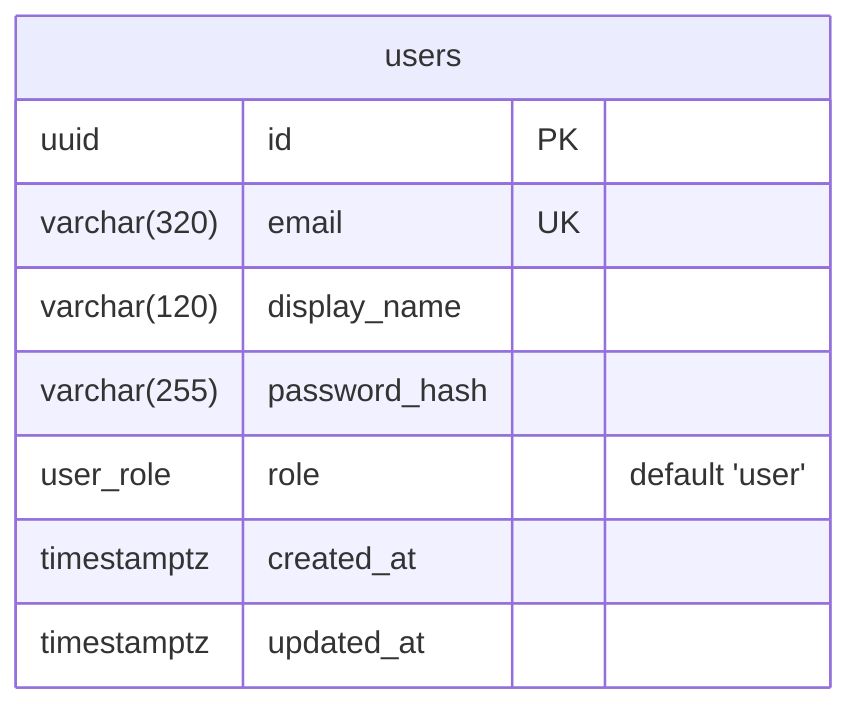
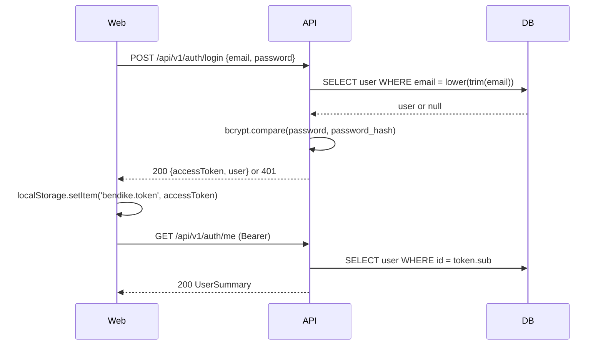
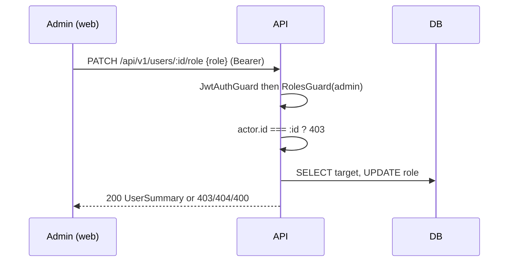

# Feature: User accounts and roles

> Issue: none (initial scaffold) · Branch: `main` (first commit) · ADRs: [0001](../../docs/adr/0001-npm-workspaces-monorepo.md), [0002](../../docs/adr/0002-credentials-jwt-and-roles.md)

## Problem Statement

Bendike needs to know who is using it and what they are allowed to do. Four kinds of account take part: ordinary
users, riggers who provide the service, dropzones (the venues or operators, as organisation accounts) and admins
who run the place. Without accounts and roles nothing else (requests, assignments, moderation) can be built.

## Personas

| Persona  | Impact   | Notes                                                          |
| -------- | -------- | -------------------------------------------------------------- |
| Visitor  | Positive | Can create an account from the landing page                    |
| User     | Positive | Gets a signed-in home and a clear path to becoming a rigger    |
| Rigger   | Positive | Is recognised as a rigger the moment an admin promotes them    |
| Dropzone | Positive | Is recognised as a dropzone once an admin promotes the account |
| Admin    | Positive | Can see every account and assign roles without touching the DB |

## Value Assessment

- **Primary value**: Future — every later feature keys off `Role`; getting it right once avoids rework.
- **Secondary value**: Efficiency — admins manage roles in the UI instead of running SQL.

## User Stories

### Story 1: Create an account

As a **Visitor**,
I want **to register with my email, a password and a display name**,
so that I can **sign in to Bendike as a user**.

#### Acceptance Criteria

- When a visitor submits a valid registration, the API shall create the account with role `user` and return a bearer token.
- If the email is already registered, then the API shall reject the registration with 409 and create nothing.
- If the password is shorter than 8 characters, then the API shall reject the registration with 400 (lowered from
  12 on 2026-09-11 at Eca's request so dropzone accounts can use the passwords he issues).
- The API shall store emails trimmed and lowercased so lookups are case-insensitive.
- The API shall never return a password hash in any response.

### Story 2: Sign in

As a **User**,
I want **to exchange my email and password for a token**,
so that I can **use the parts of Bendike that need me to be signed in**.

#### Acceptance Criteria

- When the email and password match an account, the API shall return a bearer token and the account summary.
- If the email is unknown or the password is wrong, then the API shall respond 401 with the same message for both cases.
- While a valid token is presented, the API shall resolve the current account from the database on every request.
- If the account behind a token no longer exists, then the API shall respond 401.

### Story 3: Assign roles

As an **Admin**,
I want **to see every account and change another account's role**,
so that I can **promote riggers and other admins**.

#### Acceptance Criteria

- While signed in as an admin, when the admin requests the account list, the API shall return every account summary.
- When an admin changes another account's role to `user`, `rigger`, `dropzone` or `admin`, the API shall persist it and return the updated summary.
- If an admin targets their own account, then the API shall respond 403 and leave the role unchanged.
- If the target id does not exist, then the API shall respond 404.
- If the caller is a user, a rigger or a dropzone, then the API shall respond 403 for both endpoints.
- If the role value is not one of the four roles, then the API shall respond 400.

### Story 4: Role-aware web app

As a **User**,
I want **the web app to remember my session and show me what my role allows**,
so that I can **come back without signing in every time and never see screens I cannot use**.

#### Acceptance Criteria

- When login or registration succeeds, the web app shall store the token in `localStorage` and show the dashboard.
- While a stored token is present on load, the web app shall fetch the current account before rendering protected routes.
- If the stored token is rejected by the API, then the web app shall discard it and treat the visitor as anonymous.
- While signed in as a user, a rigger or a dropzone, when the visitor opens `/app/admin/users`, the web app shall redirect to `/app`.
- While signed in as an admin, the web app shall show a "Manage accounts" entry point on the dashboard.

### Story 5: First admin

As an **Admin** (the operator),
I want **the first admin account created from configuration**,
so that I can **bootstrap a fresh environment without a database console**.

#### Acceptance Criteria

- Where `SEED_ADMIN_EMAIL` and `SEED_ADMIN_PASSWORD` are set, when the API starts, the API shall create that account with role `admin` if it does not exist.
- If the seed account already exists, then the API shall leave it untouched, whatever its role.
- Where the seed variables are unset or blank, the API shall skip seeding.

---

## Design

> Refer to `.github/copilot-instructions.md` for technical standards.

### Role Access

| Role     | Access                                                                             |
| -------- | ---------------------------------------------------------------------------------- |
| Visitor  | `POST /auth/register`, `POST /auth/login`, landing, login and register pages       |
| User     | `GET /auth/me`, dashboard                                                          |
| Rigger   | Same as User (rigger-specific capabilities arrive with later specs)                |
| Dropzone | Same as User (dropzone-specific capabilities arrive with later specs)              |
| Admin    | Everything above plus `GET /users`, `PATCH /users/:id/role` and `/app/admin/users` |

### Components Affected

- `packages/shared/src/roles.ts` — `ROLES`, `Role`, `isRole`
- `packages/shared/src/contracts.ts` — `UserSummary`, `RegisterRequest`, `LoginRequest`, `AuthResponse`, `UpdateRoleRequest`
- `apps/api/src/users/*` — entity, service, admin controller, summary mapper
- `apps/api/src/auth/*` — register/login/me, JWT strategy and guards, roles decorator and guard, admin seed
- `apps/api/src/database/migrations/1757600000000-CreateUsers.ts` — `user_role` enum and `users` table
- `apps/web/src/auth/*` — session context, API calls, `RequireAuth`, `RequireRole`
- `apps/web/src/pages/*` — login, register, dashboard, admin accounts

### Dependencies

- PostgreSQL 17 (docker compose for local)
- `@nestjs/jwt`, `@nestjs/passport`, `passport-jwt`, `bcryptjs`, `@nestjs/typeorm`, `typeorm`, `pg`

### Data Model Changes

`user_role` is a PostgreSQL enum with exactly `user`, `rigger`, `dropzone`, `admin`.

### Diagrams

### Open Questions

- [ ] Should riggers need admin approval before they appear anywhere public? (Depends on what Bendike is; see landing-page spec.)
- [ ] Password reset flow: email provider not chosen yet.

---

## Tasks

### Task 1: Shared role and contract types

**Objective**: Define the four roles and the API contracts once, in `packages/shared`.

**Context**: Both apps must agree on the role list and payload shapes before either can be written.

**Affected files**:

- `packages/shared/src/roles.ts`
- `packages/shared/src/contracts.ts`
- `packages/shared/src/roles.spec.ts`

**Requirements**:

- Story 3: role value must be one of exactly four

**Verification**:

- [x] `npm run test:unit -w @bendike/shared` passes
- [x] `isRole` rejects anything outside the tuple

**Done when**:

- [x] All verification steps pass
- [x] No new errors in affected files
- [x] Code follows patterns in `.github/copilot-instructions.md`

---

### Task 2: User entity, migration and service

**Depends on**: Task 1

**Objective**: Persist accounts with a role enum and expose lookups plus the guarded role change.

**Affected files**:

- `apps/api/src/users/user.entity.ts`
- `apps/api/src/users/users.service.ts`
- `apps/api/src/users/users.service.spec.ts`
- `apps/api/src/database/migrations/1757600000000-CreateUsers.ts`

**Requirements**:

- Story 1: normalized email; Story 3: self-change forbidden, unknown target 404

**Verification**:

- [x] `npm run test:unit -w @bendike/api -- users` passes

**Done when**:

- [x] All verification steps pass
- [x] Acceptance criteria for Story 3 (403 self, 404 unknown) satisfied

---

### Task 3: Register, login and me

**Depends on**: Task 2

**Objective**: Issue JWTs for valid credentials and resolve the current account per request.

**Affected files**:

- `apps/api/src/auth/auth.service.ts`, `auth.controller.ts`, `password-hasher.ts`, `jwt.strategy.ts`, `jwt-auth.guard.ts`
- `apps/api/src/auth/dto/register.dto.ts`, `dto/login.dto.ts`
- matching `*.spec.ts`

**Requirements**:

- Story 1 and Story 2 in full

**Verification**:

- [x] `npm run test:unit -w @bendike/api -- auth` passes
- [x] Register writes `Role.User`; login returns 401 for both unknown email and wrong password

**Done when**:

- [x] All verification steps pass
- [x] No password hash appears in any response

---

### Task 4: Admin role management

**Depends on**: Task 3

**Objective**: Let admins list accounts and change roles behind `JwtAuthGuard` + `RolesGuard`.

**Affected files**:

- `apps/api/src/auth/roles.decorator.ts`, `roles.guard.ts`, `roles.guard.spec.ts`, `current-user.decorator.ts`
- `apps/api/src/users/users.controller.ts`, `users.controller.spec.ts`, `dto/update-role.dto.ts`

**Requirements**:

- Story 3 in full

**Verification**:

- [x] `RolesGuard` allows admin, forbids user and rigger, forbids anonymous
- [x] `UpdateRoleDto` rejects values outside `ROLES`

**Done when**:

- [x] All verification steps pass

---

### Task 5: Admin seed

**Depends on**: Task 3

**Objective**: Create the first admin from environment variables on startup.

**Affected files**:

- `apps/api/src/auth/admin-seed.service.ts`, `admin-seed.service.spec.ts`
- `apps/api/src/config/app.config.service.ts`

**Requirements**:

- Story 5 in full

**Verification**:

- [x] Seed is skipped when unset, creates when missing, leaves existing untouched

**Done when**:

- [x] All verification steps pass

---

### Task 6: Web session and role-aware routing

**Depends on**: Task 4

**Objective**: Store the session, restore it on load, and gate routes by role.

**Affected files**:

- `apps/web/src/api/http.ts`, `auth/auth-api.ts`, `auth/auth-context.tsx`, `auth/RequireAuth.tsx`, `auth/RequireRole.tsx`
- `apps/web/src/pages/LoginPage.tsx`, `RegisterPage.tsx`, `DashboardPage.tsx`, `AdminUsersPage.tsx`, `App.tsx`
- matching `*.spec.tsx`

**Requirements**:

- Story 4 in full

**Verification**:

- [x] `npm run test:unit -w @bendike/web` passes
- [x] User, rigger and dropzone are redirected away from `/app/admin/users`; admin is not

**Done when**:

- [x] All verification steps pass

---

## Out of Scope

- Password reset, email verification, OAuth or social login
- Rigger-specific and dropzone-specific capabilities (what they can do beyond being labelled one)
- Whether a dropzone account can have several people signing in to it (staff logins)
- Account deletion and audit log of role changes
- Rate limiting on login

## Future Considerations

- Refresh tokens or short-lived JWT with silent renewal once sessions matter
- Audit trail (who promoted whom, when) once there is more than one admin
- Feature flags if a rollout ever needs gating; none are wired today
