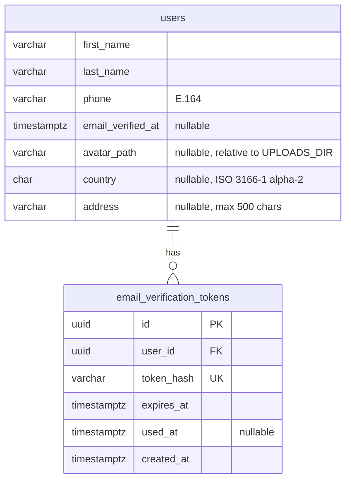
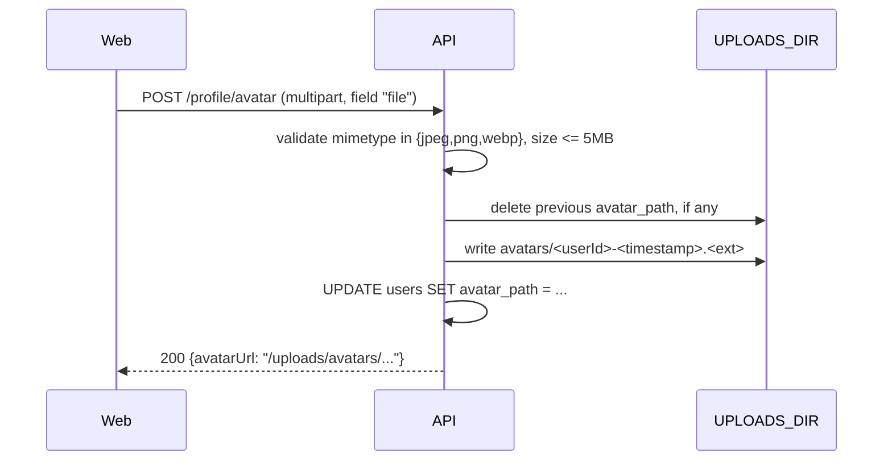

# Feature: User profile and email verification

> Issue: none yet · Branch: `feat/user-profile` (to be created) · ADR:
> [0009](../../docs/adr/0009-local-disk-storage-for-profile-avatars.md) · Requested by Eca, 2026-09-11; extended
> 2026-09-18 with picture, address, rigs and service-request summaries

## Problem Statement

An account today is an email, a password and a display name. Eca needs to reach every customer on WhatsApp, so a
phone number is required, and he needs to know the email is real before relying on it for repack and AAD notices.
Accounts also need a proper first name and last name for packing data cards and invoices, a picture, a country of
residence and a current address for shipping and customs paperwork. This spec adds a profile with those fields, a
verification email with a one-time link, and turns `/app/profile` into the account's home: their contact details,
the rigs they own and the status of the services they have requested, each pulled from the system that already owns
that data instead of being re-typed here.

## Personas

| Persona  | Impact   | Notes                                                               |
| -------- | -------- | ------------------------------------------------------------------- |
| Visitor  | Neutral  | Registration asks for a little more                                 |
| User     | Positive | Keeps their contact details current; verified email unlocks notices |
| Rigger   | Positive | Same profile; Eca can reach them                                    |
| Dropzone | Positive | Same profile; the phone is the dropzone's contact number            |
| Admin    | Positive | Can see who is reachable and verified before promoting anyone       |

## Value Assessment

- **Primary value**: Efficiency — a WhatsApp-ready phone on every account removes the "how do I reach this
  person" step from every pickup and due notice, and a country and address on file removes it again for shipping
  and customs forms.
- **Secondary value**: Customer — verified contact details are the precondition for the reminders the product
  promises, and one page that shows a customer their rigs and their service history without a WhatsApp thread
  builds the trust a safety-critical product needs.

## User Stories

### Story 1: Register with full contact details

As a **Visitor**,
I want **to register with my first name, last name, email, phone and password**,
so that I can **be reached on WhatsApp and by email**.

#### Acceptance Criteria

- When a visitor registers, the API shall require `firstName`, `lastName`, `email`, `phone` and `password`.
- The API shall validate `phone` as an international number and store it in E.164 form (for example
  `+5493413955408`); if it cannot be parsed, then the API shall respond 400 naming the field.
- The API shall derive the account's display name as `firstName lastName` for existing screens.
- When registration succeeds, the API shall create the account with `emailVerifiedAt` empty and send a verification
  email.
- The API shall not require `country` or `address` at registration; the account can add them later from the
  profile page.

### Story 2: Verify the email

As a **User**,
I want **a verification link in my inbox that confirms my email in one click**,
so that I can **receive Bendike notices there**.

#### Acceptance Criteria

- When an account is created or changes its email, the API shall generate a single-use token valid for 24 hours,
  store only its hash, and email a link to `/verify-email?token=…`.
- When the web app opens `/verify-email` with a valid token, the API shall set `emailVerifiedAt`, invalidate the
  token and respond success; the web app shall confirm and link to `/app`.
- If the token is unknown, used or expired, then the API shall respond 400 and the web app shall offer to resend.
- While an account is unverified, the web app shall show a banner in the app shell with a "Resend" action, limited
  by the API to one email per 5 minutes per account.
- The API shall never include the raw token in any log.

### Story 3: Edit the profile

As a **User**,
I want **to edit my names, phone, email, country of residence and current address**,
so that I can **keep my contact and shipping details current**.

#### Acceptance Criteria

- The web app shall serve `/app/profile` with the account's first name, last name, email, phone, country, address,
  picture and verification status, and a WhatsApp link built from the phone.
- When the account saves changes, the API shall validate them like registration and persist them.
- The API shall validate `country` against the shared list of ISO 3166-1 alpha-2 codes; if it is not a known code,
  then the API shall respond 400 naming the field.
- The API shall accept `address` as free text up to 500 characters, for a street, city and postal code Eca can read
  on a shipping label.
- If the email changes, then the API shall clear `emailVerifiedAt` and send a new verification email.
- If the new email is already used by another account, then the API shall respond 409.
- The admin account list shall show phone, verification status and a WhatsApp link per account.

### Story 4: Add a profile picture

As a **User**,
I want **to upload, replace or remove a picture on my profile**,
so that I can **be recognised by Eca and other riggers**.

#### Acceptance Criteria

- The web app shall serve an upload control on `/app/profile` accepting JPEG, PNG or WebP up to 5 MB.
- When the account uploads a picture, the API shall store the file, discard any picture previously stored for that
  account, and return the new `avatarUrl`.
- If the file is not an accepted image type or exceeds 5 MB, then the API shall respond 400 and the web app shall
  show the reason without uploading.
- When the account removes their picture, the API shall delete the stored file and clear `avatarUrl`.
- While an account has no picture, the web app shall show a placeholder built from their initials, on the profile
  page, the admin account list and anywhere else an avatar appears.

### Story 5: See my rigs from my profile

As a **User**,
I want **my profile page to show the rigs I own**,
so that I can **see what I'm responsible for without leaving my account page**.

#### Acceptance Criteria

- The web app shall show a "My rigs" panel on `/app/profile` listing the signed-in account's rigs by name with
  each rig's worst due-date status, reusing `gear-tracking.md`'s rig list endpoint.
- When the account has no rigs, the panel shall say so and link to adding one in `/app/gear`.
- When the account presses a rig in the panel or "See all", the web app shall navigate to `/app/gear` or
  `/app/gear/:rigId`.
- This story ships only once `gear-tracking.md` Tasks 1, 3 and 5 are complete; see Dependencies.

### Story 6: See my service history from my profile

As a **User**,
I want **my profile page to show the status of services I've requested and my past ones**,
so that I can **check where a repack or AAD service stands without a WhatsApp thread**.

#### Acceptance Criteria

- The web app shall show a "My service requests" panel on `/app/profile` listing the signed-in account's most
  recent requests with the service name, the gear item and the status, reusing `rigging-services.md`'s own-requests
  endpoint.
- When the account has no requests, the panel shall say so and link to `/:locale/services`.
- When the account presses "See all", the web app shall navigate to `/app/service-requests`.
- This story ships only once `rigging-services.md` Task 5 is complete; see Dependencies.

---

## Design

> Refer to `.github/copilot-instructions.md` for technical standards.

### Role Access

| Role     | Access                                                        |
| -------- | ------------------------------------------------------------- |
| Visitor  | Register, verify a token, request a resend by email           |
| User     | Read and edit own profile, resend verification                |
| Rigger   | Same as User                                                  |
| Dropzone | Same as User                                                  |
| Admin    | Same as User, plus phone and verification on the account list |

### Components Affected

- `packages/shared/src/contracts.ts` — `RegisterRequest` gains `firstName`, `lastName`, `phone`; `UserSummary` gains
  them plus `emailVerified`, `avatarUrl`, `country`, `address`; new `UpdateProfileRequest`, `VerifyEmailRequest`
- `packages/shared/src/countries.ts` — `COUNTRY_CODES` (ISO 3166-1 alpha-2 tuple), `isCountryCode`, mirroring the
  `ROLES`/`isRole` pattern
- `apps/api/src/users/user.entity.ts` — `firstName`, `lastName`, `phone`, `emailVerifiedAt`, `avatarPath`,
  `country`, `address`; `displayName` becomes derived
- `apps/api/src/database/migrations/1757900000000-AddProfileAndVerification.ts`
- `apps/api/src/auth/dto/register.dto.ts`, `auth.service.ts` — new fields, send verification on register
- `apps/api/src/verification/` — `EmailVerificationToken` entity, service, controller (`POST /auth/verify-email`,
  `POST /auth/resend-verification`)
- `apps/api/src/email/` — `EmailSender` port with `ConsoleEmailSender` (dev, tests) and one real provider adapter
- `apps/api/src/profile/` — `GET /profile`, `PATCH /profile`, `POST /profile/avatar`, `DELETE /profile/avatar`
- `apps/api/src/main.ts` — `NestExpressApplication` + `useStaticAssets(uploadsDir, { prefix: '/uploads' })`
- `apps/api/src/config/env.config.ts`, `app.config.service.ts` — `UPLOADS_DIR` (default `./uploads`)
- `apps/api/uploads/` — git-ignored runtime directory for stored avatars
- `apps/web/src/pages/RegisterPage.tsx`, `pages/ProfilePage.tsx` (contact form, avatar upload, rigs panel, service
  requests panel), `pages/VerifyEmailPage.tsx`, `components/Avatar.tsx` (new, initials placeholder),
  `components/AppShell.tsx` (unverified banner, avatar in the top bar), `pages/AdminUsersPage.tsx`

### Dependencies

- `libphonenumber-js` for parsing and E.164 formatting (new dependency; record in the PR).
- An email provider. Recommendation: Resend (free tier, simple HTTP API, no SMTP). Configuration:
  `EMAIL_PROVIDER=console|resend`, `RESEND_API_KEY`, `EMAIL_FROM`, `WEB_BASE_URL` for links.
- Avatar storage is local disk, decided in [ADR 0009](../../docs/adr/0009-local-disk-storage-for-profile-avatars.md).
  `@nestjs/platform-express`'s bundled multer handles the upload; no new package.
- `gear-tracking.md` Tasks 1, 3, 5 (`GearKind`, the gear items API, due-date read models) — hard prerequisite for
  Story 5, not yet built.
- `rigging-services.md` Task 5 (own service-request list endpoint) — hard prerequisite for Story 6, not yet built.

### Data Model Changes



`display_name` is dropped; the summary derives it. The migration backfills `first_name` and `last_name` from
`display_name` (first word, remainder) and sets `phone` to `''` for existing rows, which the profile page then asks
to complete.

### Diagrams

```mermaid
sequenceDiagram
  participant Web
  participant API
  participant Email as Email provider
  Web->>API: POST /auth/register {firstName, lastName, email, phone, password}
  API->>API: parse phone → E.164, hash password, create user
  API->>API: token = random(32 bytes); store sha256(token), expires +24h
  API->>Email: send "Verify your Bendike email" with /verify-email?token=…
  API-->>Web: 201 {accessToken, user{emailVerified:false}}
  Web->>API: POST /auth/verify-email {token}
  API->>API: find by sha256(token), check unused and unexpired
  API-->>Web: 200 {emailVerified:true}
```



### Open Questions

- [x] Email provider: Resend, decided 2026-09-19 in [ADR 0014](../../docs/adr/0014-repack-reminders-are-a-daily-digest-email-sent-by-a-cron-triggered-endpoint.md).
      The `EmailSender` port and `ConsoleEmailSender` are built once for both specs (`repack-reminders.md` Task 2).
      The `From` address still needs a domain Eca controls, or Resend's test sender while testing.
- [x] `phone` and `locale` on accounts: the minimum ships early with the rigger workspace (Task 9 there); this spec
      later adds validation with `libphonenumber-js`, the required phone at registration, and the names.
- [ ] Should unverified accounts be blocked from anything? Phase 1: no, banner only; promotion to rigger or dropzone
      requires a verified email.
- [ ] Default country for phone parsing when the user omits `+`: Argentina (`AR`)?
- [ ] Should `country` default to `AR` on the profile form too, or stay empty until the account picks one?
- [x] Order history for shop purchases: specced separately in `shop-order-tracking.md` (2026-09-18), which adds an
      "My orders" panel to `/app/profile` as its own Task 9, since it depends on that spec's order model.

---

## Tasks

### Task 1: Contracts, phone helper and country codes

**Objective**: Extend the shared contracts, add a tested `normalizePhone` helper and a tested `isCountryCode`.

**Affected files**:

- `packages/shared/src/contracts.ts`, `countries.ts`, `countries.spec.ts`, `index.ts`,
  `apps/api/src/common/phone.ts`, `phone.spec.ts`

**Verification**:

- [ ] `+54 9 341 395-5408` and `3413955408` (default AR) both normalise to `+5493413955408`; garbage is rejected
- [ ] `isCountryCode('AR')` is true, `isCountryCode('ZZ')` is false

**Done when**:

- [ ] All verification steps pass

---

### Task 2: Entity, migration and register changes

**Depends on**: Task 1

**Objective**: Add the profile columns and require the contact fields at registration; `country`, `address` and
`avatarPath` stay optional and are set later from the profile page.

**Affected files**:

- `apps/api/src/users/user.entity.ts`, `user-summary.ts`, `user.factory.ts`, `auth/dto/register.dto.ts`,
  `auth/auth.service.ts`, specs, migration

**Verification**:

- [ ] Registration without phone is 400; summary includes `firstName`, `lastName`, `phone`, `emailVerified`,
      `avatarUrl`, `country`, `address`
- [ ] Registration without `country` or `address` succeeds; both are `null` on the returned summary

**Done when**:

- [ ] All verification steps pass

---

### Task 3: Email sender port and verification tokens

**Depends on**: Task 2

**Objective**: Add `EmailSender` with a console adapter, the token entity and the verify and resend endpoints.

**Affected files**:

- `apps/api/src/email/*`, `apps/api/src/verification/*`, `config/app.config.service.ts`, specs

**Requirements**: Story 2

**Verification**:

- [ ] Only the hash is stored; used and expired tokens are 400; resend is rate limited to one per 5 minutes

**Done when**:

- [ ] All verification steps pass

---

### Task 4: Provider adapter

**Depends on**: Task 3

**Objective**: Add the real email adapter behind `EMAIL_PROVIDER` once the provider is chosen.

**Verification**:

- [ ] Outbound HTTP mocked with `nock`; API key never logged

**Done when**:

- [ ] All verification steps pass

---

### Task 5: Profile endpoints

**Depends on**: Task 2

**Objective**: `GET /profile` and `PATCH /profile` with re-verification on email change, and `country`/`address`
validation.

**Verification**:

- [ ] Email change clears verification and sends a new token; duplicate email is 409
- [ ] `PATCH /profile` with `country: 'ZZ'` is 400; `address` over 500 characters is 400

**Done when**:

- [ ] All verification steps pass

---

### Task 6: Avatar upload endpoints

**Depends on**: Task 5

**Objective**: Add `POST /profile/avatar` and `DELETE /profile/avatar`, static file serving from `UPLOADS_DIR`, and
the git-ignored uploads directory.

**Context**: Storage choice is local disk per
[ADR 0009](../../docs/adr/0009-local-disk-storage-for-profile-avatars.md); this task exists on its own because it
touches `main.ts` bootstrap and a new runtime directory, not just a controller.

**Affected files**:

- `apps/api/src/profile/profile.controller.ts`, `avatar.service.ts`, DTOs
- `apps/api/src/main.ts`, `config/env.config.ts`, `app.config.service.ts`
- `apps/api/uploads/.gitkeep`, `.gitignore`

**Requirements**: Story 4

**Verification**:

- [ ] A 6 MB file is rejected with 400 before being written to disk
- [ ] A non-image content type is rejected with 400
- [ ] Uploading twice leaves exactly one file on disk for that account; the first is deleted
- [ ] `DELETE /profile/avatar` removes the file and clears `avatarUrl` on the next `GET /profile`

**Done when**:

- [ ] All verification steps pass

---

### Task 7: Web: register, verify, profile, banner

**Depends on**: Tasks 3, 5, 6

**Objective**: Update the register form, add `/verify-email` and `/app/profile` (contact fields, country select,
address field, avatar upload with an initials placeholder), the unverified banner, and phone plus verification on
the admin list.

**Affected files**:

- `apps/web/src/pages/RegisterPage.tsx`, `pages/ProfilePage.tsx`, `pages/VerifyEmailPage.tsx`,
  `components/Avatar.tsx`, `components/AppShell.tsx`, `pages/AdminUsersPage.tsx`, specs

**Verification**:

- [ ] Banner disappears after verification without a reload; WhatsApp link opens `https://wa.me/<digits>`
- [ ] Uploading a picture updates the avatar shown in `AppShell` without a reload; removing it reverts to initials

**Done when**:

- [ ] All verification steps pass

---

### Task 8: Web: rigs and service-request panels on the profile page

**Depends on**: Task 7, `gear-tracking.md` Tasks 1, 3, 5, `rigging-services.md` Task 5

**Objective**: Add the "My rigs" and "My service requests" panels to `/app/profile`, each reading from the API the
owning spec already defines.

**Context**: This task cannot start before its two cross-spec dependencies exist. If they are not built yet when
this spec is otherwise ready, ship Tasks 1-7 and leave this task for later rather than blocking the rest of the
profile on unrelated features.

**Affected files**:

- `apps/web/src/pages/ProfilePage.tsx`, `apps/web/src/pages/gear/gear-api.ts` (read-only reuse),
  `apps/web/src/pages/services/services-api.ts` (read-only reuse)

**Requirements**: Story 5, Story 6

**Verification**:

- [ ] An account with no rigs sees the empty state and a link to `/app/gear`
- [ ] An account with no service requests sees the empty state and a link to `/:locale/services`
- [ ] "See all" on each panel navigates to `/app/gear` and `/app/service-requests` respectively

**Done when**:

- [ ] All verification steps pass

---

## Out of Scope

- Password reset (same token mechanics; separate spec)
- Phone verification by SMS or WhatsApp OTP
- Order status and order history for shop purchases: this spec's own tasks stop at Task 8; the panel itself is
  `shop-order-tracking.md` Task 9, owned by that spec
- Cropping, resizing or multiple sizes of the avatar; the uploaded file is served as-is

## Future Considerations

- Password reset reusing the token table with a `purpose` column
- WhatsApp Business API for outbound notices once volume justifies it
- Move avatar storage from local disk to S3-compatible object storage if the API ever runs on more than one
  instance or behind a redeploy that wipes the filesystem (see ADR 0009's consequences)
- Nothing further here: `shop-order-tracking.md` (2026-09-18) already covers order status/history and adds its
  own panel to this profile page in its Task 9
