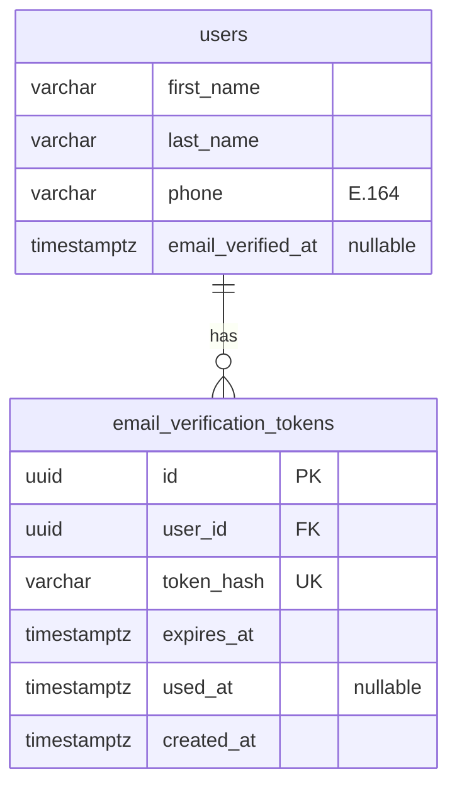

# Feature: User profile and email verification

> Issue: none yet · Branch: `feat/user-profile` (to be created) · Requested by Eca, 2026-09-11

## Problem Statement

An account today is an email, a password and a display name. Eca needs to reach every customer on WhatsApp, so a
phone number is required, and he needs to know the email is real before relying on it for repack and AAD notices.
Accounts also need a proper first name and last name for packing data cards and invoices. This spec adds a profile
with those fields and a verification email with a one-time link.

## Personas

| Persona  | Impact   | Notes                                                               |
| -------- | -------- | ------------------------------------------------------------------- |
| Visitor  | Neutral  | Registration asks for a little more                                 |
| User     | Positive | Keeps their contact details current; verified email unlocks notices |
| Rigger   | Positive | Same profile; Eca can reach them                                    |
| Dropzone | Positive | Same profile; the phone is the dropzone's contact number            |
| Admin    | Positive | Can see who is reachable and verified before promoting anyone       |

## Value Assessment

- **Primary value**: Efficiency — a WhatsApp-ready phone on every account removes the "how do I reach this
  person" step from every pickup and due notice.
- **Secondary value**: Customer — verified contact details are the precondition for the reminders the product
  promises.

## User Stories

### Story 1: Register with full contact details

As a **Visitor**,
I want **to register with my first name, last name, email, phone and password**,
so that I can **be reached on WhatsApp and by email**.

#### Acceptance Criteria

- When a visitor registers, the API shall require `firstName`, `lastName`, `email`, `phone` and `password`.
- The API shall validate `phone` as an international number and store it in E.164 form (for example
  `+5493413955408`); if it cannot be parsed, then the API shall respond 400 naming the field.
- The API shall derive the account's display name as `firstName lastName` for existing screens.
- When registration succeeds, the API shall create the account with `emailVerifiedAt` empty and send a verification
  email.

### Story 2: Verify the email

As a **User**,
I want **a verification link in my inbox that confirms my email in one click**,
so that I can **receive Bendike notices there**.

#### Acceptance Criteria

- When an account is created or changes its email, the API shall generate a single-use token valid for 24 hours,
  store only its hash, and email a link to `/verify-email?token=…`.
- When the web app opens `/verify-email` with a valid token, the API shall set `emailVerifiedAt`, invalidate the
  token and respond success; the web app shall confirm and link to `/app`.
- If the token is unknown, used or expired, then the API shall respond 400 and the web app shall offer to resend.
- While an account is unverified, the web app shall show a banner in the app shell with a "Resend" action, limited
  by the API to one email per 5 minutes per account.
- The API shall never include the raw token in any log.

### Story 3: Edit the profile

As a **User**,
I want **to edit my names, phone and email**,
so that I can **keep my contact details current**.

#### Acceptance Criteria

- The web app shall serve `/app/profile` with the account's first name, last name, email, phone and verification
  status, and a WhatsApp link built from the phone.
- When the account saves changes, the API shall validate them like registration and persist them.
- If the email changes, then the API shall clear `emailVerifiedAt` and send a new verification email.
- If the new email is already used by another account, then the API shall respond 409.
- The admin account list shall show phone, verification status and a WhatsApp link per account.

---

## Design

> Refer to `.github/copilot-instructions.md` for technical standards.

### Role Access

| Role     | Access                                                        |
| -------- | ------------------------------------------------------------- |
| Visitor  | Register, verify a token, request a resend by email           |
| User     | Read and edit own profile, resend verification                |
| Rigger   | Same as User                                                  |
| Dropzone | Same as User                                                  |
| Admin    | Same as User, plus phone and verification on the account list |

### Components Affected

- `packages/shared/src/contracts.ts` — `RegisterRequest` gains `firstName`, `lastName`, `phone`; `UserSummary` gains
  them plus `emailVerified`; new `UpdateProfileRequest`, `VerifyEmailRequest`
- `apps/api/src/users/user.entity.ts` — `firstName`, `lastName`, `phone`, `emailVerifiedAt`; `displayName` becomes
  derived
- `apps/api/src/database/migrations/1757900000000-AddProfileAndVerification.ts`
- `apps/api/src/auth/dto/register.dto.ts`, `auth.service.ts` — new fields, send verification on register
- `apps/api/src/verification/` — `EmailVerificationToken` entity, service, controller (`POST /auth/verify-email`,
  `POST /auth/resend-verification`)
- `apps/api/src/email/` — `EmailSender` port with `ConsoleEmailSender` (dev, tests) and one real provider adapter
- `apps/api/src/profile/` — `GET /profile`, `PATCH /profile`
- `apps/web/src/pages/RegisterPage.tsx`, `pages/ProfilePage.tsx`, `pages/VerifyEmailPage.tsx`,
  `components/AppShell.tsx` (unverified banner), `pages/AdminUsersPage.tsx`

### Dependencies

- `libphonenumber-js` for parsing and E.164 formatting (new dependency; record in the PR).
- An email provider. Recommendation: Resend (free tier, simple HTTP API, no SMTP). Configuration:
  `EMAIL_PROVIDER=console|resend`, `RESEND_API_KEY`, `EMAIL_FROM`, `WEB_BASE_URL` for links.

### Data Model Changes



`display_name` is dropped; the summary derives it. The migration backfills `first_name` and `last_name` from
`display_name` (first word, remainder) and sets `phone` to `''` for existing rows, which the profile page then asks
to complete.

### Diagrams

```mermaid
sequenceDiagram
  participant Web
  participant API
  participant Email as Email provider
  Web->>API: POST /auth/register {firstName, lastName, email, phone, password}
  API->>API: parse phone → E.164, hash password, create user
  API->>API: token = random(32 bytes); store sha256(token), expires +24h
  API->>Email: send "Verify your Bendike email" with /verify-email?token=…
  API-->>Web: 201 {accessToken, user{emailVerified:false}}
  Web->>API: POST /auth/verify-email {token}
  API->>API: find by sha256(token), check unused and unexpired
  API-->>Web: 200 {emailVerified:true}
```

### Open Questions

- [ ] Email provider: Resend, or does Eca already have a domain mailbox to send from? The `From` address needs a
      domain Eca controls for deliverability.
- [ ] Should unverified accounts be blocked from anything? Phase 1: no, banner only; promotion to rigger or dropzone
      requires a verified email.
- [ ] Default country for phone parsing when the user omits `+`: Argentina (`AR`)?

---

## Tasks

### Task 1: Contracts and phone helper

**Objective**: Extend the shared contracts and add a tested `normalizePhone` helper.

**Affected files**:

- `packages/shared/src/contracts.ts`, `apps/api/src/common/phone.ts`, `phone.spec.ts`

**Verification**:

- [ ] `+54 9 341 395-5408` and `3413955408` (default AR) both normalise to `+5493413955408`; garbage is rejected

**Done when**:

- [ ] All verification steps pass

---

### Task 2: Entity, migration and register changes

**Depends on**: Task 1

**Objective**: Add the profile columns and require them at registration.

**Affected files**:

- `apps/api/src/users/user.entity.ts`, `user-summary.ts`, `user.factory.ts`, `auth/dto/register.dto.ts`,
  `auth/auth.service.ts`, specs, migration

**Verification**:

- [ ] Registration without phone is 400; summary includes `firstName`, `lastName`, `phone`, `emailVerified`

**Done when**:

- [ ] All verification steps pass

---

### Task 3: Email sender port and verification tokens

**Depends on**: Task 2

**Objective**: Add `EmailSender` with a console adapter, the token entity and the verify and resend endpoints.

**Affected files**:

- `apps/api/src/email/*`, `apps/api/src/verification/*`, `config/app.config.service.ts`, specs

**Requirements**: Story 2

**Verification**:

- [ ] Only the hash is stored; used and expired tokens are 400; resend is rate limited to one per 5 minutes

**Done when**:

- [ ] All verification steps pass

---

### Task 4: Provider adapter

**Depends on**: Task 3

**Objective**: Add the real email adapter behind `EMAIL_PROVIDER` once the provider is chosen.

**Verification**:

- [ ] Outbound HTTP mocked with `nock`; API key never logged

**Done when**:

- [ ] All verification steps pass

---

### Task 5: Profile endpoints

**Depends on**: Task 2

**Objective**: `GET /profile` and `PATCH /profile` with re-verification on email change.

**Verification**:

- [ ] Email change clears verification and sends a new token; duplicate email is 409

**Done when**:

- [ ] All verification steps pass

---

### Task 6: Web: register, verify, profile, banner

**Depends on**: Tasks 3, 5

**Objective**: Update the register form, add `/verify-email` and `/app/profile`, the unverified banner, and phone plus
verification on the admin list.

**Verification**:

- [ ] Banner disappears after verification without a reload; WhatsApp link opens `https://wa.me/<digits>`

**Done when**:

- [ ] All verification steps pass

---

## Out of Scope

- Password reset (same token mechanics; separate spec)
- Phone verification by SMS or WhatsApp OTP
- Avatars

## Future Considerations

- Password reset reusing the token table with a `purpose` column
- WhatsApp Business API for outbound notices once volume justifies it
