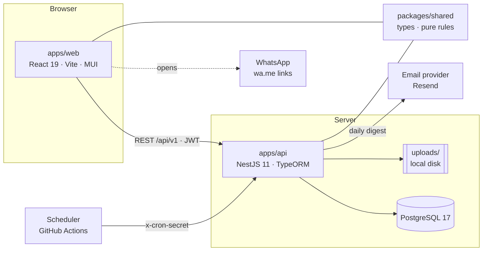
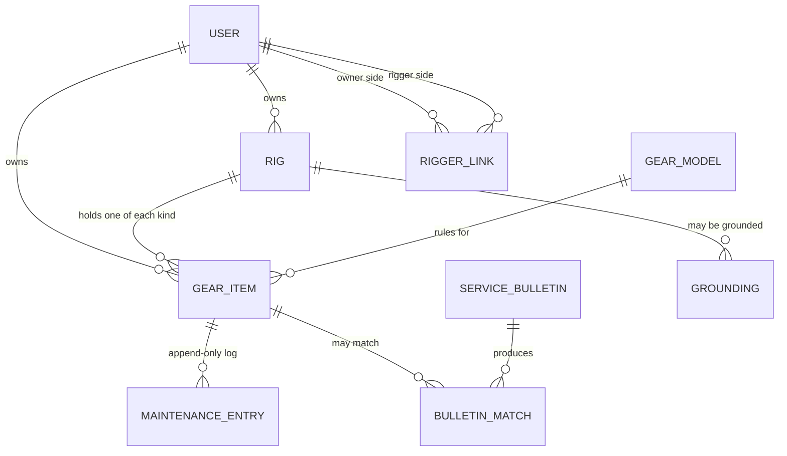
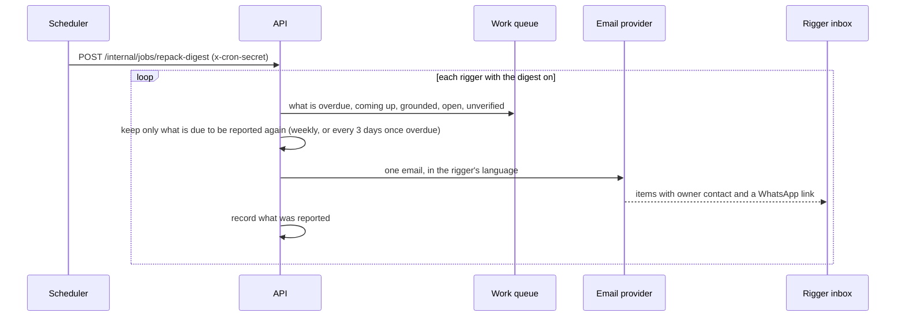

# Bendike

**A rigging loft in Argentina, and the software that keeps skydivers, riggers and dropzones on top of reserve repacks,
AAD service and manufacturer service bulletins.**

Safety comes first. A reserve past its repack date, an AAD past its battery or life, a rig that a bulletin says not to
use: Bendike exists so that nobody finds these out at the dropzone. It is built by a rigger who is also a programmer,
around the work he does at his own loft.

[What it does](#what-you-can-do-today) · [Run it locally](#run-it-locally) · [Architecture](#how-the-pieces-fit) ·
[How we work](#how-we-work) · [Roadmap](#roadmap)

## Who is behind it

I am **Enrique "Eca" Coscarelli**: a certified rigger with my own loft in Argentina, a programmer, and the owner of
Bendike. The first customers are riggers like me, and the dropzones and skydivers we look after.

| How to reach me |                                                                                                   |
| --------------- | ------------------------------------------------------------------------------------------------- |
| Email           | [enriquecoscarelli@gmail.com](mailto:enriquecoscarelli@gmail.com)                                 |
| WhatsApp        | [Chat with Eca](https://wa.me/5493413955408?text=Hola%20Eca%2C%20te%20escribo%20desde%20bendike.) |
| Instagram       | [@ecacoscarelli](https://www.instagram.com/ecacoscarelli/)                                        |
| LinkedIn        | [enrique-coscarelli](https://www.linkedin.com/in/enrique-coscarelli/)                             |

If you are a developer joining the project, everything you need is in this file, in [`docs/`](docs) and in
[`.github/specs/`](.github/specs). Start with [How the pieces fit](#how-the-pieces-fit) and
[How we work](#how-we-work).

## What you can do today

Bendike has four kinds of account. Every new account starts as a `user`; an admin promotes it to `rigger`,
`dropzone` or `admin`.

| Role         | Who it is                                                         | What they do in Bendike                                                                                                                                            |
| ------------ | ----------------------------------------------------------------- | ------------------------------------------------------------------------------------------------------------------------------------------------------------------ |
| **Visitor**  | Anyone who is not signed in                                       | Reads the landing page, the About story, the trilingual shop (English, Spanish, Portuguese) and the rigging services.                                              |
| **User**     | A skydiver                                                        | Keeps their rigs and spare gear with colour-coded due dates, picks a rigger, sees inspections and groundings on their rigs.                                        |
| **Rigger**   | A certified parachute rigger                                      | Works from one **work queue** across every dropzone and customer they look after: logs repacks in a tap, inspects, grounds, reviews bulletins, gets a daily email. |
| **Dropzone** | An organisation account (the venue or its operator, not a person) | Keeps its whole fleet as a catalogue, assigns its riggers, sees the last inspection and any grounding on every rig.                                                |
| **Admin**    | Eca, at first                                                     | Manages accounts, the shop, services, used gear, the gear-model rules and the service bulletins.                                                                   |

### The gear tracker

A **rig** is four components: a container, a main canopy, a reserve and an AAD. Small parts (bridle, pilot chute,
risers, toggles, handles) hang off a component as notes. Everything that happens to a component is one entry in an
**append-only maintenance log**, and every date on screen is computed from that log, never typed as a "next due" field.

- **Colour-coded due dates.** Red when overdue, yellow when it is coming up, green when fine, grey when there is no
  data. Every badge also carries an icon and a word, so colour is never the only signal. A reserve repack turns yellow
  21 days before it is due, an AAD date 90 days before.
- **Grid view by default.** `/app/gear` opens as a paginated table with one row per component (manufacturer, model,
  serial, date of manufacture, status, next due, notes) or one row per rig, with the same search, filters and sort as
  the card layout, which stays one click away.
- **The 180-day repack rule**, with a per-model override. A catalogue of models holds each manufacturer's repack
  cycle, AAD service interval, battery cycle and life, and components inherit those rules.
- **Unverified work grounds the rig.** Not every rigger uses Bendike. An owner can record that someone else packed the
  rig and keep that person's name, contact and licence for later. That work counts towards the due date, but the rig
  shows **GROUNDED** until a Bendike rigger verifies it.
- **Fleet import.** A dropzone's existing spreadsheet can be imported in one command (see
  [Import a dropzone's fleet](#import-a-dropzones-fleet)).

### The rigger workspace

- **Links, not access by role.** A rigger sees an owner's gear only after both sides agree, in either direction: the
  owner picks a rigger, or the rigger adds a customer. Ending the link removes access at once, and contact details are
  shared only while a link is active.
- **The work queue.** Every reserve repack and AAD date across everyone the rigger looks after, sortable and
  filterable, each row with a one-tap **Log repack** and a **Contact** button that opens WhatsApp with a message
  already written in the owner's language.
- **Inspections.** A rigger records passed, needs work or grounded. Dropzones and owners see the last inspection, who
  did it and the result.
- **QR label per rig.** Print it, stick it on the rig, scan it to open the rig's page.
- **Daily digest email.** One email a day, only when something needs the rigger: overdue and coming-up dates, grounded
  rigs, open service bulletins, and work awaiting verification, each with the owner's contact and a WhatsApp link.

### Service bulletins and grounding

An admin enters a manufacturer's bulletin **once**, with what it applies to (model, serial range, date of
manufacture). Publishing it finds every matching component across all gear:

- Matching is exact after normalising case, spaces and hyphens. It never guesses by similarity.
- A component whose serial or date cannot be compared (for example a serial like `VR-360 007284`) is flagged
  **needs review** instead of being silently skipped, because a missed match is unsafe.
- A `grounding` bulletin grounds every matched rig until its rigger resolves the match as complied or not applicable.
- A rigger can also ground a rig or a single component by hand, and give the green light with a note. Grounding is a
  record everyone can see, not a lock: Bendike shows it and the rigger and dropzone act on it.

### The manual library

Riggers and admins get a **Library** (`/app/library`): a searchable, paginated list of manuals and bulletins that Bendike
keeps a copy of, so they survive a manufacturer's website changing or disappearing. A rigger uploads a PDF and says
which model and revision it is; every download goes through Bendike, and only admins can archive a document. Users
and dropzones never see it. Files live in a Google Drive folder you own (see below) or, in development, on local disk.

### The shop and the services

- A **trilingual shop** for Squirrel wingsuits and gear, FlySight and Vigil, with prices in US dollars plus derived
  pesos and reais, search, filters, categories, pagination and a WhatsApp handoff for enquiries.
- **Used gear**: priced directly in pesos or dollars, with uploaded photos, and a "Sold" badge instead of deleting.
- **Rigging services** (reserve repacks, AAD send-in, patchwork, relines) that an admin edits, priced in pesos.
- A landing page with a brand carousel, and an About story built on a scroll-driven engine.

The full status of every feature is in [`.github/specs/README.md`](.github/specs/README.md).

## Run it locally

You need **Node 24** (see `.nvmrc`) and **Docker** for PostgreSQL.

```bash
npm install                    # installs every workspace and builds packages/shared
npm run db:up                  # PostgreSQL 17 on localhost:5432
cp apps/api/.env.example apps/api/.env
npm run dev:api                # API on http://localhost:3000, Swagger UI at /docs
npm run dev:web                # web on http://localhost:5173, proxies /api and /uploads to the API
```

Set `SEED_ADMIN_EMAIL` and `SEED_ADMIN_PASSWORD` in `apps/api/.env` and the API creates that admin on startup.
Migrations run when the API starts. If port 5432 is taken by another PostgreSQL, change the port mapping in
`docker-compose.yml` and in `DATABASE_URL`.

### Test accounts

```bash
DEV_ACCOUNTS_PASSWORD='choose-one' npm run seed:dev-accounts -w @bendike/api   # user@, rigger@, dropzone@bendike.local
```

That script creates three generic accounts (`user@bendike.local`, `rigger@bendike.local`, `dropzone@bendike.local`)
with the password you pass in `DEV_ACCOUNTS_PASSWORD`, and refuses to run in production. Promote or link accounts from the admin
screens. Keep any personal logins in `apps/api/.env.dev-accounts`, which git ignores.

### Seed and import data

```bash
npm run seed:catalog  -w @bendike/api     # FlySight and Vigil products with real copy and prices
npm run seed:services -w @bendike/api     # the five rigging services
npm run import:squirrel -w @bendike/api   # the Squirrel catalogue, from squirrel.ws (needs Playwright)
```

### Import a dropzone's fleet

A dropzone that already tracks its gear in a spreadsheet can be imported into its account. The importer reads the
workbook directly, links containers, AADs, reserves and canopies to their rigs, turns each reserve's last fold date
into a repack entry, and is idempotent (run it twice, get the same result).

```bash
npm run import:fleet -w @bendike/api -- \
  --file path/to/Equipos.xlsx --owner-email dropzone@example.com --as admin@example.com --dry-run
```

Drop `--dry-run` to write. The dry run lists every row it cannot link, such as a date typed as `1017`. The workbook
itself holds real serial numbers and contact details, so **never commit it**.

## Configuration

All configuration is environment variables in `apps/api/.env` (see `apps/api/.env.example`) and, for the web app, in
`apps/web/.env`. Everything except the database and the JWT secret is optional.

| Variable                                         | What it does                                                                                                                                  |
| ------------------------------------------------ | --------------------------------------------------------------------------------------------------------------------------------------------- |
| `DATABASE_URL`, `JWT_SECRET`                     | Required. The PostgreSQL connection and the token signing secret (at least 32 characters).                                                    |
| `SEED_ADMIN_EMAIL`, `SEED_ADMIN_PASSWORD`        | Create the first admin on startup.                                                                                                            |
| `GOOGLE_CLIENT_ID` / `VITE_GOOGLE_CLIENT_ID`     | Turn on "Continue with Google". Empty means the button is hidden and the endpoint answers 503.                                                |
| `DEEPL_API_KEY`, `DEEPL_API_URL`                 | Machine-translate shop copy. Without a key new copy stays in English until an admin edits it.                                                 |
| `EXCHANGE_RATE_PROVIDER_URL`                     | Source of the ARS and BRL rates shown next to dollar prices.                                                                                  |
| `UPLOADS_DIR`                                    | Where uploaded used-gear photos are stored (default `./uploads`).                                                                             |
| `EMAIL_PROVIDER`, `RESEND_API_KEY`, `EMAIL_FROM` | `console` (default) writes emails to the API log; `resend` sends them for real.                                                               |
| `EMAIL_OVERRIDE_TO`                              | While testing, send **every** email to this one address, with the intended recipient in the subject.                                          |
| `CRON_SECRET`                                    | Shared secret the scheduler sends to run the daily digest. Empty keeps the endpoint closed.                                                   |
| `WEB_BASE_URL`                                   | Where links inside emails point.                                                                                                              |
| `GOOGLE_DRIVE_*`, `LIBRARY_LOCAL_DIR`            | Where the manual library keeps its PDFs: Google Drive when all four `GOOGLE_DRIVE_*` values are set, otherwise local disk (development only). |

### Sign in with Google

Create an OAuth 2.0 **Web client id** in Google Cloud (authorised JavaScript origins: `http://localhost:5173` and your
production domain), then set it as `GOOGLE_CLIENT_ID` in `apps/api/.env` and `VITE_GOOGLE_CLIENT_ID` in
`apps/web/.env`. See [ADR 0005](docs/adr/0005-google-sign-in-alongside-passwords.md).

### Keep the manual library in Google Drive

The Library stores riggers' manuals in a folder of your own Google Drive, through a small storage port
([ADR 0015](docs/adr/0015-the-manual-library-is-stored-in-google-drive-behind-a-storage-port.md)). Until you configure
it the files stay on local disk in `apps/api/library-files`, which is fine for trying it out and not for a server.

1. In [Google Cloud Console](https://console.cloud.google.com/) create a project, enable the **Google Drive API**, set
   up the OAuth consent screen (add yourself as a test user) and create an **OAuth client id** of type **Desktop app**.
2. Run the one-time script with that client id and secret:
   `GOOGLE_DRIVE_CLIENT_ID=... GOOGLE_DRIVE_CLIENT_SECRET=... npm run drive:authorize -w @bendike/api`.
   Open the address it prints, allow access, and it creates a folder called "Bendike Library" in your Drive.
3. Paste the four `GOOGLE_DRIVE_*` lines it prints into `apps/api/.env`. The API only ever sees files it created
   (the narrow `drive.file` permission), and downloads always go through Bendike, never through a public Drive link.

### Send the daily digest for real

Emails go through a small port, so the provider is swappable. **Resend** is the first one. Until you configure it the
digest is written to the API log and nothing is sent.

1. Create an account at [resend.com](https://resend.com) and create an **API key**.
2. Put it in `apps/api/.env` as `RESEND_API_KEY`, and set `EMAIL_PROVIDER=resend`.
3. To send to anyone, **verify a domain you own** in Resend (you add a few DNS records at the place you bought the
   domain), then set `EMAIL_FROM` to an address on it, for example `Bendike <hola@yourdomain.com>`.
4. To only try it first, keep the default `EMAIL_FROM` (Resend's own test sender) and set
   `EMAIL_OVERRIDE_TO=you@gmail.com`. As far as Resend documents, its test sender only delivers to the account
   owner's own address, which is what you want while testing. Check their docs, as terms change.
5. In production, set `CRON_SECRET` and let the scheduler call the endpoint once a day
   (`.github/workflows/repack-digest.yml` does it from GitHub Actions; add the `API_URL` and `CRON_SECRET` repository
   secrets).

To see what a digest would contain without sending anything, an admin can call
`POST /api/v1/admin/repack-digest` (a preview by default) from Swagger.

## How the pieces fit



| Path               | What lives there                                                                                                         |
| ------------------ | ------------------------------------------------------------------------------------------------------------------------ |
| `apps/web/`        | The React single-page app: public site, shop, and the signed-in app under `/app`.                                        |
| `apps/api/`        | The NestJS API, TypeORM entities, raw-SQL migrations, and one-off scripts (imports, seeds).                              |
| `packages/shared/` | The **contract** between web and API and the **pure rules** both sides use: due dates, matching, pricing, WhatsApp text. |
| `.github/specs/`   | One spec per feature: requirements in EARS form, design, and small verifiable tasks.                                     |
| `docs/adr/`        | Architecture decision records: the _why_ behind each choice.                                                             |
| `docs/personas.md` | The people the product is for.                                                                                           |

Two design habits are worth knowing before you touch anything:

1. **Rules that must never drift live in `packages/shared` as pure functions with tests.** The due-date engine, the
   bulletin matcher, the price maths and the WhatsApp message builder are all there, so the API and the web app can
   never disagree about them.
2. **Access to gear has one door.** `GearAccessService` decides who may read, edit or sign off which owner's gear
   (admin, the owner, or a rigger with an active link). Everything that touches gear goes through it, and a stranger
   gets a 404 rather than a hint that the gear exists.

### The domain in one picture



- **Status is computed, not stored.** A reserve's next repack is its latest non-void repack plus its cycle. Nothing
  stores "next due", so it cannot drift from the log.
- **A rig is grounded while any reason is open:** a manual grounding, a bulletin grounding, a failed inspection with no
  later pass, or unverified work by someone outside Bendike.
- **The maintenance log is never edited or deleted.** A mistake is voided with a reason and corrected with a new entry.

### The daily digest



### Decisions on record

| ADR                                                                                                    | Decision                                                                 |
| ------------------------------------------------------------------------------------------------------ | ------------------------------------------------------------------------ |
| [0001](docs/adr/0001-npm-workspaces-monorepo.md)                                                       | One npm-workspaces monorepo with a shared types package.                 |
| [0002](docs/adr/0002-credentials-jwt-and-roles.md)                                                     | Email and password sign-in, one of four roles, a JWT.                    |
| [0003](docs/adr/0003-usd-pricing-derived-currencies-whatsapp-checkout.md)                              | Prices in USD, derived pesos and reais, WhatsApp handoff.                |
| [0004](docs/adr/0004-gear-items-and-maintenance-log.md)                                                | A rig is four gear items; every date comes from an append-only log.      |
| [0005](docs/adr/0005-google-sign-in-alongside-passwords.md)                                            | Google sign-in as a second credential on the same account.               |
| [0006](docs/adr/0006-scrollcraft-engine-for-the-about-story.md)                                        | The About story runs on a vendored scroll engine.                        |
| [0007](docs/adr/0007-trilingual-catalog-locale-routing-and-machine-translation.md)                     | Trilingual shop behind a URL locale prefix.                              |
| [0008](docs/adr/0008-service-requests-resolve-into-maintenance-entries.md)                             | Service requests resolve into maintenance entries.                       |
| [0009](docs/adr/0009-local-disk-storage-for-profile-avatars.md)                                        | Avatars and uploads on local disk.                                       |
| [0010](docs/adr/0010-checkout-requires-sign-in.md)                                                     | Checkout requires sign-in.                                               |
| [0011](docs/adr/0011-used-gear-in-the-products-table-with-direct-price-and-uploaded-photos.md)         | Used gear in the products table with a direct price.                     |
| [0012](docs/adr/0012-riggers-reach-gear-through-confirmed-links-and-dropzones-own-fleets.md)           | Riggers reach gear through confirmed links; dropzones own fleets.        |
| [0013](docs/adr/0013-grounding-is-an-auditable-record-and-service-bulletins-ground-through-matches.md) | Grounding is an auditable record; bulletins ground through matches.      |
| [0014](docs/adr/0014-repack-reminders-are-a-daily-digest-email-sent-by-a-cron-triggered-endpoint.md)   | The repack reminder is a daily digest sent by a cron-triggered endpoint. |

## A tour of the app

| Route                                                                   | Who             | What is there                                                                                        |
| ----------------------------------------------------------------------- | --------------- | ---------------------------------------------------------------------------------------------------- |
| `/`, `/about`                                                           | Everyone        | Landing page with the brand carousel, and the About story.                                           |
| `/:locale/shop`, `/:locale/shop/:slug`                                  | Everyone        | The shop in `es`, `en` or `pt`, with search, filters, used gear and "Sold".                          |
| `/:locale/services`, `/:locale/services/:slug`                          | Everyone        | The rigging services.                                                                                |
| `/login`, `/register`                                                   | Visitors        | Email and password, and "Continue with Google" when configured.                                      |
| `/app`, `/app/profile`                                                  | Signed in       | The dashboard, and your name, WhatsApp phone and language.                                           |
| `/app/gear`, `/app/gear/:rigId`, `/app/gear/items/:id`                  | Signed in       | Your gear as a paginated grid (or cards): a dropzone's "Fleet", the rig page, a component's history. |
| `/app/gear/:rigId/label`                                                | Signed in       | The printable QR label.                                                                              |
| `/app/riggers`                                                          | Signed in       | Choose your riggers (owners) or your customers and dropzones (riggers).                              |
| `/app/work`, `/app/work/customers`, `/app/work/bulletins`               | Riggers, admins | The work queue, the customer list and the bulletin matches to review.                                |
| `/app/library`                                                          | Riggers, admins | The manual library: search, upload and download manuals and bulletins.                               |
| `/app/admin/users`, `services`, `used-gear`, `gear-models`, `bulletins` | Admins          | Accounts and roles, services, used gear, the model rules, the service bulletins.                     |

The API documents itself: open <http://localhost:3000/docs> for every endpoint, its payload and its access rules.

## How we work

This repository is **spec-driven and test-driven**. That is not decoration; it is how the safety-critical parts stay
trustworthy.

1. **Spec first.** No production code changes without a spec in `.github/specs/`. The spec states the problem, the
   personas, the acceptance criteria (in EARS form, such as "When X, the API shall Y"), the role access, the design and a
   list of small tasks with verification steps. Use the repo's `/feature-to-spec` skill in Claude Code, or the "Feature To
   Spec" issue template.
2. **Decisions in writing.** A new dependency, storage shape or integration gets an ADR in `docs/adr/`.
3. **Red, green, tick.** Write the failing test, make it pass, then tick the task's checkbox in the spec in the same
   change.
4. **One command tells you if you are done.**

```bash
npm run validate     # lint, format check, typecheck, all unit tests, production build
```

Right now that runs **977 unit tests** (shared 164, API 490, web 323) and they all pass.

Other useful commands:

| Command                                 | What it does                                                    |
| --------------------------------------- | --------------------------------------------------------------- |
| `npm run dev:api` / `npm run dev:web`   | Start the API and the web app with hot reload.                  |
| `npm run test:unit -w @bendike/api`     | One workspace's tests (also `@bendike/web`, `@bendike/shared`). |
| `npm run migration:run -w @bendike/api` | Apply migrations by hand (they also run when the API starts).   |
| `npm run format` / `npm run lint`       | Prettier and ESLint.                                            |

Conventions worth knowing:

- **Conventional Commits**, and never commit straight to `main`.
- **No explanatory code comments.** Names and tests carry the meaning; a comment is only for a hidden constraint.
- **Roles are compared with the `Role` constants**, never with string literals.
- Tests for services run against a small in-memory fake of TypeORM's `EntityManager`
  (`apps/api/src/gear/testing/in-memory-manager.ts`), so they need no database.
- The engineering guide for humans and agents is [`.github/copilot-instructions.md`](.github/copilot-instructions.md);
  [`CLAUDE.md`](CLAUDE.md) points Claude Code at it.

## Roadmap

Built and verified: the gear tracker, the rigger workspace, repack reminders, service bulletins and grounding, the
shop, used gear, services, Google sign-in and the fleet importer. What is next, roughly in order:

- **Resend account and domain**, so the digest can go to real inboxes (the code is done and waits on this).
- **Profile and email verification** ([spec](.github/specs/user-profile-and-email-verification.md)): names, verified
  email, avatars. The phone and language fields already exist.
- **Rigger profile and licence review** ([spec](.github/specs/rigger-profile-and-license.md)): an admin checks a
  licence before promoting a rigger, and the licence number is stamped on each entry.
- **Service requests** (rigging-services phase 2): request a repack for a specific rig, and completing it writes the
  maintenance entry for you.
- **Cart and WhatsApp checkout**, then **shop order tracking**.
- **Owner reminders and the notification inbox** ([spec](.github/specs/notifications-inbox.md)).
- **Jump counts and canopy reline limits**, once a manifest integration exists.
- **Transferring gear to a new owner** with its history, and starting a used-gear listing from a component.

Open questions that need a decision from Eca live at the bottom of each spec, under "Open Questions".

## Security and privacy

- **This repository is public.** Never commit secrets, real customer data, personal contact details, spreadsheets with
  real serial numbers, or dealer arrangements. `.env*` files and `apps/api/uploads/*` are git-ignored on purpose.
- **Contact details are shared only through consent.** A rigger sees an owner's phone and email only while a link
  between them is active.
- **Grounding is advisory.** Bendike records and shows it; the people at the dropzone act on it.
- **Digest emails carry customer contact details**, so test with `EMAIL_OVERRIDE_TO` set.

## Status of this document

This README is maintained together with the code: it is updated in the same change as any feature, and re-read
regularly for anything that has drifted. If you find something wrong, say so or fix it in the same pull request.
